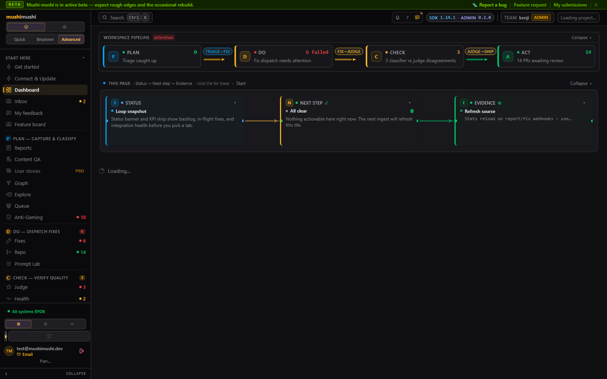
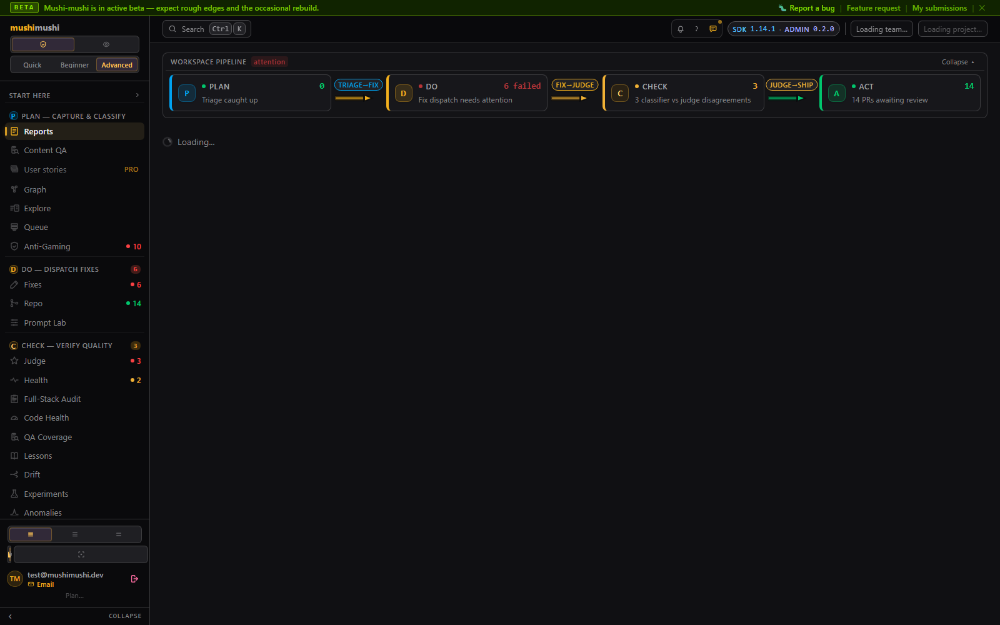
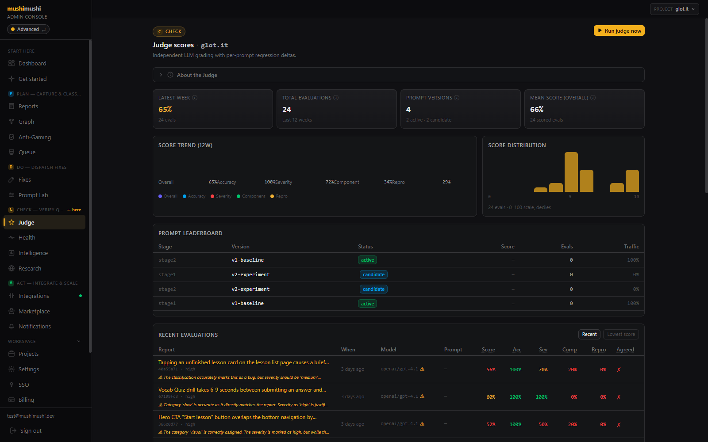
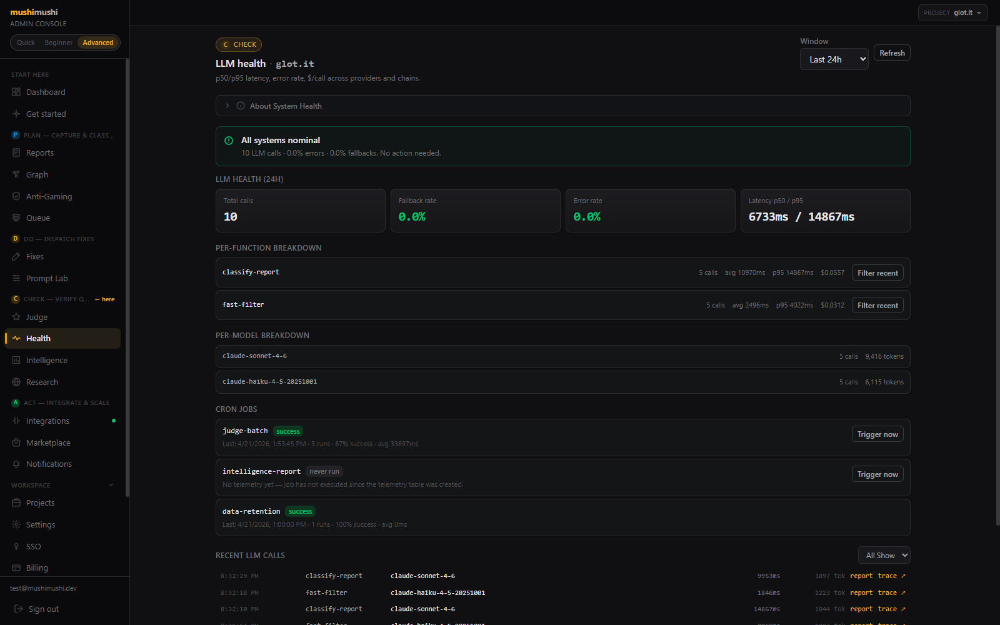
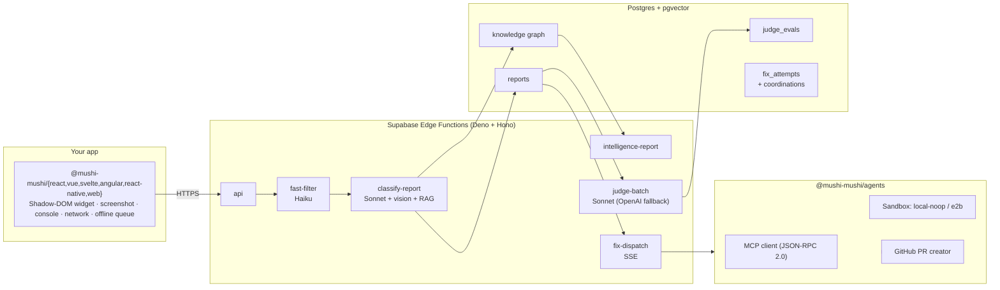

<div align="center">

# Mushi Mushi 虫虫

**The user-friction intelligence layer that complements Sentry.**

Sentry sees what your code throws. Mushi sees what your users *feel*.

[](https://www.npmjs.com/package/@mushi-mushi/react)
[](https://github.com/kensaurus/mushi-mushi/actions/workflows/ci.yml)
[](https://github.com/kensaurus/mushi-mushi/actions/workflows/security.yml)
[](https://socket.dev/npm/package/mushi-mushi)
[](https://snyk.io/advisor/npm-package/mushi-mushi)
[](./LICENSE)
[](./packages/server/LICENSE)
[](https://react.dev)
[](https://typescriptlang.org)
[](https://vite.dev)
[](https://nodejs.org)
[](https://pnpm.io)

[Quick start](#quick-start) · [Live admin demo](https://kensaur.us/mushi-mushi/) · [Docs](./apps/docs) · [Self-hosting](./SELF_HOSTED.md) · [Architecture](#architecture)

<a href="https://kensaur.us/mushi-mushi/" title="Open the live admin demo">
  
</a>

<sub>↑ click to open the live admin demo · the admin is dark-only by design</sub>

</div>

---

## The gap Mushi Mushi closes

Your existing monitoring is excellent at one thing: **what your code threw**. It cannot see:

- A button that *looks* clickable but does nothing
- A checkout flow that confuses every new user
- A page that takes 12 seconds to load but never errors
- A layout that breaks on one specific Android phone
- A feature that silently regressed two deploys ago

These are **user-felt bugs**. They never trigger an alert. Users just leave.

Mushi Mushi is the missing layer. Drop a small SDK into your app — users press shake-to-report (or click a widget) and Mushi auto-captures screenshot, console, network, device, route, and intent. An LLM-native pipeline (Haiku fast-filter → Sonnet vision + RAG → judge → optional agentic auto-fix) classifies, deduplicates, and turns the friction into actionable bug intelligence — wired into Sentry, Slack, Jira, Linear, and PagerDuty.

| Scenario                              | Sentry / Datadog | **Mushi Mushi** |
| ------------------------------------- | :--------------: | :-------------: |
| Unhandled exception                   |        ✅        |        ✅        |
| Button doesn't respond                |        —         |        ✅        |
| Page loads in 12 s, no error          |        —         |        ✅        |
| User can't find the settings panel    |        —         |        ✅        |
| Layout breaks on iPad Safari          |        —         |        ✅        |
| Form submits but data doesn't save    |        ~         |        ✅        |
| Feature regressed since last deploy   |        ~         |        ✅        |

> Designed as a **companion** to your existing monitoring, not a replacement. Reports stream through to Sentry breadcrumbs and link back to the offending session.

---

## Tour

A walk through the rooms inside. Click any panel to land on it in the live demo.

<table width="100%">
<tr>
  <td width="50%" valign="top">
    <a href="https://kensaur.us/mushi-mushi/"></a>
    <p align="center"><b>Quickstart mode</b> · <sub>3 pages, verb-led labels, no PDCA jargon. The default for first-time visitors. Pill-toggle up to Beginner (9 pages) or Advanced (all pages) anytime.</sub></p>
  </td>
  <td width="50%" valign="top">
    <a href="https://kensaur.us/mushi-mushi/"></a>
    <p align="center"><b>First-run tour</b> · <sub>custom 5-stop spotlight tour, no react-joyride dep so it inherits dark theme tokens. Stops that need real data silently skip until the first report lands.</sub></p>
  </td>
</tr>
<tr>
  <td width="50%" valign="top">
    <a href="https://kensaur.us/mushi-mushi/onboarding"></a>
    <p align="center"><b>Plug-n-play onboarding</b> · <sub> — the wizard now opens with a Plan→Do→Check→Act storyboard so you see the loop before the checklist. Required steps drive the green progress bar; optional steps stay tagged.</sub></p>
  </td>
  <td width="50%" valign="top">
    <a href="https://kensaur.us/mushi-mushi/judge"></a>
    <p align="center"><b>Sticky run receipts</b> · <sub>every Run / Generate / Dispatch button now leaves a persistent <code>ResultChip</code> next to it, so the user never has to wonder "did it actually work?" after the toast fades.</sub></p>
  </td>
</tr>
<tr>
  <td width="50%" valign="top">
    <a href="https://kensaur.us/mushi-mushi/"></a>
    <p align="center"><b>Dashboard (Advanced)</b> · <sub>one living number per stage, bottleneck ring, Next-Best-Action strip, 14d severity-stacked histogram, LLM tokens & calls sparklines.</sub></p>
  </td>
  <td width="50%" valign="top">
    <a href="https://kensaur.us/mushi-mushi/reports"></a>
    <p align="center"><b>Reports</b> · <sub>queue + Btn parity — 4 px severity stripe, 14d severity KPIs, blast-radius dedup, single primary action per row, every action button on a stable verb with a spinner instead of a label swap.</sub></p>
  </td>
</tr>
<tr>
  <td width="50%" valign="top">
    <a href="https://kensaur.us/mushi-mushi/fixes"></a>
    <p align="center"><b>Fixes</b> · <sub>pipeline + stagger — per-attempt PDCA cards, 30d KPI sparklines, Langfuse trace per run, real PR links, retry-failed CTA. Cards now cascade-fade in via <code>useStaggeredAppear</code>.</sub></p>
  </td>
  <td width="50%" valign="top">
    <a href="https://kensaur.us/mushi-mushi/judge"></a>
    <p align="center"><b>Judge (at rest)</b> · <sub>baseline — live KPIs, 12w trend, distribution histogram, prompt leaderboard, recent evals show summaries (not hashes) with column tooltips per dimension.</sub></p>
  </td>
</tr>
<tr>
  <td width="50%" valign="top">
    <a href="https://kensaur.us/mushi-mushi/health"></a>
    <p align="center"><b>Health</b> · <sub>real <code>cost_usd</code> per call, per-function / per-model breakdown, p50/p95 latency, fallback rate, cron triggers, Langfuse deeplinks.</sub></p>
  </td>
  <td width="50%" valign="top">
    <a href="https://kensaur.us/mushi-mushi/prompt-lab"></a>
    <p align="center"><b>Prompt Lab</b> · <sub>Replaces Fine-Tuning. A/B traffic split between active and candidate prompts per stage, eval dataset preview, synthetic report generator, fine-tuning jobs queue.</sub></p>
  </td>
</tr>
<tr>
  <td width="50%" valign="top">
    <a href="https://kensaur.us/mushi-mushi/graph"></a>
    <p align="center"><b>Knowledge graph</b> · <sub>Auto-switches to Sankey storyboard under 12 nodes; full React Flow canvas above. Apache AGE backed when installed, falls back to plain SQL adjacency otherwise.</sub></p>
  </td>
  <td width="50%" valign="top">
    <a href="https://kensaur.us/mushi-mushi/compliance">30 days, PASS) with JSON payloads inline, then Data residency table with US/EU/JP/SELF radio per project" /></a>
    <p align="center"><b>Compliance</b> · <sub>SOC 2 control evidence pack with PASS / WARN pills and inline JSON, region pinning per project, print-styled Export PDF, DSAR workflow tracking.</sub></p>
  </td>
</tr>
<tr>
  <td width="50%" valign="top">
    <a href="https://kensaur.us/mushi-mushi/marketplace"></a>
    <p align="center"><b>Marketplace</b> · <sub>D1 — toggleable extension layer for the loop. Each plugin declares the events it subscribes to and ships with HMAC-signed webhooks; deliveries are logged with HTTP status + first 512 chars of the response.</sub></p>
  </td>
  <td width="50%" valign="top">
    <a href="https://kensaur.us/mushi-mushi/"></a>
    <p align="center"><b>Report detail</b> · <sub>The PDCA receipt strip compresses one user-felt bug's full lifecycle into 4 stamps — fed by <code>llm_invocations</code>, <code>fix_attempts</code>, and <code>classification_evaluations</code> in a single round-trip so it never N+1s.</sub></p>
  </td>
</tr>
</table>

---

## Seven capabilities, one platform

1. **User-side capture** — Shadow-DOM widget, screenshot, console + network rings, route + intent, offline queue, rage-click / error-spike / slow-page proactive triggers.
2. **LLM-native classification** — 2-stage pipeline (Haiku fast-filter → Sonnet deep + vision), structured outputs via `response_format`, prompt-cached system instructions, deterministic JSON.
3. **Knowledge graph + dedup** — Bug ↔ component ↔ page ↔ version edges in Postgres + pgvector. Auto-grouping kills duplicate noise.
4. **LLM-as-Judge self-improvement** — Weekly Sonnet judge scores classifier outputs; low-scoring runs feed a fine-tuning queue. OpenAI fallback when Anthropic is degraded.
5. **Agent-agnostic auto-fix** — Orchestrator with `validateResult` gating + GitHub PR creation. Sandbox provider abstraction (`local-noop` for tests, `e2b` / `modal` / `cloudflare` for prod, all four wired through `resolveSandboxProvider`). True MCP client adapter (JSON-RPC 2.0 + SEP-1686 Tasks) so Claude Code, Codex, Cursor, or any future agent plugs in.
6. **Multi-repo coordinated PRs** — A bug spanning frontend + backend opens linked PRs (`fix_coordinations` table) so reviewers see the full surface.
7. **Enterprise scaffolding** — SSO config CRUD, audit log ingest, plugin marketplace with HMAC, region-pinned data residency, retention policies, DSAR workflow, Stripe metered billing.

---

## Quick start

```bash
npx mushi-mushi
```

The wizard auto-detects your framework (Next.js / Nuxt / SvelteKit / Angular / Expo / Capacitor / plain React, Vue, Svelte / vanilla JS), installs the right SDK with your package manager, writes `MUSHI_PROJECT_ID` and `MUSHI_API_KEY` to `.env.local` (with the right framework prefix), and prints the snippet to paste in. Equivalent commands:

```bash
npm create mushi-mushi              # via the npm-create convention
npx @mushi-mushi/cli init           # if you prefer the scoped name
```

Skip the wizard and install directly if you already know which SDK you want:

```bash
npm install @mushi-mushi/react      # also covers Next.js
```

```tsx
import { MushiProvider } from '@mushi-mushi/react'

function App() {
  return (
    <MushiProvider config={{ projectId: 'proj_xxx', apiKey: 'mushi_xxx' }}>
      <YourApp />
    </MushiProvider>
  )
}
```

That's it. Users now have a shake-to-report widget. Reports land in your admin console, classified within seconds.

<details>
<summary><b>Other frameworks</b> — Vue, Svelte, Angular, React Native, Vanilla JS, iOS, Android</summary>

#### Vue 3 / Nuxt
```ts
import { MushiPlugin } from '@mushi-mushi/vue'
app.use(MushiPlugin, { projectId: 'proj_xxx', apiKey: 'mushi_xxx' })

import { Mushi } from '@mushi-mushi/web'
Mushi.init({ projectId: 'proj_xxx', apiKey: 'mushi_xxx' })
```

#### Svelte / SvelteKit
```ts
import { initMushi } from '@mushi-mushi/svelte'
initMushi({ projectId: 'proj_xxx', apiKey: 'mushi_xxx' })

import { Mushi } from '@mushi-mushi/web'
Mushi.init({ projectId: 'proj_xxx', apiKey: 'mushi_xxx' })
```

#### Angular 17+
```ts
import { provideMushi } from '@mushi-mushi/angular'
bootstrapApplication(AppComponent, {
  providers: [provideMushi({ projectId: 'proj_xxx', apiKey: 'mushi_xxx' })],
})
```

#### React Native / Expo
```tsx
import { MushiProvider } from '@mushi-mushi/react-native'
<MushiProvider projectId="proj_xxx" apiKey="mushi_xxx">
  <App />
</MushiProvider>
```

#### Vanilla JS / any framework
```ts
import { Mushi } from '@mushi-mushi/web'
Mushi.init({ projectId: 'proj_xxx', apiKey: 'mushi_xxx' })
```

#### iOS (Swift Package Manager — early dev)
```swift
.package(url: "https://github.com/kensaurus/mushi-mushi.git", from: "0.1.0")

import Mushi
Mushi.configure(projectId: "proj_xxx", apiKey: "mushi_xxx")
```

#### Android (Maven — early dev)
```kotlin
dependencies {
  implementation("dev.mushimushi:mushi-android:0.1.0")
}

Mushi.init(context = this, config = MushiConfig(projectId = "proj_xxx", apiKey = "mushi_xxx"))
```

</details>

> Want a runnable example? Check [`examples/react-demo`](./examples/react-demo) — a minimal Vite + React app with test buttons for dead clicks, thrown errors, failed API calls, and console errors.

---

## Where the project is today

**Published:** SDKs at `0.2.x` (all seven frameworks), CLI + launcher at `0.4.x`, admin at [`kensaur.us/mushi-mushi/`](https://kensaur.us/mushi-mushi/) (auto-deployed to S3 + CloudFront on every push to `master`).

**Dogfood:** end-to-end loop validated on a real production webapp. Report → LLM triage → "Dispatch fix" → draft GitHub PR → live in `/fixes`. Sentry, Langfuse and GitHub all probe **Healthy** from the Integrations page.

**This month's highlights** 🐛
- **Global command palette** — press `⌘K` (macOS) or `Ctrl+K` (Linux/Windows) anywhere in the admin to jump to any page, filtered view, or real report / fix by name. `cmdk`-backed, keyword aliases (`bugs` → Reports, `pr` → Fixes, `spam` → Anti-Gaming), debounced live API search, recents persist per browser.
- **PDCA as a live React Flow canvas** — the dashboard loop is now a diamond of Plan / Do / Check / Act nodes with gradient bezier edges and a marching-ants animation on the current bottleneck. Narrow viewports keep the stacked cockpit fallback; onboarding ships the same flow as an explainer.
- **Responsive tables** — new `ResponsiveTable` primitive with edge-fade scroll shadows, opt-in sticky first column, and a global comfy / compact density toggle that persists per browser. Reports, Judge leaderboards, and Compliance evidence / DSAR tables already use it.
- **Quickstart mode** — the default 3-page admin (`Setup → Bugs to fix → Fixes ready`) for humans who'd rather not know what PDCA stands for. Pill-toggle up to Beginner (9 pages) or Advanced (full console) when you're ready. Advanced mode now groups its pages under the four PDCA stages with staleness badges and per-page "next best action" strips so the density doesn't hide what to do next.
- **First-run tour** — a 5-stop spotlight that auto-launches once, skips stops that need real data, and resumes when the first report lands. No `react-joyride` dep, inherits dark theme tokens.
- **Themed dialogs** — native `window.confirm/prompt` retired in favour of focus-trapped `<ConfirmDialog>` / `<PromptDialog>` with proper `tone="danger"` for destructive actions.
- **N+1 slayed** — `apiFetch` now dedups in-flight requests + keeps a 200 ms micro-cache. The old 24× storm on `/v1/admin/setup` is now 1 request.
- **Sentry telemetry** — every non-2xx API response leaves a breadcrumb; 5xx captures a message; rotated DSNs self-disable after 3 consecutive 401/403 so your devtools stay clean.
- **Slack quick-fix** — Block Kit messages with `Triage` + `Dispatch fix` buttons wired to a signed `slack-interactions` Edge Function. The loop starts and ends in Slack.
- **Pre-commit lint guards** — `pnpm install` auto-installs a `.git/hooks/pre-commit` that chains three zero-dependency guards: `check-no-secrets.mjs` (AWS / Stripe / Slack / GitHub / OpenAI / Anthropic / JWT leak scanner), `check-design-tokens.mjs` (flags retired Tailwind aliases that would render transparently in the admin console), and `check-mcp-catalog-sync.mjs` (keeps the MCP catalog and its admin mirror in lockstep). Bypass once with `git commit --no-verify`, skip install with `MUSHI_SKIP_GIT_HOOKS=1`.

<details>
<summary><b>Full phase history</b></summary>

| Phase | Theme | Status |
| :--: | -------------------------------------------------------------------------------------------------- | :----: |
|  A   | Capture, fast-filter, deep classification, dedup                                                   |   ✅    |
|  B   | Knowledge graph, NL queries, weekly intelligence                                                   |   ✅    |
|  C   | Vision air-gap, RAG codebase indexer, fix dispatch                                                 |   ✅    |
|  D   | Marketplace, Cloud + Stripe, multi-repo fixes, hardened LLM I/O                                    |   ✅    |
| E–H  | PDCA full-sweep, pipeline self-heal, SAML SSO, integrations CRUD, Sentry hardening                 |   ✅    |
|  I   | Real `unique_users` blast radius, `StatusStepper`, `PdcaReceiptStrip`, NN/G-compliant `EmptyState`  |   ✅    |
|  J   | Real LLM cost — `llm_invocations.cost_usd`, Billing `LLM $X.XX` chip, Prompt Lab `Avg $ / eval`    |   ✅    |
|  K   | Admin polish — first-action gating, layout-shaped skeletons, `ResultChip`, microinteractions       |   ✅    |
|  L   | Beginner/Advanced mode toggle, Next-Best-Action strip, unified 4-stage PDCA, post-QA fixes         |   ✅    |
| M–Q  | 23-page audit + fix-spec sweep — Quickstart mode, first-run tour, themed dialogs, N+1 dedup        |   ✅    |
|  R   | 7-axis security + perf audit (2026-04-21) — internal-only middleware, expanded PII scrubber, 20 FK indexes, Zod runtime validation, vendor chunks, secrets scanner · [`docs/audit-summary-2026-04-21.md`](./docs/audit-summary-2026-04-21.md) | ✅ |

Handover docs (most recent first) live under [`docs/`](./docs/) — they're the long-form companion to each row above.

</details>

### Honest status — what works, what's still partial

| Area                 | Working                                                                                             | Still partial                                                  |
| -------------------- | --------------------------------------------------------------------------------------------------- | -------------------------------------------------------------- |
| Classification       | Haiku fast-filter, Sonnet deep, **vision air-gap closed + contract-tested**, structured outputs, prompt-cached prompts, **`pg_cron` self-healing every 5 min** | Stage 2 response streaming (Wave S5) — see below               |
| Judge / self-improve | Sonnet judge with **OpenAI fallback** wired, prompt A/B auto-promotion loop (judge → `prompt_versions.avg_judge_score` → `promoteCandidate`) | **Fine-tune vendor promotion**: `finetune_runs` schema exists, the submit-to-OpenAI/Anthropic worker is a stub. Prompt A/B promotion is the shipping mechanism today. |
| Fix orchestrator     | Single-repo `validateResult` gating, GitHub PR creation, **MCP JSON-RPC 2.0** client, multi-repo **data model** + **coordinator worker** (fans out per-repo fix attempts, aggregates per-repo pass/fail) | First-party Claude Code / Codex adapters still wait on vendor APIs. |
| Sandbox              | Provider abstraction; `local-noop` (tests) + `e2b` / `modal` / `cloudflare` (prod-ready, deny-by-default egress, audit-event stream) | —                                                              |
| Verify               | Screenshot diff via Playwright + pixelmatch; **`@mushi-mushi/verify` step interpreter feature-complete** — `navigate`, `click`, `type`, `press`, `select`, `assertText`, `waitFor`, `observe`. | —                                                              |
| Enterprise           | Plugin marketplace + HMAC, audit ingest, region pinning, retention CRUD, Stripe metering + `/billing` UI + invoice list, **SAML SSO via Supabase Auth Admin API** (ACS / Entity ID surfaced for IdP setup), routing-destination CRUD with masked secrets | **OIDC SSO intentionally returns `501 Not Implemented`** — Supabase GoTrue does not yet expose the admin endpoints we'd need. The admin UI exposes the config form so the settings round-trip is tested, but the endpoint is gated. Track Supabase changelog for GoTrue OIDC admin support. |
| Graph backend        | Plain SQL adjacency over `graph_nodes` / `graph_edges` ships in every deployment. | **Apache AGE is a hosted-tier enhancement**: when the AGE extension is installed (self-hosted Postgres 16 or Supabase Enterprise tier) we route graph queries through AGE for >10× traversal speedup. Supabase's managed tier does not ship AGE, so cloud deployments stay on SQL adjacency. |
| Streaming            | Fix-dispatch SSE (CVE-2026-29085-safe sanitization)                                                  | Classification reasoning still arrives whole. Stage 2 `streamObject` conversion lands in Wave S5. |

The orchestrator **refuses to run `local-noop` in production** unless you explicitly set `MUSHI_ALLOW_LOCAL_SANDBOX=1`. Pick `e2b` (or implement the `SandboxProvider` interface yourself) before exposing autofix to production traffic.

---

## Architecture



See [`apps/docs/content/concepts/architecture.mdx`](./apps/docs/content/concepts/architecture.mdx) for the full pipeline.

---

## Packages

> Most developers only install **one** SDK package — `npx mushi-mushi` picks the right one for you and pulls in `core` and `web` automatically.

| Install                            | Framework               | What you get                                                                              |
| ---------------------------------- | ----------------------- | ----------------------------------------------------------------------------------------- |
| `npx mushi-mushi`                  | **Any** (auto-detects)  | One-command wizard — installs the right SDK, writes env vars, prints the snippet          |
| `npm i @mushi-mushi/react`         | React / Next.js         | `<MushiProvider>`, `useMushi()`, `<MushiErrorBoundary>` — drop-in for any React app       |
| `npm i @mushi-mushi/vue`           | Vue 3 / Nuxt            | `MushiPlugin`, `useMushi()` composable, error handler (pair with `web` for the widget UI) |
| `npm i @mushi-mushi/svelte`        | Svelte / SvelteKit      | `initMushi()`, SvelteKit error hook (pair with `web` for the widget UI)                   |
| `npm i @mushi-mushi/angular`       | Angular 17+             | `provideMushi()`, `MushiService`, error handler (pair with `web` for the widget UI)       |
| `npm i @mushi-mushi/react-native`  | React Native / Expo     | Shake-to-report, bottom-sheet widget, navigation capture, offline queue                   |
| `npm i @mushi-mushi/capacitor`     | Capacitor / Ionic       | iOS + Android via Capacitor — shake-to-report, screenshot, offline queue                  |
| `npm i @mushi-mushi/web`           | Vanilla / any framework | Framework-agnostic SDK — Shadow-DOM widget, screenshot, console + network capture         |
| `npm i @mushi-mushi/node`          | Node (Express/Fastify/Hono) | **Server-side** SDK — error-handler middleware, `uncaughtException` hook, W3C trace context |
| `npm i @mushi-mushi/adapters`      | Any Node webhook server | Translate Datadog / New Relic / Honeycomb / Grafana alerts into Mushi reports              |

[&color=cb3837)](https://www.npmjs.com/package/mushi-mushi)
[](https://www.npmjs.com/package/@mushi-mushi/react)
[](https://www.npmjs.com/package/@mushi-mushi/vue)
[](https://www.npmjs.com/package/@mushi-mushi/svelte)
[](https://www.npmjs.com/package/@mushi-mushi/angular)
[](https://www.npmjs.com/package/@mushi-mushi/react-native)
[](https://www.npmjs.com/package/@mushi-mushi/capacitor)
[](https://www.npmjs.com/package/@mushi-mushi/web)
[](https://www.npmjs.com/package/@mushi-mushi/node)
[](https://www.npmjs.com/package/@mushi-mushi/adapters)
[](https://www.npmjs.com/package/@mushi-mushi/cli)
[](https://www.npmjs.com/package/@mushi-mushi/mcp)
[](https://www.npmjs.com/package/@mushi-mushi/mcp-ci)

<details>
<summary><b>Internal & native packages</b></summary>

| Package                               | Purpose                                                                                                                |
| ------------------------------------- | ---------------------------------------------------------------------------------------------------------------------- |
| [`@mushi-mushi/core`](./packages/core) | Shared engine — types, API client, PII scrubber, offline queue, rate limiter, structured logger. Auto-installed.       |
| [`@mushi-mushi/cli`](./packages/cli)   | CLI for project setup, report listing, triage. `npm i -g @mushi-mushi/cli`                                              |
| [`@mushi-mushi/mcp`](./packages/mcp)   | MCP server — lets Cursor / Copilot / Claude read, triage, classify, dispatch fixes, and run NL queries                  |
| [`@mushi-mushi/mcp-ci`](./packages/mcp-ci) | GitHub Action that calls the MCP tools from CI — gate PR merges on classification coverage, dispatch fixes on label  |
| [`@mushi-mushi/plugin-sdk`](./packages/plugin-sdk) | Build third-party plugins — signed webhook verification, REST callback client, framework adapters              |
| [`@mushi-mushi/plugin-jira`](./packages/plugin-jira) | Bidirectional Mushi ↔ Jira Cloud sync (OAuth 3LO, status transitions, fix comments)                          |
| [`@mushi-mushi/plugin-slack-app`](./packages/plugin-slack-app) | First-class Slack app — `/mushi` slash command, signing-secret verification, App Manifest           |
| [`@mushi-mushi/plugin-linear`](./packages/plugin-linear) | Reference plugin — create + sync Linear issues from Mushi reports                                        |
| [`packages/ios`](./packages/ios)       | Native iOS SDK (Swift Package Manager) — early dev                                                                      |
| [`packages/android`](./packages/android) | Native Android SDK (Maven `dev.mushimushi:mushi-android`) — early dev                                                  |

</details>

<details>
<summary><b>Backend packages</b> (BSL 1.1 → Apache 2.0 in 2029)</summary>

| Package                | Purpose                                                                                                                                              |
| ---------------------- | ---------------------------------------------------------------------------------------------------------------------------------------------------- |
| `@mushi-mushi/server`  | Edge functions — classification pipeline, knowledge graph, fix dispatch + SSE, RAG indexer, vision air-gap, judge with OpenAI fallback, plugin runtime |
| `@mushi-mushi/agents`  | Agentic fix orchestrator — `validateResult` gating, GitHub PR creation, sandbox abstraction, MCP JSON-RPC 2.0 client, multi-repo coordinator                                  |
| `@mushi-mushi/verify`  | Playwright fix verification — screenshot visual diff + feature-complete step interpreter (`navigate`, `click`, `type`, `press`, `select`, `assertText`, `waitFor`, `observe`). Attach step arrays _at call-time_ via `verifyFix({ steps })` and correlate runs to an attempt with `verifyFix({ fixAttemptId })` — the verifier replays, diffs, writes `fix_verifications`, and mirrors the result into `fix_attempts.verify_steps` so the judge can answer "did attempt X verify?" without a timestamp join. |

</details>

---

## Connecting to a backend

### A. Hosted (zero-config)

1. Sign up at **[kensaur.us/mushi-mushi](https://kensaur.us/mushi-mushi/)**
2. Create a project → copy your `projectId` and `apiKey`
3. Drop the SDK into your app

### B. Self-hosted

```bash
cd deploy
cp .env.example .env   # ANTHROPIC_API_KEY, Supabase creds
docker compose up -d
```

Or via Supabase CLI directly — see [SELF_HOSTED.md](./SELF_HOSTED.md). A Helm chart lives at `deploy/helm/` (incomplete — missing migrations ConfigMap).

> **Internal edge functions** (`fast-filter`, `classify-report`, `fix-worker`, `judge-batch`, `intelligence-report`, `usage-aggregator`, `soc2-evidence`, `generate-synthetic`) authenticate via the shared `requireServiceRoleAuth` middleware, which accepts **either** `MUSHI_INTERNAL_CALLER_SECRET` (used by `pg_cron` → `pg_net`, mirrored into `public.mushi_runtime_config.service_role_key`) or the auto-injected `SUPABASE_SERVICE_ROLE_KEY` (used for function-to-function calls). Never expose them with `--no-verify-jwt` in production. Only the public `api` function should face the internet. See [`packages/server/README.md`](./packages/server/README.md#internal-caller-authentication-sec-1).

---

## Monitoring & privacy (this repo's deployment)

The hosted instance reports to two Sentry projects under the [`sakuramoto`](https://sakuramoto.sentry.io) org:

| Project              | What it covers                                                                                                                              | DSN source                                  |
| -------------------- | ------------------------------------------------------------------------------------------------------------------------------------------- | ------------------------------------------- |
| `mushi-mushi-admin`  | Admin console: unhandled errors, React error boundaries, perf traces (10 % sample), errors-only Session Replay (`replaysOnErrorSampleRate: 1.0`, masked text + media) | `VITE_SENTRY_DSN` baked into the build      |
| `mushi-mushi-server` | All eight edge functions: unhandled exceptions + every `log.error()`/`log.fatal()` forwarded via `_shared/sentry.ts`                        | `SENTRY_DSN_SERVER` Supabase secret         |

Privacy & safety:

- `sendDefaultPii: false` on both — no IPs, cookies, or request bodies attached automatically.
- Token-like query params scrubbed in `beforeSend`. `Authorization`, `Cookie`, `*-api-key` headers redacted server-side.
- Sourcemaps uploaded by `@sentry/vite-plugin` during `pnpm build` and **deleted from `dist/` before the S3 sync** — the public bucket never serves them.
- Sentry data scrubbing strips token prefixes (`mushi_*`, `sntryu_*`, JWTs starting with `eyJ`, `ghp_*`, `npm_*`) on top of SDK-side redaction.

> **For SDK consumers and forks:** the published packages **do not initialize Sentry**. The bridge at [`packages/web/src/sentry.ts`](packages/web/src/sentry.ts) only *reads context from your existing Sentry instance* — it never sends data on its own. Self-hosted forks can leave the DSNs unset and the SDKs no-op cleanly.

## Payment & support operations

The hosted product wires three feedback loops so the operator hears from paying customers fast:

| Channel                              | Trigger                                                                                                                                                          | Where it shows up                                                              |
| ------------------------------------ | ---------------------------------------------------------------------------------------------------------------------------------------------------------------- | ------------------------------------------------------------------------------ |
| **Stripe webhooks → operator push**  | `checkout.session.completed`, `invoice.payment_failed`, `customer.subscription.deleted`, `cancel_at_period_end → true`, `invoice.payment_succeeded` (recovery only) | Slack and/or Discord via `OPERATOR_SLACK_WEBHOOK_URL` / `OPERATOR_DISCORD_WEBHOOK_URL` |
| **Stripe Dashboard email digests**   | Same events natively, plus dispute / refund flows                                                                                                                 | The Stripe Dashboard email recipient list (configured in the Dashboard UI)    |
| **In-app support inbox**             | Paid (or free) customer submits the BillingPage "Need help?" form                                                                                                | `support_tickets` table + operator push + audit log + reply to `SUPPORT_EMAIL` |

How each piece works:

- **Operator push** (`packages/server/supabase/functions/_shared/operator-notify.ts`): a single helper that knows how to render Slack Block Kit *and* Discord rich embeds. Severity drives colour; `urgent` pings `@here` on Discord. Failures are captured to Sentry but never block the webhook from 200-ing back to Stripe.
- **In-app support form** (`/v1/support/contact`): JWT-gated, rate-limited to 5 tickets/hour/user, captures plan tier at submit time so paid tickets jump the queue. Customer sees status updates inline on `/billing`. PII (passwords, API keys) explicitly called out as off-limits in the form copy.
- **Centralised support address** (`SUPPORT_EMAIL` env var, defaults to `support@mushimushi.dev`): used in the Checkout `custom_text`, the BillingPage "Need help?" mailto, and the rate-limit error message.

To enable the operator push for a self-hosted instance:

```bash
# 1. Create a Slack incoming webhook (api.slack.com/messaging/webhooks)
#    OR a Discord channel webhook (server settings → integrations → webhooks).
# 2. Push the secret to Supabase:
supabase secrets set OPERATOR_SLACK_WEBHOOK_URL=https://hooks.slack.com/services/...
# or
supabase secrets set OPERATOR_DISCORD_WEBHOOK_URL=https://discord.com/api/webhooks/...
# 3. Optionally override the support address (defaults to support@mushimushi.dev):
supabase secrets set SUPPORT_EMAIL=ops@yourdomain.com
# 4. Redeploy the api + stripe-webhooks functions:
supabase functions deploy api stripe-webhooks
```

---

<details>
<summary><b>Repo structure & dev commands</b></summary>

#### Development

```bash
git clone https://github.com/kensaurus/mushi-mushi.git
cd mushi-mushi
pnpm install
pnpm build
```

Requires Node.js ≥ 22 and pnpm ≥ 10.

| Command            |                                                              |
| ------------------ | ------------------------------------------------------------ |
| `pnpm dev`         | Run all dev servers (admin on `:6464`, docs, cloud)          |
| `pnpm build`       | Build all packages                                           |
| `pnpm test`        | Vitest                                                       |
| `pnpm typecheck`   | TypeScript checks                                            |
| `pnpm lint`        | Lint                                                         |
| `pnpm format`      | Prettier                                                     |
| `pnpm changeset`   | Create a changeset                                           |
| `pnpm release`     | Build + publish to npm                                       |
| `pnpm check:secrets` | Scan the whole tree for leaked AWS / Stripe / Slack / GitHub / OpenAI / Anthropic / Supabase / JWT tokens. Also runs staged-only on every commit via the auto-installed `pre-commit` hook. |
| `pnpm check:design-tokens` | Flag Tailwind classes in `apps/admin/` that reference retired aliases (`success*` / `error*` / `surface-subtle`) or typo against real `--color-*` namespaces defined in `apps/admin/src/index.css`. Catches the "invisible transparent element" bug class at commit time. |
| `pnpm check:catalog-sync` | Verify `packages/mcp/src/catalog.ts` and its admin mirror `apps/admin/src/lib/mcpCatalog.ts` haven't drifted. |
| `pnpm check:publish-readiness` | Assert every publishable `package.json` has `name`, `version`, `license`, `engines.node >=20`, `repository.directory`, `files` (incl. README + LICENSE), and `exports`/`main` or `bin`. Runs in CI and the release workflow before `changeset publish`. |
| `pnpm check:license-headers` | Assert every package's `license` field matches its folder's canonical license (BSL for `server` / `agents` / `verify`, MIT for the rest) and that a matching `LICENSE` file exists. |
| `pnpm check:dead-buttons` | Grep `apps/admin/**/*.tsx` for `<button disabled>` / `disabled={true}` with no `aria-label` or tooltip — catches "button exists but does nothing" regressions at commit time. |
| `pnpm size`       | Run `size-limit` against the built `@mushi-mushi/web` bundle (15 KB gzipped budget). |
| `pnpm e2e`        | Run the full-PDCA Playwright dogfood suite in `examples/e2e-dogfood/`. Assumes Supabase + admin + the dogfood app are already running locally — see the workspace README for setup. |

#### Admin console (zero-config)

```bash
cd apps/admin
pnpm dev    # → http://localhost:6464 — auto-connects to Mushi Cloud
```

To self-host with your own Supabase project, copy `apps/admin/.env.example` and fill in your URL + anon key.

#### Backend / edge functions

```bash
cp .env.example .env   # Supabase + LLM provider keys
cd packages/server/supabase
npx supabase db push
npx supabase functions deploy api --no-verify-jwt
```

#### Repo layout

```
packages/
  core, web, react, vue, svelte, angular, react-native   # SDKs (MIT)
  ios, android                                            # Native SDKs (early dev)
  cli, mcp                                                # Tooling
  server, agents, verify                                  # Backend (BSL 1.1)
  plugin-{sdk,zapier,linear,pagerduty}                    # Plugin marketplace
apps/
  admin    # React 19 + Tailwind 4 + Vite 8 (dark-only by design)
  docs     # Nextra v4 documentation site
  cloud    # Next.js 15 marketing landing + Stripe billing
examples/
  react-demo
deploy/    # Docker Compose + Helm chart
tooling/   # Shared ESLint + TypeScript configs
```

</details>

---

## Contributing

Issues and PRs welcome. To get started: `pnpm install && pnpm dev`. See individual package READMEs for package-specific setup, and the latest ([`docs/HANDOVER-2026-04-21-console-elevate.md`](./docs/HANDOVER-2026-04-21-console-elevate.md)) for the current state of play.

## License

- **SDK packages** (core, web, react, vue, svelte, angular, react-native, cli, mcp): [MIT](./LICENSE)
- **Server, agents, verify**: [BSL 1.1](./packages/server/LICENSE) — converts to Apache 2.0 on April 15, 2029
