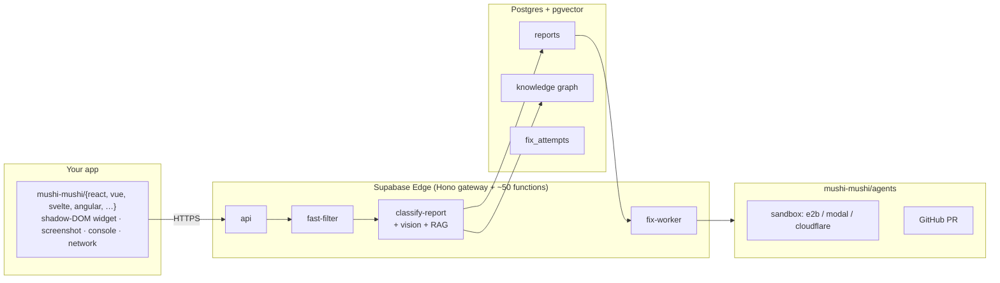

<div align="center">

# Mushi Mushi

**Your AI wrote it. Mushi tells you why it broke.**

Plain-English diagnosis + a paste-ready fix, right inside Cursor and Claude Code. No log-reading. No second LLM API key for MCP.

**Fastest path — drop Mushi into your AI editor:**

```bash
npx mushi-mushi setup --ide cursor   # or: --ide claude
```

Already shipping an app? One command installs the SDK + env vars + an optional test report:

```bash
npx mushi-mushi
```

**Open source, self-hostable, MIT JS core** — bring your own LLM key, no second key for MCP, no lock-in. [Self-host in minutes](./SELF_HOSTED.md) · [licensing](https://kensaur.us/mushi-mushi/docs/concepts/open-source).

<sub>What is Mushi, exactly? Read the one-page constitution: **[VISION.md](./VISION.md)** — the single source of truth for positioning, the north-star sentence, and who this is for.</sub>

[](https://kensaur.us/mushi-mushi/docs/connect)
[](https://kensaur.us/mushi-mushi/docs/connect)
[](https://www.npmjs.com/package/@mushi-mushi/react)
[](./packages/server/LICENSE)

<sub>Node ≥22 · [CI](https://github.com/kensaurus/mushi-mushi/actions/workflows/ci.yml) · SDK MIT · [enterprise](./packages/server/ee/README.md) · [Smithery](https://smithery.ai/servers/kensaurus/mushi-mushi)</sub>

[Vision](./VISION.md) · [Quick start](#60-second-proof) · [Connect your editor](https://kensaur.us/mushi-mushi/docs/connect) · [Self-host](#self-host-in-under-5-minutes) · [Sentry enrichment](#sentry-enrichment) · [Packages](#framework-coverage) · [Docs](https://kensaur.us/mushi-mushi/docs/) · [Live demo](https://kensaur.us/mushi-mushi/admin/) · [Operators / platform](./docs/operators/) · [Roadmap](https://kensaur.us/mushi-mushi/docs/roadmap)

<!-- TODO(loop-video): embed a 20–30s incident-loop gif when recut.
     Until then use the static frame at docs/screenshots/incident-loop.png.
     Script + target metric (time-to-first-diagnosis < 2 min) in docs/marketing/STOREFRONTS.md. -->

<a href="https://kensaur.us/mushi-mushi/admin/reports" title="Open a classified report in the live demo">
  
</a>

<sub>↑ the diagnosis: plain-English root cause + a paste-ready fix prompt · click to open the live demo</sub>

</div>

---

## 60-second proof

```bash
npx mushi-mushi
```

The wizard auto-detects your framework, installs the right SDK, writes framework-prefixed env vars (e.g. `VITE_MUSHI_PROJECT_ID` / `VITE_MUSHI_API_KEY`, or `NEXT_PUBLIC_MUSHI_*`) to `.env.local`, and prints the snippet to paste. Those two vars are **all the SDK needs** — no Supabase, no LLM key (see [`examples/sdk.env.example`](./examples/sdk.env.example); the root `.env.example` is for self-hosting the backend only). Then, the moment something breaks:

1. The bug lands in your queue — screenshot, the user's note, the route, the last console + network events, device context.
2. Mushi produces **the diagnosis**: a plain-English root cause + a fix you can paste.
3. You pull it into your editor over MCP:

```bash
npx mushi-mushi setup --ide cursor    # then ask Cursor: "what's broken in prod?"
```

**No Sentry, no account, no monitoring stack required to see value.** Self-host the whole thing in under five minutes, or use the free hosted tier (no card).

---

## What this is

For the solo AI-first builder (the _vibe coder_): you ship fast with Cursor, Claude Code, Lovable, or Bolt, then lose afternoons when something breaks in code you didn't fully write. Mushi is the **comprehension layer** — plain-English diagnosis in your editor over MCP, so a bug costs five minutes instead of your afternoon. (Small teams and agencies hit the same pain.)

These are the bugs your monitoring can't see, and the ones you didn't write:

- A user added a coupon and the pay button slipped under their keyboard.
- A new signup tapped _Save_ twice because nothing visibly happened the first time.
- A Pro customer's dashboard takes 12 seconds to load — and they've opened the competitor's tab.
- A layout that looks fine on your laptop folds in half on the one Android model used by 18% of your traffic.

## What it is not

Not another dashboard you have to go read, and not an enterprise monitoring stack — standalone first, no Sentry/Datadog/Firebase required. Full positioning: [`VISION.md`](./VISION.md).

---

## The diagnosis loop

When a user shakes their phone (or clicks the reporter):

1. **Capture** — screenshot, route, user note, recent console + network events, device context.
2. **Classify** — two-stage LLM tags severity, category, and a plain-English root-cause hint. The screenshot goes through an air-gapped vision pass that can't see the text prompt. A nightly judge scores the classifier and feeds a prompt-A/B loop.
3. **Connect** — the report embeds into a knowledge graph (Postgres + pgvector). The same broken button reported twenty times shows up as **one** row, not twenty.
4. **Fix** _(optional)_ — _Dispatch fix_ (or Slack / MCP / CI) runs an agent in a sandbox, runs your tests, and opens a **draft** PR. You review it like any other PR.



The architecture, sequence diagram, and component-by-component spec live in [`apps/docs/content/concepts/architecture.mdx`](./apps/docs/content/concepts/architecture.mdx).

---

## Self-host in under 5 minutes

A single Docker Compose file gets you a working stack against your own Supabase project:

```bash
cd deploy
cp .env.example .env   # ANTHROPIC_API_KEY, Supabase creds
docker compose up -d
```

[`SELF_HOSTED.md`](./SELF_HOSTED.md) and the [Self-host in minutes](https://kensaur.us/mushi-mushi/docs/self-hosting/docker-compose) guide are the long-form walkthroughs. A **Helm chart** lives at [`deploy/helm/`](./deploy/helm/README.md) — one `helm install` on any cluster.

**Hosted:** sign up at [`kensaur.us/mushi-mushi/`](https://kensaur.us/mushi-mushi/), click _Start free, no card_, create a project, and copy your `projectId` + `apiKey`. The free tier covers 50 diagnoses a month (no card required).

> **One BYOK rule, both ways.** Self-host and you bring your own Anthropic / OpenAI key — you pay the vendor at list rate, we never mark up a token. On hosted you bring no key at all: we meter by **diagnosis** (the plain-English root cause + fix), never by tokens, with a per-project **spend cap** and **50 / 80 / 100% alerts** so the bill can't surprise you. Full numbers: [pricing](https://kensaur.us/mushi-mushi/docs/pricing).

> **Internal edge functions** (`fast-filter`, `classify-report`, `fix-worker`, `judge-batch`, `intelligence-report`, `usage-aggregator`, `generate-synthetic`) authenticate via `requireServiceRoleAuth`. Never expose them with `--no-verify-jwt`. Only the public `api` function should face the internet — see [`packages/server/README.md`](./packages/server/README.md#internal-caller-authentication-sec-1).

---

## Sentry enrichment

Mushi works standalone. If you already run Sentry, Mushi enriches it: Sentry owns "errors your code throws"; Mushi owns the bugs that *don't* throw (dead buttons, 12-second screens, layouts that break on one phone) and the **plain-English diagnosis + fix** Sentry's $80/mo Seer tier reserves for bigger teams.

Inbound adapters forward Sentry (and Datadog, Bugsnag, Rollbar, Crashlytics, New Relic, Honeycomb, Grafana Loki, CloudWatch, Opsgenie, Firebase) alerts into Mushi for deeper fix context; outbound plugins send Mushi's verdicts back so a Sentry issue auto-resolves the moment Mushi merges its fix. The full enrichment / synthesis story lives in [`docs/operators/`](./docs/operators/#where-mushi-fits) — it's the upgrade path, never the front door.

| | Mushi | Sentry | Langfuse |
| --- | --- | --- | --- |
| Catches | Thrown errors **and** silent UX bugs (dead clicks, slow screens, layout breaks) | Thrown errors, performance traces | LLM call traces, prompt evals |
| Output | Plain-English root cause + paste-ready fix, in your editor | Stack trace + breadcrumbs, in a dashboard | Trace tree + scores, in a dashboard |
| Auto-fix | Optional: sandbox agent opens a draft PR | Seer add-on (paid) | Not in scope |
| Second LLM key for MCP | No — reuses your app's key | N/A | N/A |
| Setup | One command, no account required to try | SDK + DSN + dashboard | SDK + project + dashboard |

Different jobs: Sentry watches what your code throws, Langfuse watches what your LLM calls do, Mushi watches what your *user* experiences — including the bugs that never throw.

---

## Framework coverage

Most developers install **one** SDK — `npx mushi-mushi` picks it for you. React/Next.js quick start:

```bash
npm install @mushi-mushi/react      # also covers Next.js
```

```tsx
import { MushiProvider } from '@mushi-mushi/react';

function App() {
  return (
    <MushiProvider config={{ projectId: 'proj_xxx', apiKey: 'mushi_xxx' }}>
      <YourApp />
    </MushiProvider>
  );
}
```

<details>
<summary><b>Other frameworks</b> — Vue, Svelte, Angular, React Native, Vanilla JS, iOS, Android, Flutter</summary>

```ts
// Vue 3 / Nuxt
import { MushiPlugin } from '@mushi-mushi/vue';
app.use(MushiPlugin, { projectId: 'proj_xxx', apiKey: 'mushi_xxx' });

// Svelte / SvelteKit
import { initMushi } from '@mushi-mushi/svelte';
initMushi({ projectId: 'proj_xxx', apiKey: 'mushi_xxx' });

// Angular 17+
import { provideMushi } from '@mushi-mushi/angular';
bootstrapApplication(AppComponent, { providers: [provideMushi({ projectId: 'proj_xxx', apiKey: 'mushi_xxx' })] });

// React Native / Expo
import { MushiProvider } from '@mushi-mushi/react-native';

// Vanilla JS / any framework
import { Mushi } from '@mushi-mushi/web';
Mushi.init({ projectId: 'proj_xxx', apiKey: 'mushi_xxx' });
```

iOS (Swift PM, v0.4.0): `.package(url: "https://github.com/kensaurus/mushi-mushi.git", from: "0.4.0")` · Android (Gradle): `dev.mushimushi:mushi-android:0.4.0` · Flutter: `pub add mushi_mushi`.

</details>

> Want a runnable example? [`examples/react-demo`](./examples/react-demo) is a minimal Vite + React app with test buttons for dead clicks, thrown errors, failed API calls, and console errors.

Full package list and maturity table: [SDK reference](https://kensaur.us/mushi-mushi/docs/sdks).

---

## Where it stops

Mushi is honest about what's still partial. Skim before you commit:

| Area                 | Working                                                                                                                                                                                                                                                                                                                                                                                                                                                                    | Still partial                                                                                                                                                                                                                                                                                                     |
| -------------------- | -------------------------------------------------------------------------------------------------------------------------------------------------------------------------------------------------------------------------------------------------------------------------------------------------------------------------------------------------------------------------------------------------------------------------------------------------------------------------- | ----------------------------------------------------------------------------------------------------------------------------------------------------------------------------------------------------------------------------------------------------------------------------------------------------------------- |
| Classification       | Haiku fast-filter, Sonnet deep + **vision air-gap closed**, structured outputs, prompt-cached prompts, `pg_cron` self-healing, **Stage 2 streaming via `streamObject` with progressive `reports.stage2_partial` UI updates and OpenAI fallback**                                                                                                                                                                                                                           | —                                                                                                                                                                                                                                                                                                                 |
| Judge / self-improve | Sonnet judge with **OpenAI fallback**, prompt A/B auto-promotion via `judge → avg_judge_score → promoteCandidate`, **OpenAI fine-tune adapter end-to-end** (submit JSONL → poll → predict against `fine_tuned_model_id`, BYOK `OPENAI_API_KEY`), **Bedrock fine-tune adapter** (SigV4-signed `CreateModelCustomizationJob`, requires `MUSHI_BEDROCK_FINETUNE_ENABLED=1` + AWS BYOK keys) | Anthropic fine-tune API is not publicly self-service in 2026 — the adapter stub links to the access-request form. |
| Fix orchestrator     | Single-repo `validateResult` gating, GitHub PR, **MCP JSON-RPC 2.0** client, multi-repo coordinator, **first-party `ClaudeCodeAgent` (spawns local `claude` CLI)** and **`CodexAgent` (OpenAI Responses API, BYOK)** — both gated behind explicit env flags so shared deployments never invoke them unintentionally                                                                                                                                                        | —                                                                                                                                                                                                                                                                                                                 |
| Sandbox              | Provider abstraction; `local-noop` (tests) + `e2b` / `modal` / `cloudflare` (prod). Production refuses `local-noop` unless `MUSHI_ALLOW_LOCAL_SANDBOX=1`.                                                                                                                                                                                                                                                                                                                  | —                                                                                                                                                                                                                                                                                                                 |
| Verify               | Playwright screenshot diff + step interpreter (`navigate` / `click` / `type` / `press` / `select` / `assertText` / `waitFor` / `observe`)                                                                                                                                                                                                                                                                                                                                  | —                                                                                                                                                                                                                                                                                                                 |
| Enterprise           | Plugin marketplace + HMAC, audit ingest, region pinning, retention CRUD, Stripe metering, **SAML SSO via Supabase Auth Admin API**, **OIDC SSO self-service** — see the [commercial boundary](#license--branding) below for which of these are paid/Enterprise-tier | — |
| Graph backend        | SQL adjacency over `graph_nodes` / `graph_edges` ships in every deployment                                                                                                                                                                                                                                                                                                                                                                                                 | Apache AGE is a hosted-tier enhancement when the extension is installed. Managed Supabase stays on SQL adjacency.                                                                                                                                                                                                |
| Inventory v2 & QA-gates | Hand-written `inventory.yaml`, SDK-driven discovery, Claude proposer, ESLint gate rules, 5-gate composite GitHub check, synthetic monitor, `expected_outcome` contract end-to-end — see [`docs/operators/`](./docs/operators/inventory-and-gates.md) | Inventory is gated behind _Advanced mode_ + the `inventory_v2` plan flag. |
| Self-host (Helm)     | Single-pod deploy on any Kubernetes; pre-install Job applies all SQL migrations from a bundled ConfigMap. **Multi-region** via `global.region` + `global.peerRegions` Helm values. | Full active/active write replication is not automated yet — write routing relies on client-side region stickiness. |

---

## Running this for a team?

The platform depth — inbound adapters, outbound plugins, A2A / AG-UI / MCP interop, the `inventory.yaml` QA-gate system, the synthetic monitor, SSO / audit / retention / region pinning, and open-standards plumbing — lives in **[`docs/operators/`](./docs/operators/)** so the front door stays on the wedge. Start there if you're wiring Mushi into an existing stack or evaluating it as a platform.

---

## Cursor & Claude Skills

Install Mushi skills in your Cursor or Claude Code project for one-command setup, usage, and debugging:

```bash
npx skills add kensaurus/mushi-mushi
```

Then: `/mushi-setup` (guided SDK install + MCP wiring), `/mushi-debug` (diagnose ingest / MCP / pipeline failures), `/mushi-health` (pass/fail check across CLI, API, edge functions, BYOK keys), `/mushi-integration` (two-way loop, fix dispatch, lessons). The admin **Connect & Update** page (`/connect`) mirrors the same flows with one-click **Add to Cursor** deeplinks.

<sub>Repo at a glance (run `pnpm docs-stats`): ~351K TS lines · 1,688 source files · 44 workspace / 36 npm packages · 51 edge functions · 322 SQL migrations · 19 pipeline agents. Full tour: [`docs/SCREENSHOTS.md`](./docs/SCREENSHOTS.md).</sub>

---

## Contributing

Issues and PRs welcome:

```bash
git clone https://github.com/kensaurus/mushi-mushi.git
cd mushi-mushi
pnpm install
pnpm dev
```

Requires Node.js ≥ 22 and pnpm ≥ 10. See individual package READMEs, [`docs/stats.md`](./docs/stats.md) for canonical counts, and [`CONTRIBUTING.md`](./CONTRIBUTING.md).

## License & branding

This repository is **open-core** — the Supabase / Grafana model. The **SDK packages** are MIT — use them in any product, open or closed. The **server** (the part you self-host or we run for you) is **AGPLv3** — true OSI open source: self-host it, fork it, modify it for your own org. If you offer a **modified** server as a hosted service to third parties, publish your changes or see [COMMERCIAL-LICENSE.md](./COMMERCIAL-LICENSE.md). A small **Enterprise Edition** boundary (`packages/server/ee/`) is source-available but commercial for production use — that's operator/enterprise plumbing only, never the wedge.

| Surface | License | Permitted | Notes |
| ------- | ------- | --------- | ----- |
| SDK packages — `core`, `web`, `react`, `vue`, `svelte`, `angular`, `react-native`, `capacitor`, `flutter`, `ios`, `android`, `node`, `cli`, `mcp`, `mcp-ci`, `plugin-*` (13 plugins), `adapters` (11 sources), `inventory-schema`, `inventory-auth-runner`, `eslint-plugin-mushi-mushi`, `brand`, `marketing-ui` | [MIT](./LICENSE) | Use, fork, sell, embed in proprietary products. | Trademarks separate — see below. |
| Server packages — `@mushi-mushi/server`, `@mushi-mushi/agents`, `@mushi-mushi/verify` | [AGPLv3](./packages/server/LICENSE) | Use, modify, self-host, fork for your own org. SaaS modifiers publish changes or [commercial license](./COMMERCIAL-LICENSE.md). | OSI-approved copyleft. The cloud runs this exact core. |
| Enterprise features — SSO/SCIM, audit-log ingest, retention policy CRUD, region pinning, SOC2 evidence | Commercial / paid tier | Available on the Enterprise plan (hosted) or with a commercial license (self-host). | The code may be source-visible, but production use of these specific features is a paid boundary — see [`docs/operators/`](./docs/operators/). |
| Trademarks — "Mushi Mushi", "Mushi", 虫, the bug logo | [Trademark policy](./TRADEMARK.md) | Refer to the project, build add-ons, link to the repo. | **Forks must rename.** Hosting a service under the Mushi name requires written permission. |
| Third-party attributions | [NOTICE](./NOTICE) | — | Upstream projects we depend on and their licenses. |

Security researchers: see [`SECURITY.md`](./SECURITY.md) for the threat model, PII commitments, and safe-harbor terms.

---

## Also by @kensaurus

Other free apps and tools from the same Tokyo studio:

| App | What it does | Links |
|:----|:-------------|:------|
| **[glot.it — Learn Thai Free](https://kensaur.us/glot-it/)** | 161 lessons, pitch-contour tone mirror, AI roleplay chat, offline-first. | [App Store](https://apps.apple.com/us/app/glot-it/id6761582648) · [Google Play](https://play.google.com/store/apps/details?id=com.glotit.app) |
| **[yen-yen — Expense Tracker](https://kensaur.us/yen-yen/)** | Kakeibo-style household ledger. No bank password, no ads, no auto-writes. | [App Store](https://apps.apple.com/app/id6764548441) · [Google Play](https://play.google.com/store/apps/details?id=app.yenyen) |
| **[The Wanting Mind — Free Book](https://kensaur.us/the-wanting-mind/)** | 147,000-word interactive book — 3D knowledge graph, 12 narrators, 22 simulations. | [App Store](https://apps.apple.com/us/app/the-wanting-mind/id6761361305) · [Google Play](https://play.google.com/store/apps/details?id=us.kensaur.thewantingmind) |
| **[cursor-kenji](https://github.com/kensaurus/cursor-kenji)** | 58 Cursor AI agent skills for React / Next.js / Supabase development. | `npx skills add kensaurus/cursor-kenji` |

---

<div align="center">
<sub>If Mushi-chan helped, drop a ⭐ — next devs find the repo faster that way. <a href="https://github.com/kensaurus/mushi-mushi/stargazers">Star the repo</a> · <a href="https://github.com/kensaurus/mushi-mushi/issues/new/choose">Open an issue</a> · <a href="https://bsky.app/profile/mushimushi.dev">Follow on Bluesky</a></sub>
</div>
