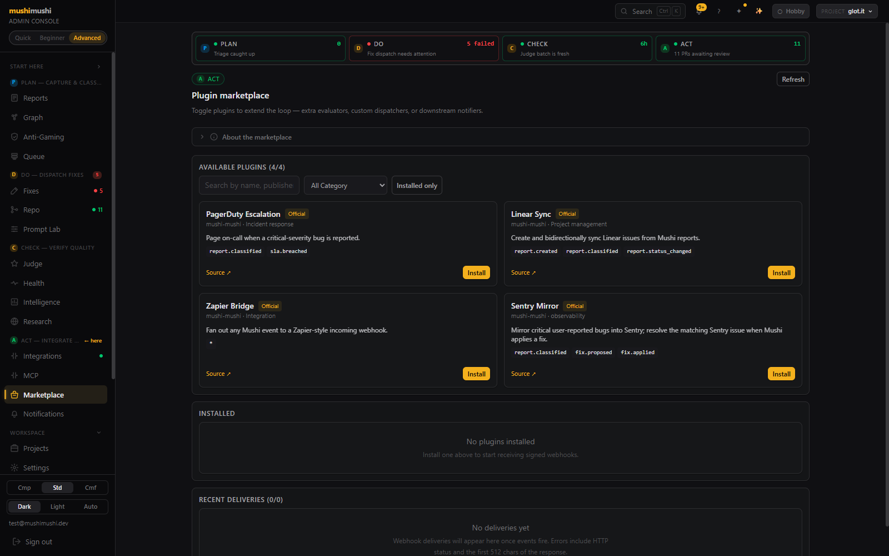
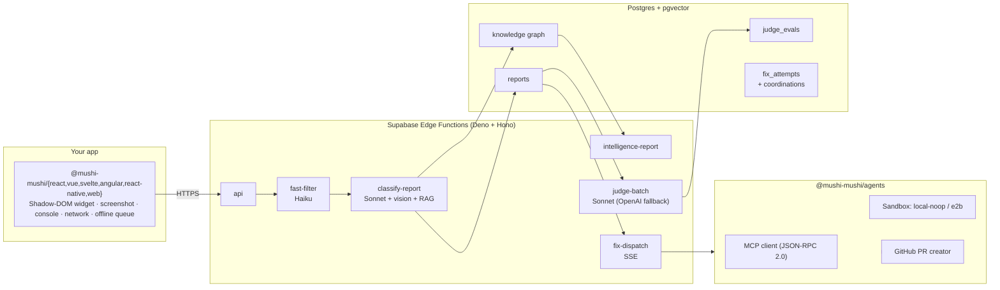

<div align="center">

# Mushi Mushi 虫虫

**The user-friction intelligence layer that complements Sentry.**

Sentry sees what your code throws. Mushi sees what your users *feel*.

[](https://www.npmjs.com/package/@mushi-mushi/react)
[](https://github.com/kensaurus/mushi-mushi/actions/workflows/ci.yml)
[](./LICENSE)
[](./packages/server/LICENSE)
[](https://react.dev)
[](https://typescriptlang.org)
[](https://vite.dev)
[](https://nodejs.org)
[](https://pnpm.io)

[Quick start](#quick-start) · [Live admin demo](https://kensaur.us/mushi-mushi/) · [Docs](./apps/docs) · [Self-hosting](./SELF_HOSTED.md) · [Architecture](#architecture)

<a href="https://kensaur.us/mushi-mushi/">
  
</a>

</div>

---

## The gap Mushi Mushi closes

Your existing monitoring is excellent at one thing: **what your code threw**. It cannot see:

- A button that *looks* clickable but does nothing
- A checkout flow that confuses every new user
- A page that takes 12 seconds to load but never errors
- A layout that breaks on one specific Android phone
- A feature that silently regressed two deploys ago

These are **user-felt bugs**. They never trigger an alert. Users just leave.

Mushi Mushi is the missing layer. Drop a small SDK into your app — users press shake-to-report (or click a widget) and Mushi auto-captures screenshot, console, network, device, route, and intent. An LLM-native pipeline (Haiku fast-filter → Sonnet vision + RAG → judge → optional agentic auto-fix) classifies, deduplicates, and turns the friction into actionable bug intelligence — wired into Sentry, Slack, Jira, Linear, and PagerDuty.

| Scenario                              | Sentry / Datadog | **Mushi Mushi** |
| ------------------------------------- | :--------------: | :-------------: |
| Unhandled exception                   |        ✅        |        ✅        |
| Button doesn't respond                |        —         |        ✅        |
| Page loads in 12 s, no error          |        —         |        ✅        |
| User can't find the settings panel    |        —         |        ✅        |
| Layout breaks on iPad Safari          |        —         |        ✅        |
| Form submits but data doesn't save    |        ~         |        ✅        |
| Feature regressed since last deploy   |        ~         |        ✅        |

> Designed as a **companion** to your existing monitoring, not a replacement. Reports stream through to Sentry breadcrumbs and link back to the offending session.

---

## Tour

<table width="100%">
<tr>
  <td width="50%" valign="top">
    <a href="./docs/screenshots/dashboard-dark.png"></a>
    <p align="center"><b>Dashboard</b><br/>At-a-glance counters, severity histogram, weekly trend.</p>
  </td>
  <td width="50%" valign="top">
    <a href="./docs/screenshots/reports-dark.png"></a>
    <p align="center"><b>Reports</b><br/>Triage queue with status / category / severity filters.</p>
  </td>
</tr>
<tr>
  <td width="50%" valign="top">
    <a href="./docs/screenshots/graph-dark.png"></a>
    <p align="center"><b>Knowledge graph</b><br/>Bug ↔ component ↔ page ↔ version, traversable in NL.</p>
  </td>
  <td width="50%" valign="top">
    <a href="./docs/screenshots/health-dark.png"></a>
    <p align="center"><b>System health</b><br/>Live LLM telemetry, fallback rate, latency p50/p95, cron status.</p>
  </td>
</tr>
<tr>
  <td width="50%" valign="top">
    <a href="./docs/screenshots/marketplace-dark.png"></a>
    <p align="center"><b>Plugin marketplace</b><br/>HMAC-signed webhooks. PagerDuty / Linear / Zapier ship in-tree.</p>
  </td>
  <td width="50%" valign="top">
    <a href="./docs/screenshots/compliance-dark.png"></a>
    <p align="center"><b>Compliance</b><br/>SOC 2 evidence pack, data residency pinning, DSAR workflow.</p>
  </td>
</tr>
</table>

---

## Seven capabilities, one platform

1. **User-side capture** — Shadow-DOM widget, screenshot, console + network rings, route + intent, offline queue, rage-click / error-spike / slow-page proactive triggers.
2. **LLM-native classification** — 2-stage pipeline (Haiku fast-filter → Sonnet deep + vision), structured outputs via `response_format`, prompt-cached system instructions, deterministic JSON.
3. **Knowledge graph + dedup** — Bug ↔ component ↔ page ↔ version edges in Postgres + pgvector. Auto-grouping kills duplicate noise.
4. **LLM-as-Judge self-improvement** — Weekly Sonnet judge scores classifier outputs; low-scoring runs feed a fine-tuning queue. OpenAI fallback when Anthropic is degraded.
5. **Agent-agnostic auto-fix** — Orchestrator with `validateResult` gating + GitHub PR creation. Sandbox provider abstraction (`local-noop` for tests, `e2b` / `modal` / `cloudflare` for prod, all four wired through `resolveSandboxProvider`). True MCP client adapter (JSON-RPC 2.0 + SEP-1686 Tasks) so Claude Code, Codex, Cursor, or any future agent plugs in.
6. **Multi-repo coordinated PRs** — A bug spanning frontend + backend opens linked PRs (`fix_coordinations` table) so reviewers see the full surface.
7. **Enterprise scaffolding** — SSO config CRUD, audit log ingest, plugin marketplace with HMAC, region-pinned data residency, retention policies, DSAR workflow, Stripe metered billing.

---

## Quick start

```bash
npx mushi-mushi
```

The wizard auto-detects your framework (Next.js / Nuxt / SvelteKit / Angular / Expo / Capacitor / plain React, Vue, Svelte / vanilla JS), installs the right SDK with your package manager, writes `MUSHI_PROJECT_ID` and `MUSHI_API_KEY` to `.env.local` (with the right framework prefix), and prints the snippet to paste in. Equivalent commands:

```bash
npm create mushi-mushi              # via the npm-create convention
npx @mushi-mushi/cli init           # if you prefer the scoped name
```

Skip the wizard and install directly if you already know which SDK you want:

```bash
npm install @mushi-mushi/react      # also covers Next.js
```

```tsx
import { MushiProvider } from '@mushi-mushi/react'

function App() {
  return (
    <MushiProvider config={{ projectId: 'proj_xxx', apiKey: 'mushi_xxx' }}>
      <YourApp />
    </MushiProvider>
  )
}
```

That's it. Users now have a shake-to-report widget. Reports land in your admin console, classified within seconds.

<details>
<summary><b>Other frameworks</b> — Vue, Svelte, Angular, React Native, Vanilla JS, iOS, Android</summary>

#### Vue 3 / Nuxt
```ts
import { MushiPlugin } from '@mushi-mushi/vue'
app.use(MushiPlugin, { projectId: 'proj_xxx', apiKey: 'mushi_xxx' })

import { Mushi } from '@mushi-mushi/web'
Mushi.init({ projectId: 'proj_xxx', apiKey: 'mushi_xxx' })
```

#### Svelte / SvelteKit
```ts
import { initMushi } from '@mushi-mushi/svelte'
initMushi({ projectId: 'proj_xxx', apiKey: 'mushi_xxx' })

import { Mushi } from '@mushi-mushi/web'
Mushi.init({ projectId: 'proj_xxx', apiKey: 'mushi_xxx' })
```

#### Angular 17+
```ts
import { provideMushi } from '@mushi-mushi/angular'
bootstrapApplication(AppComponent, {
  providers: [provideMushi({ projectId: 'proj_xxx', apiKey: 'mushi_xxx' })],
})
```

#### React Native / Expo
```tsx
import { MushiProvider } from '@mushi-mushi/react-native'
<MushiProvider projectId="proj_xxx" apiKey="mushi_xxx">
  <App />
</MushiProvider>
```

#### Vanilla JS / any framework
```ts
import { Mushi } from '@mushi-mushi/web'
Mushi.init({ projectId: 'proj_xxx', apiKey: 'mushi_xxx' })
```

#### iOS (Swift Package Manager — early dev)
```swift
.package(url: "https://github.com/kensaurus/mushi-mushi.git", from: "0.1.0")

import Mushi
Mushi.configure(projectId: "proj_xxx", apiKey: "mushi_xxx")
```

#### Android (Maven — early dev)
```kotlin
dependencies {
  implementation("dev.mushimushi:mushi-android:0.1.0")
}

Mushi.init(context = this, config = MushiConfig(projectId = "proj_xxx", apiKey = "mushi_xxx"))
```

</details>

> Want a runnable example? Check [`examples/react-demo`](./examples/react-demo) — a minimal Vite + React app with test buttons for dead clicks, thrown errors, failed API calls, and console errors.

---

## Where the project is today

| Wave | Theme                                              | Status |
| :--: | -------------------------------------------------- | :----: |
|  A   | Capture, fast-filter, deep classification, dedup   |   ✅    |
|  B   | Knowledge graph, NL queries, weekly intelligence   |   ✅    |
|  C   | Vision air-gap, RAG codebase indexer, fix dispatch |   ✅    |
|  D   | Marketplace, Cloud + Stripe, multi-repo fixes, hardened LLM I/O | ✅ (v1.0.0 prepping) |

Released today: `v0.8.0`. Next: `v1.0.0` — see [HANDOVER.md](./HANDOVER.md) for the release checklist and the two deferred follow-ups (Node mirror of `sanitize.ts` and the demo video).

**Latest dogfood:** end-to-end PDCA loop validated on a real production webapp ([glot.it](https://github.com/kensaurus/glot.it)) with my own OpenRouter key. Report → Stage 1 + Stage 2 LLM triage → admin "Dispatch fix" → `fix-worker` → draft GitHub PR → live in `/fixes`. Sentry, Langfuse and GitHub all probe **Healthy** from the Integrations page. Full writeup with screenshots: [`docs/dogfood-glotit-pdca-2026-04-17.md`](./docs/dogfood-glotit-pdca-2026-04-17.md).

**PDCA full-sweep (2026-04-18):** Stage 2 air-gap closed (only structured Stage 1 evidence reaches Sonnet, never raw user strings) and now contract-tested via `stage2-airgap.test.ts`; pipeline self-heals via `mushi-pipeline-recovery-5m` `pg_cron` + admin "Recover stranded" button + `scripts/pipeline-recover.mjs` host fallback (verified 2026-04-18 12:14 UTC: synthetic stranded report `07325681-…` → fast-filter 1.7 s → classify-report 14.1 s → `classified`); SDK now ships `fingerprintHash` (V5 §3c) and `ingestReport` always anti-games when present; Stripe quota gate ships HTTP 402 + `/billing` UI + invoice list + dashboard `QuotaBanner`; Sentry Seer cron poller; GitHub indexer sweep mode; Modal + Cloudflare sandbox adapters; real SAML SSO via Supabase Auth Admin API (OIDC documented as enterprise-tier-only); integrations routing CRUD with masked-secret pass-through; GraphPage a11y (table fallback + ARIA); `usePageData` + `useToast` rolled out across all 24 admin tabs (Playwright sweep 2026-04-18 12:20 UTC: 0 console errors, 0 warnings); `library-modernizer` + `prompt-auto-tune` Edge Functions deployed; 7 Supabase advisor lints cleared. Full handover: [`docs/HANDOVER-2026-04-18.md`](./docs/HANDOVER-2026-04-18.md).

**Admin console overhaul (Apr 2026):** every analytical page now shares the same `charts.tsx` primitives (`KpiTile`, `LineSparkline`, `SeverityStackedBars`, `Histogram`, `StatusPill`, `HealthPill`). Knowledge graph is a real React Flow canvas with cluster layout + side-panel. Judge has live KPIs, distribution histogram and a prompt leaderboard. NL Query has persistent per-user history and sanitised SQL output. Fixes shows a per-attempt Git branch graph plus a 30-day KPI summary. Queue (formerly DLQ) gets pagination, throughput sparkline and stage breakdown. Fine-Tuning was retired in favour of **Prompt Lab** (A/B traffic, dataset preview, clone/activate/delete) — `/fine-tuning` redirects there. Bug Intelligence runs **async** through `intelligence_generation_jobs` so the page no longer hangs on slow LLM calls. Cross-cutting: global `useToast`, StrictMode-safe `usePageData`, paused polling on hidden tabs, and an `IntegrationHealthDot` that reflects real `/v1/admin/health/history` status.

**PDCA cockpit reframing (Apr 2026):** the 23-page admin console is now organised around the Plan → Do → Check → Act loop the README sells, not the previous `Overview / Pipeline / Operations / Configuration` jargon. The sidebar groups every page under its PDCA stage (`Layout.tsx`); the dashboard prepends a 4-tile `PdcaCockpit` with a single living number per stage, a coloured ring on the current bottleneck, and one-click drill-into-stage. The empty dashboard now reads as a 3-step PDCA first-run script. Reports list got a 4 px severity stripe, a `+N similar` dedup badge, and a single primary action per row (`Triage →` or `Dispatch fix →`). Knowledge graph auto-switches to a Sankey-style storyboard when fewer than 12 nodes exist. Judge surfaces report summaries instead of hashes plus column tooltips. Anti-Gaming aggregates identical events by `(reason, fingerprint, ip)`. See [`apps/admin/README.md`](./apps/admin/README.md#information-architecture-pdca-loop) for the new IA + composition.

**Wave I gap-closure (Apr 2026):** closes the audit gap from the PDCA cockpit reframing. Reports list now shows a real `unique_users` blast-radius column (a `COUNT(DISTINCT reporter_token_hash)` Postgres RPC backed by partial covering indexes — `20260420000000_blast_radius_indexes.sql`), a 14-day severity KPI strip (`/v1/admin/reports/severity-stats`), a `StatusStepper` primitive that turns the four-state lifecycle into a visible progression, and group-by-fingerprint collapse with deep-linkable `?expand=<id>` state. Report Detail now opens with a `ScreenshotHero` and a `PdcaReceiptStrip` that pre-fetches `llm_invocations` + `fix_attempts` + `classification_evaluations` in parallel. Per-page polish: Projects shows a `PdcaBottleneckPill` per project (Plan / Do / Check / Act with deep-link), Billing shows a "on pace to hit limit in N days" forecast band, Audit gets an `actor_type` filter (human / agent / system), Compliance gets a print-styled "Export PDF" button, Storage shows per-project usage, Query gets pinned-question Saved sidebar (`is_saved` column on `nl_query_history` — `20260420000100_nl_query_saved.sql`) plus an SQL hints card. The dashboard `FirstReportHero` promotes "Send a test report" the moment the SDK is installed but no report has landed. The shared `EmptyState` primitive is now NN/G-compliant (status line + learning cue + optional bullet hints + direct-path action). Full handover: [`docs/HANDOVER-wave-i-2026-04-20.md`](./docs/HANDOVER-wave-i-2026-04-20.md).

**Wave J real LLM cost (Apr 2026):** promotes LLM dollars from a frontend-side estimate to a first-class column. New `llm_invocations.cost_usd numeric(12, 6)` column (`20260420000200_llm_cost_usd.sql`) is written at insert time by `logLlmInvocation`, backfilled for every historical row, and indexed via a partial covering index for fast monthly rollups. Pricing is centralised in `packages/server/supabase/functions/_shared/pricing.ts` so the SQL backfill, telemetry write, and Health fallback all read the same table. Three surfaces consume it: Health per-function reads the column directly, Billing shows a per-project `LLM $X.XX` chip alongside the report-quota usage bar (real COGS this billing month), Prompt Lab's diff modal shows `Avg $ / eval` next to `Avg judge score` so ops can see "did the candidate get more accurate AND cheaper?" without leaving the diff. Also patches two production Sentry issues caught during Wave I rollout: a `toFixed` crash on `/health` (deploy-skew defensive renders) and HMR-noise leakage from React Fast Refresh (`beforeSend` filter in `lib/sentry.ts`). Full handover: [`docs/HANDOVER-wave-j-2026-04-20.md`](./docs/HANDOVER-wave-j-2026-04-20.md).

**Wave K admin polish (Apr 2026):** UX + microinteraction sweep across all 24 admin routes. Pre-setup dashboard now hides the full KPI grid behind a "Show full dashboard" reveal so brand-new admins see only `SetupChecklist + HeroIntro` until they've sent their first report. `PageHelp` panels default-open only on the first ever visit (single global `mushi:visited` flag), then default-closed for returning users — first-day learners get the explainer, daily users get the lean header. Outcome copy replaces jargon: "PDCA cockpit" → "Loop status — Plan, Do, Check, Act"; "PDCA loop — healthy" → "Triage → Fix → Verify — healthy". `PageHeader` accepts a `projectScope` prop and `Reports / Fixes / Judge / Graph / Health / Compliance` thread the active project name through the header so the admin sees `Reports · glot-it` at a glance. Eight silent / broken UI surfaces fixed (DSAR snake_case contract + `project_id`, Reports KPI strip silent zeros → inline retry, Query / Billing tiny-text errors → `ErrorAlert` with retry, comment mutation toasts, triage bar `<Btn loading>` adoption, Reports empty contradiction, `Conf.` → `<abbr title="Confidence">`). Loading states are now layout-shaped: `DashboardSkeleton`, `TableSkeleton`, `DetailSkeleton`, `PanelSkeleton` replaced 22 page-level `<Loading />` spinners so first paint matches the loaded layout. Microinteractions across the app: toasts animate in / out (180 / 140ms), modal scrims fade-in and panels scale-in, Settings page has a sliding underline tab indicator, and a new `<ResultChip>` primitive gives every Test / Run / Trigger button a persistent `✓ Connection OK · 2s ago` receipt. Token aliases added in `index.css` so stale class names (`bg-warning-subtle`, `text-fg-primary`, `border-border`) keep rendering correctly without a grep-and-replace risk; zero raw `bg-black / bg-white / text-black / text-white` left in `apps/admin/src`. Full handover: [`docs/HANDOVER-wave-k-2026-04-20.md`](./docs/HANDOVER-wave-k-2026-04-20.md).

### Honest status — what works, what's still partial

| Area                 | Working                                                                                             | Still partial                                                  |
| -------------------- | --------------------------------------------------------------------------------------------------- | -------------------------------------------------------------- |
| Classification       | Haiku fast-filter, Sonnet deep, **vision air-gap closed + contract-tested**, structured outputs, prompt-cached prompts, **`pg_cron` self-healing every 5 min** | —                                                              |
| Judge / self-improve | Sonnet judge with **OpenAI fallback** wired                                                          | Auto-promotion of fine-tuning candidates to a training run     |
| Fix orchestrator     | Single + multi-repo, `validateResult` gating, GitHub PR creation, **MCP JSON-RPC 2.0** client       | First-party Claude Code / Codex adapters wait on vendor APIs   |
| Sandbox              | Provider abstraction; `local-noop` (tests) + `e2b` / `modal` / `cloudflare` (prod-ready, deny-by-default egress, audit-event stream) | —                                                              |
| Verify               | Screenshot diff via Playwright + pixelmatch                                                          | Step interpreter is proof-of-concept (nav + click only)        |
| Enterprise           | Plugin marketplace + HMAC, audit ingest, region pinning, retention CRUD, Stripe metering + `/billing` UI + invoice list, **SAML SSO via Supabase Auth Admin API** (ACS / Entity ID surfaced for IdP setup), routing-destination CRUD with masked secrets | OIDC SSO writes config but waits on GoTrue admin endpoints     |
| Streaming            | Fix-dispatch SSE (CVE-2026-29085-safe sanitization)                                                  | Classification reasoning still arrives whole, not token-stream |

The orchestrator **refuses to run `local-noop` in production** unless you explicitly set `MUSHI_ALLOW_LOCAL_SANDBOX=1`. Pick `e2b` (or implement the `SandboxProvider` interface yourself) before exposing autofix to production traffic.

---

## Architecture



See [`apps/docs/content/concepts/architecture.mdx`](./apps/docs/content/concepts/architecture.mdx) for the full pipeline.

---

## Packages

> Most developers only install **one** SDK package — `npx mushi-mushi` picks the right one for you and pulls in `core` and `web` automatically.

| Install                            | Framework               | What you get                                                                              |
| ---------------------------------- | ----------------------- | ----------------------------------------------------------------------------------------- |
| `npx mushi-mushi`                  | **Any** (auto-detects)  | One-command wizard — installs the right SDK, writes env vars, prints the snippet          |
| `npm i @mushi-mushi/react`         | React / Next.js         | `<MushiProvider>`, `useMushi()`, `<MushiErrorBoundary>` — drop-in for any React app       |
| `npm i @mushi-mushi/vue`           | Vue 3 / Nuxt            | `MushiPlugin`, `useMushi()` composable, error handler (pair with `web` for the widget UI) |
| `npm i @mushi-mushi/svelte`        | Svelte / SvelteKit      | `initMushi()`, SvelteKit error hook (pair with `web` for the widget UI)                   |
| `npm i @mushi-mushi/angular`       | Angular 17+             | `provideMushi()`, `MushiService`, error handler (pair with `web` for the widget UI)       |
| `npm i @mushi-mushi/react-native`  | React Native / Expo     | Shake-to-report, bottom-sheet widget, navigation capture, offline queue                   |
| `npm i @mushi-mushi/capacitor`     | Capacitor / Ionic       | iOS + Android via Capacitor — shake-to-report, screenshot, offline queue                  |
| `npm i @mushi-mushi/web`           | Vanilla / any framework | Framework-agnostic SDK — Shadow-DOM widget, screenshot, console + network capture         |

[&color=cb3837)](https://www.npmjs.com/package/mushi-mushi)
[](https://www.npmjs.com/package/@mushi-mushi/react)
[](https://www.npmjs.com/package/@mushi-mushi/vue)
[](https://www.npmjs.com/package/@mushi-mushi/svelte)
[](https://www.npmjs.com/package/@mushi-mushi/angular)
[](https://www.npmjs.com/package/@mushi-mushi/react-native)
[](https://www.npmjs.com/package/@mushi-mushi/capacitor)
[](https://www.npmjs.com/package/@mushi-mushi/web)
[](https://www.npmjs.com/package/@mushi-mushi/cli)
[](https://www.npmjs.com/package/@mushi-mushi/mcp)

<details>
<summary><b>Internal & native packages</b></summary>

| Package                               | Purpose                                                                                                                |
| ------------------------------------- | ---------------------------------------------------------------------------------------------------------------------- |
| [`@mushi-mushi/core`](./packages/core) | Shared engine — types, API client, PII scrubber, offline queue, rate limiter, structured logger. Auto-installed.       |
| [`@mushi-mushi/cli`](./packages/cli)   | CLI for project setup, report listing, triage. `npm i -g @mushi-mushi/cli`                                              |
| [`@mushi-mushi/mcp`](./packages/mcp)   | MCP server — lets Cursor / Copilot / Claude read and triage bug reports                                                 |
| [`packages/ios`](./packages/ios)       | Native iOS SDK (Swift Package Manager) — early dev                                                                      |
| [`packages/android`](./packages/android) | Native Android SDK (Maven `dev.mushimushi:mushi-android`) — early dev                                                  |

</details>

<details>
<summary><b>Backend packages</b> (BSL 1.1 → Apache 2.0 in 2029)</summary>

| Package                | Purpose                                                                                                                                              |
| ---------------------- | ---------------------------------------------------------------------------------------------------------------------------------------------------- |
| `@mushi-mushi/server`  | Edge functions — classification pipeline, knowledge graph, fix dispatch + SSE, RAG indexer, vision air-gap, judge with OpenAI fallback, plugin runtime |
| `@mushi-mushi/agents`  | Agentic fix orchestrator — `validateResult` gating, GitHub PR creation, sandbox abstraction, MCP JSON-RPC 2.0 client                                  |
| `@mushi-mushi/verify`  | Playwright fix verification — screenshot visual diff (proof-of-concept step interpreter)                                                              |

</details>

---

## Connecting to a backend

### A. Hosted (zero-config)

1. Sign up at **[kensaur.us/mushi-mushi](https://kensaur.us/mushi-mushi/)**
2. Create a project → copy your `projectId` and `apiKey`
3. Drop the SDK into your app

### B. Self-hosted

```bash
cd deploy
cp .env.example .env   # ANTHROPIC_API_KEY, Supabase creds
docker compose up -d
```

Or via Supabase CLI directly — see [SELF_HOSTED.md](./SELF_HOSTED.md). A Helm chart lives at `deploy/helm/` (incomplete — missing migrations ConfigMap).

> Internal edge functions (`judge-batch`, `intelligence-report`, `generate-synthetic`) authenticate via `SUPABASE_SERVICE_ROLE_KEY`. Never expose them with `--no-verify-jwt` in production. Only the public `api` function should face the internet.

---

## Monitoring & privacy (this repo's deployment)

The hosted instance reports to two Sentry projects under the [`sakuramoto`](https://sakuramoto.sentry.io) org:

| Project              | What it covers                                                                                                                              | DSN source                                  |
| -------------------- | ------------------------------------------------------------------------------------------------------------------------------------------- | ------------------------------------------- |
| `mushi-mushi-admin`  | Admin console: unhandled errors, React error boundaries, perf traces (10 % sample), errors-only Session Replay (`replaysOnErrorSampleRate: 1.0`, masked text + media) | `VITE_SENTRY_DSN` baked into the build      |
| `mushi-mushi-server` | All eight edge functions: unhandled exceptions + every `log.error()`/`log.fatal()` forwarded via `_shared/sentry.ts`                        | `SENTRY_DSN_SERVER` Supabase secret         |

Privacy & safety:

- `sendDefaultPii: false` on both — no IPs, cookies, or request bodies attached automatically.
- Token-like query params scrubbed in `beforeSend`. `Authorization`, `Cookie`, `*-api-key` headers redacted server-side.
- Sourcemaps uploaded by `@sentry/vite-plugin` during `pnpm build` and **deleted from `dist/` before the S3 sync** — the public bucket never serves them.
- Sentry data scrubbing strips token prefixes (`mushi_*`, `sntryu_*`, JWTs starting with `eyJ`, `ghp_*`, `npm_*`) on top of SDK-side redaction.

> **For SDK consumers and forks:** the published packages **do not initialize Sentry**. The bridge at [`packages/web/src/sentry.ts`](packages/web/src/sentry.ts) only *reads context from your existing Sentry instance* — it never sends data on its own. Self-hosted forks can leave the DSNs unset and the SDKs no-op cleanly.

## Payment & support operations

The hosted product wires three feedback loops so the operator hears from paying customers fast:

| Channel                              | Trigger                                                                                                                                                          | Where it shows up                                                              |
| ------------------------------------ | ---------------------------------------------------------------------------------------------------------------------------------------------------------------- | ------------------------------------------------------------------------------ |
| **Stripe webhooks → operator push**  | `checkout.session.completed`, `invoice.payment_failed`, `customer.subscription.deleted`, `cancel_at_period_end → true`, `invoice.payment_succeeded` (recovery only) | Slack and/or Discord via `OPERATOR_SLACK_WEBHOOK_URL` / `OPERATOR_DISCORD_WEBHOOK_URL` |
| **Stripe Dashboard email digests**   | Same events natively, plus dispute / refund flows                                                                                                                 | The Stripe Dashboard email recipient list (configured in the Dashboard UI)    |
| **In-app support inbox**             | Paid (or free) customer submits the BillingPage "Need help?" form                                                                                                | `support_tickets` table + operator push + audit log + reply to `SUPPORT_EMAIL` |

How each piece works:

- **Operator push** (`packages/server/supabase/functions/_shared/operator-notify.ts`): a single helper that knows how to render Slack Block Kit *and* Discord rich embeds. Severity drives colour; `urgent` pings `@here` on Discord. Failures are captured to Sentry but never block the webhook from 200-ing back to Stripe.
- **In-app support form** (`/v1/support/contact`): JWT-gated, rate-limited to 5 tickets/hour/user, captures plan tier at submit time so paid tickets jump the queue. Customer sees status updates inline on `/billing`. PII (passwords, API keys) explicitly called out as off-limits in the form copy.
- **Centralised support address** (`SUPPORT_EMAIL` env var, defaults to `support@mushimushi.dev`): used in the Checkout `custom_text`, the BillingPage "Need help?" mailto, and the rate-limit error message.

To enable the operator push for a self-hosted instance:

```bash
# 1. Create a Slack incoming webhook (api.slack.com/messaging/webhooks)
#    OR a Discord channel webhook (server settings → integrations → webhooks).
# 2. Push the secret to Supabase:
supabase secrets set OPERATOR_SLACK_WEBHOOK_URL=https://hooks.slack.com/services/...
# or
supabase secrets set OPERATOR_DISCORD_WEBHOOK_URL=https://discord.com/api/webhooks/...
# 3. Optionally override the support address (defaults to support@mushimushi.dev):
supabase secrets set SUPPORT_EMAIL=ops@yourdomain.com
# 4. Redeploy the api + stripe-webhooks functions:
supabase functions deploy api stripe-webhooks
```

---

<details>
<summary><b>Repo structure & dev commands</b></summary>

#### Development

```bash
git clone https://github.com/kensaurus/mushi-mushi.git
cd mushi-mushi
pnpm install
pnpm build
```

Requires Node.js ≥ 22 and pnpm ≥ 10.

| Command            |                                                              |
| ------------------ | ------------------------------------------------------------ |
| `pnpm dev`         | Run all dev servers (admin on `:6464`, docs, cloud)          |
| `pnpm build`       | Build all packages                                           |
| `pnpm test`        | Vitest                                                       |
| `pnpm typecheck`   | TypeScript checks                                            |
| `pnpm lint`        | Lint                                                         |
| `pnpm format`      | Prettier                                                     |
| `pnpm changeset`   | Create a changeset                                           |
| `pnpm release`     | Build + publish to npm                                       |

#### Admin console (zero-config)

```bash
cd apps/admin
pnpm dev    # → http://localhost:6464 — auto-connects to Mushi Cloud
```

To self-host with your own Supabase project, copy `apps/admin/.env.example` and fill in your URL + anon key.

#### Backend / edge functions

```bash
cp .env.example .env   # Supabase + LLM provider keys
cd packages/server/supabase
npx supabase db push
npx supabase functions deploy api --no-verify-jwt
```

#### Repo layout

```
packages/
  core, web, react, vue, svelte, angular, react-native   # SDKs (MIT)
  ios, android                                            # Native SDKs (early dev)
  cli, mcp                                                # Tooling
  server, agents, verify                                  # Backend (BSL 1.1)
  plugin-{sdk,zapier,linear,pagerduty}                    # Plugin marketplace
apps/
  admin    # React 19 + Tailwind 4 + Vite 8 (dark-only by design)
  docs     # Nextra v4 documentation site
  cloud    # Next.js 15 marketing landing + Stripe billing
examples/
  react-demo
deploy/    # Docker Compose + Helm chart
tooling/   # Shared ESLint + TypeScript configs
```

</details>

---

## Contributing

Issues and PRs welcome. To get started: `pnpm install && pnpm dev`. See individual package READMEs for package-specific setup, and [HANDOVER.md](./HANDOVER.md) for the current state of play.

## License

- **SDK packages** (core, web, react, vue, svelte, angular, react-native, cli, mcp): [MIT](./LICENSE)
- **Server, agents, verify**: [BSL 1.1](./packages/server/LICENSE) — converts to Apache 2.0 on April 15, 2029
