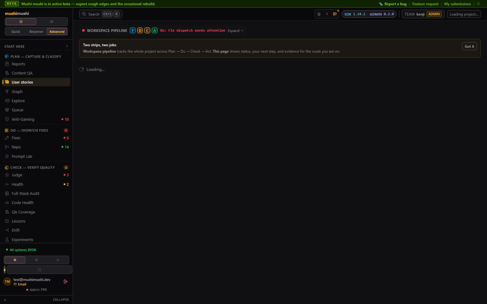
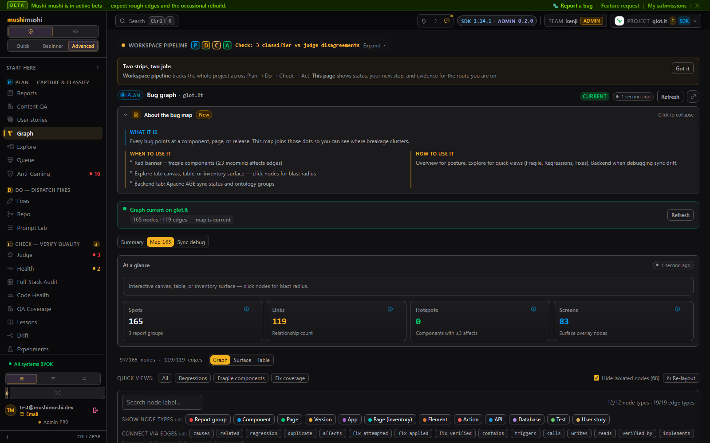
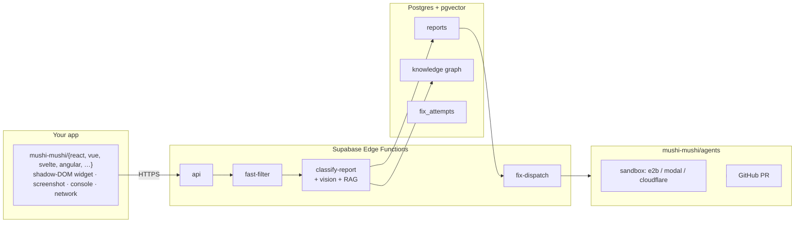

<div align="center">

# Mushi Mushi

**The bug your monitoring can't see, in your queue with a draft fix.**

Sentry catches what your code throws. Datadog catches what your infrastructure does. Firebase catches what your users *click*. Mushi catches what your users *feel* — the dead button, the 12-second screen, the layout that breaks on one Android.

Mushi is the **synthesis layer**: the one signal none of your existing tools capture, with inbound adapters for Datadog / Crashlytics / New Relic and outbound plugins for Sentry / Slack / Jira / Linear / PagerDuty so every tool in your stack stays in the loop.

[](https://www.npmjs.com/package/@mushi-mushi/react)
[](https://github.com/kensaurus/mushi-mushi/actions/workflows/ci.yml)
[](./LICENSE)
[](./packages/server/LICENSE)

[Quick start](#try-it) · [Live admin demo](https://kensaur.us/mushi-mushi/admin/) · [Docs](https://kensaur.us/mushi-mushi/docs/) · [Marketing landing](https://kensaur.us/mushi-mushi/) · [Self-hosting](./SELF_HOSTED.md) · [Full screenshot tour](./docs/SCREENSHOTS.md)

<a href="https://kensaur.us/mushi-mushi/admin/" title="Open the live admin demo — animated guided tour">
  
</a>

<sub>↑ a logged-in 4-stop walk through the Plan → Do → Check → Act loop</sub>

<br><br>

<a href="https://kensaur.us/mushi-mushi/admin/dashboard" title="Open the live admin dashboard">
  <picture>
    <source media="(prefers-color-scheme: dark)" srcset="./docs/screenshots/dashboard-dark.png">
    <source media="(prefers-color-scheme: light)" srcset="./docs/screenshots/dashboard-light.png">
    
  </picture>
</a>

<sub>↑ the v2 admin · click to open the live demo · the image swaps with your system theme</sub>

</div>

---

## What's new in v2 — bidirectional inventory + agentic-failure gates

Mushi v1 was the negative side: catch what your users *felt* break and triage it.
**v2 adds the positive side**: a declarative `inventory.yaml` of user stories, pages, and actions — with five pre-release **gates** that fail the build when the agent's drafts diverge from the contract, and a **synthetic monitor** that re-walks the same surface against staging on a schedule.

- 🌱 **Sketch your app, not just its bugs.** A `User stories · Inventory` page (sidebar → User stories) groups every user-facing action under the story it serves and shows verified / unwired / regressed counts at a glance.
- 🤖 **The SDK proposes the inventory.** Turn on `capture.discoverInventory` and the SDK quietly observes routes, `data-testid`s, and outbound API paths in production — Claude drafts an `inventory.yaml` from the stream, you accept or edit. Most teams will never hand-author one.
- 🚦 **Five gates, one composite GitHub check.** `mushi-mushi/no-dead-handler` (empty `onClick`s), `mushi-mushi/no-mock-leak` (faker / "John Doe" arrays in non-test paths), inventory drift (added / removed / renamed actions), agentic-failure detection (handler regressions across deploys), and synthetic walk health.
- 🛰️ **Synthetic monitor** runs the inventory's `expected_outcome` checks against your staging URL on a cron — fail-closed by default, with explicit `synthetic_monitor_allow_mutations` opt-in for write paths.
- 🕸️ **Graph gets a Surface mode** — the same `Bug graph` toggles to a `Surface` view that overlays the positive inventory on the live knowledge graph so you can see the dead corners.
- 🧭 **Spec traceability is end-to-end (2026-05-09 release).** `expected_outcome` is a real schema field — its assertions ride along with every fix dispatch, get rendered into the LLM prompt, gate the PR through `validateAgainstSpec`, and trigger a *targeted* synthetic probe against the originating Action the moment the PR opens. Every `fix_attempt` row records the inventory `Action` it was meant to repair (`inventory_action_node_id`), so the admin "Where this fix came from" drawer can show the same spec the agent saw. See [How spec traceability works](#how-spec-traceability-works) below for the full chain.
- 🔌 **First-class orchestrator interop.** Plug Mushi into Cursor, Claude Code, OpenAI Agents SDK, LangGraph, CrewAI, A2A v1.0.0 agents, or anything else: **MCP Streamable HTTP** at `/functions/v1/mcp` (2025-03-26 spec), **A2A `tasks` endpoints** at `/v1/a2a/tasks` (create / get / cancel / SSE subscribe), **OpenAPI 3.1** at `/openapi.json`, AG-UI v0.4 SSE accepts API keys (`mcp:read`), `SandboxProvider` is an open contract with a third-party registry, and JSON Schemas for `FixContext` / `FixResult` / `SandboxProvider` / `ExpectedOutcome` are served at `/v1/schemas/*`. See [Connecting your orchestrator](https://kensaur.us/mushi-mushi/docs/concepts/orchestrator-interop) for per-orchestrator recipes.

Get started in any project that already has Mushi installed:

```yaml
# .github/workflows/mushi-gates.yml
- uses: kensaurus/mushi-mushi/packages/mcp-ci@master
  with:
    api-key: ${{ secrets.MUSHI_API_KEY }}
    project-id: ${{ secrets.MUSHI_PROJECT_ID }}
    command: gates                       # also: propose · discover-api · discovery-status · auth-bootstrap
```

Inside your IDE the same commands are exposed as MCP tools via [`@mushi-mushi/mcp`](./packages/mcp/), so Cursor / Claude Code / Copilot can run them on your behalf. From the admin UI you click *Run gates* / *Run crawler* directly on each row of the User stories page.

Full schema in [`@mushi-mushi/inventory-schema`](./packages/inventory-schema/), ESLint rules in [`eslint-plugin-mushi-mushi`](./packages/eslint-plugin-mushi-mushi/), the auth-bootstrap helper in [`@mushi-mushi/inventory-auth-runner`](./packages/inventory-auth-runner/).

---

## How spec traceability works

The most-asked v2 question is "how do you keep agent work tied back to the original spec once implementation starts?" Honest answer: until the 2026-05-09 release the read side was tight and the write side was a U-turn — the worker dropped the inventory pointer the moment dispatch started. That's now closed end-to-end.

```
report ──► classify-report writes graph_edge (reports_against)
              │
              ▼
        inventory Action node ◄────────── inventory.yaml (expected_outcome)
              │
              ▼
       POST /v1/admin/fixes/dispatch  (or /v1/a2a/tasks, MCP dispatch_fix)
              │  body may carry { inventoryActionNodeId } — else worker walks the edge
              ▼
        fix_dispatch_jobs.inventory_action_node_id  ──► persisted
              │
              ▼
        fix-worker assembles FixContext
              + inventoryAction.expectedOutcome  ──► Markdown spec block in the LLM prompt
              ▼
        validateAgainstSpec  (deterministic pre-PR gate)
              │  HARD ERROR if the diff removes a json_path field the contract asserts on
              │  WARN to fix_attempts.spec_validation_warnings if no file references the contract's table / route
              ▼
        GitHub PR + fix_attempts row stamped with inventory_action_node_id
              │
              ▼
        synthetic_runs queued (status='skipped', error_message='queued_post_pr', action_node_id=…)
              │
              ▼
        synthetic-monitor cron drains the queue with priority on the next tick,
        runs an HTTP probe, evaluates expected_outcome (status_in + JSONPath assertions),
        records a real synthetic_runs row.
              │
              ▼
        Status reconciler picks it up → admin UI flips the Action to verified / regressed.
```

Every link in that chain has a real column / migration / test:

| Link | Where to look |
| ---- | ------------- |
| `expected_outcome` schema | [`packages/inventory-schema/src/index.ts`](./packages/inventory-schema/src/index.ts) — Zod + JSON Schema, mirrored at `/v1/schemas/expected-outcome.json` |
| `inventory_action_node_id` columns | [`20260509100000_inventory_action_traceability.sql`](./packages/server/supabase/migrations/) — `fix_dispatch_jobs` + `fix_attempts` (FK, `ON DELETE SET NULL`) + `spec_validation_warnings JSONB` |
| Spec context in the LLM prompt | `renderSpecContext()` in [`packages/agents/src/review.ts`](./packages/agents/src/review.ts), mirrored in [`packages/server/supabase/functions/fix-worker/index.ts`](./packages/server/supabase/functions/fix-worker/index.ts) |
| Pre-PR gate | `validateAgainstSpec()` in [`packages/agents/src/review.ts`](./packages/agents/src/review.ts), wired into [`packages/agents/src/orchestrator.ts`](./packages/agents/src/orchestrator.ts) |
| Post-PR probe | `drainPostPrQueue()` + `evaluateExpectedOutcome()` in [`packages/server/supabase/functions/synthetic-monitor/index.ts`](./packages/server/supabase/functions/synthetic-monitor/index.ts) |
| External orchestrators see the same anchor | `dispatch_fix` and `get_fix_context` MCP tools in [`packages/server/supabase/functions/mcp/index.ts`](./packages/server/supabase/functions/mcp/index.ts); A2A `inventoryActionNodeId` body field in [`packages/server/supabase/functions/api/routes/a2a-tasks.ts`](./packages/server/supabase/functions/api/routes/a2a-tasks.ts) |

What the agent sees in its prompt today (rendered by `renderSpecContext`):

```markdown
## Inventory Spec Context (whitepaper §2.10 spec-traceability)
This fix was dispatched against a tracked Action in the project's `inventory.yaml`.
The agent and the reviewer MUST keep the diff scoped to making the action work as
specified — do NOT refactor unrelated code or break sibling actions on the same page.

- Action: `signup-form: submit`
- Description: Submit the signup form and create a new user
- Page: `/signup` (id=`signup`)
- User story: New user signup (`signup`)

### Expected outcome contract (success criteria after fix)
- Summary: POST /signup returns 200 and creates a user row
- HTTP status MUST be one of: 200, 201
- Response body assertions:
  - `$.user.id` exists
- Database: `public.users` MUST row_exists
- UI MUST show text containing: "Welcome"
- UI MUST navigate to: `/dashboard`

After the PR merges, the synthetic monitor will probe the action against this
contract. A draft fix that the synthetic monitor will then immediately mark
`regressed` is worse than no fix at all.
```

The same anchor flows out to every external surface — Cursor / Claude Code / OpenAI Agents SDK / LangGraph / CrewAI / A2A all get the inventory Action and its `expected_outcome` via the MCP `get_fix_context` tool, the A2A Task `metadata.inventoryActionNodeId` field, or the dispatch row's column directly.

---

## When this matters to you

Your existing monitoring is excellent at one thing: telling you what your code threw. It can't tell you any of these:

- A user added a coupon and the pay button slipped under their keyboard.
- A new signup tapped *Save* twice because nothing visibly happened the first time.
- A Pro customer's dashboard takes 12 seconds to load and they've started using the competitor's tab in the meantime.
- A layout that looks fine on your laptop folds in half on the one Android model used by 18% of your traffic.
- A feature regressed two deploys ago. Three users emailed support; two just churned.

These never trigger an alert. Your users just leave. Mushi gives them a way to tell you while the moment is still fresh — so the bug your monitoring missed lands in your triage queue, classified, deduped, and (optionally) with a draft PR already open.

---

## Try it

```bash
npx mushi-mushi
```

The wizard auto-detects your framework (Next.js / Nuxt / SvelteKit / Angular / Expo / Capacitor / plain React, Vue, Svelte / vanilla JS), installs the right SDK, writes `MUSHI_PROJECT_ID` and `MUSHI_API_KEY` to `.env.local`, and prints the snippet to paste in. Equivalent commands:

```bash
npm create mushi-mushi              # via the npm-create convention
npx @mushi-mushi/cli init           # the scoped name
```

Or install directly if you already know which SDK you want:

```bash
npm install @mushi-mushi/react      # also covers Next.js
```

```tsx
import { MushiProvider } from '@mushi-mushi/react'

function App() {
  return (
    <MushiProvider
      config={{
        projectId: 'proj_xxx',
        apiKey: 'mushi_xxx',
        // v2.1 — opt in to passive inventory discovery (off by default).
        // Routes, testids, and outbound API paths flow into the proposer
        // so Claude can draft an inventory.yaml for you to accept.
        capture: { discoverInventory: true },
      }}
    >
      <YourApp />
    </MushiProvider>
  )
}
```

Your users now have a shake-to-report widget. Reports land in your admin console, classified within seconds — and (with `discoverInventory`) your inventory drafts itself from the same stream.

<details>
<summary><b>Other frameworks</b> — Vue, Svelte, Angular, React Native, Vanilla JS, iOS, Android</summary>

#### Vue 3 / Nuxt
```ts
import { MushiPlugin } from '@mushi-mushi/vue'
app.use(MushiPlugin, { projectId: 'proj_xxx', apiKey: 'mushi_xxx' })
```

#### Svelte / SvelteKit
```ts
import { initMushi } from '@mushi-mushi/svelte'
initMushi({ projectId: 'proj_xxx', apiKey: 'mushi_xxx' })
```

#### Angular 17+
```ts
import { provideMushi } from '@mushi-mushi/angular'
bootstrapApplication(AppComponent, {
  providers: [provideMushi({ projectId: 'proj_xxx', apiKey: 'mushi_xxx' })],
})
```

#### React Native / Expo
```tsx
import { MushiProvider } from '@mushi-mushi/react-native'
<MushiProvider projectId="proj_xxx" apiKey="mushi_xxx">
  <App />
</MushiProvider>
```

#### Vanilla JS / any framework
```ts
import { Mushi } from '@mushi-mushi/web'
Mushi.init({ projectId: 'proj_xxx', apiKey: 'mushi_xxx' })
```

#### iOS (Swift Package Manager — early dev)
```swift
.package(url: "https://github.com/kensaurus/mushi-mushi.git", from: "0.3.0")
import Mushi
Mushi.configure(projectId: "proj_xxx", apiKey: "mushi_xxx")
```

#### Android (Maven — early dev)
```kotlin
dependencies {
  implementation("dev.mushimushi:mushi-android:0.3.0")
}
Mushi.init(context = this, config = MushiConfig(projectId = "proj_xxx", apiKey = "mushi_xxx"))
```

</details>

> Want a runnable example? [`examples/react-demo`](./examples/react-demo) is a minimal Vite + React app with test buttons for dead clicks, thrown errors, failed API calls, and console errors.

---

## Tour the rooms

A quick look at where you'll spend your time. Every panel is a click-through to the live demo.

<table>
  <tr>
    <td width="50%" align="center">
      <a href="https://kensaur.us/mushi-mushi/admin/dashboard" title="Open the live dashboard">
        
      </a>
      <br>
      <sub><b>Dashboard</b> · the PDCA cockpit — PLAN / DO / CHECK / ACT in one row, the next action explained in plain English, and the setup checklist that moves itself off-screen once you finish</sub>
    </td>
    <td width="50%" align="center">
      <a href="https://kensaur.us/mushi-mushi/admin/inventory" title="Open the live inventory">
        
      </a>
      <br>
      <sub><b>User stories · Inventory</b> · the new v2 positive surface — every user-facing action grouped under its story, with verified / unwired / regressed counts and one-click <i>Run gates</i> / <i>Run crawler</i> from the row</sub>
    </td>
  </tr>
  <tr>
    <td width="50%" align="center">
      <a href="https://kensaur.us/mushi-mushi/admin/graph" title="Open the live knowledge graph">
        
      </a>
      <br>
      <sub><b>Knowledge graph</b> · component / page / release adjacency weighted by bug incidence — toggle <i>Surface</i> to overlay the positive inventory and see the dead corners</sub>
    </td>
    <td width="50%" align="center">
      <a href="https://kensaur.us/mushi-mushi/admin/graph" title="Open graph in Surface mode">
        
      </a>
      <br>
      <sub><b>Graph · Surface mode</b> · v2 — the same canvas, but every Page / Element / Action from <code>inventory.yaml</code> overlaid on the live knowledge graph so the dead corners light up</sub>
    </td>
  </tr>
</table>

For the full screenshot tour (28 surfaces, every page in the console) see [`docs/SCREENSHOTS.md`](./docs/SCREENSHOTS.md).

---

## How the loop runs

When a user shakes their phone, four things happen in roughly the order you'd expect a careful colleague to do them:

1. **Capture.** The widget grabs the screenshot, the route, the user's note, the last few console + network events, and the device context. Everything they were doing, plus everything that broke.
2. **Classify.** A two-stage LLM pipeline (Haiku fast-filter → Sonnet deep + vision) tags severity, category, and root-cause hint in plain English. A nightly Sonnet judge scores the classifier's own work and feeds a prompt-A/B loop, so the labels you see come from prompts that have earned their place.
3. **Connect.** The report embeds into a knowledge graph (Postgres + pgvector). The same broken button reported twenty times shows up as one row, not twenty.
4. **Fix.** *Optional.* You click *Dispatch fix* (or wire the same action into Slack, MCP, or CI) and an agent in a sandbox tries the change, runs your tests, and opens a draft PR. You review it like any other PR — and merge, change, or close it.

The architecture, sequence diagram, and component-by-component spec live in [`apps/docs/content/concepts/architecture.mdx`](./apps/docs/content/concepts/architecture.mdx). A condensed wire diagram:



---

## What you get on day one

- **You see one report per actual bug, not twenty.** Dedup runs against the knowledge graph, so the same broken button collapses across users and devices.
- **Your queue is already triaged.** Severity, category, and a one-line root-cause hint are there before you click in.
- **Your users get a way to tell you.** A 14 KB shake-to-report widget that doesn't pretend to be a chat bot and doesn't ask them to write a ticket.
- **Your auto-fix is opt-in and reviewable.** The agent opens a *draft* PR. You merge it, edit it, or close it — the loop never bypasses you.
- **Your existing tools keep working.** Mushi sits next to Sentry; it does not replace it. Sentry breadcrumbs flow into Mushi's classifier, and Mushi reports flow back as Sentry User Feedback if you want them to.

---

## Where it stops

Mushi is honest about what's still partial. Skim before you commit:

| Area | Working | Still partial |
| ---- | ------- | ------------- |
| Classification | Haiku fast-filter, Sonnet deep + **vision air-gap closed**, structured outputs, prompt-cached prompts, `pg_cron` self-healing | Stage 2 response streaming (Wave S5) |
| Judge / self-improve | Sonnet judge with **OpenAI fallback**, prompt A/B auto-promotion via `judge → avg_judge_score → promoteCandidate` | Vendor fine-tune submit-worker is a stub. Prompt A/B is the shipping mechanism today. |
| Fix orchestrator | Single-repo `validateResult` gating, GitHub PR, **MCP JSON-RPC 2.0** client, multi-repo coordinator | First-party Claude Code / Codex adapters wait on vendor APIs. |
| Sandbox | Provider abstraction; `local-noop` (tests) + `e2b` / `modal` / `cloudflare` (prod) | — |
| Verify | Playwright screenshot diff + step interpreter (`navigate` / `click` / `type` / `press` / `select` / `assertText` / `waitFor` / `observe`) | — |
| Enterprise | Plugin marketplace + HMAC, audit ingest, region pinning, retention CRUD, Stripe metering, **SAML SSO via Supabase Auth Admin API** | **OIDC SSO returns `501 Not Implemented`** — Supabase GoTrue does not yet expose admin endpoints for OIDC. The admin form still saves so the round-trip is tested; tracking the GoTrue changelog. |
| Graph backend | SQL adjacency over `graph_nodes` / `graph_edges` ships in every deployment | Apache AGE is a hosted-tier enhancement when the extension is installed (self-hosted Postgres 16 or Supabase Enterprise). Managed Supabase stays on SQL adjacency. |
| Inventory v2 | Hand-written `inventory.yaml`, SDK-driven discovery (`capture.discoverInventory`), Claude proposer, ESLint rules `no-dead-handler` + `no-mock-leak`, 5-gate composite GitHub check, synthetic monitor with explicit mutation opt-in, **Surface** mode in the graph, **`expected_outcome` contract end-to-end** (schema → fix-worker prompt → `validateAgainstSpec` pre-PR gate → targeted post-PR synthetic probe) | Inventory routes are gated behind *Advanced* mode in the sidebar (sidebar → User stories) — promote when the team is ready. Synthetic mutations stay fail-closed unless `synthetic_monitor_allow_mutations = true` is set per-project. |
| Orchestrator interop | **MCP Streamable HTTP** at `/functions/v1/mcp` (2025-03-26 spec), **A2A v1.0.0 `tasks` endpoints** at `/v1/a2a/tasks`, **OpenAPI 3.1 spec** at `/openapi.json`, AG-UI v0.4 SSE accepts API keys (`mcp:read`), `SandboxProvider` is an open contract with a third-party registry, JSON Schemas for `FixContext` / `FixResult` / `SandboxProvider` / `ExpectedOutcome` served at `/v1/schemas/*` | Outbound A2A push notifications (vs. SSE pull) land in a future PR — outbound webhook system already covers `fix.pr_opened` / `fix.failed` for HMAC-signed pushes. |

The orchestrator **refuses to run `local-noop` in production** unless you explicitly set `MUSHI_ALLOW_LOCAL_SANDBOX=1`. Pick `e2b` (or implement `SandboxProvider` yourself) before exposing autofix to production traffic.

---

## Where Mushi fits

Every team we talk to already runs three kinds of monitoring. Mushi is the fourth layer none of them cover.

| Signal | Typical tools | What they miss |
| --- | --- | --- |
| Code-thrown errors | Sentry, Crashlytics, Bugsnag, Rollbar | Bugs that don't throw — dead buttons, janky scroll, 12-second screens |
| System telemetry | Datadog, New Relic, Honeycomb, Grafana | The user's perspective on what that latency spike felt like |
| Product analytics | Firebase Analytics, PostHog, Amplitude | *Why* a funnel step was abandoned, in the user's own words |
| **User-felt friction** | **nothing → Mushi** | — |

Mushi is the **synthesis layer**, not a replacement. It adds the one signal that's missing, and ingests the others so a single classified bug row can carry everything at once: the stack trace from Crashlytics, the latency spike from Datadog, the funnel drop from Firebase, AND the user's screenshot and note.

### Compared to each tool you already have

| | Sentry / Crashlytics | Datadog / New Relic | Firebase / Amplitude | **Mushi Mushi** |
| --- | :--- | :--- | :--- | :--- |
| **Signal origin** | Code throws | Infrastructure metrics | User event streams | User-felt friction, captured in the moment |
| **What lands in your queue** | Stack trace | Alert threshold breach | Funnel drop-off | User note + screenshot + device context |
| **Repeat signal** | Same error = separate issue | Spike repeats → new alert | Conversion drops again | Same broken button collapses to one row |
| **Closing the loop** | Assign a ticket | Write a runbook | A/B test the conversion | Optional draft PR you merge, edit, or close |
| **From your IDE** | Paste issue ID into Cursor | — | — | Cursor reads the report and proposes the diff |
| **Where it runs** | Their cloud | Their cloud | Google cloud | Yours, ours, or both |

Mushi is already wired to send signals **back** to the tools you run — Sentry breadcrumbs, Slack, Jira, Linear, PagerDuty — and to **receive** alerts from Datadog / New Relic / Honeycomb / Grafana via [`@mushi-mushi/adapters`](./packages/adapters). You don't replace anything; you add the layer that completes the picture.

The marketing landing at [`kensaur.us/mushi-mushi/`](https://kensaur.us/mushi-mushi/) walks the full integration story.

---

## Run it

**Hosted (zero-config).** Sign up at [`kensaur.us/mushi-mushi/`](https://kensaur.us/mushi-mushi/), click *Start free, no card*, create a project, and copy your `projectId` + `apiKey`. The free tier covers 1,000 reports a month.

**Self-hosted.** A single Docker Compose file gets you a working stack against your own Supabase project:

```bash
cd deploy
cp .env.example .env   # ANTHROPIC_API_KEY, Supabase creds
docker compose up -d
```

[`SELF_HOSTED.md`](./SELF_HOSTED.md) is the long-form guide. A Helm chart lives at `deploy/helm/` (incomplete — missing migrations ConfigMap; PRs welcome).

> **Internal edge functions** (`fast-filter`, `classify-report`, `fix-worker`, `judge-batch`, `intelligence-report`, `usage-aggregator`, `soc2-evidence`, `generate-synthetic`) authenticate via the shared `requireServiceRoleAuth` middleware. Never expose them with `--no-verify-jwt` in production. Only the public `api` function should face the internet — see [`packages/server/README.md`](./packages/server/README.md#internal-caller-authentication-sec-1).

---

## Packages

Most developers only install **one** SDK package — `npx mushi-mushi` picks the right one for you and pulls in `core` and `web` automatically.

| Install | Framework | What you get |
| ------- | --------- | ------------ |
| `npx mushi-mushi` | **Any** (auto-detects) | One-command wizard — installs the right SDK, writes env vars, prints the snippet |
| `npm i @mushi-mushi/react` | React / Next.js | `<MushiProvider>`, `useMushi()`, `<MushiErrorBoundary>` |
| `npm i @mushi-mushi/vue` | Vue 3 / Nuxt | `MushiPlugin`, `useMushi()` composable, error handler |
| `npm i @mushi-mushi/svelte` | Svelte / SvelteKit | `initMushi()`, SvelteKit error hook |
| `npm i @mushi-mushi/angular` | Angular 17+ | `provideMushi()`, `MushiService`, error handler |
| `npm i @mushi-mushi/react-native` | React Native / Expo | Shake-to-report, bottom-sheet widget, navigation capture, offline queue |
| `npm i @mushi-mushi/capacitor` | Capacitor / Ionic | iOS + Android via Capacitor |
| `pub add mushi_mushi` | Flutter / Dart | Shake-to-report, screenshot capture, offline queue — iOS + Android + Web |
| Swift PM `.package(url:…)` | iOS (Swift) | Native shake-to-report, `MushiConfig`, SwiftUI / UIKit early dev |
| Gradle `dev.mushimushi:mushi-android` | Android (Kotlin/Java) | Native shake-to-report, early dev |
| `npm i @mushi-mushi/web` | Vanilla / any framework | Framework-agnostic SDK |
| `npm i @mushi-mushi/node` | Node (Express / Fastify / Hono) | Server-side SDK — error-handler middleware, `uncaughtException` hook |
| `npm i @mushi-mushi/adapters` | Any Node webhook server | Translate Datadog / New Relic / Honeycomb / Grafana alerts into Mushi reports |

<details>
<summary><b>Internal &amp; backend packages</b></summary>

| Package | Purpose |
| ------- | ------- |
| [`@mushi-mushi/core`](./packages/core) | Shared engine — types, API client, PII scrubber, offline queue, rate limiter, **v2.1 `discoverInventory` types** |
| [`@mushi-mushi/cli`](./packages/cli) | CLI for project setup, report listing, triage |
| [`@mushi-mushi/mcp`](./packages/mcp) | MCP server — Cursor / Copilot / Claude read, triage, classify, dispatch fixes. **Both stdio (local) and Streamable HTTP (`/functions/v1/mcp`, hosted) transports per the 2025-03-26 spec.** Discoverable via `/.well-known/agent-card`, `/openapi.json`, and `/v1/a2a/tasks` (A2A v1.0.0). |
| [`@mushi-mushi/mcp-ci`](./packages/mcp-ci) | GitHub Action — `gates`, `discover-api`, `discovery-status`, `propose`, `auth-bootstrap` (the v2 pre-release suite + new MCP CLI) |
| [`@mushi-mushi/inventory-schema`](./packages/inventory-schema) | **v2 source of truth** — Zod + JSON Schema for `inventory.yaml`, used by the admin ingester, gate runner, LLM proposer, and GitHub Action |
| [`eslint-plugin-mushi-mushi`](./packages/eslint-plugin-mushi-mushi) | **v2 gate rules** — `no-dead-handler` (empty `onClick` etc.) and `no-mock-leak` (faker / "John Doe" arrays in non-test paths). Ships a `recommended` preset |
| [`@mushi-mushi/inventory-auth-runner`](./packages/inventory-auth-runner) | **v2 helper** — `npx mushi-mushi-auth refresh` runs the `inventory.yaml` `auth.scripted` Playwright block and seeds the resulting cookies into `project_settings` so the crawler + synthetic monitor can hit auth-gated routes |
| [`@mushi-mushi/plugin-sdk`](./packages/plugin-sdk) | Build third-party plugins — signed webhook verification, REST callback |
| [`@mushi-mushi/plugin-jira`](./packages/plugin-jira) | Bidirectional Mushi ↔ Jira Cloud sync |
| [`@mushi-mushi/plugin-slack-app`](./packages/plugin-slack-app) | First-class Slack app — `/mushi` slash command |
| [`@mushi-mushi/plugin-linear`](./packages/plugin-linear) | Reference plugin — create + sync Linear issues |
| [`@mushi-mushi/plugin-pagerduty`](./packages/plugin-pagerduty) | Reference plugin — page on-call via PagerDuty when a critical bug is reported |
| [`@mushi-mushi/plugin-zapier`](./packages/plugin-zapier) | Reference plugin — fan out any Mushi event to a Zapier-style incoming webhook |
| [`@mushi-mushi/plugin-sentry`](./packages/plugin-sentry) | Reference plugin — mirror critical user-reported bugs into Sentry; resolves the Sentry fingerprint when Mushi applies a fix |
| `@mushi-mushi/server` (BSL 1.1) | Edge functions — classification pipeline, knowledge graph, fix dispatch + SSE, RAG indexer |
| `@mushi-mushi/agents` (BSL 1.1) | Agentic fix orchestrator — `validateResult` gating, GitHub PR creation, sandbox abstraction |
| `@mushi-mushi/verify` (BSL 1.1) | Playwright fix verification — screenshot visual diff + step interpreter |

</details>

---

## Contributing

Issues and PRs welcome. To get started:

```bash
git clone https://github.com/kensaurus/mushi-mushi.git
cd mushi-mushi
pnpm install
pnpm dev
```

Requires Node.js ≥ 22 and pnpm ≥ 10. See individual package READMEs for setup, [`docs/`](./docs/) for handover notes (newest first), and [`docs/SCREENSHOTS.md`](./docs/SCREENSHOTS.md) for the full admin tour.

## License & branding

This repository is dual-licensed because the **code** is open source but
the **brand** is not. The split is what lets us welcome forks while
making it hard for bad actors to ship a malicious copy under our name.

| Surface | License | Permitted | Notes |
|---|---|---|---|
| SDK packages — `core`, `web`, `react`, `vue`, `svelte`, `angular`, `react-native`, `flutter`, `ios`, `android`, `cli`, `mcp`, `plugin-*`, `adapters`, `brand`, `marketing-ui` | [MIT](./LICENSE) | Use, fork, sell, embed in proprietary products. | Trademarks separate — see below. |
| Server packages — `@mushi-mushi/server`, `@mushi-mushi/agents`, `@mushi-mushi/verify` | [BSL 1.1](./packages/server/LICENSE) | Self-host for your own org. Modify. Resell embedded. | Cannot offer as a hosted bug-reporting service to third parties until **2029-04-15**, when it converts to Apache 2.0 automatically. |
| Trademarks — "Mushi Mushi", "Mushi", 虫, the bug logo, the visual identity | [Trademark policy](./TRADEMARK.md) | Refer to the project, build add-ons, link to the repo. | **Forks must rename.** Hosting a service under the Mushi name requires written permission. Use on malware / phishing kits is enforced against. |
| Third-party attributions | [NOTICE](./NOTICE) | — | One-stop list of upstream projects we depend on and their licenses. |

If you're a security researcher, see [`SECURITY.md`](./SECURITY.md) for
the threat model, PII commitments, coordinated-disclosure timeline, and
safe-harbor terms.

---

<div align="center">
<sub>If Mushi-chan helped, drop a ⭐ — next devs find the repo faster that way. <a href="https://github.com/kensaurus/mushi-mushi/stargazers">Star the repo</a> · <a href="https://github.com/kensaurus/mushi-mushi/issues/new/choose">Open an issue</a> · <a href="https://bsky.app/profile/mushimushi.dev">Follow on Bluesky</a></sub>
</div>
