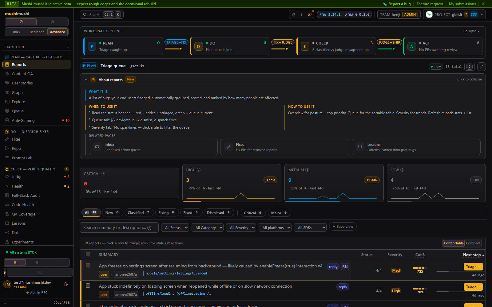
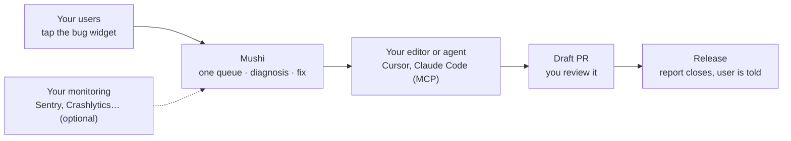

<div align="center">

# Mushi Mushi

**Your AI wrote it. Mushi tells you why it broke.**

When a user hits a bug, Mushi explains the cause in plain English and hands your editor a fix to start from.<br/>
Built for the vibe coder who ships fast with Cursor, Claude Code, Lovable or Bolt, so a bug costs five minutes instead of an afternoon.

[](https://kensaur.us/mushi-mushi/docs/connect)
[](https://kensaur.us/mushi-mushi/docs/connect)
[](https://www.npmjs.com/package/@mushi-mushi/react)
[](./packages/server/LICENSE)
[](https://scorecard.dev/viewer/?uri=github.com/kensaurus/mushi-mushi)
[](./SECURITY.md#verifying-a-mushi-mushi-tarball-before-installing)

[Quick start](#quick-start) · [How it works](#how-it-works) · [Docs](https://kensaur.us/mushi-mushi/docs/) · [Demo](https://kensaur.us/mushi-mushi/docs/connect) · [Why not Sentry?](#why-not-just-sentry) · [Self-host](#self-host) · [Vision](./VISION.md)

<a href="https://kensaur.us/mushi-mushi/docs/connect" title="Try the read-only demo — no signup">
  
</a>

<sub>↑ a diagnosis: the root cause in plain English and a paste-ready fix prompt. Click to open the read-only demo.</sub>

</div>

## How it works


```mermaid
flowchart LR
    U["Your users<br/>tap the bug widget"] --> M
    S["Your monitoring<br/>Sentry, Crashlytics… (optional)"] -.-> M
    M["Mushi<br/>one queue · diagnosis · fix"] --> E["Your editor or agent<br/>Cursor, Claude Code (MCP)"]
    E --> P["Draft PR<br/>you review it"]
    P --> R["Release<br/>report closes, user is told"]
```

1. **Capture.** A user taps the widget. Mushi records a screenshot, the route, their note, and the last console and network events.
2. **Diagnose.** Mushi writes the root cause in plain English with a fix prompt. Twenty reports of the same broken button become one row.
3. **Fix.** Your editor reads the diagnosis over MCP. If you want, an agent opens a **draft** PR that you review like any other.

It catches the bugs that never throw an error: the pay button hidden under the keyboard, the Save button tapped twice because nothing happened, the dashboard that takes 12 seconds.

## Quick start

```bash
npx mushi-mushi                      # detects your framework, installs the SDK, writes env vars, sends a test report
npx mushi-mushi setup --ide cursor   # or --ide claude: your editor can now read diagnoses
```

Then ask your editor: *"what's broken in prod?"*

The SDK needs two env vars (`VITE_MUSHI_PROJECT_ID` / `VITE_MUSHI_API_KEY`, or `NEXT_PUBLIC_MUSHI_*`; see [`examples/sdk.env.example`](./examples/sdk.env.example)). No Sentry, no LLM key, no monitoring stack. The hosted free tier covers 50 diagnoses a month with no card, or you can [self-host](#self-host).

<details>
<summary><b>Let your AI editor do the setup</b></summary>

Paste this into Cursor or Claude Code:

> Install the Mushi skills from github.com/kensaurus/mushi-mushi (`npx skills add kensaurus/mushi-mushi`), then run the mushi-setup skill to wire the Mushi SDK and MCP server into this app and send a test report to verify the connection.

The skills also add `/mushi-debug` (why ingest or MCP fails), `/mushi-health` (pass/fail across CLI, API and keys) and `/mushi-integration` (fix dispatch and the two-way loop).

</details>

<details>
<summary><b>Add it by hand</b> (React shown; Vue, Svelte, Angular, React Native, vanilla JS, native)</summary>

```tsx
import { MushiProvider } from '@mushi-mushi/react';

export function App() {
  return (
    <MushiProvider config={{ projectId: 'proj_xxx', apiKey: 'mushi_xxx' }}>
      <YourApp />
    </MushiProvider>
  );
}
```

```ts
import { MushiPlugin } from '@mushi-mushi/vue';        // Vue 3 / Nuxt: app.use(MushiPlugin, { projectId, apiKey })
import { initMushi } from '@mushi-mushi/svelte';       // Svelte / SvelteKit: initMushi({ projectId, apiKey })
import { provideMushi } from '@mushi-mushi/angular';   // Angular 17+: providers: [provideMushi({ projectId, apiKey })]
import { MushiProvider } from '@mushi-mushi/react-native';
import { Mushi } from '@mushi-mushi/web';              // any framework: Mushi.init({ projectId, apiKey })
```

Native SDKs (iOS, Android, Flutter) are a preview and install from this repository: see [`packages/ios`](./packages/ios), [`packages/android`](./packages/android/README.md#install) and [`packages/flutter`](./packages/flutter/README.md#install). A runnable demo lives in [`examples/react-demo`](./examples/react-demo).

</details>

## What's inside

| Package | For | What it does |
| --- | --- | --- |
| [`mushi-mushi`](https://www.npmjs.com/package/mushi-mushi) | Setup | One-command wizard (`npx mushi-mushi`) |
| [`@mushi-mushi/react`](./packages/react), `vue`, `svelte`, `angular`, `react-native`, `capacitor` | Your app | The bug widget for your framework |
| [`@mushi-mushi/web`](./packages/web) | Your app | The same widget for any site, no framework needed |
| [`@mushi-mushi/node`](./packages/node) | Your server | Reports backend errors into the same queue |
| [`@mushi-mushi/mcp`](./packages/mcp) | Your editor | Gives Cursor and Claude Code the diagnosis and fix tools |
| [`@mushi-mushi/cli`](./packages/cli) | Your terminal | Setup, reports, fixes and health checks |
| [`@mushi-mushi/ux`](./packages/ux) | Your app's screens | Runs your coding agent over every screen and keeps only measured improvements |
| [`packages/server`](./packages/server) | Backend | Supabase edge functions + Postgres. Hosted for you, or self-host |

Full list and maturity: [SDK reference](https://kensaur.us/mushi-mushi/docs/sdks). Architecture: [how the pipeline fits together](https://kensaur.us/mushi-mushi/docs/concepts/architecture).

## Why not just Sentry?

> **Sentry is built around what the code threw, with a User Feedback widget and
> replay alongside. Mushi starts from what the user reported, ingests Sentry's
> errors too, explains each one in plain English, and hands your agent a fix
> prompt to start from. One queue, with or without Sentry.**

| | Mushi | Sentry |
| --- | --- | --- |
| Catches | Thrown errors **and** silent UX bugs (dead clicks, slow screens, broken layouts) | Thrown errors, performance traces |
| You get | A plain-English root cause and a fix prompt, in your editor | A stack trace and breadcrumbs, in a dashboard |
| Auto-fix | Optional: an agent opens a draft PR | Seer add-on (paid) |
| Setup | One command that signs you in through the browser; the demo needs no account | SDK + DSN + dashboard |

**It works with what you already run.** Point a Sentry alert webhook at `/v1/webhooks/sentry?projectId=<id>` and errors land in the same queue. Merging a Mushi fix resolves the Sentry issue, and the reverse. Adapters also bring in Datadog, Bugsnag, Rollbar, Crashlytics and others. Plugins keep Linear, Jira, GitHub Issues, Slack, Discord, Teams and PagerDuty in sync. Nothing gets ripped out. Details: [Sentry vs Mushi](https://kensaur.us/mushi-mushi/docs/compare/sentry-vs-mushi).

## Self-host

```bash
cd deploy && cp .env.example .env   # add ANTHROPIC_API_KEY and your Supabase credentials
docker compose up -d
```

Walkthroughs: [`SELF_HOSTED.md`](./SELF_HOSTED.md) and [Docker Compose guide](https://kensaur.us/mushi-mushi/docs/self-hosting/docker-compose). Self-hosting is bring-your-own-key: you pay your LLM vendor at list price. The hosted service needs no key; it bills per diagnosis with a spend cap ([pricing](https://kensaur.us/mushi-mushi/docs/pricing)). Teams wiring Mushi into an existing stack (SSO, retention, region routing, Kubernetes) start at [`docs/operators/`](./docs/operators/). Only the public `api` function should face the internet: see [internal caller authentication](./packages/server/README.md#internal-caller-authentication-sec-1).

## Where it stops

| Area | Still partial |
| --- | --- |
| Native SDKs | iOS, Android and Flutter are previews, not yet on CocoaPods, Maven Central or pub.dev |
| Fine-tuning | OpenAI and Bedrock work. Anthropic fine-tuning is not self-service, so its adapter links to the access form |
| Knowledge graph | SQL adjacency everywhere. Apache AGE only where the extension is installed (not managed Supabase) |
| Inventory and QA gates | Behind *Advanced mode* and the `inventory_v2` plan flag |
| Multi-region | Region pinning works. Active/active write replication is not automated |

<sub>Repo at a glance (run `pnpm docs-stats`): ~515K TS lines · 2,385 source files · 45 workspace / 37 npm packages · 64 edge functions · 464 SQL migrations · 19 pipeline agents. Full tour: [`docs/SCREENSHOTS.md`](./docs/SCREENSHOTS.md).</sub>

## Community and contributing

Questions and show-and-tell: [GitHub Discussions](https://github.com/kensaurus/mushi-mushi/discussions). Bugs: [Issues](https://github.com/kensaurus/mushi-mushi/issues) (first reply within 24 hours on weekdays). Security: [`SECURITY.md`](./SECURITY.md). Anything else private: kensaurus@gmail.com.

```bash
git clone https://github.com/kensaurus/mushi-mushi.git && cd mushi-mushi
pnpm install && pnpm dev   # Node ≥ 22, pnpm ≥ 10
```

See [`CONTRIBUTING.md`](./CONTRIBUTING.md) and [`docs/stats.md`](./docs/stats.md).

## License

Open core. Each package directory's own `LICENSE` governs that package; the [root `LICENSE`](./LICENSE) states the split.

| Part | License | In short |
| --- | --- | --- |
| SDKs, CLI, MCP, plugins, adapters | [MIT](./LICENSE) | Use anywhere, including closed-source products |
| Server (`server`, `agents`, `verify`) | [AGPLv3](./packages/server/LICENSE) | Self-host and modify freely. Offer a modified server as a service: publish your changes or get a [commercial license](./COMMERCIAL-LICENSE.md) |
| Enterprise features (`packages/server/ee/`) | [EE license](./packages/server/ee/LICENSE) | SSO, audit ingest, retention, region pinning. Paid for production use |
| Name and logo | [Trademark policy](./TRADEMARK.md) | Forks must rename |

Third-party notices: [NOTICE](./NOTICE).

## More from KENSAURUS

| | App | What it is |
|---|---|---|
|  | [Glot It](https://kensaur.us/glot-it/?utm_source=github&utm_medium=readme) | Learn Thai — bite-size lessons, smart flashcards, and an AI tutor |
|  | [yen-yen](https://kensaur.us/yen-yen/?utm_source=github&utm_medium=readme) | Where did the money go? Now you'll know. A kakeibo for households |
|  | [The Wanting Mind](https://kensaur.us/the-wanting-mind/?utm_source=github&utm_medium=readme) | How the Battle Between Extraction and Generation Is Reshaping Our World — a 147,000-word interactive webbook with 268 concepts, 242 citations, and original illustrations |
|  | [Help Her Take Photo](https://kensaur.us/help-her-take-photo/?utm_source=github&utm_medium=readme) | Pair phones, direct the pose, nail the photo |
|  | [Cooler Heads](https://talk.kensaur.us/?utm_source=github&utm_medium=readme) | Practice hard conversations before you have them |
|  | [一人社長 Solo Boss](https://solo-boss.kensaur.us/?utm_source=github&utm_medium=readme) | Bookkeeping and tax-filing co-pilot for one-person companies in Japan |
|  | [Tsumagoi Work&Camp 嬬恋牧場](https://tsumagoi.kensaur.us/?utm_source=github&utm_medium=readme) | Coworking camp at 1,444 m — [Instagram](https://www.instagram.com/tsumagoicamp/) · [Facebook](https://www.facebook.com/profile.php?id=61592113053042) · [Maps](https://maps.app.goo.gl/JCNnTfsdQVHCS1FA7) |
|  | [kenji skills](https://github.com/kensaurus/skills)       | Agent skills and slash commands for Claude Code, Cursor, Codex, and Gemini |
|  | [KENSAURUS](https://kensaur.us/?view=portfolio&utm_source=github&utm_medium=readme) | Everything else built under the same roof |

All apps live under [kensaur.us](https://kensaur.us).

---

<div align="center">
<sub>If Mushi helped, <a href="https://github.com/kensaurus/mushi-mushi/stargazers">star the repo</a> so the next vibe coder finds it. <a href="https://github.com/kensaurus/mushi-mushi/issues/new/choose">Open an issue</a> · <a href="https://bsky.app/profile/kensaurus.bsky.social">Follow on Bluesky</a></sub>
</div>
