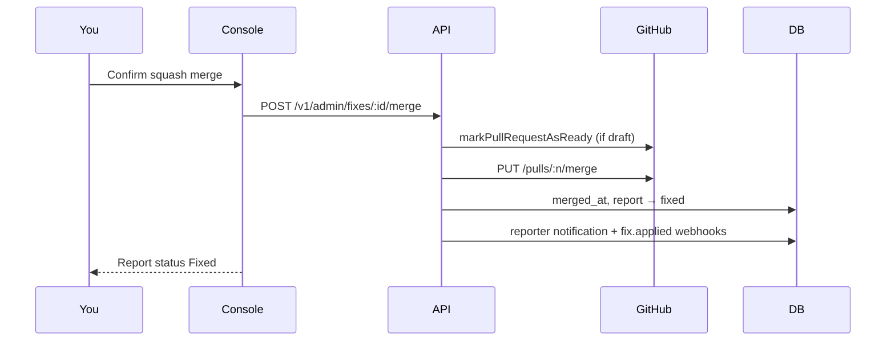

import { Callout } from 'nextra/components'

<AdminDocHero page="fixes" />

# Fix orchestrator

The Fixes page is the live view of every agent run Mushi has dispatched — from the
moment the orchestrator picks up the report to the moment a PR is open (or the run
fails). It also shows coordination rows for [multi-repo fixes](/concepts/multi-repo-fixes).

---

## The fixes list

Each row in the list shows:

| Column | What it is |
| ------ | ---------- |
| **Status** | `queued` · `running` · `completed` · `failed` · `cancelled` |
| **Agent type** | `McpFixAgent` (Cursor / Claude Code), `RestFixWorkerAgent` (edge function), or `cursor_cloud` (Cursor Cloud Agent) |
| **Sandbox** | `e2b` (default cloud), `modal`, `local`, or `none`. Cursor Cloud runs use `none` — the agent runs in Cursor's managed cloud env. |
| **Branch / PR** | Link to the GitHub PR. For Cursor runs, this is the Cursor-signed draft PR. |
| **Files / lines** | Scope of the diff — files touched and net line delta |
| **Spec warnings** | Yellow pill if `validateAgainstSpec()` flagged issues before the PR opened |
| **AI summary** | One-sentence description of what the agent changed and why |
| **Cursor badge** | ◆ chip (visible on `cursor_cloud` rows) — links directly to the agent run transcript in Cursor |

Coordination rows have a **▶ Expand** toggle that reveals the per-repo child
attempts grouped underneath.

---

## Streaming view

Click any running fix to open the **streaming drawer**. It opens a Hono
`streamSSE` connection into the orchestrator and renders AG-UI protocol events live:

- **Tool calls** — file reads, searches, shell commands, test runs.
- **File writes** — diffs rendered inline as the agent writes them.
- **Test output** — pass / fail per test as they stream.
- **Sandbox lifecycle** — boot, snapshot, restore, teardown events.

The transport sanitises carriage returns per
[CVE-2026-29085](https://nvd.nist.gov/vuln/detail/CVE-2026-29085) so injected
control sequences can't forge fake tool-call lines.

<Callout type="info">
  The streaming view works for both `McpFixAgent` and `RestFixWorkerAgent`.
  For MCP agents, events arrive via the Cursor / Claude Code AG-UI bridge.
  For REST workers, events stream directly from the `fix-worker` Edge Function.
</Callout>

---

## Spec-validation warnings

When the fix-worker runs `validateAgainstSpec()` before opening a PR and finds
soft issues — e.g. the diff doesn't touch any file that references the contract's
required DB table — the warnings land in `fix_attempts.spec_validation_warnings`
and surface as a yellow callout in the streaming drawer:

```
⚠  Sanity-check before merging
   The diff does not reference table public.users, but the expected_outcome
   contract requires a row_exists assertion on that table.
   Review manually before merging.
```

Hard errors (removing a json_path field the contract asserts on) abort the run
before the PR opens.

---

## Cursor Cloud Agent runs

When `agent = cursor_cloud`, the fix row shows two additional UI elements:

- **Cursor badge** — a ◆ `bc-…` chip that links to the agent run transcript in Cursor's web interface.
- **Artifact gallery** — screenshots, videos, and log files the agent produced during the run. These are fetched via `agent.listArtifacts()` after the run terminates.

The artifact gallery is visible in the expanded fix detail when artifacts are present.

## Dispatching a fix

You can dispatch a fix from four places:

1. **Report detail** → "Dispatch fix" button (single-repo or auto multi-repo).
2. **Reports list** → kebab menu → "Send to Cursor agent" (dispatches `cursor_cloud` directly).
3. **Fixes list** → "New fix" button with a report picker.
4. **MCP / A2A / CLI** — `dispatch_fix` tool (`agent=cursor_cloud`), `POST /v1/a2a/tasks`, or `mushi fix <reportId> --agent cursor_cloud`.

All three paths produce the same `fix_dispatch_jobs` row and emit the same
`fix.dispatched` webhook to subscribed plugins.

---

## Webhooks

| Event | When |
| ----- | ---- |
| `fix.requested` | Immediately after a fix dispatch is requested (pre-agent launch) |
| `fix.dispatched` | Immediately after the dispatch row is created and agent has started |
| `fix.proposed` | Orchestrator opens a draft PR (Cursor or standard agent) |
| `fix.applied` | Fix completed and PR is merged |
| `fix.failed` | Orchestrator exhausted retries |
| `fix.coordination.succeeded` | All child PRs in a multi-repo fix are open |

Configure webhook endpoints in **Settings → Webhooks**. Each delivery is logged
with the payload, HTTP status, and any retry attempts.

---

## CI feedback on open PRs

When a fix-worker or Cursor agent opens a draft PR, GitHub Actions runs on the branch.
The fix detail card shows a **CI badge** with the latest check-run conclusion
(`success`, `failure`, `pending`, etc.).

| Control | What it does |
| ------- | ------------ |
| **Refresh CI status** | Calls `POST /v1/admin/fixes/:id/refresh-ci` → `ci-sync` edge function. Use when webhooks dropped or the badge is stale. |
| **View GitHub Actions log →** | Deep link to the check run on GitHub. |

A background `mushi-ci-sync-10m` pg_cron also refreshes completed attempts every
10 minutes, but on-demand refresh closes the loop immediately after you push a fix
to the PR branch.

From the CLI:

```bash
mushi fixes refresh-ci <fixId>
```

---

## Merging from the console

After CI passes (or you've reviewed manually), merge the draft PR without leaving
Mushi. This is **user-confirmed** — Mushi never auto-merges.

### Where merge appears

- **Report detail** → fix card → **Merge PR** (confirm popover)
- **Fixes list** → completed row with open PR
- **Pipeline flow** on the report detail page

The UI picks the **primary fix attempt** — if a later retry failed but an earlier
attempt still has an open PR, the merge button targets the mergeable attempt, not
the failed retry.

### Merge flow



**Draft PRs:** fix-worker opens PRs as drafts. Before merge, the API calls GitHub's
GraphQL `markPullRequestAsReady` (same as `gh pr ready`). New fix-worker runs also
auto-ready immediately after opening the PR.

**Merge methods:** squash (default), merge commit, or rebase — chosen in the confirm
popover.

**Already merged:** if GitHub shows merged but the webhook was missed, merge is
idempotent — `finalizeFixMerge()` backfills `merged_at` and report status.

From the CLI (requires `mcp:write` API key):

```bash
mushi fixes merge <fixId>
mushi fixes merge <fixId> --method squash
```

### Prerequisites

| Requirement | Why |
| ----------- | --- |
| Fix status `completed` | Agent finished and opened a PR |
| Open PR (`pr_url`, `pr_number`) | Nothing to merge otherwise |
| GitHub connected | App installation or PAT with merge permission |
| CI green (recommended) | Merge popover warns on failing checks; you can override |

---

## See also

- [Concepts → Agentic fix orchestrator](/concepts/fix-orchestrator) — how the orchestrator works internally.
- [Concepts → Multi-repo coordinated fixes](/concepts/multi-repo-fixes) — coordinated multi-repo runs.
- [Connecting your orchestrator](/concepts/orchestrator-interop) — dispatch via MCP, A2A, or REST.
