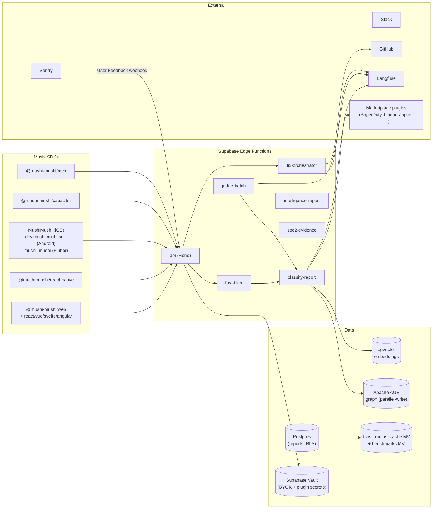

# Architecture

## Component summary

- **Edge gateway (Hono on Supabase Edge Functions)** authenticates with API
  keys (public reports) or JWT (admin), enforces rate limits, and routes
  to specialised functions.
- **`fast-filter`** triages high-volume garbage (form spam, duplicate one-liners)
  with the cheapest model the project's BYOK plan permits.
- **`classify-report`** runs the canonical two-stage classifier. Stage 1
  tags category/severity/component from text. Stage 2, only if a screenshot
  is present, runs an air-gapped vision pass that *cannot* see Stage 1's
  prompt (defence against prompt injection via screenshots).
- **`judge-batch`** is a nightly cron that scores classifier accuracy with a
  separate judge model, feeding the prompt-A/B framework that promotes new
  prompt versions automatically when they win statistically.
- **`fix-orchestrator`** dispatches approved triage decisions to a sandbox
  (E2B today, Modal/Cloudflare Sandbox SDK adapters available) where an
  agent — speaking either MCP (`tools/call`) or REST — drafts code, opens
  a PR via a scoped GitHub App.
- **`intelligence-report`** generates weekly bug-intelligence digests with
  optional cross-customer benchmarking (k-anonymity enforced via
  materialized view).
- **`soc2-evidence`** snapshots control state for SOC 2 Type 1 readiness.

## Knowledge graph

Reports embed into pgvector for semantic dedup. The same edges are mirrored
asynchronously into Apache AGE so customers who care about graph queries
(e.g. "find all reports touching the same component within a release
window") get true Cypher.

## A2A Agent Card

Public discovery endpoints at `/.well-known/agent-card` and `/v1/agent-card`
expose the agent's identity, skills, supported A2A version, MCP transport,
and auth requirements. Other agents can negotiate with Mushi without
out-of-band config.

## Data residency

Each project pins to a region (`us` / `eu` / `jp`). The gateway returns
`307 Temporary Redirect` when a request reaches the wrong region, and the
Core SDK transparently follows it (caching the resolved region in
`localStorage`). The US cluster remains the **catalog of record** for
plugin marketplace + project metadata.

## Storage

Per-project storage settings ([BYO Storage](/security/byo-storage)) let
you keep screenshots and intelligence-report PDFs in your own
S3 / R2 / GCS / MinIO bucket. Supabase Storage is the default.
