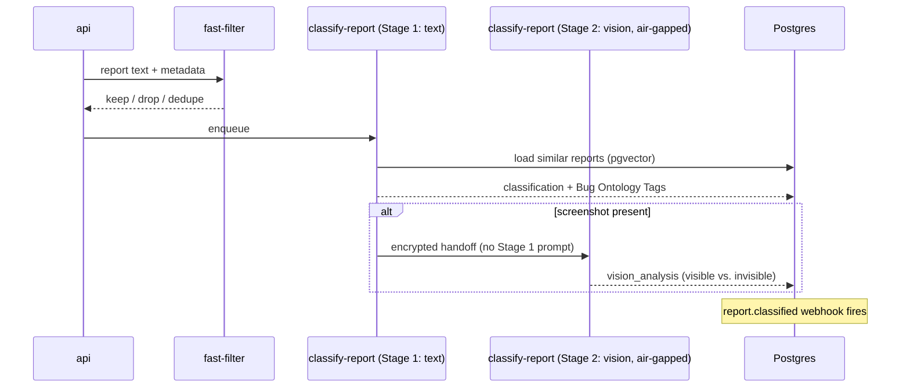

# Classification pipeline

## Outputs

- `category` (`bug`, `feature_request`, `usage_question`, `visual`, `confusing`, `other`)
- `severity` (`low` / `medium` / `high` / `critical`) with **calibration** —
  judges score this monthly and feed corrections into the prompt-A/B framework.
- `component` (resolved against your project's component taxonomy if uploaded).
- `bug_ontology_tags` (cross-customer Bug Ontology — see Whitepaper §2.6).
- `confidence` ∈ [0, 1].
- `summary` (one-sentence triage headline).

## Vision air-gap

Stage 2 ("look at the screenshot") runs in a **separate inference call with no
shared system prompt**. This blocks the canonical
[OWASP LLM01:2025 prompt-injection-via-image](https://owasp.org/www-project-top-10-for-large-language-model-applications/)
class of attacks: a screenshot containing "ignore prior instructions" can no
longer corrupt Stage 1's classification because Stage 1 already finished
before the screenshot was loaded.

## BYOK

Per-project keys (Anthropic and/or OpenAI) override the cluster default.
Failover order:

1. Project's BYOK Anthropic key (if set)
2. Cluster Anthropic env var (if set)
3. Project's BYOK OpenAI key
4. Cluster OpenAI env var

Every invocation logs which key source was used so finance can attribute
spend without inspecting the prompt.
