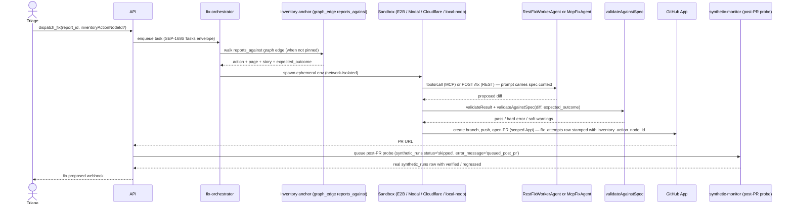

# Fix drafts & PRs

When you click **Dispatch fix** in the admin console, Mushi opens a draft pull
request on your repo — with a rationale, screenshot diff, and CI status you
can review before merge.

## Flow



## Sandbox providers

| Adapter        | When to use                              |
| -------------- | ---------------------------------------- |
| `local-noop`   | Tests + local dev (no network at all)    |
| `e2b`          | Default for cloud (managed Firecracker)  |
| `modal`        | Heavy compute / long-running fixes       |
| `cloudflare`   | Edge-routed, sub-second cold starts      |

The adapter abstraction means swapping providers is a config change, not a
code change. Every sandbox invocation writes to `sandbox_audit_log`
(provider, image digest, network policy, exit code) so a SOC 2 auditor can
verify isolation guarantees.

## Agent contract

We support three agent shapes:

- **`McpFixAgent`** — speaks JSON-RPC 2.0 with `tools/call`, plus the
  SEP-1686 Tasks envelope so long-running fixes can stream progress.
- **`RestFixWorkerAgent`** — a simpler REST contract (`POST /fix`,
  `GET /status`) for teams that haven't adopted MCP yet.
- **`CursorCloudAgent`** (new in May 2026) — delegates to a [Cursor Cloud Agent](https://cursor.com/docs/cloud-agent)
  via `@cursor/sdk`. The agent runs in Cursor's managed cloud environment, opens a signed
  draft PR via `autoCreatePR: true`, and returns the PR URL and agent artifacts.
  Unlike the other adapters, it does **not** use an E2B/Modal sandbox — Cursor provides
  its own isolated runtime. The fix-worker edge function delegates these runs to the Node-side
  orchestrator since `@cursor/sdk` is Node-only.

Both `McpFixAgent` and `RestFixWorkerAgent` have the same tools: `read_file`, `write_file`,
`run_tests`, `git_commit`, `open_pr`. Filesystem and network access are
brokered through the sandbox — the agent itself never gets a raw shell.

`CursorCloudAgent` receives the fix prompt (including spec context) and uses Cursor's
own tool suite inside the managed cloud environment.

## Credential scoping

Mushi's GitHub App ships with **per-repo, per-PR scoping**: each fix
attempt installs the app only on the target repo, with `contents:write` and
`pull-requests:write` only. Tokens last 60 minutes and are revoked the
moment the PR is opened.

## Spec traceability — `inventoryAction` end-to-end

Every fix carries the originating inventory `Action` from dispatch all
the way back to the admin UI. The 2026-05-09 release closed the
write-side U-turn that was the v2 system's biggest open issue.

### What the worker now does

1. **Recover the anchor.** The worker reads `inventory_action_node_id`
   from the dispatch row. If empty (legacy report or the caller didn't
   specify), it walks the `reports_against` graph edge that
   `classify-report` writes when it can match a report to an Action —
   then back-fills the dispatch row so the next consumer doesn't have
   to repeat the walk.
2. **Thread `expected_outcome` into the LLM prompt.** A Markdown block
   rendered by `renderSpecContext()` lists the action description,
   page, story, and every assertion in the contract. The reviewer
   prompt's question 4 explicitly asks the agent to preserve every
   assertion — drift is treated as a regression, not a stylistic note.
3. **Run `validateAgainstSpec` as a deterministic pre-PR gate.**
   Hard-fails the dispatch if the diff *removes* a `json_path` field
   the contract asserts on; soft warnings (no changed file references
   the contract's required DB table, no changed file mentions the
   action's page route) are persisted to
   `fix_attempts.spec_validation_warnings JSONB` so the admin Fixes
   drawer can show "this fix didn't reference the inventory's required
   `users` table — sanity-check before merging".
4. **Queue a targeted post-PR synthetic probe.** A marker `synthetic_runs`
   row scoped to `actionNodeId` is inserted the moment the PR opens.
   The synthetic-monitor cron drains the queue with priority on its
   next tick, runs an HTTP probe, and evaluates `expected_outcome`
   (`status_in` checks + JSONPath assertions) against the live action.
   The result is a real `synthetic_runs` row that flips the Action to
   `verified` or `regressed` in the admin UI within minutes of merge.

### `expected_outcome` shape

```yaml
expected_outcome:
  summary: 'POST /signup returns 200 and creates a user row'
  response:
    status_in: [200, 201]
    json_path:
      - { path: '$.user.id', op: 'exists' }
      - { path: '$.error', op: 'not_equals', value: 'rate_limited' }
  database:
    table: 'users'
    schema: 'public'
    expect: 'row_exists'
  ui:
    route_change_to: '/dashboard'
    visible_text: 'Welcome'
```

Every field is optional except `database.table` (when `database` is set). The
synthetic monitor evaluates the HTTP-side assertions today; database +
UI assertions are recorded as `unverified` until the Playwright crawler
runtime lands. See
[`/v1/schemas/expected-outcome.json`](/concepts/orchestrator-interop#json-schemas)
for the canonical JSON Schema.

### Carrying the anchor through external surfaces

| Surface | How the anchor flows |
| ------- | -------------------- |
| REST `POST /v1/admin/fixes/dispatch` | Optional `inventoryActionNodeId` field on the request body (UUID-validated) |
| MCP `dispatch_fix` tool | `inputSchema.properties.inventoryActionNodeId`; `get_fix_context` returns the full `inventory_action` (with `expected_outcome`) |
| A2A `POST /v1/a2a/tasks` | `input.inventoryActionNodeId` at create time; surfaced on every `GET /v1/a2a/tasks/:id` as `metadata.inventoryActionNodeId` |
| GitHub Action | `inventory-action-node-id` input on `command: dispatch-fix` |
