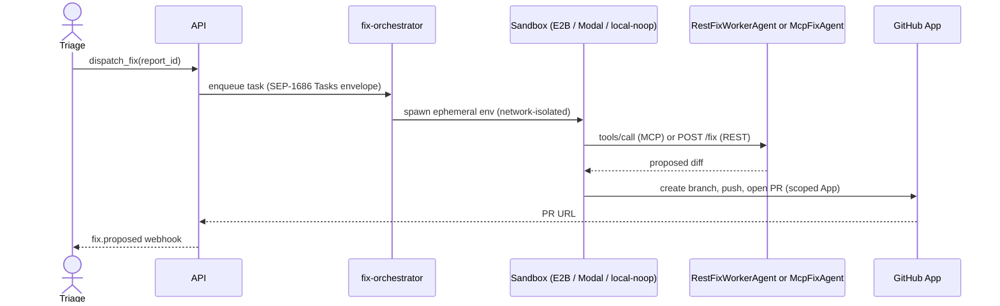

# Agentic fix orchestrator

When you click **Dispatch fix** in the admin console, the report becomes a
*task* for an agent running in an isolated sandbox.

## Flow

## Sandbox providers

| Adapter        | When to use                              |
| -------------- | ---------------------------------------- |
| `local-noop`   | Tests + local dev (no network at all)    |
| `e2b`          | Default for cloud (managed Firecracker)  |
| `modal`        | Heavy compute / long-running fixes       |
| `cloudflare`   | Edge-routed, sub-second cold starts      |

The adapter abstraction means swapping providers is a config change, not a
code change. Every sandbox invocation writes to `sandbox_audit_log`
(provider, image digest, network policy, exit code) so a SOC 2 auditor can
verify isolation guarantees.

## Agent contract

We support two agent shapes:

- **`McpFixAgent`** — speaks JSON-RPC 2.0 with `tools/call`, plus the
  SEP-1686 Tasks envelope so long-running fixes can stream progress.
- **`RestFixWorkerAgent`** — a simpler REST contract (`POST /fix`,
  `GET /status`) for teams that haven't adopted MCP yet.

Both agents have the same set of tools available: `read_file`, `write_file`,
`run_tests`, `git_commit`, `open_pr`. Filesystem and network access are
brokered through the sandbox — the agent itself never gets a raw shell.

## Credential scoping

Mushi's GitHub App ships with **per-repo, per-PR scoping**: each fix
attempt installs the app only on the target repo, with `contents:write` and
`pull-requests:write` only. Tokens last 60 minutes and are revoked the
moment the PR is opened.
