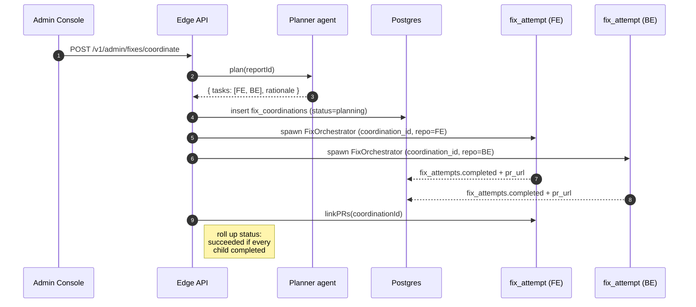

# Multi-repo coordinated fixes

A bug like *"checkout returns 400 with 'invalid currency'"* often spans
two repos: the FE sends a malformed shape, the BE accepts a wider
range than it should. Mushi's `MultiRepoFixOrchestrator` plans and
opens **one PR per repo** for these.

## Setup

In **Settings → Repositories**, register each repo your project owns:

| Field            | Example                                          |
| ---------------- | ------------------------------------------------ |
| Repo URL         | `https://github.com/acme/checkout-fe`            |
| Role             | `frontend`                                       |
| Default branch   | `main`                                           |
| Path globs       | `apps/web/**`, `packages/ui/**`                  |
| Primary?         | one repo per project must be primary             |

The path globs are the routing rule the planner uses: any file the
classifier identifies as relevant gets matched to the first repo whose
globs cover it.

## How a coordination flows



## Status rollup

| Children                       | Parent status     |
| ------------------------------ | ----------------- |
| All `completed`                | `succeeded`       |
| Some `completed`, some failed  | `partial_success` |
| All failed                     | `failed`          |
| Manually stopped               | `cancelled`       |

The admin UI shows a single row per `fix_coordinations` with sibling
PRs grouped underneath, so the reviewer sees the whole change set at
once.

## Cross-linking PRs

After every child PR is open, the orchestrator posts a comment on each
listing its siblings:

```text
🤝 Mushi multi-repo coordination

This PR is part of a coordinated fix across multiple repos:

- [frontend] https://github.com/acme/checkout-fe/pull/812
- [backend]  https://github.com/acme/checkout-be/pull/345

Merge order matters when there are FE↔BE contract changes —
review siblings first.
```

## When to skip

If your project has only one row in `project_repos`, the
`MultiRepoFixOrchestrator.plan()` call throws — use the regular
`FixOrchestrator.run()` directly. The admin console picks the right
orchestrator automatically based on repo count.
