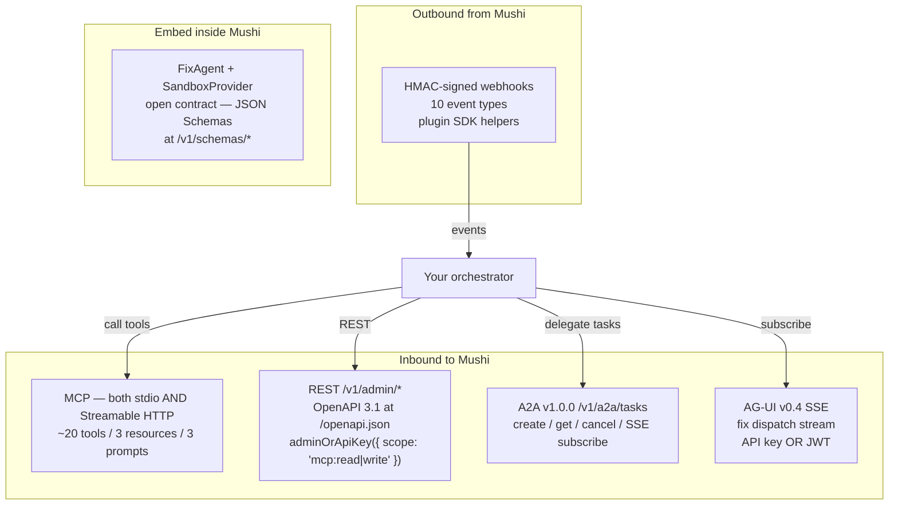

import { Callout } from 'nextra/components';

# Connecting your orchestrator

Mushi exposes four inbound surfaces and one outbound channel so any
modern agent orchestrator — Cursor, Claude Code / Claude Desktop /
Claude Agent SDK, OpenAI Agents SDK, ChatGPT Agent, LangGraph, CrewAI,
AutoGen, Mastra, A2A v1.0.0, or your own — can plug in without forking
this repo. The 2026-05-09 release closed every gap the original audit
flagged.

## Discovery

Every Mushi backend serves the canonical discovery doc at:

```
GET /.well-known/agent-card
```

The card advertises the MCP transport, A2A `tasks` endpoints, REST
base + OpenAPI URL, AG-UI streaming endpoint, JSON Schemas for the
agent contracts, and the auth manifest. A backwards-compat alias lives
at `/v1/agent-card` for proxies that strip dotfiles.

## Inbound surfaces



### MCP — stdio (local) AND Streamable HTTP (hosted)

Mushi ships BOTH MCP transports so you can pick the one that matches
your client:

- **stdio** — `npx -y @mushi-mushi/mcp@latest`. Default for editor
  integrations (Cursor / Claude Desktop / Claude Code / Continue /
  Cline / Zed / Windsurf). Your client launches the server as a
  subprocess and pipes JSON-RPC over stdio.
- **Streamable HTTP** (2025-03-26 spec, 2026-05-09 release) — single
  endpoint at `/functions/v1/mcp`. POST returns `application/json` or
  `text/event-stream` per content negotiation, GET opens an SSE stream
  for server-pushed notifications, DELETE terminates the session. Use
  this for OpenAI Agents SDK, ChatGPT Agent, hosted CrewAI, or any
  orchestrator that talks remote MCP without spawning a subprocess.

```jsonc filename=".cursor/mcp.json — Streamable HTTP"
{
  "mcpServers": {
    "mushi-mushi-hosted": {
      "url": "https://api.mushimushi.dev/functions/v1/mcp",
      "headers": {
        "X-Mushi-Api-Key": "mushi_live_…",
        "X-Mushi-Project-Id": "proj_…",
      },
    },
  },
}
```

The full tool catalog (~20 tools, 3 resources, 3 prompts) lives in
[`@mushi-mushi/mcp`](/sdks/mcp). Tools that move money (`dispatch_fix`,
`transition_status`, `submit_fix_result`, `trigger_judge`, `run_nl_query`)
require the `mcp:write` scope; everything else is fine on `mcp:read`.

### A2A v1.0.0 — Tasks resource

Google's Agent2Agent v1.0.0 spec (March 2026) requires `tasks/{id}` GET

- `tasks/{id}:cancel` + `tasks/{id}:subscribe`. Mushi implements all of
  them on top of the existing `fix_dispatch_jobs` table — every A2A Task
  IS a fix dispatch job, with status names translated at the edge:

| Mushi `fix_dispatch_jobs.status` | A2A `Task.state`                          |
| -------------------------------- | ----------------------------------------- |
| `queued`                         | `submitted`                               |
| `running`                        | `working`                                 |
| `completed`                      | `completed`                               |
| `failed`                         | `failed`                                  |
| `cancelled`                      | `canceled` (sic: A2A spec spelling)       |
| `skipped`                        | `completed` (with `result.skipped: true`) |

```bash
# Create a Task
curl -X POST https://api.mushimushi.dev/functions/v1/api/v1/a2a/tasks \
  -H "X-Mushi-Api-Key: mushi_live_…" \
  -H "Content-Type: application/json" \
  -d '{
    "skill": "dispatch_fix",
    "input": {
      "reportId": "00000000-0000-0000-0000-000000000123",
      "projectId": "00000000-0000-0000-0000-000000000abc",
      "inventoryActionNodeId": "00000000-0000-0000-0000-000000000def"
    }
  }'

# Subscribe to live updates
curl -N https://api.mushimushi.dev/functions/v1/api/v1/a2a/tasks/<id>:subscribe \
  -H "X-Mushi-Api-Key: mushi_live_…"

# Cancel
curl -X POST https://api.mushimushi.dev/functions/v1/api/v1/a2a/tasks/<id>:cancel \
  -H "X-Mushi-Api-Key: mushi_live_…"
```

### Push notifications (A2A v1.0.0 PushNotificationConfig)

Pull (SSE) is fine for a long-running orchestrator process. If you'd rather receive task updates on a callback URL — webhooks instead of an open connection — pass `configuration.pushNotificationConfig` on create:

```bash
curl -X POST https://api.mushimushi.dev/functions/v1/api/v1/a2a/tasks \
  -H "X-Mushi-Api-Key: mushi_live_…" \
  -H "Content-Type: application/json" \
  -d '{
    "skill": "dispatch_fix",
    "input": {
      "reportId": "00000000-0000-0000-0000-000000000abc",
      "projectId": "00000000-0000-0000-0000-000000000def"
    },
    "configuration": {
      "pushNotificationConfig": {
        "url": "https://orchestrator.example.com/a2a/callback",
        "token": "optional-bearer-forwarded-as-Authorization"
      }
    }
  }'
```

A Postgres trigger fires on every status change (`queued → working → completed | failed | canceled`) and the `a2a-push-notify` edge function POSTs the A2A Task envelope to your URL with [Standard Webhooks](https://www.standardwebhooks.com/) headers:

```
POST https://orchestrator.example.com/a2a/callback
Content-Type: application/json
webhook-id: <uuid>
webhook-timestamp: <unix-secs>
webhook-signature: v1,<base64-hmac-sha256>      ← signed with `token` (or per-project Vault secret)
X-Mushi-Event: a2a.task.completed
X-Mushi-Schema: a2a/v1.0.0/task
Authorization: Bearer <your token, if provided>
```

Pull _and_ push are supported simultaneously — subscribe to the SSE stream AND configure a push URL if you want belt-and-suspenders delivery. Every push attempt (success, error, timeout, skipped) lands in `a2a_push_deliveries` so operators can debug callback failures from the admin UI without grepping logs.

Push URLs **must** be `https://` and on the public internet (RFC-1918 / loopback hosts are blocked unless `MUSHI_ALLOW_INTERNAL_PUSH=1` is set in self-hosted dev clusters).

Today only `skill: "dispatch_fix"` is implemented as an A2A Task — the
agent card lists every advertised skill, but the others (`judge_fix`,
`classify_report`, `intelligence_report`) are still REST-only. Open
an issue if you need one wrapped as an A2A Task.

### REST + OpenAPI 3.1

Every `/v1/admin/*` route is a documented REST endpoint. The
hand-curated OpenAPI 3.1 specification ships at:

```
GET https://api.mushimushi.dev/functions/v1/api/openapi.json
```

(alias `/v1/openapi.json` for clients that hard-code the `/v1/` prefix.)
Use it with LangGraph code-gen, generic OpenAPI clients, A2A skill
negotiators, or `openapi-typescript` to generate a typed client.

The spec is intentionally narrow — it documents the endpoints external
orchestrators actually use:

- `POST /v1/admin/fixes/dispatch` (+ stream + cancel)
- `GET /v1/admin/reports` and `GET /v1/admin/reports/{id}`
- `GET /v1/admin/inventory/{projectId}` and `/findings`
- `POST /v1/a2a/tasks` (+ get / cancel / subscribe)
- `POST /v1/admin/auth/token` (RFC 6749 refresh + introspection)

Internal admin-UI-only endpoints (settings forms, billing, super-admin
diagnostics) are deliberately excluded — they're shaped for the Mushi
admin app, not for general-purpose API clients.

### AG-UI v0.4 — fix dispatch SSE

The fix dispatch stream is the live event channel for any UI / agent
that wants to render progress while a fix is being drafted:

```
GET /v1/admin/fixes/dispatch/{id}/stream
```

Frames are AG-UI v0.4 envelopes (`run.started`, `run.status`,
`run.completed`, `run.failed`). **Auth was JWT-only until 2026-05-09;
it now accepts API keys with `mcp:read` scope** — the single biggest
unblock for non-browser orchestrators (LangGraph nodes, A2A
subscribers, CI integrations).

## JSON Schemas

Non-TS orchestrators (Python LangGraph, Go agents, A2A skill cards)
can consume the agent contracts as draft-07 JSON Schemas served at:

| URL                                 | Contract                                              |
| ----------------------------------- | ----------------------------------------------------- |
| `/v1/schemas/fix-context.json`      | `FixContext` — what the agent receives at dispatch    |
| `/v1/schemas/fix-result.json`       | `FixResult` — what the agent returns                  |
| `/v1/schemas/sandbox-provider.json` | `SandboxProvider` — pluggable sandbox runtime         |
| `/v1/schemas/expected-outcome.json` | `ExpectedOutcome` — the spec contract on every Action |

Browse the full index at `GET /v1/schemas` for shape `{ schemas: [{ name, url, $id }] }`. Schemas are also exported from `@mushi-mushi/agents` as `AGENT_JSON_SCHEMAS`.

## Open `SandboxProvider` contract

`SandboxProvider['name']` is now an open
`KnownSandboxProvider | (string & {})` union. First-party Mushi ships
`local-noop` / `e2b` / `modal` / `cloudflare`; third parties (Daytona,
Sealos DevBox, internal corp envs) register at runtime:

```ts filename="bootstrap.ts"
import { registerSandboxProvider, type SandboxProvider } from '@mushi-mushi/agents';

const corpProvider: SandboxProvider = {
  name: 'corp-firecracker',
  createSandbox: async (config, onAudit) => {
    /* … */
  },
};

registerSandboxProvider('corp-firecracker', () => corpProvider);
// project_settings.sandbox_provider = 'corp-firecracker' now resolves to your adapter
```

The registry refuses to overwrite first-party providers (they're locked
to the published contract) and surfaces `PROVIDER_UNAVAILABLE` with a
helpful message for unregistered ids.

## Per-orchestrator recipes

| Orchestrator                                        | Recommended path                 | Why                                                                                                                                                                                                              |
| --------------------------------------------------- | -------------------------------- | ---------------------------------------------------------------------------------------------------------------------------------------------------------------------------------------------------------------- |
| **Cursor / Cursor Agents**                          | stdio MCP                        | Already supported, ~20 tools instantly. Add `@mushi-mushi/mcp` to `mcpServers` in agent config                                                                                                                   |
| **Claude Agent SDK / Claude Desktop / Claude Code** | stdio MCP                        | Same path, same surface                                                                                                                                                                                          |
| **OpenAI Agents SDK** (TS / Python)                 | Streamable HTTP MCP              | Per OpenAI's MCP guide, Streamable HTTP and stdio are preferred over deprecated SSE. Mushi's hosted MCP at `/functions/v1/mcp` fits                                                                              |
| **ChatGPT Agent**                                   | Streamable HTTP MCP              | Same — no subprocess in the hosted runtime                                                                                                                                                                       |
| **Mastra**                                          | stdio MCP via `MCPClient`        | Same                                                                                                                                                                                                             |
| **CrewAI / AutoGen**                                | Outbound webhook + REST callback | CrewAI's strength is multi-agent crews reacting to events. Subscribe to `report.classified` via the plugin SDK pattern; trigger your crew on the event; call `POST /v1/admin/fixes/dispatch` to round-trip a fix |
| **LangGraph**                                       | REST + AG-UI SSE                 | Use `/v1/admin/*` inside a LangGraph node with API-key auth. AG-UI SSE is no longer JWT-only — subscribe directly with the same key                                                                              |
| **A2A v1.0.0 agents**                               | A2A `tasks` + agent card         | Discovery via `/.well-known/agent-card`; delegation via `POST /v1/a2a/tasks`. The Mushi agent card advertises the skill catalog and the A2A endpoint URLs                                                        |

## Spec traceability flows out automatically

Every inbound surface accepts the optional `inventoryActionNodeId`
spec-traceability anchor (whitepaper §2.10):

| Surface                              | How to pass it                                                        |
| ------------------------------------ | --------------------------------------------------------------------- |
| REST `POST /v1/admin/fixes/dispatch` | `body.inventoryActionNodeId`                                          |
| MCP `dispatch_fix` tool              | `arguments.inventoryActionNodeId`                                     |
| A2A `POST /v1/a2a/tasks`             | `body.input.inventoryActionNodeId`                                    |
| GitHub Action                        | `inventory-action-node-id: '<uuid>'` input on `command: dispatch-fix` |

In every case the worker recovers the inventory `Action` (walking the
`reports_against` graph edge if the caller didn't pin it), threads the
`expected_outcome` contract into the LLM prompt, runs `validateAgainstSpec`
as a deterministic pre-PR gate, and queues a targeted post-PR synthetic
probe scoped to that Action.

External orchestrators that want to _read_ the contract before drafting
a fix can call the MCP `get_fix_context` tool — it now returns the
linked Action with its `expected_outcome` so the orchestrator can
compose its own prompt around the same contract.

## See also

- [Concepts → Inventory and gates](/concepts/inventory-and-gates) — the
  `expected_outcome` contract that spec traceability is built on.
- [Concepts → Agentic fix orchestrator](/concepts/fix-orchestrator) —
  what the worker does between dispatch and PR.
- [`@mushi-mushi/mcp`](/sdks/mcp) — the MCP server (both transports).
- [`@mushi-mushi/agents`](https://www.npmjs.com/package/@mushi-mushi/agents)
  — TypeScript types + `registerSandboxProvider` + JSON Schemas.
