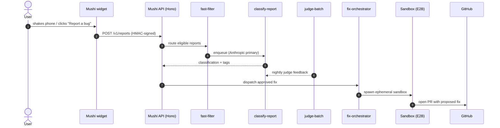

# Mushi Mushi

> Your users find bugs your monitoring can't.
> **Mushi** captures user-side friction, classifies it with an LLM pipeline,
> and lets an agentic fix orchestrator turn approved triage decisions into
> pull requests.

Mushi sits **upstream** of Sentry. Sentry sees what your code throws; Mushi
sees what your users feel. The two are designed to compose: Mushi's
classifier ingests Sentry breadcrumbs, and Sentry User Feedback events can be
forwarded into Mushi via webhook.

## Try it in 60 seconds

import { Cards } from 'nextra/components'

<Cards>
  <Cards.Card title="React" href="/quickstart/react" arrow>
    Drop the provider into your app and ship a Shake-to-Report widget.
  </Cards.Card>
  <Cards.Card title="Vue / Svelte / Angular" href="/sdks" arrow>
    First-class adapters for every major web framework.
  </Cards.Card>
  <Cards.Card title="iOS / Android / Flutter" href="/quickstart/mobile" arrow>
    Native SDKs with shake detection, offline queue, and Sentry bridge.
  </Cards.Card>
  <Cards.Card title="MCP server" href="/sdks/mcp" arrow>
    Let Claude / Cursor / Codex triage and propose fixes from your IDE.
  </Cards.Card>
</Cards>

## Why Mushi (vs. Sentry alone)

| Layer                    | Sentry              | Mushi                                         |
| ------------------------ | ------------------- | --------------------------------------------- |
| Source of bugs           | Stack traces & perf | Direct user reports + Sentry User Feedback    |
| Triage                   | Manual              | Two-stage LLM classifier with judge feedback  |
| Knowledge                | Issue list          | Knowledge graph (pgvector + Apache AGE)       |
| Fix workflow             | Issue → ticket      | Agentic orchestrator → sandboxed PR           |
| AI agent surface         | None                | A2A Agent Card + MCP server                   |
| Self-host                | OSS edition         | OSS first; cloud optional                     |

## Architecture at a glance

See **[Concepts → Architecture](/concepts/architecture)** for the full picture.

## What's new in v0.8.0

import { Callout } from 'nextra/components'

<Callout type="info" emoji="🚀">
  **Wave C shipped.** Native iOS, Android, Flutter, and Capacitor SDKs are
  now on their respective registries. The platform also gained A2A Agent
  Card discovery, SOC 2 Type 1 readiness controls, US/EU/JP data residency,
  BYO Storage (S3/R2/GCS/MinIO), and BYOK (Anthropic/OpenAI keys per project).

  [Read the v0.8.0 changelog →](/changelog)
</Callout>
