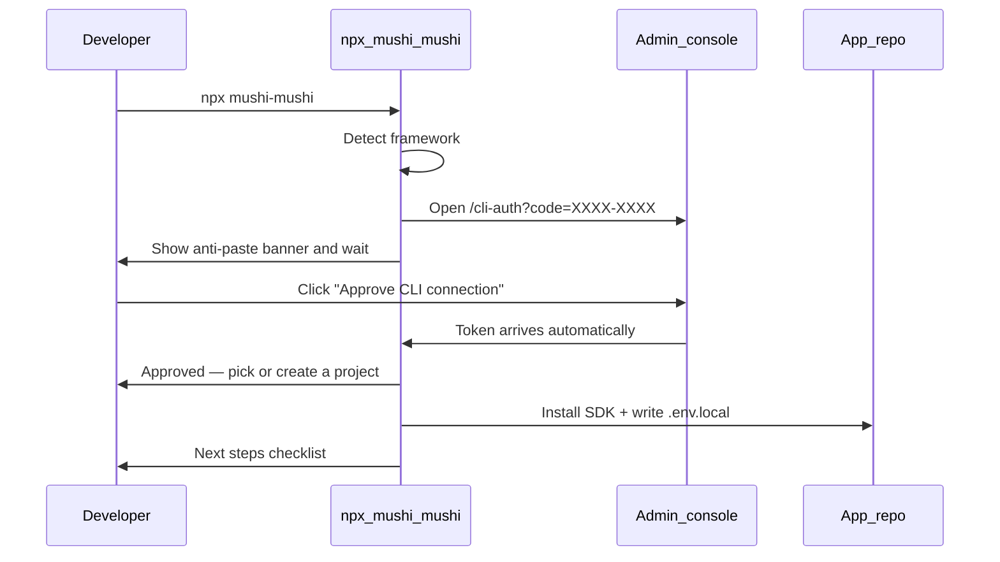
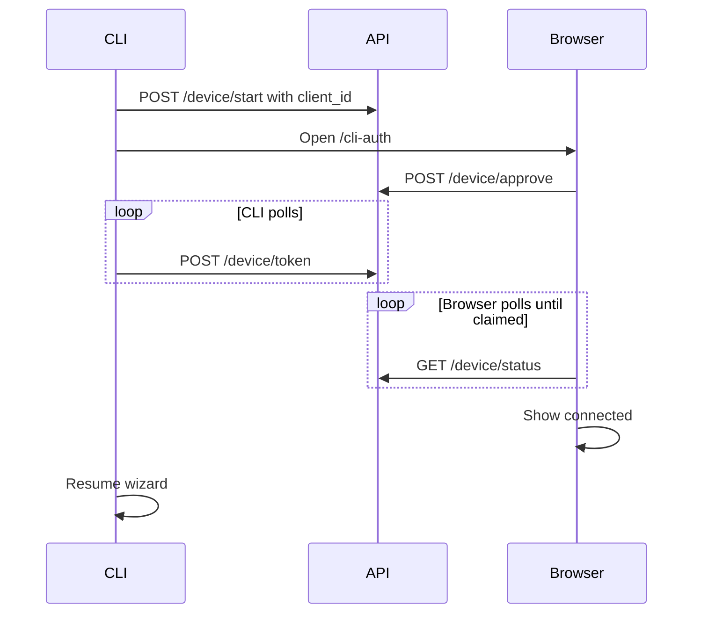

import { Callout, Steps } from 'nextra/components'

# CLI ↔ console setup loop

The fastest path from zero to a working SDK is `npx mushi-mushi` — the wizard
handles project creation, key minting, and SDK installation in one command with
**no copy-paste**. This page explains the full flow and how to recover when
something goes wrong.

## Which CLI command?

| Command | When to use | What it does |
| --- | --- | --- |
| **`npx mushi-mushi`** / **`mushi init`** | First SDK install in an app repo | Detects framework, opens browser auth, installs SDK, writes `.env.local` |
| **`mushi login`** | Authenticate the CLI without installing | Browser sign-in only; persists to `~/.config/mushi/config.json` |
| **`mushi connect`** | You already have credentials; want env + MCP + proof | Merges env vars, wires `.cursor/mcp.json`, optional `--wait` heartbeat |
| **`mushi setup`** | MCP-only wiring after login | Writes Cursor/Claude MCP config — **does not** install the SDK |

<Callout type="warning">
  `mushi setup` is for MCP wiring only, not SDK installation. To install
  the SDK for the first time, run `npx mushi-mushi` (not `mushi setup`).
</Callout>

<Callout type="info">
  **SDK ingest keys** come from **Setup → Verify** (`report:write` scope).
  **Settings → API Keys** is for BYOK LLM/Firecrawl keys — not Mushi project
  credentials.
</Callout>

## Browser sign-in flow (recommended)

`npx mushi-mushi` uses browser sign-in (no paste) via RFC 8628:



### What happens in the terminal

When the wizard starts the browser sign-in step, you will see a box like this:

```
  ┌──────────────────────────────────────────────────────────┐
  │  Browser sign-in — follow these 3 steps                  │
  ├──────────────────────────────────────────────────────────┤
  │                                                          │
  │  1. A browser tab will open (or visit the URL below)    │
  │  2. Sign in if prompted, then click "Approve"           │
  │  3. Come back here — setup continues automatically      │
  │                                                          │
  ├──────────────────────────────────────────────────────────┤
  │  Verification code (show in browser — NOT terminal):    │
  │                                                          │
  │    TGKX-PBXP                                            │
  │                                                          │
  │  ⚠  Do NOT paste or type this code in your terminal     │
  ├──────────────────────────────────────────────────────────┤
  │  URL: https://kensaur.us/...                            │
  └──────────────────────────────────────────────────────────┘

  ⏳ Waiting for browser approval… (Ctrl+C to cancel)
```

**The terminal waits automatically.** You do not need to type or paste anything.
Switch to your browser, approve, then come back to this terminal.

### What happens in the browser

The console shows a 3-step guide and displays the same code:

1. Confirm the code matches what your terminal printed
2. Click **Approve CLI connection**
3. Switch back to your terminal — setup resumes automatically

After you click **Approve**, the browser shows a **waiting** state while the CLI
claims the token. When the terminal picks it up, the page switches to **"CLI
connected — switch back to your terminal"** and the terminal continues to the
project picker.

## How sign-in reliability works

Each machine gets a stable `client_id` (stored in `~/.config/mushi/config.json`).
The CLI sends it when starting device auth so concurrent logins on the same
machine behave predictably.



**Concurrent logins:** Starting a new `mushi login` or `npx mushi-mushi` on the
same machine supersedes any older pending approval for that `client_id`. If you
have two terminals waiting, only the newest poll wins — close the stale one and
run the wizard again.

**Re-running the wizard:** If credentials are already saved, the CLI validates
them with `GET /v1/sync/whoami` before reinstalling anything.

<Steps>

### 1. Run the wizard

```bash
npx mushi-mushi
```

The wizard auto-detects your framework (Next.js, React, Vue, Expo, …).

### 2. Approve in the browser

A browser tab opens at `/cli-auth?code=XXXX-XXXX`. Click **Approve CLI connection**.
The browser waits until your terminal claims the token, then shows connected — no
copy-paste needed.

### 3. Pick or create a project

The wizard lists your existing projects. Choose one or enter a name to create a
new project. The SDK API key is minted automatically.

### 4. SDK installed

The wizard installs the SDK package and writes your `.env.local` with
`MUSHI_PROJECT_ID`, `MUSHI_API_KEY`, and `MUSHI_API_ENDPOINT`.

### 5. Wire Cursor MCP (optional but recommended)

```bash
mushi connect --write-env --wire-ide --wait
```

This writes `.cursor/mcp.json` and waits for the first SDK heartbeat to confirm
the connection is live.

</Steps>

## Console URLs

| Environment | Admin console | Notes |
| --- | --- | --- |
| **Hosted (production)** | [kensaur.us/mushi-mushi/admin](https://kensaur.us/mushi-mushi/admin) | Default for external apps |
| **Local monorepo dev** | [http://localhost:6464](http://localhost:6464) | Run `pnpm dev` from the mushi-mushi repo |
| **Override** | Set `MUSHI_CONSOLE_URL` | CLI hints + browser opens use this base when set |

The CLI resolves the console in this order: `MUSHI_CONSOLE_URL` → saved
`~/.config/mushi/config.json` `consoleUrl` → localhost `:6464` probe → hosted default.

## Manual paste (fallback / self-hosted)

If the browser auth path isn't available, select "Paste a Project ID + API key"
in the wizard, or pass flags directly:

```bash
mushi init --project-id <uuid> --api-key mushi_xxx
```

To get the values manually:

| Value | Where to find it |
|---|---|
| `projectId` | UUID on the [Setup → Steps](https://kensaur.us/mushi-mushi/admin/onboarding?tab=steps) success panel |
| `apiKey` | [Setup → Verify](https://kensaur.us/mushi-mushi/admin/onboarding?tab=verify) → Generate API key (scope: `report:write`) |

<Callout type="warning">
  **Settings → API Keys** is for BYOK LLM/Firecrawl keys — not SDK ingest keys.
  Always use **Setup → Verify** to generate `report:write` project keys.
</Callout>

## CI / non-interactive

Pass all three flags so the wizard skips all interactive prompts:

```bash
npx mushi-mushi --yes --project-id <uuid> --api-key mushi_xxx
```

Or use the non-interactive connect command after minting a key in the console:

```bash
MUSHI_API_KEY=mushi_xxx mushi connect \
  --project-id <uuid> \
  --endpoint https://dxptnwrhwsqckaftyymj.supabase.co/functions/v1/api \
  --write-env --wire-ide
```

## Troubleshooting

| Symptom | Cause | Fix |
| --- | --- | --- |
| `command not found: TGKX-PBXP` | You pasted the verification code into the shell | That code belongs in the **browser**, not the terminal. The terminal waits automatically. |
| Terminal exits immediately after showing code | Browser tab didn't open; terminal was closed | Keep the terminal open. Open the URL from the banner manually if the tab didn't open. |
| "Wizard opens wrong console URL" | Hosted default while you meant local dev | Run `pnpm dev`, or set `MUSHI_CONSOLE_URL=http://localhost:6464` |
| "Invalid project ID" | Pasted name instead of UUID | Copy from success panel (UUID chip) on Setup → Steps |
| 401 / whoami failure | Wrong key or revoked key | Mint a new key on [Setup → Verify](https://kensaur.us/mushi-mushi/admin/onboarding?tab=verify) |
| "Browser sign-in timed out" | 10-minute code expired before approval | Run `npx mushi-mushi` again — a new code is generated |
| `--write-env` unknown option | CLI older than v1.19 | Upgrade: `npm i -g @mushi-mushi/cli@latest` |
| Non-interactive hang in CI | TTY prompts with partial flags | Pass `--yes --project-id <uuid> --api-key mushi_xxx` |
| Browser says connected, terminal still waiting | Stale browser tab, wrong terminal window, or superseded poll from a second login | Close old `/cli-auth` tabs. Use the terminal that started the most recent `npx mushi-mushi`. Run the wizard again if needed. |
| Browser stuck on "waiting" after Approve | CLI has not claimed the token yet (slow network) or terminal was closed | Keep the terminal open. After ~45s the browser shows stale-tab help. |
| Terminal still waiting after browser connected | Token poll hit a different `device_code` than the open browser tab | Run `npx mushi-mushi` again in the terminal you want to use. Approve in the fresh browser tab only. |
| `429 Too Many Requests` during token poll | Rate limit on `/device/token` | The CLI retries automatically. Wait a few seconds — do not spam Approve. |
| `408 Request Timeout` during token poll | Transient network blip | The CLI retries automatically. If it persists, check firewall/proxy rules. |

## Related

- [Credentials](/concepts/credentials) — scopes, env var names, endpoints
- [Admin → Onboarding](/admin/onboarding) — in-console checklist + success panel
- [Connect & Update](/admin/connect) — copy commands with your active project prefilled
- [MCP quickstart](/quickstart/mcp) — IDE wiring after credentials are saved
- [SDK reliability deploy checklist](https://github.com/kensaurus/mushi-mushi/blob/master/docs/operators/sdk-reliability-overhaul.md) — operators self-hosting the stack
