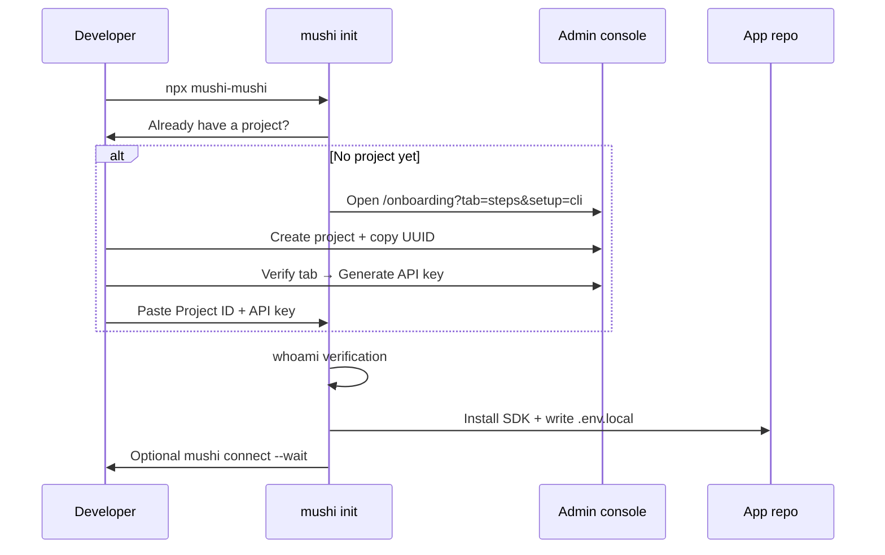

import { Callout, Steps } from 'nextra/components'

# CLI ↔ console setup loop

Use this when `npx mushi-mushi` asks for a **Project ID** and **API key**, or when you
want the console and terminal to stay in sync during first-time setup.

## Console URLs

| Environment | Admin console | Notes |
| --- | --- | --- |
| **Hosted (production)** | [kensaur.us/mushi-mushi/admin](https://kensaur.us/mushi-mushi/admin) | Default for external apps |
| **Local monorepo dev** | [http://localhost:6464](http://localhost:6464) | Run `pnpm dev` from the mushi-mushi repo |
| **Override** | Set `MUSHI_CONSOLE_URL` | CLI hints + browser opens use this base when set |

The CLI resolves the console in this order: `MUSHI_CONSOLE_URL` → saved
`~/.config/mushi/config.json` `consoleUrl` → localhost `:6464` probe (when the dev
server responds) → monorepo heuristic → hosted default.

<Callout type="info">
  `app.mushimushi.dev` may redirect to the hosted console — prefer
  **kensaur.us/mushi-mushi/admin** in docs and scripts.
</Callout>

## Which CLI command?

| Command | When to use | What it does |
| --- | --- | --- |
| **`mushi init`** / **`npx mushi-mushi`** | First SDK install in an app repo | Detects framework, installs SDK, writes `.env.local`, optional test report |
| **`mushi connect`** | You already have ID + key; want env + MCP + proof | Saves config, merges env, wires `.cursor/mcp.json`, optional `--wait` heartbeat |
| **`mushi login`** | Save credentials before other commands | Browser or `--api-key`; persists to `~/.config/mushi/config.json` |
| **`mushi setup`** | MCP-only wiring after login | Writes Cursor/Claude MCP config from saved credentials — **not** SDK install |

<Callout type="warning">
  **SDK ingest keys** come from **Setup → Verify** (`report:write`). **Settings → API
  Keys (BYOK)** is for your own LLM/Firecrawl keys — not Mushi project credentials.
</Callout>

## Setup flow (console + terminal)



<Steps>

### 1. Create a project

Open [Setup → Steps](https://kensaur.us/mushi-mushi/admin/onboarding?tab=steps) or
[Projects → New project](https://kensaur.us/mushi-mushi/admin/projects?tab=create).

- Enter a name and click **Create**.
- Copy the **Project ID** (UUID) from the **success panel** — do not hunt the metrics rail.
- If you already have projects, add `?setup=cli` to the onboarding URL (the CLI opens this
  automatically) so the create form stays visible.

### 2. Generate an API key

On [Setup → Verify](https://kensaur.us/mushi-mushi/admin/onboarding?tab=verify), click
**Generate API key**. Use **`report:write`** for SDK ingest.

The plaintext key is shown **once**. Copy it before navigating away.

### 3. Run the CLI in your app repo

**Recommended — full SDK wizard:**

```bash
npx mushi-mushi
# or, if you already copied the UUID:
mushi init --project-id <uuid>
```

**Agent / script — env + Cursor MCP + heartbeat proof:**

```bash
MUSHI_API_KEY=mushi_xxx mushi connect \
  --project-id <uuid> \
  --endpoint https://dxptnwrhwsqckaftyymj.supabase.co/functions/v1/api \
  --write-env --wire-ide --wait
```

Replace `mushi_xxx` with your Verify-tab key. Self-hosted installs: pass your
`MUSHI_API_ENDPOINT` instead of the cloud URL.

</Steps>

## CLI prerequisite step

When the wizard does not receive `--project-id` / `--api-key` and nothing is saved in
`~/.config/mushi/config.json`, it asks:

1. **No — open the console to create one** — opens `?setup=cli`, waits for you to finish.
2. **Yes — I have Project ID + API key** — skips straight to paste prompts.
3. **Use mushi login first** — exits with instructions to run `mushi login`, then re-run init.

Before installing packages, init calls **`GET /v1/sync/whoami`** so a typo in the UUID or
key fails fast with a clear error.

## Second project / existing workspace

If you already have a Mushi project but need another app:

1. Open `/onboarding?tab=steps&setup=cli` (or **Projects → New project**).
2. Create the new project and copy the fresh UUID from the success panel.
3. Run `mushi init --project-id <new-uuid>` in that app's repo.

The `?setup=cli` flag keeps the create form visible even when you already have projects.

## Troubleshooting

| Symptom | Likely cause | Fix |
| --- | --- | --- |
| Wizard opens wrong console URL | Hosted default while you meant local dev | Run `pnpm dev`, or set `MUSHI_CONSOLE_URL=http://localhost:6464` |
| "Invalid project ID" | Pasted slug/name instead of UUID | Copy from success panel or Projects UUID chip |
| whoami / 401 | Wrong key or revoked key | Mint a new key on Verify tab; check `report:write` scope |
| `--write-env` unknown option | CLI older than v1.19 | Upgrade: `npm i -g @mushi-mushi/cli@latest` |
| connect fails without `--endpoint` | Required flag on `mushi connect` | Pass cloud URL or set `MUSHI_API_ENDPOINT` |
| Banner says "Name your app" but no form | Missing `?setup=cli` on onboarding | Use CLI deep link or **Projects → New project** |
| Non-interactive hang in CI | TTY prompts with partial flags | Pass `--yes --project-id <uuid> --api-key mushi_xxx` |

## Related

- [Credentials](/concepts/credentials) — scopes, env var names, endpoints
- [Admin → Onboarding](/admin/onboarding) — in-console checklist + success panel
- [Connect & Update](/admin/connect) — copy commands with your active project prefilled
- [MCP quickstart](/quickstart/mcp) — IDE wiring after credentials are saved
