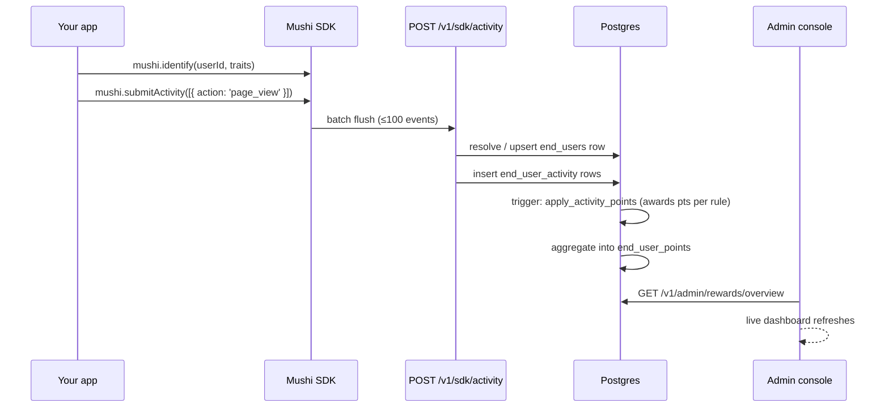

# Rewards program

Source: https://kensaur.us/mushi-mushi/docs/admin/rewards

---
title: Rewards program
---

# Rewards program

The Rewards program turns passive bug reporters into engaged contributors.
Every activity your users take in your app — navigating screens, submitting
reports, leaving comments — earns them points. Points advance tiers. Tiers
open perks you configure: free plan upgrades, early-access flags, and
(optionally) monetary payouts via Stripe Connect.

  The Rewards page is available on **Pro** and **Enterprise** plans. The admin
  toggle at the bottom of [Settings](#settings) is always visible so you can
  prepare your configuration before flipping the SDK flag in your app.

---

## How the pipeline works



The `identify()` call is the gate. Until a user ID is known, activity events
are buffered and tagged with the anonymous `reporter_token_hash`. As soon as
`identify()` fires (typically on auth state change), the SDK flushes the buffer
with the resolved user traits attached, and the server upserts an `end_users`
record that links all future activity and reports to that identity.

---

## Overview tab

The Overview tab shows a snapshot of your rewards program's health:

| Tile | What it measures |
|------|-----------------|
| **Active contributors** | Distinct end users who earned ≥1 point in the last 30 days |
| **Total points issued** | Sum of all `points_awarded` ever, for your org |
| **Reports this month** | Reports linked to a known `end_user_id` in the calendar month |
| **Tier breakdown** | Donut chart: percentage of contributors at each tier |

The tiles are live — `useRealtimeReload` polls every 30 seconds via Supabase
Realtime so you see activity without a page refresh.

---

## One-click recommended defaults

On an empty Activity rules tab, click **Use recommended defaults** (or call
`POST /v1/admin/rewards/presets/apply`). That idempotently installs:

| Action | Default points | When it fires |
|--------|---------------:|---------------|
| `report.submitted` | 10 | After ingest links the report to an `end_user` |
| `report.triaged` | 50 | After `classify-report` finishes (idempotent) |
| `comment_posted` | (preset) | Reporter comments |

Plus a 4-tier ladder (Explorer → Contributor → Champion → Legend). Safe to
re-run — existing custom rules/slugs are never clobbered. Full operator guide:
[`docs/REWARDS.md`](https://github.com/kensaurus/mushi-mushi/blob/master/docs/REWARDS.md).

---

## Activity Rules tab

Rules define which user actions earn points and what the caps are.

| Column | Description |
|--------|-------------|
| **Action** | The `action` string the SDK sends (e.g. `page_view`, `report_submit`) |
| **Base points** | Points awarded per occurrence. Negative values deduct points. |
| **Max / day** | Cap per user per calendar day. `null` = unlimited. |
| **Max lifetime** | Lifetime cap per user. `null` = unlimited. |
| **Multiplier eligible** | Whether a tier multiplier can boost this action's award. |
| **JWT required** | Monetary-eligible rules (P2) — require a verified host JWT before awarding. |
| **Enabled** | Toggle without deleting. Disabled rules skip evaluation silently. |

**Built-in defaults** (set when the project first enables rewards):

| Action | Points | Max/day | Notes |
|--------|-------:|--------:|-------|
| `session_start` | 10 | 3 | First three sessions of the day |
| `page_view` | 2 | 20 | Incremental reading progress |
| `navigate` | 3 | 30 | Deliberate navigation events |
| `button_press` | 5 | 30 | Explicit interactions |
| `comment_add` | 25 | 10 | Social engagement |
| `report_submit` | 50 | 5 | Core value action — confirmed bugs earn a bonus from the anti-gaming scorer |

Rules are applied by a PostgreSQL trigger (`private.apply_activity_points`)
so the award is atomic and consistent regardless of which SDK surface fired.

### Custom rules

Click **+ Add rule** to create an action you define in your own code:

```typescript
mushi.submitActivity([
  { action: 'lesson_complete', metadata: { lessonId: 'l_123', score: 0.9 } }
])
```

Then create a rule with `action: 'lesson_complete'`, set the points, and it
starts accruing immediately — no SDK update required.

---

## Tier Ladder tab

Tiers map a point threshold to a named rank with optional perks.

| Column | Description |
|--------|-------------|
| **Slug** | Internal identifier used in webhook payloads and SDK responses |
| **Display name** | User-visible name (e.g. "Explorer", "Contributor") |
| **Points threshold** | Minimum `total_points` to reach this tier |
| **Perks** | Arbitrary JSON object passed to your webhook / SDK callback |
| **Multiplier** | Point multiplier applied to multiplier-eligible rules for this tier |

**Default ladder shipped with new projects:**

| Tier | Threshold | Color |
|------|----------:|-------|
| Free | 0 | Grey |
| Explorer | 100 | Blue |
| Contributor | 500 | Purple |
| Champion | 2 000 | Amber |

Edit or extend the ladder to match your own program. Tier evaluation runs
inside `awardPointsForEndUser` after every successful activity flush — if the
new total crosses a threshold, a `tier_up` webhook fires automatically.

---

## Contributors tab

A live leaderboard of your top reporters, ranked by `total_points` (descending).
Filter by time window (7d / 30d / all-time) or search by display name / email.

**Per-contributor drill-down** (`/v1/admin/rewards/contributors/:id`) shows:

- Point history chart (daily breakdown)
- Each `end_user_activity` entry with the action, points awarded, and timestamp
- Linked reports with their classification status
- Current tier + progress to the next tier
- GDPR controls: export or delete the end-user's data

  The Contributors tab shows email addresses and display names collected via
  `identify()` traits. Make sure your privacy policy discloses that you collect
  this data through the Mushi SDK before enabling rewards. See the
  [Privacy & GDPR](#gdpr--consent) section below.

---

## Quests tab

Quests are multi-step goals. A user completes a quest by performing a defined
sequence of actions within a time window.

**Example quest** — "First Feedback":
1. `session_start` (day 0)
2. `navigate` to any 3 distinct screens (day 0–7)
3. `report_submit` or `comment_add` (day 0–14)

Quest completions award a bonus `quest_complete` point event in addition to the
per-action awards.

### Quest editor

Click **+ New quest** to open the editor:

- **Name** and **description** (shown to users in the badge widget)
- **Steps** — drag-and-drop ordered list of `{ action, min_count, within_days }`
- **Reward points** — awarded on completion
- **Expiry** — quest deadline (absolute date or rolling window)
- **One-shot** — whether a user can complete the same quest multiple times

Quest progress is evaluated server-side in `evaluateQuestProgress` after each
activity flush, so no client-side code is needed to track completion state.

---

## Retention tab

The Retention tab shows **cohort-level analysis**: how did the rewards program
affect 7-day and 30-day retention for users who opted in versus those who did
not?

Charts displayed:

- Retention curves: opted-in vs. opted-out cohorts
- Avg. sessions per user / week: rewards vs. control
- Report volume trend: did engagement translate to more reports?
- At-risk users: opted-in users who haven't appeared in 14+ days (re-engagement
  candidates for a push campaign)

Data is computed by the `intelligence-report` edge function and cached in
`project_settings.retention_cache` with a 24-hour TTL.

---

## Simulator tab

The Simulator lets you preview how a point award would behave **before** you
deploy it to users.

1. Pick or type an `action` name.
2. Enter an example `userId` (can be a test ID — no actual `end_users` row is
   created or modified).
3. Click **Run** — the server evaluates the rule, applies caps, and returns the
   award result, the capped reason if applicable, and the hypothetical new tier.

Use this to sanity-check multiplier interactions, daily cap edge cases, and
quest trigger logic without touching production data.

---

## Settings tab

| Setting | Description |
|---------|-------------|
| **Rewards enabled** | Master toggle. Disabling stops point awards but preserves all historical data. |
| **Consent mode** | `explicit` (SDK shows a one-time prompt) or `auto` (opt-in on first `identify()`). |
| **Show in widget** | Display tier + points footer inside the Mushi bug-report widget. |
| **Show notifications** | "+X pts" toast shown to the user on each award. |
| **Monthly org cap** | Max total points your org will award in a calendar month (fraud guard). `0` = unlimited. |

### Webhooks

Webhook payloads are sent for these events:

| Event | Payload highlights |
|-------|--------------------|
| `points_awarded` | `userId`, `action`, `points`, `totalPoints`, `tier` |
| `tier_up` | `userId`, `previousTier`, `newTier`, `totalPoints` |
| `quest_complete` | `userId`, `questId`, `questName`, `bonusPoints` |
| `payout_created` | `userId`, `amount`, `currency`, `stripeTransferId` (P2) |

Register webhook endpoints in the **Webhooks** subtab, test-fire them with a
synthetic payload, and view the delivery log.

---

## Monetary payouts (P2)

  Monetary payouts require the **Enterprise** plan and a connected Stripe
  account. The Stripe Connect onboarding flow is inside Settings → Payouts.

When monetary payouts are enabled:

1. Each contributing user completes a Stripe Connect Express onboarding
   (linked from their profile or from a `tier_up` notification you send).
2. Your payout rules define a `$/point` rate and a minimum threshold.
3. The `payout-aggregator` cron job (runs monthly) computes each user's earned
   amount, writes a `reward_payouts` row, and queues a Stripe transfer.
4. The **Payout liability dashboard** shows the outstanding liability (unpaid
   earned amounts) so you can top up your Stripe balance before month-end.

The JWT verification step (`verifyUserToken` in `MushiRewardsConfig`) ensures
that monetary awards are only issued to authenticated users whose identity the
host app can vouch for — preventing anonymous abuse.

---

## GDPR & consent

The rewards pipeline stores:

| Table | Data |
|-------|------|
| `end_users` | `external_user_id`, optional `email` + `display_name`, `last_seen_at` |
| `end_user_activity` | `action`, `points_awarded`, `occurred_at`, metadata |
| `end_user_points` | `total_points`, `points_30d`, `points_lifetime` |

**User rights** are handled by SDK endpoints:

| Endpoint | Right |
|----------|-------|
| `GET /v1/sdk/me/export` | Data portability — returns the full activity log as JSON |
| `DELETE /v1/sdk/me` | Erasure — deletes all `end_user_activity`, zeroes `end_user_points`, anonymises the `end_users` row |
| `POST /v1/sdk/me/consent` | Withdraw / re-grant opt-in; withdrawal stops new award events |

If you use `consentMode: 'explicit'` (the default), the SDK surfaces a
one-time prompt before the first `identify()` flush. The user's choice is
persisted server-side in `end_users.opted_in`, so it follows them across
devices.
