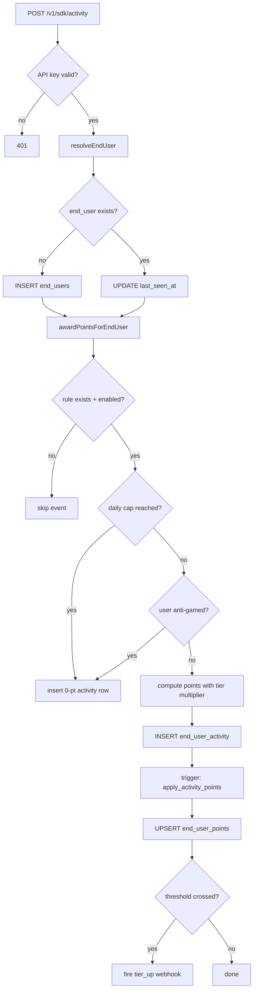
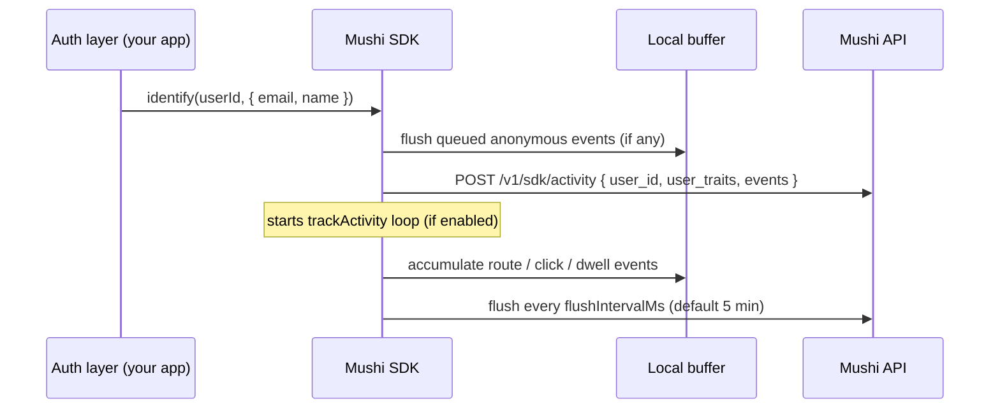
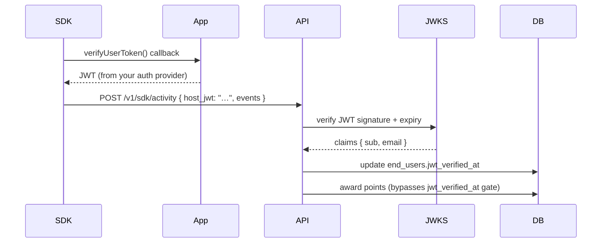

# Rewards & contributor identity

Source: https://kensaur.us/mushi-mushi/docs/concepts/rewards

---
title: Rewards & contributor identity
---

# Rewards & contributor identity

Reporters earn points when they submit and when triage completes. Points
climb a project-defined tier ladder and can grant host-app perks (roles,
credits) via signed webhooks — so good reports pay off without inventing a
second product.

---

## Design principles

1. **Identity is optional but cumulative.** An anonymous user who later calls
   `identify()` does not lose credit for their prior activity. The server
   back-patches the `end_user_id` on pre-existing reports and activity events
   using the stable `reporter_token_hash` as the bridge.

2. **Awards are server-authoritative.** Points are never computed in the SDK.
   The SDK sends raw events; a PostgreSQL trigger (`private.apply_activity_points`)
   applies the rules atomically. This means your cap and multiplier logic is
   tamper-proof even if the SDK is patched by the user.

3. **Anti-gaming composability.** Rewards reuse the existing anonymous
   reputation scorer (see [Anti-gaming & reputation](/concepts/anti-gaming)).
   A reporter whose token-hash reputation drops below −100 has their activity
   events accepted but scored at 0 until their reputation recovers. They cannot
   farm points by spamming bad reports.

4. **Privacy first.** No PII is required. If `identify()` is called without
   `email` or `name` traits, `end_users.email` and `display_name` remain null.
   The Contributors leaderboard shows an anonymised handle in that case
   (`User-a4f3` from the last 4 chars of `external_user_id`).

---

## Data model

```
end_users
  id                   uuid PK
  organization_id      uuid FK → organizations
  external_user_id     text   — the ID from your auth provider
  display_name         text?
  email                text?
  provider             text?  — 'google' | 'apple' | 'supabase' | …
  opted_in             boolean
  jwt_verified_at      timestamptz? — set when P2 host JWT is verified
  reporter_token_hash  text?  — bridges anonymous activity
  last_seen_at         timestamptz
  created_at           timestamptz
  updated_at           timestamptz

end_user_activity
  id                   uuid PK
  end_user_id          uuid FK → end_users
  organization_id      uuid FK → organizations
  action               text   — matches a reward_rules.action
  points_awarded       int    — 0 if capped or anti-gamed
  metadata             jsonb
  occurred_at          timestamptz

end_user_points
  end_user_id          uuid PK FK → end_users (1:1)
  organization_id      uuid
  total_points         int   — all-time, always ≥ 0
  points_30d           int   — rolling 30-day window
  points_lifetime      int   — synonym for total (never reset)
  updated_at           timestamptz

reward_rules
  id                   uuid PK
  organization_id      uuid FK → organizations
  action               text   — e.g. 'page_view', 'report_submit'
  base_points          int    — negative = deduction
  max_per_day          int?
  max_per_user_lifetime int?
  multiplier_eligible  boolean
  requires_jwt_verification boolean
  enabled              boolean

reward_tiers
  id                   uuid PK
  organization_id      uuid FK → organizations
  slug                 text   — 'free' | 'explorer' | 'contributor' | 'champion'
  display_name         text
  points_threshold     int
  perks                jsonb
  multiplier           numeric  — point multiplier for eligible rules
  sort_order           int
```

---

## Server-side award flow



Key guarantee: each `end_user_activity` insert triggers
`private.apply_activity_points` in the same transaction, so `end_user_points`
is always consistent — there is no separate aggregation job to fall behind.

---

## SDK-side flow



`trackActivity: true` in `MushiRewardsConfig` auto-captures:

- `session_start` — once per session (new tab / app foreground after 30 min
  idle)
- `page_view` — every pathname change in the web SDK, every screen change via
  `setScreen()` in React Native
- `navigate` — explicit `` clicks and `router.push()` calls
- `button_press` — clicks on elements with `data-mushi-track` or
  `[data-testid]` attributes

For custom actions, call `mushi.submitActivity()` directly.

---

## Identity verification (P2 — monetary awards)

When monetary payouts are enabled, a rule marked `requires_jwt_verification:
true` will not award points unless a host-app JWT is present and valid.



The JWKS endpoint for your auth provider is registered once in the admin
console under **Rewards → Settings → Identity Providers**. Supported providers:
Supabase Auth, Apple Sign In, Google Sign In, and any provider that serves a
standard `/.well-known/jwks.json`.

---

## Tier multipliers

When a user reaches a tier with `multiplier > 1`, all subsequent
`multiplier_eligible` rule awards are scaled:

```
points_awarded = floor(base_points × tier.multiplier)
```

Example: an Explorer (multiplier 1.0) earns 2 pts for a `page_view`. A
Champion (multiplier 2.0) earns 4 pts for the same action.

Non-eligible rules (e.g. anti-gaming deductions) are always applied at face
value — multipliers cannot amplify a penalty.

---

## Anti-gaming integration

The rewards system inherits all guarantees from the
[anti-gaming pipeline](/concepts/anti-gaming):

- The `reporter_token_hash` reputation gate blocks known bad actors from
  accruing points even before their `end_users` record is created.
- Activity events from tokens flagged `spam` or `rate_limited` are stored with
  `points_awarded = 0` so the audit trail is complete without the fraud being
  rewarded.
- The `anomaly-detection-cron` (P3) runs nightly to identify users whose
  `end_user_activity` pattern deviates statistically from the cohort median.
  Flagged records land in `reward_disputes` for manual review.
- Monthly org caps in `project_settings` put a hard ceiling on total points
  issued in a calendar month — protecting you from an unexpected viral spike.

---

## Webhooks reference

Register webhook endpoints in the admin console under **Rewards → Settings →
Webhooks**. All payloads are `POST`, `Content-Type: application/json`, signed
with `X-Mushi-Signature` (HMAC-SHA256).

### `points_awarded`

```json
{
  "event": "points_awarded",
  "userId": "usr_abc123",
  "organizationId": "org_xyz",
  "action": "report_submit",
  "pointsAwarded": 50,
  "totalPoints": 220,
  "tier": { "slug": "explorer", "displayName": "Explorer" },
  "occurredAt": "2026-05-17T12:34:56Z"
}
```

### `tier_up`

```json
{
  "event": "tier_up",
  "userId": "usr_abc123",
  "organizationId": "org_xyz",
  "previousTier": { "slug": "free", "displayName": "Free" },
  "newTier": { "slug": "explorer", "displayName": "Explorer" },
  "totalPoints": 103,
  "occurredAt": "2026-05-17T12:34:56Z"
}
```

### `quest_complete`

```json
{
  "event": "quest_complete",
  "userId": "usr_abc123",
  "organizationId": "org_xyz",
  "questId": "quest_001",
  "questName": "First Feedback",
  "bonusPoints": 100,
  "totalPoints": 320,
  "occurredAt": "2026-05-17T12:34:56Z"
}
```

### `payout_created` (P2 — monetary)

```json
{
  "event": "payout_created",
  "userId": "usr_abc123",
  "organizationId": "org_xyz",
  "amount": 25.00,
  "currency": "usd",
  "stripeTransferId": "tr_xxx",
  "occurredAt": "2026-05-17T12:34:56Z"
}
```
