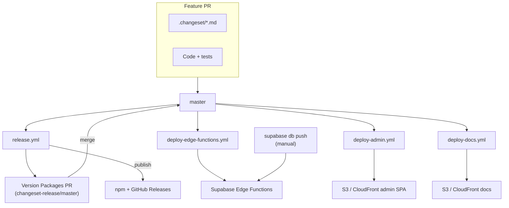

# Production deployment (Mushi Cloud)

Maintainer runbook for shipping **Mushi Cloud** (`kensaur.us/mushi-mushi/*`) and
**npm SDK packages** (`@mushi-mushi/*`). Self-hosters follow
[`SELF_HOSTED.md`](../SELF_HOSTED.md) and the [Self-hosting docs](https://kensaur.us/mushi-mushi/docs/self-hosting).

> **Scope:** This document covers the **kensaurus/mushi-mushi** GitHub Actions
> pipelines that deploy the hosted product. It does not replace per-package
> READMEs or the admin-console feature docs under `apps/docs/content/admin/`.

---

## Architecture at a glance

Production is four independent pipelines, all triggered from `master`:

| Pipeline | Workflow | Deploy target | Auto-trigger paths |
| --- | --- | --- | --- |
| **npm SDK release** | [`.github/workflows/release.yml`](../.github/workflows/release.yml) | [npmjs.com](https://www.npmjs.com/org/mushi-mushi) + GitHub Releases | Every push to `master` (opens version PR or publishes) |
| **Edge Functions** | [`.github/workflows/deploy-edge-functions.yml`](../.github/workflows/deploy-edge-functions.yml) | Supabase project (`SUPABASE_PROJECT_REF`) | `packages/server/supabase/functions/**`, `config.toml` |
| **Admin console** | [`.github/workflows/deploy-admin.yml`](../.github/workflows/deploy-admin.yml) | S3 + CloudFront → `https://kensaur.us/mushi-mushi/admin/` | `apps/admin/**` |
| **Docs site** | [`.github/workflows/deploy-docs.yml`](../.github/workflows/deploy-docs.yml) | S3 + CloudFront → `https://kensaur.us/mushi-mushi/docs/` | `apps/docs/**` |

**Database migrations are not automated in CI.** Apply them manually with
`supabase db push` from `packages/server/` **before** (or in the same release
window as) deploying Edge Functions that depend on new schema. See
[Database migrations](#database-migrations).



---

## npm SDK release (Changesets)

Releases are fully automated once a maintainer merges the version PR. Do **not**
run `npm publish` by hand for routine bumps.

### Normal flow

1. **Land feature PRs on `master`** with one or more changeset files in
   `.changeset/` (`pnpm changeset`). Each changeset must target at least one
   **publishable** package — orphaned changesets (only ignored packages like
   `server`) fail `pnpm check:changeset-orphans`.
2. **`release.yml` runs on push to `master`.** The Changesets action opens or
   updates a PR titled **`chore: version packages`** from branch
   `changeset-release/master`. That PR bumps affected `package.json` files,
   rolls up per-package changelogs, and deletes consumed changesets.
3. **Wait for CI on the version PR.** Required checks mirror `ci.yml` plus
   release-only gates (publish readiness, migration catalog, edge-fn imports,
   license headers, etc.).
4. **Merge the version PR** (squash is fine; branch protection allows it).
5. **Confirm publish ran.** After merge, `release.yml` should publish to npm with
   **OIDC Trusted Publishers** + Sigstore provenance. Check:
   - Actions → **Release** → latest run → job **Version & Publish** → step summary
   - [GitHub Releases](https://github.com/kensaurus/mushi-mushi/releases)
   - `npm view @mushi-mushi/<pkg> version`

### Manual dispatch (required after most version-PR merges)

GitHub's **anti-loop protection** often suppresses the downstream `push`
trigger when the version PR squash-merge is attributed to
`github-actions[bot]`. The publish step does **not** run automatically.

**Fix:** Actions → **Release** → **Run workflow** → branch **`master`** → Run.

This is documented in `release.yml` and is the same path used for prior releases
(e.g. run `27689036533` on 2026-06-17). Always dispatch manually if no Release
run appears within ~2 minutes of merging the version PR.

```bash
# CLI equivalent
gh workflow run release.yml --ref master
gh run list --workflow=release.yml --limit 3
```

### Version PR CI did not start

Bot-created branches sometimes get **zero checks** until a human or non-bot
commit lands on `changeset-release/master`. Push an empty commit to the version
PR branch (or merge a small fix like SDK matrix regen) to trigger CI:

```bash
git fetch origin changeset-release/master
git checkout changeset-release/master
git commit --allow-empty -m "chore: trigger release CI on version PR"
git push origin HEAD:changeset-release/master
```

### `check:sdk-version-matrix` failed on the version PR

The version PR bumps package versions but does **not** regenerate
`apps/docs/content/sdks/index.mdx`. CI fails with:

```text
SDK version matrix drift — run `pnpm gen:sdk-version-matrix` and commit.
```

**Fix** (commit to the version PR branch, not `master` directly):

```bash
git fetch origin changeset-release/master
git checkout -B fix/version-matrix origin/changeset-release/master
pnpm gen:sdk-version-matrix
git add apps/docs/content/sdks/index.mdx
git commit -m "docs(sdks): regenerate SDK version matrix for version bump"
git push origin HEAD:changeset-release/master
```

Prefer an **isolated worktree** if your main checkout has unrelated uncommitted
changes — pre-commit hooks scan the whole tree.

### Orphaned changeset blocked release

If a changeset only bumps ignored packages (`server`, `agents`, `verify` in
`.changeset/config.json`), delete it or add a publishable package target.
`pnpm check:changeset-orphans` fails with the offending filename.

### Brand-new npm package (one-time bootstrap)

Trusted Publisher rules require the package to exist on npm first. See
[CONTRIBUTING.md — Adding a brand-new publishable package](../CONTRIBUTING.md#adding-a-brand-new-publishable-package).

---

## Edge Functions deployment

**Workflow:** `deploy-edge-functions.yml`

| Trigger | Behaviour |
| --- | --- |
| Push to `master` changing `packages/server/supabase/functions/**` or `config.toml` | Deploy **all** functions sequentially |
| `workflow_dispatch` | Deploy all, or one function via `function_name` input |

Each function is deployed via `scripts/deploy-edge-function.mjs` (Supabase
Management API — same path as local deploys). Pre-flight runs
`pnpm check:edge-fn-imports` so cross-function relative imports fail in CI
instead of as a Supabase HTTP 400.

Post-deploy smoke tests hit `/functions/v1/api/health` and a CORS preflight from
`https://kensaur.us`.

**Manual re-deploy (all functions):**

```bash
gh workflow run deploy-edge-functions.yml --ref master
```

**Single function:**

```bash
gh workflow run deploy-edge-functions.yml --ref master -f function_name=inventory-gates
```

**Secrets (GitHub):** `SUPABASE_ACCESS_TOKEN`, `SUPABASE_PROJECT_REF`

---

## Admin console deployment

**Workflow:** `deploy-admin.yml`  
**URL:** `https://kensaur.us/mushi-mushi/admin/`

Triggers on push to `master` when `apps/admin/**` (or CloudFront router scripts)
change. Builds the Vite SPA with production Supabase + Sentry env, syncs to S3
with immutable caching for JS/CSS, invalidates CloudFront `/mushi-mushi/*`, and
checks `version.json`.

```bash
gh workflow run deploy-admin.yml --ref master
```

**Secrets:** `AWS_ACCESS_KEY_ID`, `AWS_SECRET_ACCESS_KEY`,
`CLOUDFRONT_DISTRIBUTION_ID`, `VITE_SUPABASE_URL`, `VITE_SUPABASE_ANON_KEY`,
`VITE_SENTRY_DSN`, `SENTRY_AUTH_TOKEN`

This pipeline is **independent** of npm Changesets — admin can ship without an
SDK release.

---

## Docs site deployment

**Workflow:** `deploy-docs.yml`  
**URL:** `https://kensaur.us/mushi-mushi/docs/`

Triggers on push to `master` when `apps/docs/**` changes. Static Nextra export
with `basePath: /mushi-mushi/docs`.

After editing docs locally, regenerate derived artifacts when applicable:

```bash
pnpm gen:sdk-version-matrix    # if package versions changed
pnpm changelog:aggregate       # if changelogs changed
pnpm gen:llms-txt                # if nav / content structure changed
```

```bash
gh workflow run deploy-docs.yml --ref master
```

---

## Database migrations

There is **no** `db push` step in GitHub Actions for Mushi Cloud. Migrations live
in `packages/server/supabase/migrations/` and must be applied manually:

```bash
cd packages/server
npx supabase link --project-ref "$SUPABASE_PROJECT_REF"
npx supabase db push
```

**Order of operations for schema + handler changes:**

1. Apply migration (`db push`) and verify on remote (`pg_proc`, RLS policies).
2. Merge + deploy Edge Functions that call the new RPCs/tables.
3. Merge admin/console changes that read the new shape.

Deploying handlers before migrations produces 500s that look like UI bugs — see
`docs/audit-2026-04-20/QA-VERIFICATION.md` (P0 deploy-order incident).

Release CI runs `pnpm check:migration-catalog` so docs, CLI, and admin migration
cards stay in sync — but that gate does **not** apply migrations for you.

---

## Pre-ship checklist (maintainers)

Use this before merging a version PR or dispatching Release:

- [ ] All feature PRs on `master` include valid changesets (no orphans).
- [ ] Version PR CI is **green** (especially **Build & Test** / `check:sdk-version-matrix`).
- [ ] If the version PR touched semver for framework SDKs, `apps/docs/content/sdks/index.mdx` is regenerated.
- [ ] Pending DB migrations applied to production Supabase **before** edge deploy.
- [ ] After merging version PR → **manually dispatch** `release.yml` unless a Release run already started.
- [ ] Confirm npm `latest` and GitHub Releases match expected versions.
- [ ] Edge/admin/docs deploy workflows succeeded for any paths you changed.

---

## Troubleshooting

| Symptom | Likely cause | Fix |
| --- | --- | --- |
| Version PR has no CI checks | Bot-branch suppression | Empty commit on `changeset-release/master` |
| `check:sdk-version-matrix` failed | Docs table stale after version bump | `pnpm gen:sdk-version-matrix` on version PR branch |
| Merged version PR but nothing on npm | Anti-loop suppressed Release `push` | `gh workflow run release.yml --ref master` |
| Release publish 404 with provenance | npm OIDC mismatch (older npm) | Workflow uses Node 24; verify Trusted Publisher on npmjs.com |
| Edge deploy HTTP 400 | Bad cross-function import | `pnpm check:edge-fn-imports` locally |
| Admin 500 on new feature | Handler deployed without migration | `supabase db push` then re-deploy functions |
| `check:changeset-orphans` failed | Changeset targets only ignored packages | Delete or retarget changeset |

---

## Related docs

- [CONTRIBUTING.md — Release flow](../CONTRIBUTING.md#release-flow)
- [`.github/workflows/release.yml`](../.github/workflows/release.yml) (inline comments on OIDC, CDN propagation, bootstrap)
- [Self-hosting — Edge Functions](../apps/docs/content/self-hosting/edge-functions.mdx) (function list + secrets for any Supabase project)
- [AGENTS.md](../AGENTS.md) (agent inventory — deploy is separate from agent cron wiring)
