# Screenshots — full admin tour

This is the long-form companion to the README. The README now leads with one
animated tour and one static report screenshot; the grid below shows every
admin surface, kept here so the README stays readable in 90 seconds and the
detail is still one click away for anyone evaluating the project.

Click any image to open the same page in the live admin demo.

↑ animated 4-stop walk through the Plan → Do → Check → Act loop

↑ a real bug, end-to-end · the admin is dark-only by design

## Tour

A walk through the rooms inside. Click any panel to land on it in the live demo.

<table width="100%">
<tr>
  <td width="50%" valign="top">
    
    
<b>Quickstart mode</b> · 3 pages, verb-led labels, no PDCA jargon. The default for first-time visitors — pill-toggle up to Beginner (9 pages) or Advanced (all pages) anytime.

  </td>
  <td width="50%" valign="top">
    
    
<b>First-run tour</b> · 5-stop spotlight tour, no <code>react-joyride</code> dep so it inherits dark theme tokens. Stops that need real data silently skip until the first report lands.

  </td>
</tr>
<tr>
  <td width="50%" valign="top">
    
    
<b>Plug-n-play onboarding</b> · opens with a Plan→Do→Check→Act storyboard so you see the loop before the checklist. Required steps drive the green progress bar; optional steps stay tagged.

  </td>
  <td width="50%" valign="top">
    
    
<b>Sticky run receipts</b> · every Run / Generate / Dispatch button leaves a persistent <code>ResultChip</code> next to it, so you never have to wonder "did it actually work?" after the toast fades.

  </td>
</tr>
<tr>
  <td width="50%" valign="top">
    
    
<b>Dashboard (Advanced)</b> · one living number per stage, bottleneck ring, Next-Best-Action strip, 14d severity-stacked histogram, LLM tokens & calls sparklines.

  </td>
  <td width="50%" valign="top">
    
    
<b>Reports</b> · triage queue with 4 px severity stripe, 14d severity KPIs with sparklines, blast-radius dedup, Save view preset, single primary action per row.

  </td>
</tr>
<tr>
  <td width="50%" valign="top">
    
    
<b>Fixes</b> · per-attempt PDCA cards, 30d KPI sparklines, Langfuse trace per run, real PR links, retry-failed CTA.

  </td>
  <td width="50%" valign="top">
    
    
<b>Judge</b> · Decide/Act/Verify hero over the charts. Live KPIs, 12w score trend, distribution histogram, prompt leaderboard, one-click re-run.

  </td>
</tr>
<tr>
  <td width="50%" valign="top">
    <a href="https://kensaur.us/mushi-mushi/admin/repo">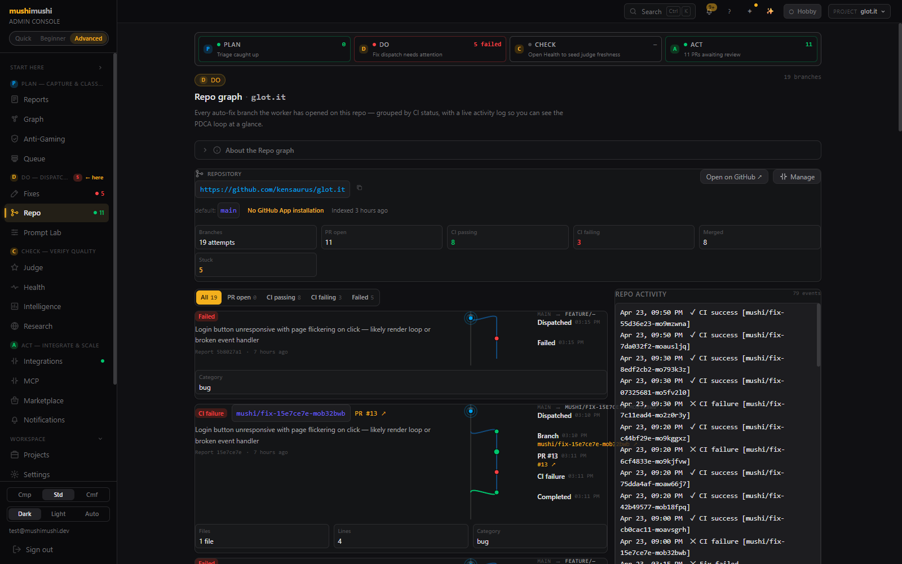</a>
    
<b>Repo</b> · one branch per auto-fix attempt, grouped by CI status. Live event stream via Supabase Realtime on <code>fix_events</code>.

  </td>
  <td width="50%" valign="top">
    
    
<b>Intelligence</b> · the 3-tile hero pattern in action — Decide surfaces the one-liner that matters, Act collapses to "All clear" when there's nothing to do, Verify deeplinks to the evidence.

  </td>
</tr>
<tr>
  <td width="50%" valign="top">
    
    
<b>Health</b> · real <code>cost_usd</code> per call, per-function / per-model breakdown, p50/p95 latency, fallback rate, cron triggers, Langfuse deeplinks.

  </td>
  <td width="50%" valign="top">
    
    
<b>Prompt Lab</b> · A/B traffic split between active and candidate prompts per stage, eval dataset preview, synthetic report generator, fine-tuning jobs queue.

  </td>
</tr>
<tr>
  <td width="50%" valign="top">
    
    
<b>Knowledge graph</b> · auto-switches to Sankey storyboard under 12 nodes; full React Flow canvas above. Apache AGE backed when installed, falls back to plain SQL adjacency otherwise.

  </td>
  <td width="50%" valign="top">
    
    
<b>Compliance</b> · SOC 2 control evidence pack with PASS / WARN pills and inline JSON, region pinning per project, print-styled Export PDF, DSAR workflow tracking.

  </td>
</tr>
<tr>
  <td width="50%" valign="top">
    
    
<b>Marketplace</b> · toggleable extension layer for the loop. Each plugin declares the events it subscribes to and ships with HMAC-signed webhooks.

  </td>
  <td width="50%" valign="top">
    <a href="https://kensaur.us/mushi-mushi/admin/inbox">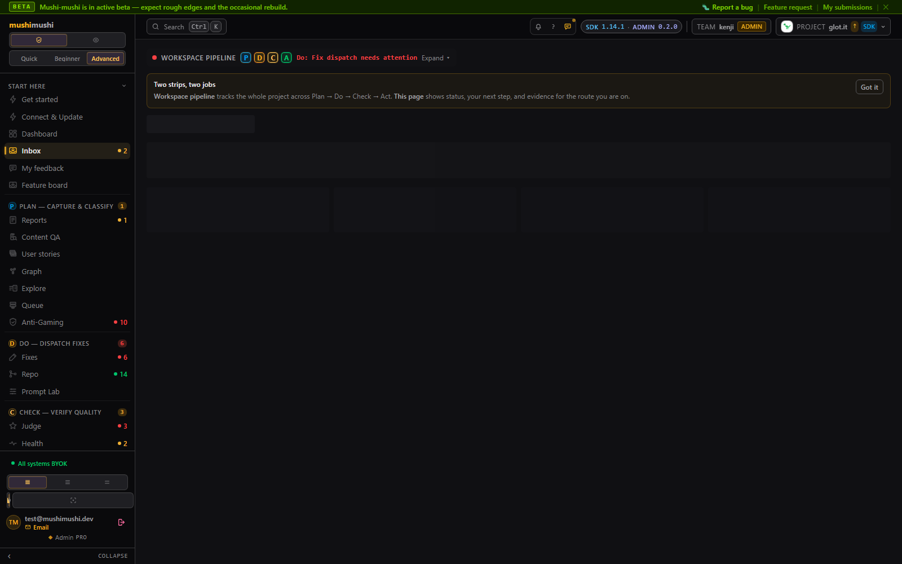</a>
    
<b>Action inbox</b> · open actions across the PDCA loop, grouped by stage with one CTA per group. Empty groups skip — the page only renders what's actually waiting on you.

  </td>
</tr>
<tr>
  <td width="50%" valign="top">
    <a href="https://kensaur.us/mushi-mushi/admin/anti-gaming">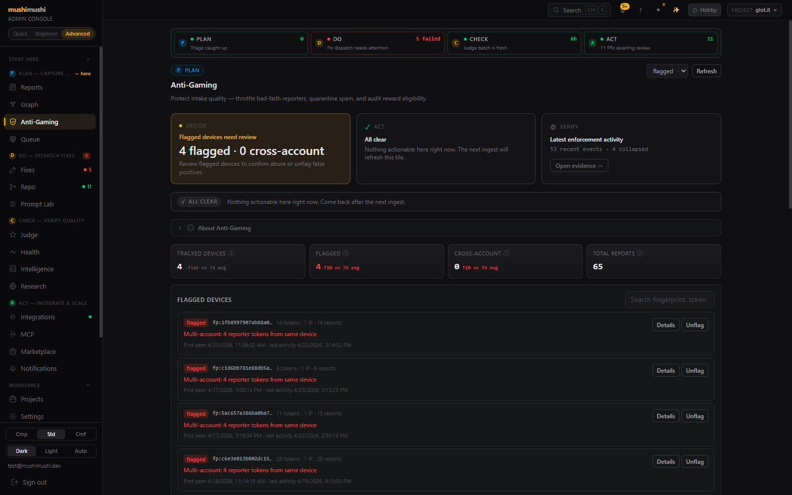</a>
    
<b>Anti-gaming</b> · per-device fingerprint tracker that throttles bad-faith reporters and surfaces multi-account abuse. Every enforcement action lands in the audit trail.

  </td>
  <td width="50%" valign="top">
    <a href="https://kensaur.us/mushi-mushi/admin/queue">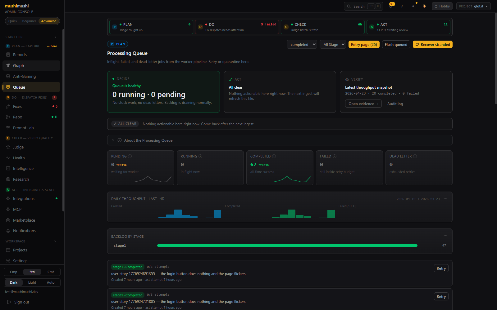</a>
    
<b>Processing queue (DLQ)</b> · <code>worker_jobs</code> viewer with 14d throughput histogram, per-stage backlog bar, and per-job <code>Retry</code> action.

  </td>
</tr>
<tr>
  <td width="50%" valign="top">
    <a href="https://kensaur.us/mushi-mushi/admin/query">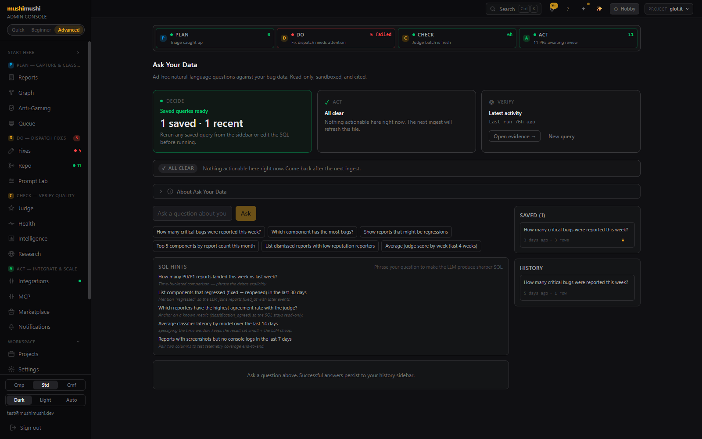</a>
    
<b>Ask Your Data</b> · ad-hoc natural-language SQL over the bug data — read-only Postgres, pre-canned chip prompts, Saved queries + History sidebar.

  </td>
  <td width="50%" valign="top">
    <a href="https://kensaur.us/mushi-mushi/admin/research">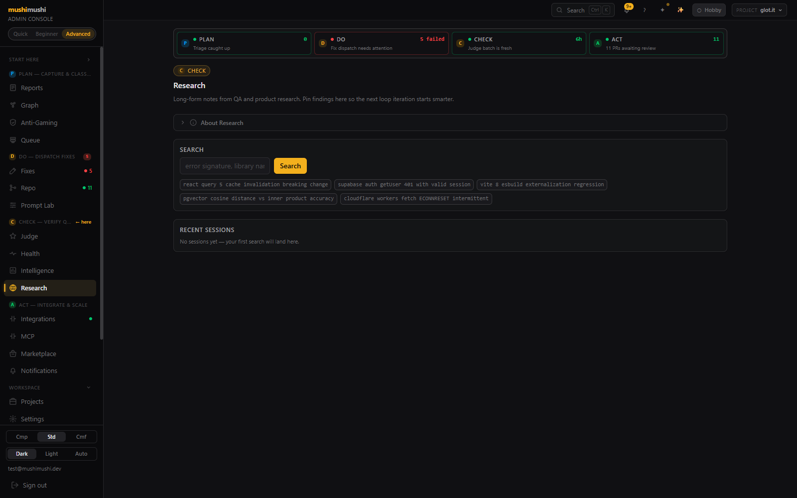</a>
    
<b>Research</b> · pin QA + product findings here so the next loop iteration starts smarter.

  </td>
</tr>
<tr>
  <td width="50%" valign="top">
    <a href="https://kensaur.us/mushi-mushi/admin/mcp">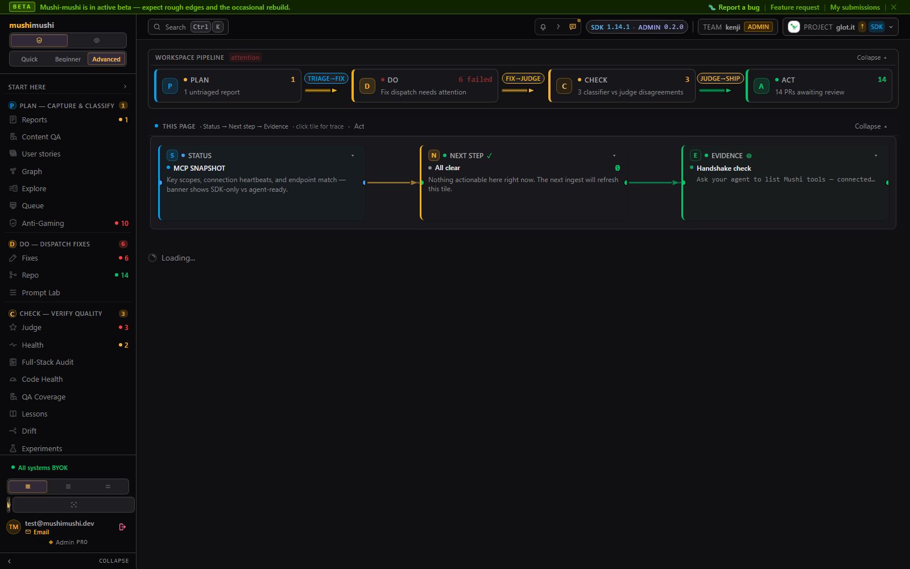</a>
    
<b>MCP — Model Context Protocol</b> · per-project <code>.cursor/mcp.json</code> snippet pre-filled with the active <code>MUSHI_PROJECT_ID</code>, 13-tool catalog, 60s 3-step agent bootstrap.

  </td>
  <td width="50%" valign="top">
    <a href="https://kensaur.us/mushi-mushi/admin/integrations">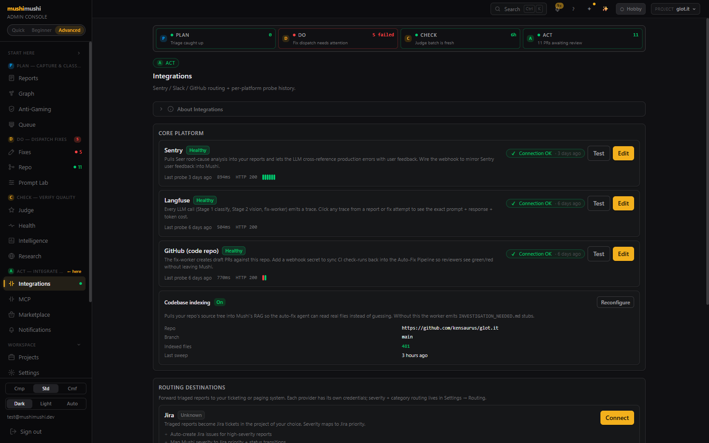</a>
    
<b>Integrations</b> · <code>Sentry / Langfuse / GitHub</code> health-checked probes with last-probe latency + HTTP code + sparkline, codebase indexing status, routing-destination CRUD.

  </td>
</tr>
<tr>
  <td width="50%" valign="top">
    
    
<b>Reporter notifications</b> · outbound messages sent to the people who reported each bug. <code>Show payload</code> reveals the exact JSON the SDK delivered.

  </td>
  <td width="50%" valign="top">
    <a href="https://kensaur.us/mushi-mushi/admin/settings">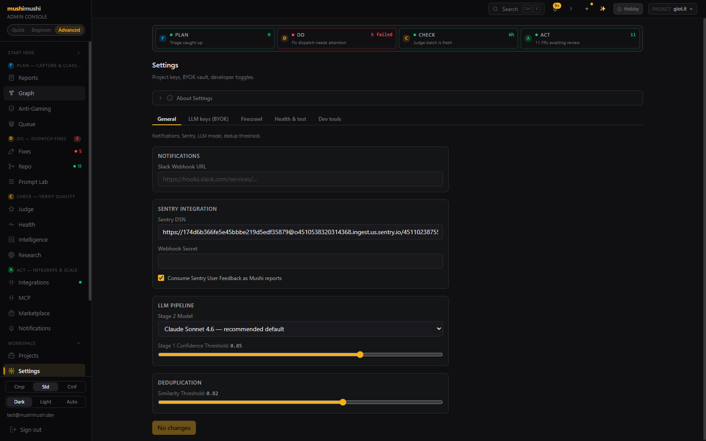</a>
    
<b>Workspace settings</b> · 5 tabs covering Slack webhook, Sentry DSN, Stage-2 model picker, Stage-1 confidence threshold, dedup similarity threshold.

  </td>
</tr>
<tr>
  <td width="50%" valign="top">
    <a href="https://kensaur.us/mushi-mushi/admin/sso">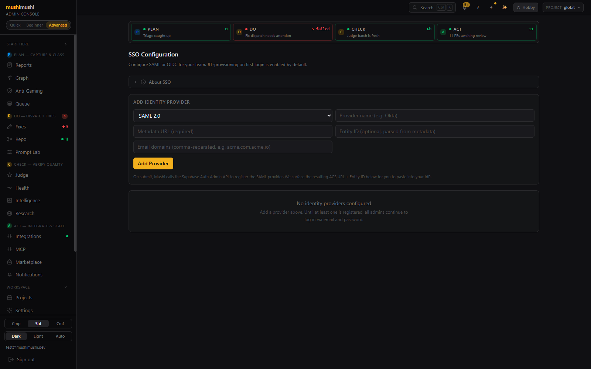</a>
    
<b>SSO config</b> · SAML 2.0 + OIDC form, calls the Supabase Auth Admin API on submit, surfaces the resulting ACS URL + Entity ID for IdP setup. JIT provisioning on first login is the default.

  </td>
  <td width="50%" valign="top">
    <a href="https://kensaur.us/mushi-mushi/admin/audit">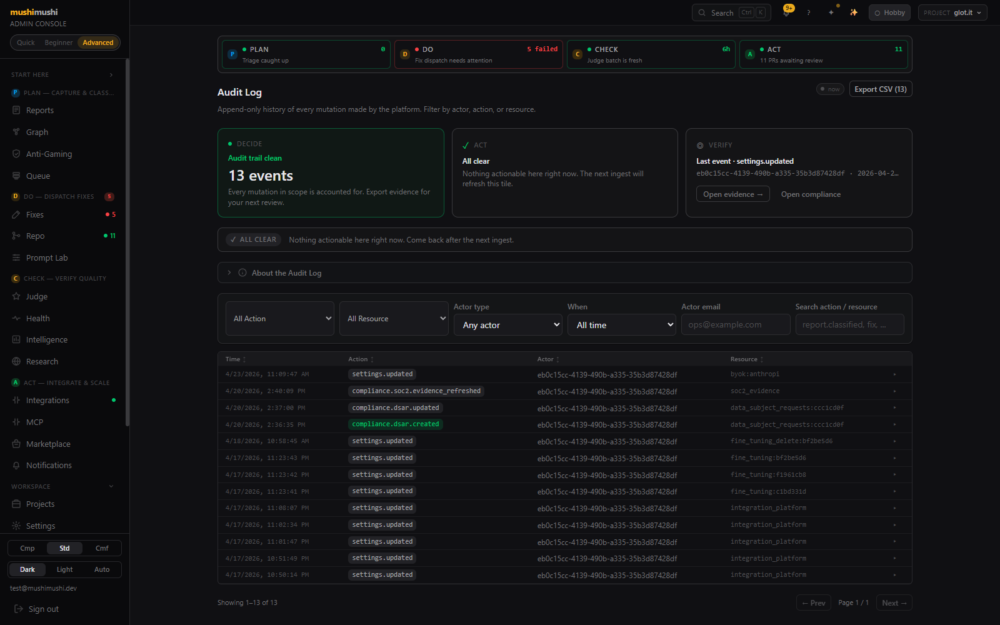</a>
    
<b>Audit log</b> · append-only history of every mutation, filterable by actor / action / resource / time. <code>Export CSV</code> for the next SOC 2 review.

  </td>
</tr>
<tr>
  <td width="50%" valign="top">
    <a href="https://kensaur.us/mushi-mushi/admin/storage">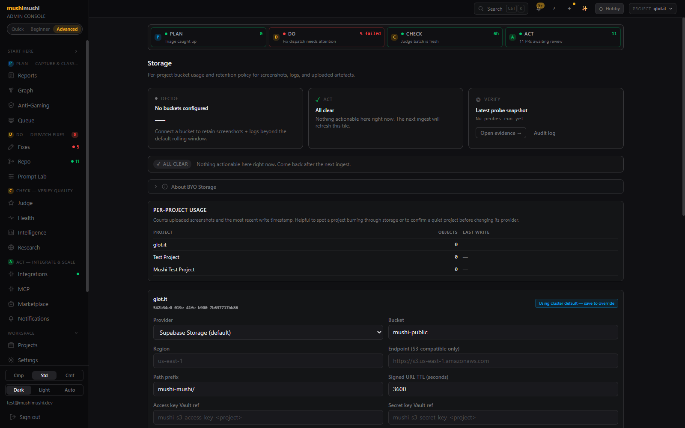</a>
    
<b>BYO storage</b> · per-project bucket form (Supabase / S3 / R2), region pinning, presigned-URL TTL editor, vault-ref'd access keys (never plaintext).

  </td>
  <td width="50%" valign="top">
    <a href="https://kensaur.us/mushi-mushi/admin/projects">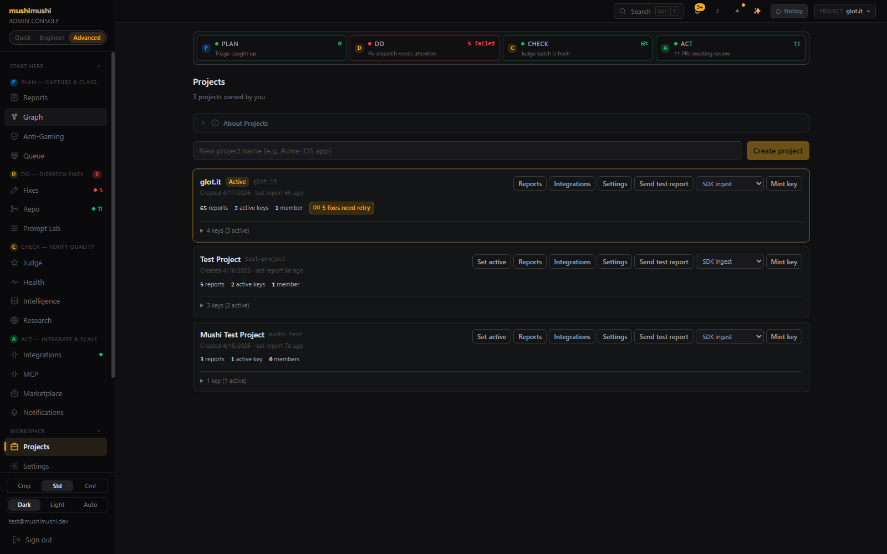</a>
    
<b>Multi-project workspace</b> · per-project cards with active-key count, reports count, member count, plus inline CTAs to mint a fresh key, send a test report, or open project-scoped Integrations / Settings.

  </td>
</tr>
<tr>
  <td width="50%" valign="top">
    <a href="https://kensaur.us/mushi-mushi/admin/billing">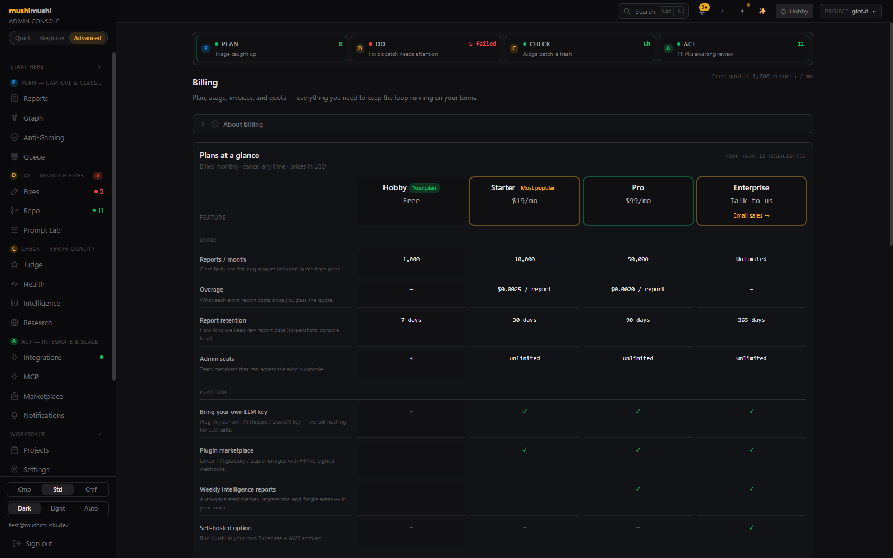</a>
    
<b>Billing</b> · plan comparison (Hobby Free / Starter $19 / Pro $99 / Enterprise), per-plan reports/month + overage cents/report + retention days + admin seats, Stripe-metered LLM $ per day, in-app support form.

  </td>
  <td width="50%" valign="top">
    
    
<b>Report detail</b> · 4-stamp PDCA receipt + live Branch & PR timeline — every step of the dispatch lifecycle in a single round-trip so it never N+1s.

  </td>
</tr>
</table>
