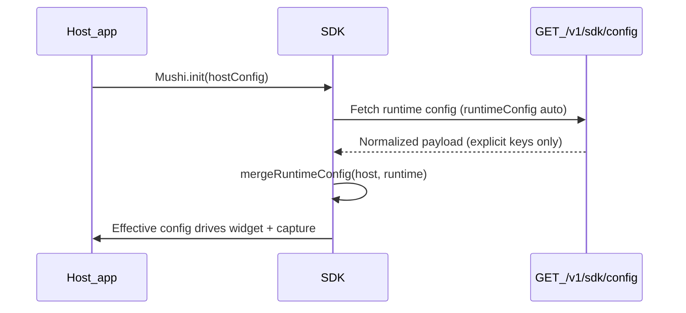

# Mushi SDK Runtime Config Merge

**Shipped in `@mushi-mushi/web` and server edge functions (Jul 2026).**

Before this release, `GET /v1/sdk/config` could emit column defaults for widget
and capture fields. The client merge treated those as explicit overrides — so a
host that wired `widget: { trigger: 'banner' }` could lose its top banner when
the console row still had the default `launcher: 'auto'`. A similar split existed
between the admin and public config normalizers (`reporterNotificationsEnabled`
never reached the live SDK from one code path).

The fix is two-part: **explicit-only emission** on the server and **host-priority
merge** on the client.

## Table of contents

- [Data flow](#data-flow)
- [Server: explicit-only emission](#server-explicit-only-emission)
- [Client: merge precedence](#client-merge-precedence)
- [Capture merge](#capture-merge)
- [Banner and launcher merge](#banner-and-launcher-merge)
- [Widget draft persistence](#widget-draft-persistence)
- [Backend endpoints](#backend-endpoints)
- [File responsibilities](#file-responsibilities)
- [Related docs](#related-docs)

---

## Data flow

| Stage | Input | Output |
| --- | --- | --- |
| Host init | `MushiConfig` in code | Baseline widget, capture, privacy |
| Server normalize | `project_settings` columns | SDK JSON with defaults omitted |
| Client merge | host + runtime | Effective config for widget render |

User-facing summary: [Runtime config concept page](https://kensaur.us/mushi-mushi/docs/concepts/runtime-config).

---

## Server: explicit-only emission

Single normalizer: `packages/server/supabase/functions/_shared/sdk-config.ts`

Consumed by:

- `GET /v1/sdk/config` (`api/routes/public.ts`)
- `GET/PUT /v1/admin/projects/:id/sdk-config` (via re-export in `api/helpers.ts`)

**Rule:** widget and capture keys are included only when the console value differs
from the platform default. A column still at its default means "never configured"
and is omitted so the client cannot clobber host init.

| Column default | Emitted when |
| --- | --- |
| `sdk_widget_launcher = 'auto'` | Only if set to `banner`, `edge-tab`, `manual`, or `hidden` |
| `sdk_capture_screenshot = 'on-report'` | Only if set to `'auto'` or `'off'` |
| `sdk_capture_console = true` | Only if set to `false` |
| `sdk_capture_element_selector = false` | Only if set to `true` |
| `sdk_screenshot_sensitive_hint = NULL` | Only when non-null (`''` → hide caption) |

`reporterNotificationsEnabled` and the `assistant` block are always emitted with
resolved booleans so console toggles match live SDK behavior.

---

## Client: merge precedence

Implementation: `packages/web/src/runtime-merge.ts` (`mergeRuntimeConfig`)

### Trigger / launcher

| Host `widget.trigger` | Runtime sends | Effective trigger |
| --- | --- | --- |
| `'banner'` | `launcher: 'auto'` | `'banner'` (runtime `auto` ignored) |
| `'attach'` | any | host attach unchanged |
| unset | `launcher: 'banner'` | `'banner'` |
| `'hidden'` | runtime not explicitly `hidden` | host non-hidden preserved |

Runtime `launcher: 'auto'` or `widget.trigger: 'auto'` does **not** override a
host non-auto trigger.

### Other widget keys

Non-trigger widget keys from runtime apply only when defined and non-null.
`betaMode` from host is never dropped.

### Banner copy

When runtime sends any banner field (`bannerMessage`, `bannerVariant`, etc.),
fields merge into host `bannerConfig` without resetting unspecified host keys.

---

## Capture merge

`mergeRuntimeCapture(host, runtime)` copies host capture first, then overlays
runtime keys where the value is not `undefined`.

| Host | Runtime | Result |
| --- | --- | --- |
| `elementSelector: true` | omitted (console default) | `true` |
| `screenshot: 'off'` | omitted | `'off'` |
| `console: true` | `console: false` | `false` |
| `network: true` | `network: false` | `false` |

---

## Banner and launcher merge

**Incident:** Host init used `trigger: 'banner'`. Console row untouched
(`launcher` column default `'auto'`). Old normalizer always emitted
`launcher: 'auto'`. Client merge replaced banner with FAB — top strip vanished.

**Fix:** Server omits default launcher; client ignores runtime `auto` when host
trigger is non-auto.

---

## Widget draft persistence

`packages/web/src/widget.ts` captures description, email, and reply field values
(and caret position) before `innerHTML` rebuilds, then restores them after render.

| Event | Draft behavior |
| --- | --- |
| Runtime config refresh | Preserved |
| Route change while panel open | Preserved |
| Successful submit | Description draft cleared |
| New report session | All drafts cleared |

Capture availability: `setCaptureAvailability()` hides screenshot/element buttons
when unavailable; `setElementError()` surfaces inline failure copy.

---

## Backend endpoints

| Method | Path | Auth | Role |
| --- | --- | --- | --- |
| GET | `/v1/sdk/config` | `apiKeyAuth` | Runtime payload for SDK merge |
| GET | `/v1/admin/projects/:id/sdk-config` | JWT / admin | Console read (same normalizer) |
| PUT | `/v1/admin/projects/:id/sdk-config` | JWT / admin | Persists via `coerceSdkConfigUpdate()` |

---

## File responsibilities

| File | Role |
| --- | --- |
| `_shared/sdk-config.ts` | `normalizeSdkConfig`, `coerceSdkConfigUpdate` |
| `_shared/sdk-config.test.ts` | Explicit-only emission regressions |
| `packages/web/src/runtime-merge.ts` | Client merge precedence |
| `packages/web/src/runtime-merge.test.ts` | Banner trigger regression |
| `packages/web/src/mushi.ts` | Fetches config, calls merge, wires capture availability |
| `packages/web/src/widget.ts` | Draft capture/restore, capture UI |
| `api/routes/public.ts` | Public config route (imports shared normalizer) |
| `api/helpers.ts` | Re-exports shared normalizer for admin routes |

---

## Related docs

- [Runtime config (public)](https://kensaur.us/mushi-mushi/docs/concepts/runtime-config)
- [@mushi-mushi/web SDK reference](https://kensaur.us/mushi-mushi/docs/sdks/web)
- [Trigger modes](https://kensaur.us/mushi-mushi/docs/concepts/trigger-modes)
- [SDK screenshot preview](./SDK_SCREENSHOT_PREVIEW.md)
- [SDK assistant](./SDK_ASSISTANT.md)
- [Operator deploy checklist](./operators/sdk-reliability-overhaul.md)
