# Dead Code, MCP Attunement, and the Voice Loop

> Audited 2026-09-12 against the working tree (branch `fix/stagger-edge-cron-herd`) and current vendor documentation. Section 0 lists every correction. Everything else is the plan as it should be executed. Prior plan `RealWorld SDK Attunement` (Plan 016) shipped in `76ec9325` (#340) except its CI gate; see P0.

The three workstreams interlock exactly as the original plan said: the dead-code audit finds that Mushi's Cursor path and the `fix.requested` event are wired at the consumer end with no producer, the voice loop is the missing producer, and the MCP 2026-07-28 upgrade supplies the async-task and human-confirmation primitives both need. What the audit changed is the *facts* under each claim, several of which would have sent the execution pass to the wrong file or pinned a CI ratchet to a number that matches nothing.

---

## 0. Audit ledger: what the original plan got wrong or missed

| # | Original claim | Verdict | Corrected fact |
|---|---|---|---|
| 1 | Mark Plan 016 complete in PLANS.md | Stale | PLANS.md line 522 already says `COMPLETE`; Phase 2 is marked `PLANNED` there and `PENDING` in `realworld-attunement.md` although `examples/realworld`, `conduit-journey.spec.ts` and `e2e:gate` shipped in #340. Only the CI job (`MUSHI_REALWORLD=1`) never landed; no workflow references it. |
| 2 | `console.(log|debug|warn)` = 474, residue 38 | Partial | 474 counts references (18 are comments/assignments). Call sites = 456: cli 435, admin 14, core 3, web 3, mcp 1. Residue outside CLI = **21**. |
| 3 | Suppressions 28; `any` 13 | Wrong | Non-test: `@ts-ignore` 1 (`apps/admin/src/lib/mushi-self.ts:93`), `@ts-expect-error` **0** (the 2 are in tests), `eslint-disable` **21**. `: any`/`as any` non-test = **9** (core 8, cli 1). No definition yields 13. |
| 4 | 339 `.sql` migrations | Wrong | `packages/server/supabase/migrations` = 337 tracked, 338 on disk (untracked `20260828100000_sdk_upgrade_jobs_stuck_reaper.sql`). README counter (`scripts/lib/docs-stats.mjs:70`) says 337; committing the untracked file without bumping README fails `check:docs-stats`. Helm mirror `deploy/helm/migrations` = 319 and `check:helm-migrations` is not in CI. Stray `supabase/migrations/20260517003000_fix_apply_activity_points_30d.sql` at repo root. |
| 5 | Two tsconfig gaps (mcp, eslint-plugin) | Missed 23 | 24 tsconfigs extend nothing and set neither flag: `packages/{mcp, inventory-auth-runner, vscode-extension, plugin-bugsnag, plugin-crashlytics, plugin-discord, plugin-github-issues, plugin-linear, plugin-msteams, plugin-pagerduty, plugin-rollbar, plugin-sdk, plugin-sentry, plugin-zapier}`, `apps/docs`, `apps/docs/playground/{react,vue}`, `apps/testers`, 6 `examples/*`. Plus the eslint-plugin override. |
| 6 | core index ~170 symbols | Partial | 188 named symbols, 25 export statements, 0 `export *`. |
| 7 | knip config "workspaces limited to Node graphs" | Under-specified | knip v6 (2026-03-20, oxc backend) reads `pnpm-workspace.yaml`; root `entry`/`project` are ignored in a monorepo (use workspace `"."`). `packages/server` **is** a Node workspace (90 vitest tests under `src/__tests__`, 31 of which import Deno files); the Deno exclusion is a `project` negation inside that workspace plus `ignoreUnresolved` for `npm:`/`jsr:`/`https://`. `packages/{android,ios,flutter,cursor-plugin}` and `apps/docs/playground/*` have no workspace membership and fall into root `"."`. |
| 8 | "production mode disables config hints" | Unverified | Not documented on knip.dev. Run `--treat-config-hints-as-errors` on the default run; test whether the production run emits hints during A1 instead of assuming. |
| 9 | Diff 61 env names against `.env.example` "in A1" | Under-specified | `scripts/check-env-docs.mjs` never scans source, so a code-vs-template gate is new work, not a duplicate. 35 real in-scope names are absent from every `.env.example`; server side, 88 of 116 `Deno.env.get` names are absent. |
| 10 | `SUPPORTED_PROTOCOL_VERSIONS` ladder to 2026-07-28 | Confirmed | 2026-07-28 is the current published revision; all eight listed changes are merged (SEP-2567, 2575, 2663, 2322, 2243, 2577). See B for the changes the plan did **not** list (resultType on every result, CacheableResult, error-code renumbering, removed ping/logging, SEP-414 traceparent). |
| 11 | "Enterprise auth" in 2025-11-25 | Wrong | It is the `io.modelcontextprotocol/enterprise-managed-authorization` extension (SEP-990), not core. |
| 12 | MRTR "replaces elicitation/create and sampling/createMessage" | Nuance | MRTR removes them as *server-initiated JSON-RPC requests*; the method names survive as keys inside `inputRequests`. |
| 13 | "bump @modelcontextprotocol/sdk off ^1.29.0" | Under-specified | `@modelcontextprotocol/sdk` latest is 1.30.0 (2026-07-27), a v1 maintenance line that speaks only the legacy era. v2 is a package split (`@modelcontextprotocol/server`, `/client`, `/core`, `/node`, `/hono`, `/express`, `/fastify`, `/codemod`, all 2.0.0, 2026-07-27), Node 20+, Zod >= 4.2. Tasks-extension support in SDK 2.0.0 is not claimed in its release notes. |
| 14 | "A2A 1.0.0 push is implemented... correct, current spec version" | Wrong | Mushi advertises `1.0.0` but uses 0.3 names: `configuration.pushNotificationConfig`, agent card at `/.well-known/agent-card`, bare callback body. A2A 1.0 uses `configuration.taskPushNotificationConfig`, `authentication.scheme` (singular), PascalCase JSON-RPC methods, `/.well-known/agent-card.json`, and a `StreamResponse` callback body. |
| 15 | `fix_attempts` "already carrying cursor_agent_id, cursor_run_id, cursor_artifacts" | Partial | Columns exist (`20260521003738_cursor_cloud_agent.sql`); **nothing writes them**. Two divergent Cursor request bodies exist: `packages/plugin-cursor-cloud/src/index.ts` (documented v0 shape) and `_shared/plugins.ts:406` (an undocumented `cloud:{workspaceId,...}` shape). No poller or Cursor-to-Mushi webhook exists. |
| 16 | Cursor v1: `autoCreatePR` under target, draft PRs | Partial | v1 `autoCreatePR` is top-level; PR URL is `run.git.branches[].prUrl`; there is no draft flag (Cursor staff: drafts by default, non-deterministic). v1 webhooks are still "coming soon"; v0 webhook signs the raw body with `X-Webhook-Signature: sha256=<hex>`. |
| 17 | GitHub Agent Tasks "Copilot Business/Enterprise only" | Stale | Extended to Pro, Pro+ and Max on 2026-06-04. Endpoint, `create_pull_request`, user-to-server-only and no-webhook claims are confirmed. Header `X-GitHub-Api-Version: 2026-03-10`, public preview. PR is a draft. |
| 18 | `gpt-transcribe` with `language` hint | Partial | Model and price ($0.0045/min) confirmed; it takes `languages[]` (never `language`), returns `json` only, supports `prompt`. `ogg` is accepted per the API reference (the guide page omits it); send an extension-bearing filename. |
| 19 | Groq fallback is "plain fetch, zero new vendor surface" | Wrong | Groq is not an `LlmProvider` (`_shared/byok.ts:26` = anthropic, openai, firecrawl, browserbase, cursor). A Groq fallback is a new BYOK provider (slug, validation probe, console UI). Same-key fallback is `gpt-4o-mini-transcribe` ($0.003/min). distil-whisper was retired 2025-08-23. |
| 20 | Slack `files.info` transcription with `status: processing` | Undocumented | The file object documents `transcription`, `transcription_hl`, `vtt`, `aac`, `mp4`, `duration_ms`; no `status`/`preview` schema. Clip transcripts are user-triggered. Download `aac`/`url_private_download` and run our STT. `message` subtype `file_share` is "no longer served"; subscribe to `message.*` + `file_shared`. |
| 21 | "Slack HMAC verification exists" | Partial | `verifySlackSignature` is a local function in `slack-interactions/index.ts:529`, not in `_shared`. `packages/plugin-slack-app/manifest.json` points events at `/v1/webhooks/slack/events`, which does not exist in `api`. |
| 22 | `POST /v1/ingest/spans` for OTel spans | Wrong shape | It is a custom shape (`{spans:[{traceId, spanId, parentSpanId, name, status, duration_ms, attributes}]}`, 100 spans/batch, 8 KB/span, 500/min, stored in `backend_spans`), not OTLP. Recommending "emit OTLP into it" would fail. |
| 23 | Web Speech / PWA / push facts | Confirmed with refinements | On-device Web Speech is Chrome 139 desktop only; Android ignores `continuous`; iOS standalone `SpeechRecognition` is reported broken; iOS has no `share_target`; Safari `MediaRecorder` yields `audio/mp4` (WebM/Opus since 18.4). Push allowlist: `fcm.googleapis.com`, `*.push.services.mozilla.com`, `*.push.apple.com`, `*.notify.windows.com`; drop `android.googleapis.com`. `@pushforge/builder` 2.0.5 lists Deno (not Supabase by name). |
| 24 | reporter push = "the phone" | Conflation | `reporter_push_subscriptions` is per reporter token. The phone in this loop is an admin user's; that needs a user-keyed subscription table and a PWA subscribe flow. |
| 25 | `reports` gets `source=voice` | Missing schema | `reports` has no `source` column; provenance lives in `custom_metadata.source` (`public.ts:589`) and `dispatch_metadata.source`. |
| 26 | Cron poller "via pg_cron" | Risk | `mushi.edge_function_post` is referenced by 7+ migrations but defined in no on-disk migration (only in the hosted DB). New crons use `public.mushi_runtime_supabase_url()` + `public.mushi_internal_auth_header()` + `net.http_post`, on an unused offset minute per `20260819150000_stagger_edge_cron_thundering_herd.sql`. |
| 27 | OTel GenAI conventions | Moved | GenAI semconv now lives in `open-telemetry/semantic-conventions-genai`; `invoke_agent` (agent spans) and `execute_tool` (gen-ai spans) are Development status; an MCP semconv (`mcp.method.name`, `mcp.session.id`, `mcp.protocol.version`) exists; content attributes are opt-in. |
| 28 | Sequencing | Missing pre-flight | The tree has 45 modified + 14 untracked files on a feature branch (SDK-upgrade skill, favicon, per-user report browsing, widget i18n). Nothing here should start on top of it. |
| 29 | `fix.requested` "in the `MushiEventName` union at `_shared/plugins.ts:275`" | Wrong citation, right conclusion | Line 272-277 is the `CURSOR_EVENTS` Set. The server union (`plugins.ts:89-109`) does **not** contain `fix.requested`; only the SDK union (`packages/plugin-sdk/src/types.ts:14`) does, and `plugin-sdk/src/event-schema.ts` `KNOWN_EVENTS` omits it too. Seeds and the plugin handler are confirmed; no emitter exists. |
| 30 | Register is missing the rest of the dead events | Missed | Never passed to the plugin bus: `report.commented`, `report.dedup_grouped`, `sla.breached` (seeded into `subscribes` by `20260418001700_plugin_marketplace.sql:126`), and all four `reward.*` events (emitted through a separate `dispatchRewardWebhook` mechanism in `_shared/reward-webhooks.ts`, never `dispatchPluginEvent`). Union skew: server has `qa_story.recovered`, SDK has `qa_story.passed`; `webhooks-linear/index.ts:272` dispatches `'linear.issue.updated' as never`. |
| 31 | "AGENTS.md says 72, the catalog computes 69" | Wrong | 69 appears nowhere. Catalog is 72 at HEAD, 73 in the working tree (uncommitted `check_sdk_version`); `glama.json` says 71 (stale even at HEAD); `mcp-admin.ts` constants say 72; prose says 72 in 10 places; the hosted manifest is a legitimate 53-tool subset. The three drift scripts (`check-catalog-count`, `sync-mcp-tool-count --check`, `check-mcp-prose-tool-count`) all exit 1 today and **none runs in ci.yml**; CI only runs `check-catalog-sync.mjs --strict-full-parity`. |
| 32 | Hosted MCP server "handles 2025-03-26" | Overstated | `mcp/index.ts` is hand-rolled (no SDK). It never reads or validates `MCP-Protocol-Version` (only in the CORS allow-list), never issues or reads `Mcp-Session-Id` although its header comment claims to echo it, accepts JSON-RPC batch arrays (removed in 2025-06-18), answers DELETE with a 200 no-op, and its header comment promises SSE progress on `tools/call` that is not implemented. No `_meta`, no `progressToken`, no elicitation, no tasks. |
| 33 | Cursor clients | Undercounted | Three, not two: `packages/plugin-cursor-cloud` (documented v0 body), `_shared/plugins.ts:406` (undocumented `cloud:{}` body, the only path that runs today via `deliverCursorAgent` on `report.classified` / `qa_story.failed` / `skill_pipeline.step.dispatched`), and `packages/agents/src/adapters/cursor-cloud.ts:66` (unreachable). |
| 34 | `cursor_cloud` "absent from the allow-list" | Confirmed, plus two silent failures | `fix-dispatch.ts:176-184` `ALLOWED_AGENTS = ['claude_code','codex','auto','rest_worker','rest_fix_worker','llm','mcp']` nulls unknown values silently, so `mushi fix --agent cursor_cloud` (`packages/cli/src/commands/fix.ts:73`) is downgraded without an error; `fix-worker/index.ts:256` `SUPPORTED_AGENTS = {claude_code, rest_fix_worker, llm}` marks everything else `skipped_unsupported_agent`, so a project default of `cursor_cloud`, `codex`, `mcp`, `generic_mcp` or `claude_code_agent` dead-ends. The hosted `dispatch_fix` tool has no `agent` input at all while its output schema talks about `agent=cursor_cloud`. |
| 35 | Linear-agent 400 | Confirmed, worse | The 400 is swallowed by `.catch(() => {})` plus a 2 s abort, and `webhooks-linear-agent/index.ts:265` logs "Dispatched to fix-worker" unconditionally. `fix-worker` has no `trigger`/`linear_agent` handling; the fix is a report row plus `dispatchFixForReport`, not adding `dispatchId`. |
| 36 | `pnpm check:drift` as a CI gate | Partial | It is a local composite; ci.yml runs some of its members individually but not `check:catalog-sync` or `check:catalog-count`. |

Confirmed as stated (no change): 1,287 in-scope files; knip and jscpd absent; base tsconfig flags; `debugger` 0 and focused tests 0; 61 distinct env names; 55 edge-function entrypoints, no `deno.json`/import map; `loader.ts` reachable only via tsup (knip's tsup plugin reads it); rrweb variable specifier + optionalDependency; 12 barrel re-exports with 462 importing files; 62 literal `lazy()` imports; no coverage thresholds; `check:nav-registry` and `check-sdk-api-surface.mjs` wired to nothing; ci.yml has four sibling jobs, no `needs`, required check is `build`; `webhooks-github-indexer` matches on `fix_attempts.pr_url` and returns `pr_not_a_mushi_fix`; `POST /v1/admin/fixes/:id/merge`; `ALREADY_DISPATCHED` 409; CLI scopes `report:write, mcp:read, mcp:write`; `traceparent` propagation; A2A trigger via `pg_net`; `sendPushNotification` stub; no STT, PWA or Telegram code anywhere; Standard Webhooks headers; Telegram, Shortcuts, Android, OWASP LLM01 and GitHub cloud-agent mitigation facts.

---

## P0. Pre-flight (new)

1. **Land the in-flight branch first.** `fix/stagger-edge-cron-herd` carries 45 modified and 14 untracked files that belong to other work (`.cursor/skills/mushi-sdk-upgrade/`, favicon, per-user report browsing, widget i18n changesets, the 338th migration). Open that PR, or stash, before creating any branch below. Rationale: A3 deletes files and A4 pins counts; a dirty tree makes every red unattributable.
2. **Baseline the real gates** on clean master and record results in `docs/execplans/plan-dead-code.md`: `pnpm typecheck`, `pnpm test`, `pnpm lint`, `pnpm build`, `pnpm check:drift`, `pnpm verify:pipeline`, the `deno-check.yml` workflow, `pnpm check:helm-migrations` (expected red: 319 vs 337). `pnpm e2e` and `pnpm e2e:realworld` need the local Supabase stack; run once and record.
3. **Plan 016 reconciliation.** In `docs/execplans/PLANS.md` (Phase 2, line 543) and `realworld-attunement.md` (line 62): mark Phase 2 `COMPLETE` with the #340 evidence and list the CI gate as the single open item; either add an `e2e-realworld` job to `ci.yml` gated on `vars.ENABLE_E2E_CI` like the existing `e2e` job, or file it under Phase 3 backlog. Register this plan as Plan 017 (`PLANNED`).
4. **Read `docs/adr/INDEX.md`** before touching architecture. ADR 0002 (OpenAI `structuredOutputs: false` with optional fields) applies to C3's classifier; ADR 0005 (local dev backend is production) applies to every browser check in C; ADR 0006 (never hand sessions to peer agents) applies to any Cursor/GitHub token handling.

---

## Workstream A: dead code, audit then execute

### A0. Corrected baseline (measured, read-only)

Scope: `packages/{core,web,mcp,cli}/src` + `apps/admin/src` = 1,287 TS/TSX files (1,119 non-test), plus `packages/server` edge functions, `packages/agents` and the plugin packages for the register.

| Metric | Value | Note |
|---|---|---|
| knip issues (production / default) | not run | knip absent; config-first pass required |
| Unused locals/params | enforced in 26 of 51 tsconfigs | 24 extend nothing; 1 overrides to false |
| Duplication | not run | jscpd absent |
| `console.(log\|debug\|warn)(` non-test | 456 | 435 in `packages/cli` (user-facing stdout); residue 21 (admin 14, core 3, web 3, mcp 1) |
| `console.error(` / `console.info(` | 109 / 1 | eslint base allows `warn,error`; cli and admin set `no-console: off` |
| `debugger`, `.only/.skip/.todo/x*` | 0 / 0 | |
| Suppressions non-test | 22 | `@ts-ignore` 1, `@ts-expect-error` 0, `eslint-disable` 21 (core 8, cli 10 all in `keychain.ts`, admin 2, web 1) |
| `: any` / `as any` non-test | 9 | core 8 (`env-config.ts`, `identity.ts`, `logger.ts`, `presets.ts`), cli 1 (`keychain.ts:51`) |
| Distinct env names in scope | 61 | 3 comment artifacts, 8 builtins, 50 app-owned; 35 undocumented in any `.env.example` |
| Server `Deno.env.get` names | 116 | 88 undocumented |
| Edge functions | 55 entrypoints | 283 `npm:` specifiers, 17 `deno.land`, 2 `jsr:`; no `deno.json`, no import map |
| SQL migrations | 337 tracked / 338 on disk | Helm mirror 319; root stray 1 |
| Coverage thresholds | none | 38 workspaces run vitest, 4 with `--passWithNoTests`, 10 have no test script |
| Lint coverage | 29 of 51 workspaces | `packages/server`, all plugin-*, examples unlinted |
| Orphan assets, dead schema | not run | schema needs a human-confirmed DB target; stays read-only |

This repo does not have a stray-file problem. The payload is A2.

### A1. Config-first knip pass

Install `knip@6` as a root devDependency (Node >= 20.19; CI runs Node 24). Author `knip.json` and iterate until configuration hints are clean before reading a single finding. Facts the config must encode:

```jsonc
{
  "$schema": "https://unpkg.com/knip@6/schema.json",
  "ignoreWorkspaces": ["examples/realworld/*"],           // vendored Conduit apps, own lint story
  "ignoreDependencies": ["rrweb"],                          // variable specifier in web/src/capture/replay.ts:122
  "tags": ["-public"],
  "workspaces": {
    ".": {
      "entry": ["scripts/*.mjs", "scripts/lib/*.mjs"],
      "project": [
        "scripts/**/*.mjs",
        "!packages/android/**", "!packages/ios/**", "!packages/flutter/**", "!packages/cursor-plugin/**",
        "!apps/docs/playground/**", "!deploy/**", "!supabase/**", "!session-artifacts/**", "!tmp/**"
      ]
    },
    "packages/server": {
      "entry": ["src/index.ts", "src/__tests__/**/*.test.ts"],
      "project": ["src/**/*.ts", "!supabase/**"],           // Deno lives in supabase/functions/**
      "ignoreUnresolved": ["^npm:", "^jsr:", "^https://"]  // reached through 31 test imports
    },
    "packages/web": { "entry": ["src/index.ts!", "src/loader.ts!", "src/test-utils.ts", "src/i18n/index.ts!", "src/otel.ts!", "src/headless.ts!"] },
    "packages/core": { "entry": ["src/index.ts!"] },
    "apps/admin":    { "entry": ["src/main.tsx!", "index.html"] }
  }
}
```

- `packages/server/supabase/functions/**` is Deno. It cannot be a knip workspace and must not be reported; knip has no Deno support. Because 31 server tests import `_shared/*.ts`, those files enter the graph and their `npm:hono@4`, `npm:@supabase/supabase-js@2`, `npm:zod@3`, `npm:ai@4`, `deno.land/std` specifiers surface as unresolved. Handle with `ignoreUnresolved`, never `ignore`.
- knip's tsup plugin reads `packages/web/tsup.config.ts`, which already lists `src/loader.ts` as the IIFE entry; listing it explicitly is belt-and-braces. Its file header still says `dist/loader.global.js` while tsup emits `dist/mushi.loader.global.js`; fix the comment in A3.
- Tag the two export bombs `@public` rather than deleting: `packages/core/src/index.ts` (188 symbols, the published `exports["."]`) and `apps/admin/src/components/ui.tsx` (12 `export *`, 462 importing files, plus 53 files that bypass the barrel with deep `../ui/fields` imports; A3 may normalise those).
- Admin's 62 `lazy(() => import('./pages/...'))` calls are all literal; no glob gap.
- Expect `check-sdk-api-surface.mjs`, `PublicHomePage.tsx`, `packages/agents`, and `packages/mcp/scripts/generate-hosted-tools.mjs` to appear as unused files. That is the register, not noise.

Capture both baselines with `--reporter json` (v6: every issue type is an array; no root `files` object), commit them under `docs/execplans/knip-baseline/`, and read in cascade order: files, unresolved, exports/types, dependencies.

Add `scripts/check-env-source-parity.mjs`: extract `process.env.X`, `import.meta.env.X`, `Deno.env.get('X')` names from source and fail on names absent from all `.env.example` files (allowlist builtins). This is new; `check-env-docs.mjs` only cross-checks onboarding docs.

### A2. Unreachable-feature register (the real finding)

Chain heads with verdicts. Most are **wire, not kill**, which is why A3 must not run as a bare delete pass.

| Chain head | Evidence | Verdict | Owner phase |
|---|---|---|---|
| `fix.requested` has a consumer and no producer | in `CURSOR_EVENTS` (`_shared/plugins.ts:272-277`) and the SDK union (`plugin-sdk/src/types.ts:14`), **not** in the server `MushiEventName` union (`plugins.ts:89-109`) nor in `plugin-sdk/src/event-schema.ts` `KNOWN_EVENTS`; handler `plugin-cursor-cloud/src/index.ts:229`, three tests, seeded by `20260521003738` and `20260522000000`; every `dispatchPluginEvent*` call site in `packages/server` was enumerated and none passes it | wire | C4 |
| Plugin event union skew | server-only `qa_story.recovered`; SDK-only `qa_story.passed`, `fix.requested`; never passed to the bus: `report.commented`, `report.dedup_grouped`, `sla.breached` (seeded by `20260418001700_plugin_marketplace.sql:126`), `reward.points_awarded|tier_changed|payout_requested|payout_paid` (go through `dispatchRewardWebhook` instead); `webhooks-linear/index.ts:272` dispatches `'linear.issue.updated' as never`; `_shared/quest-tracker.ts:11` comment names an event that is not dispatched | sync unions + seeds, decide reward.* | A2 decision, C4 |
| `cursor_cloud` unreachable via dispatch | allowed by the `project_settings_autofix_agent_check` CHECK (`20260522000000:20-29`: claude_code, codex, mcp, rest_fix_worker, generic_mcp, cursor_cloud, claude_code_agent) and promised by `packages/mcp/src/catalog.ts:245`; absent from `fix-dispatch.ts:176-184` `ALLOWED_AGENTS` which silently nulls unknown values (so `mushi fix --agent cursor_cloud` at `cli/src/commands/fix.ts:73` is downgraded without error); `fix-worker/index.ts:256` `SUPPORTED_AGENTS = {claude_code, rest_fix_worker, llm}` marks everything else `skipped_unsupported_agent` (409-412); the hosted `dispatch_fix` input schema (`mcp/index.ts:436-445`) has no `agent` property | wire | C4 |
| Three divergent Cursor clients | `plugin-cursor-cloud` posts the documented v0 body; `_shared/plugins.ts:406-430` (`deliverCursorAgent`, the only live path, fired on `report.classified` / `qa_story.failed` / `skill_pipeline.step.dispatched`) posts an undocumented `cloud:{workspaceId,repos,autoCreatePR,maxIterations,envVars}` body; `packages/agents/src/adapters/cursor-cloud.ts:66` is unreachable; `byok-validation.ts:150` probes `/v1/me` while `integration-probes.ts:460` probes `/v0/me` | consolidate | C4 |
| `fix_attempts.cursor_*` columns have no writer | only the migration references them | wire | C4 |
| `packages/agents` `FixOrchestrator` never constructed | docs, comments, registry seeds only | needs-owner | decision |
| `reporter_push_subscriptions` has no producer; `sendPushNotification` returns `push_not_configured` | `_shared/notifications.ts:234-249` | implement | C5 |
| `webhooks-linear-agent` posts `fix-worker` without `dispatchId` | `webhooks-linear-agent/index.ts:236-254` sends `{projectId, trigger:'linear_agent', linearAgentSessionId, ...}`; `fix-worker/index.ts:173-183` returns 400 `dispatchId required` on its only request path; the 400 is swallowed by `.catch(() => {})` + 2 s abort and line 265 logs success unconditionally | fix (live bug, invisible) | C4 |
| `reporter_push_subscriptions` DDL duplicated | created by both `20260615045305` and `20260615045657` (idempotent) | tidy | A3 |
| `claude_code_agent` | YAML template in `_shared/mushi-claude-workflow.ts`; nothing POSTs `/dispatches`; `webhooks-github-indexer` has **no `workflow_run` handler** although `fix_attempts.claude_workflow_run_*` columns say it populates them | needs-owner | decision |
| `apps/admin/src/pages/PublicHomePage.tsx` | exported, retired in `App.tsx`, never imported | kill | A3 |
| `_unused_notifyA2A` in `pdca-runner` | no-op | kill | A3 |
| `packages/plugin-slack-app/src/commands.ts` (`/mushi list\|open\|resolve`) and `manifest.json` events URL | manifest points at `/v1/webhooks/slack/events`, which does not exist in `api`; only `/v1/webhooks/slack/oauth-callback` exists | wire | C1 |
| `packages/mcp/scripts/generate-hosted-tools.mjs` | claims to write `functions/mcp/tools-extended.ts`, absent from tree | kill or fix | A3 |
| Gates that never run | `check:nav-registry` (npm script, in no workflow, hook or chain), `check-sdk-api-surface.mjs` (no npm script; header advertises one), `check:helm-migrations` (not in CI, currently red 319 vs 337) | wire into CI | A4 |
| `report.commented` in the event union | no dispatcher | needs-owner | decision |
| `mushi.edge_function_post` | referenced by 7+ migrations; defined in no on-disk migration | fix (re-create in a migration or migrate callers to `net.http_post`) | C4 (cron) |
| Stray `supabase/migrations/*.sql` at repo root | one file, outside the counted directory | kill or move | A3 |
| Reporter `push` channel in `NotificationChannel` | stub | implement | C5 |

Also close the enforcement gaps: 24 tsconfigs extend nothing (A2 `tsconfig-gap`), `eslint-plugin-mushi-mushi` overrides both flags to false, and 22 workspaces have no lint script (A2 `lint-gap`). Each of these makes knip's `exports` findings partial for that package.

### A3. Execute (housekeep-dead-code): gated, one commit per category

Only after A1/A2 are approved **and** after C4 has decided the fate of `fix.requested`, `cursor_cloud` and `packages/agents`. Order: unused files, exports/types, the unused-locals cascade (which the tsconfig fix will surface), dependencies, residue. `--fix-type` always; never bare `--fix`; `--allow-remove-files` only on the files pass. Typecheck, affected tests and build between every category; bisect on red.

Safety net is thin: no coverage threshold anywhere, admin unit tests are narrow, and 10 workspaces have no tests. State that risk per category; a green typecheck is not proof of safety for `export`-level deletions consumed by `apps/docs` playgrounds or `examples/*`, which are outside the lint and test graph.

### A4. Ratchet

There is no aggregator job in `ci.yml` (four sibling jobs, no `needs`; required check is `build`, "Build & Test"). The ratchet lands as a **step inside `build`** beside `Check dead buttons` (line 188), not as a parallel job that branch protection ignores.

- `knip --production --max-issues <N>` and `knip --max-issues <M> --treat-config-hints-as-errors`, N and M pinned to post-cleanup counts. Verify in A1 whether the production run emits hints; do not assume.
- Suppression ratchet: 22 non-test (`@ts-ignore` 1, `eslint-disable` 21). `any` ratchet: 9 non-test, regex `:\s*any\b|\bas any\b`. Console ratchet: 21 call sites outside `packages/cli`, regex `console\.(log|debug|warn)\(`, so the number is a call count, not a reference count.
- Wire `check:nav-registry`, a new `check:sdk-api-surface` script, and `check:helm-migrations` (after syncing the mirror) into the same job. Add `check:env-source-parity` once A1 has zeroed it.
- Bump the README migration counter when the 338th migration lands (the `check:docs-stats` step at line 210 will fail otherwise).

---

## Workstream B: MCP attunement (2025-03-26 to 2026-07-28)

### B0. Current state

`packages/server/supabase/functions/mcp/index.ts` declares `SUPPORTED_PROTOCOL_VERSIONS = ['2025-03-26', '2024-11-05']`. The agent card at `api/routes/discovery.ts:150-180` advertises the same two under `mcp.protocolVersions`. `packages/mcp` (npm stdio/HTTP) pins `@modelcontextprotocol/sdk ^1.29.0` with `zod ^4.4.3` and `engines.node >= 20`; `examples/realworld` also pins `^1.29.0`; `packages/agents` declares a peer `>= 1.0.0`. `packages/mcp` uses `McpServer` from `@modelcontextprotocol/sdk/server/mcp.js` with a **stdio-only** transport (`StdioServerTransport` in `src/index.ts:276`); the HTTP surface is only the Deno function.

The hosted handler (`mcp/index.ts`) is hand-rolled JSON-RPC by design (header comment lines 55-57: avoids pulling the SDK + zod into an edge function). What it actually implements today: `initialize` (negotiates from `params.protocolVersion`, defaults to 2025-03-26; capabilities `tools.listChanged:false`, `resources.listChanged:true, subscribe:true`, `prompts.listChanged:false`), `notifications/initialized`, `ping`, `tools/list` (with `outputSchema`), `tools/call` (sets `structuredContent` when the tool has an output schema, line 1726), `resources/list|read|subscribe|unsubscribe`, `prompts/list|get`; JSON-RPC **batch arrays** (lines 2492-2498); GET without `Accept: text/event-stream` returns the server card / OAuth protected-resource metadata, GET with it opens an authenticated heartbeat SSE stream that pushes `notifications/resources/updated`; POST always returns plain JSON; DELETE is a 200 no-op. What it does **not** do: read or validate `MCP-Protocol-Version` (present only in the CORS allow-list, line 2170), issue or read `Mcp-Session-Id` (the header comment at 46-48 claiming an echo is false), `_meta`, `progressToken`, elicitation, tasks, completion, logging, sampling, or the SSE-progress-on-`tools/call` its header comment promises.

Published revisions: 2024-11-05, 2025-03-26, 2025-06-18, 2025-11-25, **2026-07-28 (current)**; the draft changelog is empty. What each revision changed that touches Mushi:

- **2025-06-18**: JSON-RPC batching removed; structured tool output (`outputSchema`/`structuredContent`, partially adopted); servers classified as OAuth Resource Servers with RFC 9728 protected-resource metadata; RFC 8707 resource indicators required; elicitation; `MCP-Protocol-Version` header required on subsequent HTTP requests; resource links in tool results; `title` field; `_meta` on more types.
- **2025-11-25**: OIDC discovery; icons; incremental scope consent via `WWW-Authenticate`; tool-name guidance; elicitation enum rework and defaults; URL-mode elicitation; sampling with tools; OAuth Client ID Metadata Documents (CIMD); experimental tasks (that wire format is **not** compatible with the extension below); input-validation errors as tool errors; SSE polling; JSON Schema 2020-12 default.
- **2026-07-28**: `Mcp-Session-Id` removed (SEP-2567); `initialize`/`notifications/initialized` removed, version + client capabilities + client info travel in `_meta["io.modelcontextprotocol/protocolVersion" | "clientCapabilities" | "clientInfo"]`, server identity in result `_meta["io.modelcontextprotocol/serverInfo"]` (SEP-2575); `server/discover` MUST be implemented, returning `{resultType:"complete", supportedVersions, capabilities, ttlMs, cacheScope}`; `subscriptions/listen` replaces the GET stream and `resources/subscribe`; SSE resumability (`Last-Event-ID`) removed, closing the stream is the cancellation signal; tasks moved to the `io.modelcontextprotocol/tasks` extension (SEP-2663); **MRTR** (SEP-2322, Final): `resultType` is REQUIRED on every result (`"complete" | "input_required"`), only `tools/call`, `resources/read`, `prompts/get` may return `input_required`, `requestState` must be treated as attacker-controlled (HMAC/AEAD); `Mcp-Method` on every POST and `Mcp-Name` on `tools/call`/`resources/read`/`prompts/get` are REQUIRED, mismatch is 400 + `HeaderMismatch -32020` (SEP-2243); `CacheableResult` `ttlMs` + `cacheScope` REQUIRED on `tools/list`, `prompts/list`, `resources/list`, `resources/read`, `resources/templates/list` (SEP-2549); `tools/list` SHOULD be deterministic; `ping`, `logging/setLevel`, `notifications/roots/list_changed`, `notifications/elicitation/complete` and `elicitationId` removed; error codes `-32020` HeaderMismatch, `-32021` MissingRequiredClientCapability, `-32022` UnsupportedProtocolVersion, resource-not-found moves to `-32602`; `extensions` field on both capability objects; OTel `traceparent`/`tracestate`/`baggage` in `_meta` (SEP-414); RFC 9207 `iss` validation; `inputSchema`/`outputSchema` may be any JSON Schema 2020-12; **deprecated** (earliest removal 2027-07-28): Sampling, Roots, Logging, Dynamic Client Registration in favour of CIMD, HTTP+SSE transport, `includeContext thisServer/allServers`.

TypeScript SDK: `@modelcontextprotocol/sdk` 1.30.0 (2026-07-27) is the v1 maintenance line, legacy era only, bug/security fixes for at least six months. v2 (all 2.0.0, 2026-07-27) is a package split: `@modelcontextprotocol/server`, `/client`, `/core`, `/node`, `/express`, `/hono`, `/fastify`, `/codemod`; Node 20+, ESM-first with CJS builds, Zod >= 4.2 (Standard Schema). Breaking for this repo: variadic `.tool()` removed in favour of `registerTool({ inputSchema: z.object(...) })`; `setRequestHandler('tools/call', ...)` takes the method string; handler `extra` becomes `ctx`; `McpError` becomes `ProtocolError`; `SSEServerTransport` removed; stdio at `@modelcontextprotocol/server/stdio`; HTTP via `createMcpHandler(factory)` which is dual-era by default with `legacy: 'stateless'` (fresh instance per legacy request, GET/DELETE 405) or `legacy: 'reject'`; MRTR helpers `inputRequired()`, `inputRequired.elicit()`, `createRequestStateCodec`; client `versionNegotiation: 'legacy' | 'auto' | { pin: '2026-07-28' }`. Codemod: `npx @modelcontextprotocol/codemod@latest v1-to-v2 .`. The 2.0.0 release notes do not mention the tasks extension; do not code tasks against the SDK until a release note says so.

### B1. Version ladder as a dual-era server

Negotiate the full ladder rather than jumping, keeping 2024-11-05/2025-03-26 for older clients:

1. **Legacy era (2024-11-05 through 2025-11-25).** Keep `initialize`; keep issuing no session (stateless is allowed) and delete the false "we echo Mcp-Session-Id" header comment; **start reading and validating `MCP-Protocol-Version`** (required from 2025-06-18; treat a missing header as 2025-03-26; unknown value is 400); **reject JSON-RPC batch arrays** for 2025-06-18+ negotiations (batching was removed in that revision; the handler accepts them today); keep structured output; keep the existing GET heartbeat stream and `resources/subscribe` for legacy clients; make DELETE a 405 instead of a 200 no-op or leave it documented as a no-op, but stop claiming session semantics.
2. **Modern era (2026-07-28).** No `initialize`; read `_meta["io.modelcontextprotocol/protocolVersion"]` and `clientCapabilities` on every request and require the header to match (else 400 `-32020`); implement `server/discover`; add `resultType` to every result; add `ttlMs` + `cacheScope` to every list result (tools are static per feature group, so `cacheScope: "public"` with a long TTL is correct); validate `Mcp-Method` and `Mcp-Name`; answer GET/DELETE with 405; return `-32022` with the supported list for unknown versions; drop `ping`/`logging`; propagate `_meta.traceparent` into the existing Langfuse/Sentry trace; skip `subscriptions/listen` unless a list actually changes at runtime (per-project feature groups do not).
3. **Decision point (B0 spike).** Either extend the hand-rolled handler with the modern branch, or adopt `npm:@modelcontextprotocol/server@2` + `@modelcontextprotocol/hono@2` inside the Deno function with `createMcpHandler({ legacy: 'stateless' })`, which gives both eras and the header validation for free. Spike both for two days: `deno check`, bundle size against the 20 MB function cap, and the HTTP smoke test in CI. Record the choice as an ADR.
4. Update the agent card `mcp.protocolVersions` and the `MCP-Protocol-Version` validation in the same PR; run `pnpm check:catalog-sync` and both MCP smoke steps.

### B2. Tasks extension and MRTR for `dispatch_fix`

A fix run is a long-lived task; `fix_dispatch_jobs` is already the task store.

- **Declaration.** Clients opt in per request via `_meta["io.modelcontextprotocol/clientCapabilities"].extensions["io.modelcontextprotocol/tasks"]`; the server advertises the same in `server/discover`. Never return a task to a client that did not declare it (return `-32021` if the tool requires it; `dispatch_fix` should instead run synchronously-with-polling as today).
- **Wire.** `tools/call dispatch_fix` returns `{ resultType: "task", taskId: <fix_dispatch_jobs.id>, status: "working", createdAt, lastUpdatedAt, ttlMs: null, pollIntervalMs: 5000 }` after the row is durably inserted. `tasks/get {taskId}` maps `queued|running` to `working`, `succeeded` to `completed` (carrying the `CallToolResult`), `failed` to `failed` (carrying `error`), `cancelled` to `cancelled`. `tasks/cancel` is cooperative: set the job to cancelling and let the sweeper stop the worker. `notifications/tasks` only if the client also subscribed via `subscriptions/listen`; otherwise polling. There is no `tasks/list` or `tasks/result` in the extension.
- **Confirmation gate.** The task moves to `input_required`; `tasks/get` carries `inputRequests: { confirm: { method: "elicitation/create", params: { message: "<verbatim transcript>\n\nAction: open a draft PR on <repo>", requestedSchema: { type: "object", properties: { confirm: { type: "boolean" } }, required: ["confirm"] } } } }`; the client answers with `tasks/update { taskId, inputResponses: { confirm: ElicitResult } }`. Keys are unique for the task lifetime; partial responses leave the task in `input_required`.
- **Non-task clients.** Return MRTR `{ resultType: "input_required", inputRequests: {...}, requestState }` on `tools/call`; the client retries the same request with `inputResponses` and the echoed `requestState`. `requestState` is an HMAC-signed, 10-minute, single-use envelope over `{projectId, reportId, transcriptSha256, action}` so a replay cannot re-arm a different action.
- Replace the bespoke SSE polling at `GET /v1/admin/fixes/dispatch/:id/stream` for MCP clients; keep it for the console (AG-UI 0.4) and A2A.

### B3. Tool-count reconciliation

The number 69 appears nowhere. Measured on 2026-09-12: `packages/mcp/src/catalog.ts` has 72 tools at HEAD and 73 in the working tree (the uncommitted `check_sdk_version`); `_shared/mcp-discovery-tools.json` matches (72/73); `_shared/mcp-hosted-tool-manifest.json` has 53 entries, the legitimate feature-group subset the hosted endpoint exposes; `glama.json:7` says 71 (stale even at HEAD); `api/routes/mcp-admin.ts:24-26` hard-codes `TOOL_COUNT = 72`; prose says 72 in 10 places (`AGENTS.md:325`, `packages/mcp/README.md:149,394`, four docs mdx lines, `admin-screenshots.ts:198`, `docs/SCREENSHOTS.md:159`).

All three drift scripts count 4-space-indented `name: '...'` lines in the three catalog arrays and **all exit 1 today**: `check-catalog-count.mjs` (glama.json 71 vs 73; warns AGENTS.md and the generated mdx), `sync-mcp-tool-count.mjs --check` (mcp-admin constants), `check-mcp-prose-tool-count.mjs` (10 prose sites). None of them runs in `ci.yml`; CI runs only `packages/mcp/scripts/check-catalog-sync.mjs --strict-full-parity` (line 324), which passes because it counts tools + resources + prompts (81/81/80). The fix: once the in-flight branch lands (73), run `pnpm sync:mcp-tool-count` and `pnpm sync:mcp-discovery-card`, fix glama.json and the prose, then wire `pnpm check:catalog-sync` and `pnpm check:catalog-count` into the `build` job (A4) so the drift cannot return. The hosted `dispatch_fix` tool also needs an `agent` input parameter, or its output schema and description must stop mentioning `agent=cursor_cloud` (C4).

### B4. SDK migration

- `packages/mcp`: run the codemod, move to `@modelcontextprotocol/server` + `@modelcontextprotocol/server/stdio`, `registerTool` with `z.object` input schemas, `ctx` instead of `extra`, `ProtocolError`. Zod is already `^4.4.3`. Keep the stdio smoke and HTTP smoke steps green; add a `versionNegotiation` matrix test (legacy, auto, pinned 2026-07-28) against the hosted server.
- `examples/realworld`: bump with it or pin to 1.30.0 and note it.
- `packages/agents`: peer `>= 1.0.0` is satisfied by either line; irrelevant if the package is archived (decision below).

---

## Workstream C: phone voice to cloud agent to draft PR to phone

### C0. What already exists (corrected)

- **A2A push** is implemented in `a2a-push-notify/index.ts` (Standard Webhooks `webhook-id`/`webhook-timestamp`/`webhook-signature v1,<base64>` over `${id}.${ts}.${body}`, plus `X-Mushi-*` headers; unsigned if no secret; https-only; 8 s timeout; logged to `a2a_push_deliveries`), accepted at `POST /v1/a2a/tasks` (`adminOrApiKey({scope:'mcp:write'})`, skills `dispatch_fix|classify_report|judge_fix`), stored on `fix_dispatch_jobs.push_notification_config`, fired by `trg_fix_dispatch_jobs_a2a_push` via `net.http_post`. **But** it uses 0.3 names (`configuration.pushNotificationConfig`, `/.well-known/agent-card`, bare callback body) while advertising `1.0.0`. Item `a2a-1-0-wire-format` fixes that additively.
- **Dispatch spine**: `POST /v1/admin/fixes/dispatch` (`withIdempotency`, 409 `ALREADY_DISPATCHED`, 400 `AUTOFIX_DISABLED`) inserts `fix_dispatch_jobs` and fire-and-forgets `invokeFixWorker` (`api/helpers.ts:863`, 2 s abort; a duplicate lives in `_shared/dispatch.ts:165`). **Reuse point for every new inbox:** `_shared/dispatch.ts:53 dispatchFixForReport({ projectId, reportId, requestedBy, metadata: { source } })`, which is what `slack-interactions` already calls. The `fix_dispatch_sweeper()` cron re-invokes stuck `queued` rows after 2 min.
- `fix_attempts` has `pr_url` (unique partial index `uq_fix_attempts_pr_url`, which webhook idempotency relies on), `cursor_agent_id`, `cursor_run_id`, `cursor_artifacts`, `claude_workflow_run_*`. Writers of `pr_url`: `fix-worker`, `fix-merge.ts`, `sdk-upgrade-runner.ts`, `test-gen-from-report`, and `PATCH /v1/admin/fixes/:id` (allow-list includes `pr_url`, mirrored to `reports.fix_pr_url`). No writer for any `cursor_*` column.
- `webhooks-github-indexer` handles `pull_request` (opened/reopened/ready_for_review/converted_to_draft/closed), `check_run` (matched by head branch), `push`, `installation_repositories`; no `workflow_run`.
- `POST /v1/ingest/spans` (`public.ts:1624`, `apiKeyAuth`): custom span JSON, `traceId` 32-hex required, 100 spans per batch, 8 KB per span, 500/min, stored in `backend_spans`.
- Slack: `slack-interactions` verifies v0 HMAC (local function), accepts only `block_actions` (pause_story, improve_story, resolve_report, dismiss_report, dispatch_fix), has replay + rate-limit gates; Slack OAuth callback lives in `api`. `packages/plugin-slack-app` is an npm package (not deployed here) with `buildSlashRouter` for `/mushi list|open|resolve`; its manifest targets a route that does not exist.
- Notifications: `notifyTeamFixEvent` (`_shared/team-notify.ts:98`, events `fix_dispatched|fix_pr_opened|fix_failed|fix_merged`, fans out to Slack channel/webhook, Discord, Teams, honours `notification_prefs`); reporter channels `in_app|email|push` with `push` a stub.
- Auth: `project_api_keys` (`mushi_` prefix, `scopes text[]`, DB CHECK `scopes <@ array['report:write','mcp:read','mcp:write','activity:write','rewards:read']`, `api_key_has_scope()`); helpers `apiKeyAuth`, `jwtAuth`, `adminOrApiKey({scope})`, `requireServiceRoleAuth`; reporter tokens via HMAC headers (`resolveReporterTokenHash`, local to `public.ts`).
- GitHub: `mintInstallationToken`, `resolveProjectGithubToken` (App mint, vault PAT ref, org PAT ref, env), `createPrFromFiles`, `generateCursorCloudBranchName`. No user-to-server OAuth token anywhere.
- BYOK: `resolveLlmKey(db, projectId, 'anthropic'|'openai'|'firecrawl'|'browserbase'|'cursor')`, vault references, `withLlmFailover`, `fetchWithTimeout` (15 s default), Langfuse `createTrace`, `logLlmInvocation`. The edge functions use Vercel AI SDK `npm:ai@4` + `@ai-sdk/openai@1`; that line has `experimental_transcribe` for OpenAI (`whisper-1`, `gpt-4o-transcribe`, `gpt-4o-mini-transcribe`) and Groq, but not `gpt-transcribe`'s `languages[]`.
- Storage: one bucket `screenshots` (5 MB, images only), no `storage.objects` RLS (service-role only), `getStorageAdapter(projectId)` with BYO S3/R2/GCS/MinIO. A `mushi-private` bucket is referenced by fine-tune code but never created.
- Sanitizers: `_shared/sanitize.ts sanitizeForLLM` (NFKC, control chars, base64 decode, OWASP LLM01 patterns, corpus test `injection.test.ts`), `packages/mcp/src/wrap-untrusted.ts`, `_shared/pii-scrubber.ts scrubReport`, `html-sanitize.ts`. No invisible-Unicode stripper.
- Per-project toggles are flat boolean columns on `project_settings` (34 migrations); crons are `pg_cron` jobs registered in migrations on offset minutes.

### What does not exist

No speech-to-text or audio handling anywhere. No working push. No Slack Events API or slash-command route. No Telegram code. No PWA manifest or service worker in `apps/admin` (`apps/docs` has a Next manifest, no SW). No GitHub cloud-agent adapter. No `reports.source` column. No audio bucket. No user-keyed push subscriptions.

### Architecture

```mermaid
flowchart TD
  subgraph inboxes [Voice inboxes]
    ios["iOS Shortcut + Siri dictation<br/>POSTs text (voice:write key)"]
    slack["Slack voice clip<br/>message.files[] / file_shared"]
    tg["Telegram voice note<br/>telegram-webhook fn"]
    pwa["Installed admin PWA<br/>share_target or MediaRecorder<br/>-> signed upload to voice-intake bucket"]
  end
  inboxes --> intake["POST /v1/intake/voice<br/>adapter per source, Idempotency-Key,<br/>rate limits, voice_intake_enabled"]
  intake --> stt["_shared/stt.ts<br/>gpt-transcribe languages[ja,en]<br/>fallback gpt-4o-mini-transcribe"]
  stt --> harden["sanitizeForLLM + invisible-Unicode strip<br/>strict-schema intent<br/>refuse privileged verbs (EN+JA)"]
  harden --> report["reports row: source=voice,<br/>voice_transcript, audio sha256"]
  report --> gate["Confirmation gate<br/>verbatim transcript + HMAC confirm token<br/>Slack buttons / Telegram inline keyboard /<br/>Shortcut second call / MCP input_required"]
  gate --> dispatch["dispatchFixForReport({source:'voice'})<br/>emit fix.requested"]
  dispatch --> agents["in-edge fix-worker | Cursor v1 | GitHub cloud agent<br/>(Anthropic Managed Agents optional)"]
  agents --> pr["Draft PR on a new branch<br/>pr_url written to fix_attempts"]
  pr --> ghwh["webhooks-github-indexer<br/>+ cursor-webhook / offset-minute poller"]
  ghwh --> notify["voice_intake_sessions -> Slack thread / Telegram reply /<br/>user Web Push / A2A taskPushNotificationConfig"]
  notify --> phone["Phone"]
```



### C1. Intake layer

One route, `POST /v1/intake/voice` in `api/routes/intake-voice.ts` (`registerIntakeVoiceRoutes(app)` called from `api/index.ts`; `pnpm gen:route-manifest`; add to `openapi.ts`), with a thin adapter per source so transcription, sanitising and dispatch are written once.

**Auth and scope.** A project API key carrying a **new narrow scope `voice:write`**, not `mcp:write`: the key lives on a phone (Shortcut) and must not be able to call every admin route. Cost: a migration extending the `scopes` CHECK and `api_key_has_scope`, `ALLOWED_KEY_SCOPES` in `api/routes/project-keys.ts`, the console key form, and `adminOrApiKey({ scope: 'voice:write' })` accepting it. Reporter HMAC tokens and end-user identity JWTs are rejected explicitly. A logged-in admin JWT is also accepted (PWA path).

**Body.** One of `{ transcript, source, external_id }` (iOS, Slack slash text), `{ audio_path, source, external_id }` (PWA after a signed upload), or `{ audio_base64, mime, source, external_id }` capped at 8 MB (Supabase does not document the edge request-body ceiling; do not rely on more). Server-side downloads for Slack and Telegram never pass through the body.

**Idempotency and limits.** `withIdempotency` on the route (`Idempotency-Key` header, or derived from `source + external_id`: Telegram `update_id`, Slack `event_id` + `X-Slack-Retry-Num`, Shortcut-generated UUID). `report_ingest_rate_limit_claim(project, 60/min)` copied from `public.ts:1631-1650`, plus `claimTenantRateLimit(db, 'project:{id}:voice', 30, 60)` and a daily audio-minutes cap (C7). `voice_intake_enabled` must be true on `project_settings`.

**Schema.** `reports.source text CHECK (source IN ('widget','sdk','sentry','slack','voice','api'))` default `'widget'` (backfill `custom_metadata.source='sentry_webhook'`), `voice_transcript text`, `voice_audio_path text`, `voice_audio_sha256 text`, `voice_language text`; a `voice_intake_sessions` table (id, project_id, report_id, source, external_chat_id, external_thread_id, transcript_sha256, confirm_token_hash, status `received|transcribed|awaiting_confirm|confirmed|dispatched|notified|refused`, expires_at) for the return path and the gate. Migration files land in `packages/server/supabase/migrations` and are applied to the confirmed project (`dxptnwrhwsqckaftyymj`) in the same turn per the ship-discipline rule; Helm mirror synced.

**Storage.** New private bucket `voice-intake` (`file_size_limit 26214400`, `allowed_mime_types` audio/ogg, audio/mpeg, audio/mp4, audio/webm, audio/wav, audio/x-m4a), no anon policies; PWA uploads with a signed upload URL through `getStorageAdapter` so BYO storage keeps working; object path `{project_id}/{intake_id}.{ext}`.

Per-source adapters:

- **iOS**: Shortcut template distributed as an iCloud link: Dictate Text (ja or en, stop after pause) -> Get Contents of URL (POST JSON, `X-Mushi-Api-Key` header) -> Show Result (Siri reads it; Speak Text is flaky inside Siri-invoked runs). The response body is the verbatim transcript plus the proposed action and a `confirm_url`; a second Shortcut "Mushi confirm" (or the same one with an "確認" branch) POSTs the confirm token. Docs page under `apps/docs/content`. Lowest friction; platform STT free; no audio leaves the phone.
- **Slack**: new `api` routes `/v1/webhooks/slack/events` (`url_verification`; `event_callback` for `message` with `files[]` and `file_shared`; `app_mention` optional) and `/v1/webhooks/slack/commands` mounting `buildSlashRouter` from `plugin-slack-app`. Move `verifySlackSignature` to `_shared/slack-verify.ts` and reuse in `slack-interactions`. Ack within 3 s, enqueue the work (a `voice_intake_sessions` row + `invoke` of the intake handler), then `files.info` -> download `aac` or `url_private_download` with the bot token (`files:read`) -> our STT. Do not read Slack's `transcription` object. Confirmation uses the `block_actions` path that already exists (add `voice_confirm` / `voice_cancel` action ids). Slack Connect files need `file_access: check_file_info`. Update `plugin-slack-app/manifest.json` scopes (`files:read`, `commands`, `chat:write`) and bot events (`message.channels`, `message.im`, `file_shared`).
- **Telegram** (the Android answer): new edge function `telegram-webhook` (`[functions.telegram-webhook] verify_jwt = false`; `SELF_HOSTED.md` + `edge-functions.mdx` entries; deploy workflow auto-discovers). `setWebhook` with `secret_token`; verify `X-Telegram-Bot-Api-Secret-Token`; dedupe on `update_id`; `message.voice` (ogg/opus, `file_id`, `duration`) -> `getFile` -> download `https://api.telegram.org/file/bot<token>/<file_path>` (20 MB cap, link valid >= 1 h) -> STT; confirmation via `inline_keyboard` + `callback_query` (answer with `answerCallbackQuery`); replies with `sendMessage` + `reply_parameters`. Per-project bot token stored as a `vault://` reference like BYOK keys; chat-to-project binding via a one-time `/start <code>` minted in the console. No Business or Mini App features required. There is no public path for a third-party Android app to receive Assistant/Gemini voice text without launching (Conversational Actions sunset 2023-06-13; App Actions launch your intents; `androidx.appfunctions` 1.0.0-alpha11 with Gemini in private preview as of 2026-08-26).
- **PWA**: `vite-plugin-pwa` in `apps/admin` (manifest + `injectManifest` service worker; today there is no manifest link in `index.html`). `share_target` `{ action: '/voice/share', method: 'POST', enctype: 'multipart/form-data', params: { files: [{ name: 'audio', accept: ['audio/*', '.m4a', '.ogg', '.mp3', '.wav', '.webm'] }] } }` intercepted in the SW `fetch` handler (Chrome Android; Google Recorder shares `.m4a`; iOS has no `share_target`). Tap-to-talk page uses `MediaRecorder`, probing `isTypeSupported('audio/webm;codecs=opus')` then `'audio/mp4'` (iOS), max 120 s, uploads via signed URL, then posts `audio_path`. Web Speech is not the capture path: on-device recognition is Chrome 139 desktop only, Android ignores `continuous`, and standalone iOS `SpeechRecognition` is reported non-functional.

### C2. Transcription

`_shared/stt.ts transcribe(db, projectId, { bytes, mime, filename, languages, prompt })`:

- Primary: OpenAI `POST /v1/audio/transcriptions`, model `gpt-transcribe` ($0.0045/min, 25 MB, `response_format` json only, `languages: ['ja','en']` from the project locale, `prompt` with product vocabulary), via `withLlmFailover(db, projectId, 'openai', key => fetchWithTimeout(..., 30_000))` so BYOK rotation, wallet checks and `markKeyUsed` apply. Send an extension-bearing filename and content type (`voice.ogg` + `audio/ogg` for Telegram, `clip.m4a` + `audio/mp4` for Slack/iOS, `clip.webm` for Android). Same-key fallback `gpt-4o-mini-transcribe` ($0.003/min, supports `language`). Diarisation (`gpt-4o-transcribe-diarize`) is unnecessary for single-speaker notes.
- A Groq fallback (`whisper-large-v3-turbo`, $0.04/h, OpenAI-compatible endpoint, 25 MB free / 100 MB dev tier) is a **new BYOK provider** (slug in `byok.ts`, probe in `byok-validation.ts`, console UI). Defer it to an open decision. Deepgram nova-3 ($0.0043/min, ja in its multilingual set) and Gemini Flash audio (~$0.0019/min) are the alternatives if a non-OpenAI default is ever wanted.
- Langfuse trace per call (`createTrace('voice.stt')`, `logLlmInvocation`); record `durationInSeconds` and cost into usage events. A 30 s Opus clip is 90 to 180 KB.

### C3. Hardening (the part that must not be skipped)

Voice text is untrusted **and** lossy. Controls follow OWASP LLM01:2025 (constrain behaviour, validate output format, privilege control, human approval for high-risk actions, segregate external content, adversarial testing) and GitHub's published cloud-agent mitigations (hidden-character filtering, draft PRs, no CI on agent PRs without approval).

- **Strip invisible Unicode and HTML comments at ingest**, as an extension of `sanitizeForLLM` (which already does NFKC, control chars, base64 decode and LLM01 patterns): Unicode `Cf` category, U+200B to U+200F, U+2060 to U+206F, U+FE00 to U+FE0F, U+E0000 to U+E007F, BOM; then `<!-- -->` blocks. Add cases to `injection.test.ts`.
- **Classify to a strict schema** with `generateObject` (`npm:ai@4`, existing pattern in `classify-report`): `z.object({ intent: z.enum(['create_report','open_draft_pr','unknown']), summary: z.string().max(280), repo_hint: z.string().optional() })`; per ADR 0002 use `structuredOutputs: false` because of the optional. Wrap the transcript with `wrapUntrusted(text, 'voice_transcript')`-style delimiters; never free-text into an agent prompt.
- **Refuse privileged verbs in the voice path entirely**, in English and Japanese: `merge|deploy|delete|drop|force[- ]push|production|rollback|revert|secret|token|rotate` and `マージ|デプロイ|削除|本番|強制|ロールバック|リバート|シークレット|トークン`. Mis-transcription ("delete" vs "deploy", 削除 vs 消去) makes this non-negotiable. Refusals are recorded on `voice_intake_sessions.status = 'refused'` and answered in-channel with the verbatim transcript.
- **Confirmation gate** returns the **verbatim transcript**, the exact action, the repo, and a single-use HMAC confirm token (10-minute TTL, bound to transcript sha256 + project + action + source). Persist raw transcript + audio sha256 on the report; the audio object itself is deleted after transcription unless retention is configured (C6).
- Agents open **draft PRs on a new branch only**; the human merge loop at `POST /v1/admin/fixes/:id/merge` stays the only way code lands. Never auto-merge; never "ready for review" from the agent.
- **Idempotency on retrigger**: dispatch already 409s with `ALREADY_DISPATCHED`; Cursor v1 `agentId` derived from the dispatch id returns 409 `agent_id_conflict`; GitHub tasks are deduped on `fix_attempts.pr_url`.
- **Cost caps**: per-project daily audio minutes and dispatch count (C7); Cursor `GET /v1/agents/{id}/usage` returns token counts (early access, no dollars); Anthropic Managed Agents emit `session.budget_reached` and accept a per-session `budget`.
- **Threat table** (kept in `plan-dead-code.md` with the register): forged webhooks (Slack v0 HMAC, Telegram secret header, Cursor v0 sha256 HMAC, Standard Webhooks for A2A); replay (timestamp windows, `update_id`/`event_id` dedupe, single-use confirm tokens); SSRF (push endpoint allowlist, https-only callbacks already enforced in A2A); key on device (narrow `voice:write` scope, rotation reminder, revoke from console); bystander speech injected into the clip (strict schema + verb refusal + verbatim gate); cost abuse (caps + rate limits); PII in transcripts (scrub before storage, C6).

### C4. Agent dispatch, all three backends

- **Cursor Cloud, first-class.** Consolidate all three existing clients (`plugin-cursor-cloud`, `_shared/plugins.ts deliverCursorAgent`, `packages/agents/src/adapters/cursor-cloud.ts`) into `_shared/cursor-cloud.ts` on the **v1 API**, make `fix-dispatch.ts` reject unknown agents with a 400 instead of silently nulling them (which currently downgrades `mushi fix --agent cursor_cloud`), and add an `agent` input to the hosted `dispatch_fix` tool schema: `POST https://api.cursor.com/v1/agents` (`Authorization: Bearer <crsr_ key>` via `resolveLlmKey(db, projectId, 'cursor')`), body `{ prompt: { text }, repos: [{ url, startingRef }], autoCreatePR: true, agentId: 'bc-' + <uuid derived from fix_dispatch_jobs.id>, name, model?: { id } }`; response `{ agent: { id, status, url }, run: { id, status, git: { branches: [{ repoUrl, branch, prUrl }] } } }`. Add `'cursor_cloud'` to the `fix-dispatch.ts` allow-list and a `cursor_cloud` branch in `fix-worker` that inserts the `fix_attempts` row with `cursor_agent_id` / `cursor_run_id` up front and emits `fix.requested` through the plugin dispatcher (repairing the dead contract). On completion write `pr_url` from `run.git.branches[].prUrl` so `webhooks-github-indexer` matches instead of returning `pr_not_a_mushi_fix`; the unique index on `pr_url` makes this idempotent. There is no draft/ready flag: Cursor opens drafts by default per staff, so assert `draft: true` on first run and add "open the PR as a draft" to the prompt. `/v1/repositories` is limited to 1 req/min; cache it. Retire the `_shared/plugins.ts:406` body shape and align the `/v0/me` vs `/v1/me` probes.
- **Cursor completion.** v1 webhooks are "coming soon", so today's push option is the **v0** `webhook: { url, secret >= 32 chars }` (`X-Webhook-Signature: sha256=<hex HMAC-SHA256 over raw body>`, `X-Webhook-ID`, `X-Webhook-Event: statusChange`, fired on `FINISHED`/`ERROR`, payload includes `target.prUrl`). Ship a `cursor-webhook` edge function for it **and** a poller: a `pg_cron` job on an unused offset minute (never `*/5` or `:00`; every-minute slots are reserved for `qa-story-runner-tick` and `plugin-dispatch-retry`) that calls a `cursor-status-poll` function via `public.mushi_runtime_supabase_url()` + `net.http_post` (not the undefined `mushi.edge_function_post`), which `GET`s `/v1/agents/{id}/runs/{runId}` for open `cursor_run_id` rows older than 2 min. Both paths are idempotent on `cursor_run_id`; the SSE stream (`.../runs/{runId}/stream`, `Last-Event-ID`, 410 `stream_expired`) is for the console, not for the edge.
- **GitHub cloud agent (Agent Tasks).** New adapter: `POST /agents/repos/{owner}/{repo}/tasks` with `{ prompt, create_pull_request: true, base_ref }` and `X-GitHub-Api-Version: 2026-03-10` (public preview). Hard constraints to surface in the console: **user-to-server tokens only** (fine-grained PAT with "Agent tasks" read+write plus contents/pull requests, or a GitHub App user access token; installation tokens are rejected, "coming soon" per the May 13 changelog), so this needs a **new** user OAuth flow or a vault PAT ref per project (`resolveProjectGithubToken` only mints installation tokens); available on Copilot Pro, Pro+, Max, Business and Enterprise since 2026-06-04, behind an admin policy. No webhook: poll `GET /agents/tasks/{task_id}` (`queued|in_progress|completed|failed|idle|waiting_for_user|timed_out|cancelled`) on the same offset-minute cron, and match the draft PR opened by `copilot-swe-agent[bot]` (verify the login on first run). Alternative dispatch: assign an issue to `copilot-swe-agent` via REST assignees or GraphQL `replaceActorsForAssignable` with the `GraphQL-Features` header.
- **Anthropic Managed Agents (optional fourth adapter).** Beta (`anthropic-beta: managed-agents-2026-04-01`); repo access is a `github_repository` session resource with an `authorization_token` plus the GitHub MCP server; the PR URL surfaces only in the agent's own events; Standard Webhooks registered in the Console with thin payloads (`data.id`, fetch the object); `session.budget_reached`; pricing is token rates plus $0.08 per running session-hour. Design the adapter interface (`dispatch(job) -> { externalId, statusUrl }`, `poll(externalId)`, `onWebhook(req)`) so this slots in; do not build it in this pass.
- **In-edge `fix-worker`**: unchanged, remains the zero-config default.
- **Live bug**: `webhooks-linear-agent/index.ts:236-254` posts `fix-worker` a `{ trigger: 'linear_agent', ... }` body that the worker's only request path rejects with 400 `dispatchId required` (`fix-worker/index.ts:173-183`); the error is swallowed and line 265 logs success. Adding `dispatchId` is not enough because the worker then requires a queued `fix_dispatch_jobs` row: create or resolve the report for the Linear issue, call `dispatchFixForReport({ projectId, reportId, metadata: { source: 'linear', linearAgentSessionId } })`, log the real result, and add a contract test in `packages/server/src/__tests__`.

### C5. Return path to the phone

- **A2A**: fix the 1.0 wire format additively (`taskPushNotificationConfig` with `pushNotificationConfig` as a deprecated alias; `authentication.scheme`; callback body `{ statusUpdate: { taskId, contextId, status: { state: 'TASK_STATE_COMPLETED', ... } } }` with `Content-Type: application/a2a+json`; `/.well-known/agent-card.json`; accept `A2A-Version`). Then point the voice flow's `pushNotificationConfig` at our own notify function.
- **Developer Web Push is a new surface.** `reporter_push_subscriptions` keys on reporter tokens; the phone here belongs to an admin user. Add `user_push_subscriptions` (`user_id -> auth.users`, `endpoint`, `p256dh`, `auth`, `user_agent`, `created_at`, `last_success_at`; RLS owner-only), a subscribe flow in the admin PWA (permission requested from a tap; iOS needs the app on the Home Screen, 16.4+), VAPID keys as project secrets, and a real `sendPushNotification` using `npm:@pushforge/builder@2.0.5` (zero-dependency, Web Crypto, Deno listed; alternative `jsr:@negrel/webpush@0.5.0`, self-declared unaudited). Endpoint host allowlist before `fetch`: `fcm.googleapis.com`, `*.push.services.mozilla.com`, `*.push.apple.com`, `*.notify.windows.com`. Reporter push (populating `reporter_push_subscriptions` from the web SDK) is a separate optional item.
- **In-channel replies**: `voice_intake_sessions` carries the Slack channel/thread or Telegram chat/message so `fix_events` (`fix_pr_opened|fix_failed`) reply where the request came from; keep `notifyTeamFixEvent` as-is for team channels.

### C6. Privacy and retention (new)

Voice is personal data (and biometric-adjacent under GDPR and Japan's APPI): `project_settings.voice_intake_enabled boolean default false`; audio objects deleted right after the transcript is persisted unless `voice_audio_retention_days` is set (default 0); transcripts pass through the PII scrubber before storage; the BYOK vendor hop (OpenAI, optionally Groq) is documented in the privacy policy and store labels; audio never reaches the coding agent, only the sanitised transcript; `retention-sweep` learns the new table and bucket.

### C7. Observability and cost (new)

Per-project daily caps (audio minutes, STT spend, dispatches) via `claimTenantRateLimit`; one Langfuse trace per intake (`stt -> classify -> gate -> dispatch`) with the intake id as the Sentry breadcrumb; usage events for billing; a console "Voice intake" settings card (enable, key, Telegram binding, retention) and an activity card (last 20 intakes, status, PR link).

---

## Workstream D: AgentInspect reply

Answer: **yes, send one fixture**, with a stated boundary. Tool path plus retry sequence without payloads diagnoses the *stuck / looped / gave-up* family (loop detection, retry without backoff, timeout cascade, wrong tool by name, budget exhaustion), which dominates user-visible agent failures. It cannot diagnose wrong-argument, schema-mismatch or hallucinated-field bugs, and the bundle should not claim to.

For the fixture to be conclusive it needs:

- a **`trace_id` join key**: Mushi propagates W3C `traceparent` from the web SDK (`packages/web/src/capture/network.ts:18`) and stores `traceId` on network entries and `backend_spans`; and once Workstream B lands, MCP 2026-07-28 carries `traceparent` in `_meta` (SEP-414), so their MCP client spans join natively;
- per-step attempt/retry index, parent/child edges, tool **name**, per-step status, duration, terminal error **class** (not message);
- optionally argument **shape** (key names, types, sizes; no values) and token/cost counters.

Recommend attribute names from the OTel GenAI conventions (now in `open-telemetry/semantic-conventions-genai`, Development status): `gen_ai.operation.name` = `invoke_agent` / `execute_tool`, `gen_ai.agent.name`, `gen_ai.tool.name`, `gen_ai.tool.call.id`, `error.type`, `gen_ai.usage.input_tokens`/`output_tokens`; and for MCP hops `mcp.method.name`, `mcp.session.id`, `mcp.protocol.version`, with `gen_ai.tool.call.arguments`/`result` left off (opt-in in the spec). **Correction to the original plan**: `POST /v1/ingest/spans` is not OTLP. Ask them to emit Mushi's documented span JSON (`traceId`, `spanId`, `parentSpanId`, `name`, `status`, `duration_ms`, `attributes`; 100 per batch, 8 KB each, 500/min) with those attribute names inside `attributes`, and offer an OTLP-JSON to `backend_spans` translator as a follow-up if they can only export OTLP. Be explicit that their `verify-safe` attestation is welcome but Mushi still runs its own PII/secret scrubber on ingest.

---

## Verification

Repo's real gates: `pnpm typecheck`, `pnpm test`, `pnpm lint`, `pnpm build`, `pnpm check:drift` (a local composite: `check:route-manifest`, `check:env-docs`, `check:docs-stats` and others run individually in CI, but `check:catalog-sync` and `check:catalog-count` do **not**, which is why the tool-count drift survived), `pnpm verify:pipeline` (server vitest + `deno check` on named files), the `deno-check.yml` workflow (all 55 entrypoints), `pnpm e2e`, `pnpm e2e:realworld`, and the CI-only steps (MCP stdio/HTTP smoke, `check-catalog-sync.mjs --strict-full-parity`, edge-function import boundaries, destructive-migration check, bundle sizes). Baseline all of them in P0 so a later red is attributable; expected reds today are `check:catalog-count`, `sync:mcp-tool-count --check`, `check-mcp-prose-tool-count` and `check:helm-migrations`.

Per workstream, "done" means:

- **A**: knip baselines committed; ratchet step green in `build`; every deletion commit has typecheck + tests + build evidence; no `--fix` without `--fix-type`.
- **B**: hosted server passes a version matrix (2024-11-05, 2025-03-26, 2025-06-18, 2025-11-25, 2026-07-28 with legacy-mode, auto and pinned clients); `server/discover` and `Mcp-Method`/`Mcp-Name` validated by the HTTP smoke; tasks flow exercised end to end (`tools/call` -> `task` -> `input_required` -> `tasks/update` -> `completed`); agent card updated; `pnpm check:catalog-sync` green; deployed via `deploy-hosted-mcp.yml` and observed.
- **C**: migrations applied to the confirmed project and verified via `information_schema`/`pg_policies`; each inbox exercised with a real device or bot (headed browser per ADR 0005, read-only against live unless the user says otherwise); a Cursor run and a GitHub task each produce a draft PR whose `pr_url` lands in `fix_attempts` and whose `pull_request` webhook is matched (no `pr_not_a_mushi_fix`); push received on an installed PWA on Android and on iOS Home Screen; `voice_intake_enabled=false` blocks everything; privileged-verb refusal tested in EN and JA; the linear-agent contract test green.
- **D**: reply sent; if a fixture arrives, ingested through `/v1/ingest/spans` and joined on `trace_id` in the console.

Apply the `completion-judge` pass before claiming any workstream complete.

## Sequencing

```
P0 (land branch, baseline, Plan 016) 
 ├─ A0–A2 + D            safe now
 ├─ B0 spike ─ B1 ─ B2   B unblocks the MCP-native gate in C3 and the task wire in C4
 ├─ C0 (A2A 1.0 fix) ─ C1 ─ C2 ─ C3   can run in parallel with B
 ├─ C4 (Cursor, GitHub, linear fix)   needs C3 gate; decides fate of fix.requested / cursor_cloud / packages/agents
 ├─ C5–C7
 └─ A3 (delete) ─ A4 (ratchet)         only after C4's decisions, or the delete pass removes what C wires
```

## ADRs required (same PR as the change)

Per `docs/adr/INDEX.md`, stack and dependency choices get an ADR: knip as the dead-code gate and ratchet; hosted MCP server adopt-SDK-v2-vs-hand-roll; A2A 1.0 wire-format alignment (and keeping 0.3 aliases); STT vendor default and BYOK ownership; Telegram as the Android inbox (and why not App Actions/AppFunctions); `@pushforge/builder` for Web Push; fate of `packages/agents` `FixOrchestrator`.

## Open decisions

- `packages/agents` `FixOrchestrator`: wire a Node-side worker, or archive with an ADR? Needed before A3.
- `claude_code_agent`: build the `workflow_dispatch` POST plus a `workflow_run` webhook handler, or retire the YAML template and the `claude_workflow_run_*` columns?
- Hosted MCP server: adopt `@modelcontextprotocol/server@2` + `/hono` in Deno (dual-era for free, new dependency in a 55-function bundle) or extend the hand-rolled handler? Decide after the B0 spike.
- Scope name for the phone key: `voice:write` (recommended, least privilege) vs reusing `mcp:write` (no migration).
- Groq as a second BYOK provider for STT, or OpenAI-only with `gpt-4o-mini-transcribe` fallback?
- Anthropic Managed Agents as a fourth adapter now, or interface-only?
- Dead-schema arm (A0 row `not run`): name a target database if wanted; read-only regardless.
- Zero-code interim for Slack: Cursor's own Slack integration (`@Cursor <prompt> autopr=true`, posts the PR link back) could validate demand before the custom Slack inbox ships, at the cost of bypassing Mushi's report and gate.

## Sources

MCP: https://modelcontextprotocol.io/specification/versioning , https://modelcontextprotocol.io/specification/2025-06-18/changelog , https://modelcontextprotocol.io/specification/2025-11-25/changelog , https://modelcontextprotocol.io/specification/2026-07-28/changelog , https://modelcontextprotocol.io/specification/2026-07-28/basic/transports/streamable-http , https://modelcontextprotocol.io/specification/2026-07-28/basic/patterns/mrtr , https://modelcontextprotocol.io/specification/2026-07-28/server/discover , https://modelcontextprotocol.io/specification/2026-07-28/deprecated , https://tasks.extensions.modelcontextprotocol.io/specification/2026-07-28/tasks.html , https://modelcontextprotocol.io/extensions/overview , https://ts.sdk.modelcontextprotocol.io/v2/migration/upgrade-to-v2.html , https://ts.sdk.modelcontextprotocol.io/v2/migration/support-2026-07-28 , https://ts.sdk.modelcontextprotocol.io/v2/serving/legacy-clients.html , https://github.com/modelcontextprotocol/typescript-sdk/releases
Knip: https://knip.dev/blog/knip-v6 , https://knip.dev/reference/cli , https://knip.dev/reference/configuration , https://knip.dev/reference/configuration-hints , https://knip.dev/reference/jsdoc-tsdoc-tags , https://knip.dev/features/production-mode , https://knip.dev/features/monorepos-and-workspaces
Agents: https://cursor.com/docs/cloud-agent/api/endpoints , https://cursor.com/docs/cloud-agent/api/v0 , https://cursor.com/docs/cloud-agent/api/webhooks , https://cursor.com/docs-static/cloud-agents-openapi.yaml , https://cursor.com/docs/integrations/slack , https://docs.github.com/en/rest/agent-tasks/agent-tasks , https://docs.github.com/en/copilot/how-tos/use-copilot-agents/cloud-agent/use-cloud-agent-via-the-api , https://github.blog/changelog/2026-06-04-agent-tasks-rest-api-now-available-for-copilot-pro-pro-and-max/ , https://docs.github.com/en/copilot/concepts/agents/cloud-agent/risks-and-mitigations , https://platform.claude.com/docs/en/managed-agents/overview , https://platform.claude.com/docs/en/managed-agents/webhooks , https://platform.claude.com/docs/en/managed-agents/github , https://platform.claude.com/docs/en/managed-agents/budgets , https://github.com/standard-webhooks/standard-webhooks/blob/main/spec/standard-webhooks.md , https://a2a-protocol.org/latest/specification/
Voice: https://developers.openai.com/api/docs/guides/speech-to-text , https://developers.openai.com/api/docs/models/gpt-transcribe , https://developers.openai.com/api/docs/pricing , https://console.groq.com/docs/speech-to-text , https://console.groq.com/docs/deprecations , https://v4.ai-sdk.dev/docs/ai-sdk-core/transcription , https://docs.slack.dev/reference/events/file_shared , https://docs.slack.dev/reference/objects/file-object/ , https://docs.slack.dev/interactivity/implementing-slash-commands , https://docs.slack.dev/authentication/verifying-requests-from-slack , https://core.telegram.org/bots/api , https://developer.chrome.com/blog/new-in-chrome-139 , https://developer.chrome.com/docs/capabilities/web-apis/web-share-target , https://webkit.org/blog/13878/web-push-for-web-apps-on-ios-and-ipados/ , https://webkit.org/blog/16574/webkit-features-in-safari-18-4/ , https://support.apple.com/guide/shortcuts/run-shortcuts-with-siri-apd07c25bb38/ios , https://support.apple.com/guide/shortcuts/share-shortcuts-apdf01f8c054/ios , https://developer.android.com/jetpack/androidx/releases/appfunctions , https://developer.android.com/ai/appfunctions , https://developers.google.com/assistant/ca-sunset , https://github.com/draphy/pushforge , https://jsr.io/@negrel/webpush , https://webkit.org/blog/12945/meet-web-push/ , https://genai.owasp.org/llmrisk/llm01-prompt-injection/
Platform: https://supabase.com/docs/guides/functions/limits , https://supabase.com/docs/guides/storage/uploads/file-limits , https://github.com/open-telemetry/semantic-conventions-genai/tree/main/docs/gen-ai
