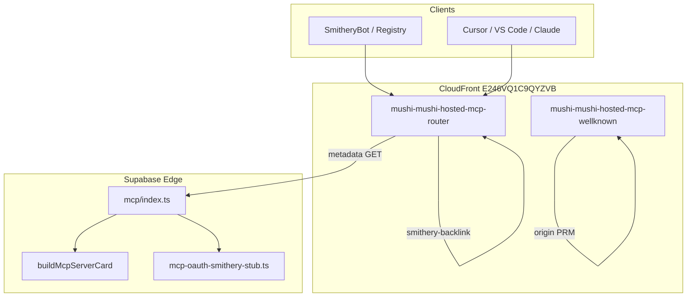

# Hosted MCP on kensaur.us — Smithery implementation guide

> **Audience:** Maintainers shipping or debugging the Streamable HTTP MCP proxy at
> `https://kensaur.us/mushi-mushi/hosted-mcp/` and the Smithery registry listing
> [`kensaurus/mushi-mushi`](https://smithery.ai/servers/kensaurus/mushi-mushi).

**Pre-documentation check (verified against code on branch `sdk-robustness-followup`):**

- Existing docs read: `docs/marketing/SMITHERY-VERIFICATION.md`, `smithery-external-publish.json`, `scripts/verify-hosted-mcp.mjs`
- Pattern: marketing ops docs under `docs/marketing/` + runnable smoke scripts under `scripts/`
- Code verified: CloudFront router/wellknown functions, Supabase `mcp` edge function OAuth stubs, `mcp-server-card.ts`, deploy workflows

---

## 1. What this system does

Mushi exposes a **hosted Streamable HTTP MCP** endpoint on the public product domain
(`kensaur.us`), not the raw Supabase URL. Smithery (and other directory clients) probe
OAuth metadata, server cards, and JSON-RPC tools through that canonical URL.

| Surface | URL |
|---------|-----|
| **Public MCP (canonical)** | `https://kensaur.us/mushi-mushi/hosted-mcp/` |
| **Supabase origin (internal)** | `https://dxptnwrhwsqckaftyymj.supabase.co/functions/v1/mcp` |
| **Smithery registry** | `https://smithery.ai/servers/kensaurus/mushi-mushi` |
| **Verification backlink page** | `https://kensaur.us/mushi-mushi/hosted-mcp/smithery-backlink` |
| **Origin RFC 9728 PRM** | `https://kensaur.us/.well-known/oauth-protected-resource/mushi-mushi/hosted-mcp` |

Real user auth remains **API key** (`x-mushi-api-key` / session config). OAuth endpoints
exist only so Smithery’s publisher scan and RFC 8414 discovery succeed.

---

## 2. Architecture



### Request routing (CloudFront Function)

File: `scripts/cloudfront-mushi-hosted-mcp-router.js`

| Path (under `/mushi-mushi/hosted-mcp`) | Handler |
|----------------------------------------|---------|
| `/smithery-backlink` | Synthetic HTML with `<a href="smithery.ai/servers/...">` |
| `/oauth/authorize` (GET) | 302 redirect to `smithery.run/oauth/callback?code=…` |
| `/.well-known/oauth-authorization-server` | Forward → Supabase `mcp` |
| `/.well-known/openid-configuration` | Forward → Supabase `mcp` |
| `/.well-known/mcp/server-card.json` | Forward → Supabase `mcp` |
| `/` (GET, no SSE Accept) | Forward → Supabase PRM |
| POST / JSON-RPC | Forward → Supabase `mcp` |

**Why authorize runs at the edge:** The CloudFront origin request policy
(`UserAgentRefererHeaders`) does not forward query strings to Supabase. Smithery sends
URL-encoded `redirect_uri`; without edge handling, authorize returned `400 invalid_redirect_uri`.

**Why metadata runs on Supabase:** CloudFront Functions cannot attach bodies to synthetic
HEAD responses. Smithery HEADs AS metadata; Supabase returns JSON with a body.

Origin PRM at apex well-known path is served by a **separate** function:
`scripts/cloudfront-mushi-hosted-mcp-wellknown.js` on cache behavior
`/.well-known/oauth-protected-resource/mushi-mushi/hosted-mcp*`.

---

## 3. Supabase `mcp` edge function

File: `packages/server/supabase/functions/mcp/index.ts`

### Environment

| Variable | Purpose |
|----------|---------|
| `MCP_PUBLIC_BASE_URL` | Must be `https://kensaur.us/mushi-mushi/hosted-mcp` (no trailing slash required; code normalizes). Drives issuer URLs in OAuth metadata. |

Set via Supabase dashboard or CLI secrets; redeploy `mcp` after changes.

### OAuth / discovery (Smithery publisher scan)

| Endpoint | Method | Behavior |
|----------|--------|----------|
| `/.well-known/oauth-authorization-server` | GET/HEAD | RFC 8414 AS metadata |
| `/.well-known/openid-configuration` | GET/HEAD | Same AS document (OIDC fallback) |
| `/.well-known/mcp/server-card.json` | GET/HEAD | Static tool catalog (SEP-1649) |
| `/oauth/authorize` | GET | 302 to Smithery callback (also handled at CF edge) |
| `/oauth/token` | POST | Stub token for scan |
| `/oauth/register` | POST | RFC 7591 DCR → `201` + `client_id` |
| `/oauth/register` | GET | `405` (must not return PRM) |

Implementation modules:

- `packages/server/supabase/functions/_shared/mcp-oauth-metadata.ts` — PRM + AS JSON
- `packages/server/supabase/functions/_shared/mcp-oauth-smithery-stub.ts` — authorize/token stubs
- `packages/server/supabase/functions/_shared/mcp-server-card.ts` — server card builder

### Auth behavior for real traffic

- **SmitheryBot** (`User-Agent: SmitheryBot/1.0`) — allowed through initialize scan paths per existing handler logic.
- **Unauthenticated POST** — must return **`401`** with `WWW-Authenticate: Bearer resource_metadata="…"` pointing at kensaur.us PRM (not `403`).
- **Authenticated tools** — `x-mushi-api-key` (+ optional `x-mushi-project-id`).

Deploy:

```bash
cd packages/server
npx supabase functions deploy mcp --project-ref dxptnwrhwsqckaftyymj --no-verify-jwt
```

---

## 4. Server card (quality score + directory metadata)

File: `packages/server/supabase/functions/_shared/mcp-server-card.ts`

Built from `packages/server/supabase/functions/mcp/hosted-tool-manifest.json`:

- One entry per hosted tool (name, description, `inputSchema` from `required[]`)
- `serverInfo`: name, version, description, homepage, repository, license
- `configSchema`: API key + optional project ID (matches Smithery Connect UI)
- `links.smithery`: registry URL for crawlers

After editing the manifest or card builder, redeploy `mcp` and republish on Smithery.

---

## 5. AWS / CloudFront wiring

Provisioner: `scripts/aws-setup-hosted-mcp.mjs` (idempotent).

Creates/updates:

1. Custom origin `supabase-hosted-mcp` → `dxptnwrhwsqckaftyymj.supabase.co/functions/v1/mcp`
2. Cache behavior `/mushi-mushi/hosted-mcp*` → that origin + router function
3. Cache behavior `/.well-known/oauth-protected-resource/mushi-mushi/hosted-mcp*` → wellknown function

Runs automatically in **Deploy Admin Console** workflow (`Setup hosted MCP proxy` step).

Manual run (requires AWS credentials with CloudFront + S3):

```bash
node scripts/aws-setup-hosted-mcp.mjs
```

Distribution ID default: `E246VQ1C9QYZVB` (override with `CLOUDFRONT_DISTRIBUTION_ID`).

---

## 6. Smithery registry operations

### Publish (non-interactive)

```bash
npx @smithery/cli mcp publish "https://kensaur.us/mushi-mushi/hosted-mcp/" \
  -n kensaurus/mushi-mushi \
  --config-schema docs/marketing/smithery-config-schema.json
```

Always pass `-n kensaurus/mushi-mushi`. Bare `publish --resume` prompts for server name interactively.

### Resume after code/metadata changes

```bash
npx @smithery/cli mcp publish --resume -n kensaurus/mushi-mushi
```

### Smithery UI settings (General)

| Field | Recommended value |
|-------|-------------------|
| Homepage | `https://kensaur.us/mushi-mushi/hosted-mcp/smithery-backlink` |
| Repository | `https://github.com/kensaurus/mushi-mushi` |
| Description | Product one-liner + “55+ MCP tools”, hosted URL, MIT/self-host note |

Config schema reference: `docs/marketing/smithery-config-schema.json` and
`docs/marketing/smithery-external-publish.json`.

---

## 7. Verification checklist (Smithery Settings → Verification)

| Check | How we satisfy it | Owner |
|-------|-------------------|-------|
| Successful release | `mcp publish` + scan SUCCESS | CI / maintainer |
| Quality score ≥ 80 | Full server card, repo/homepage, successful scan | Auto after metadata deploy |
| Homepage set | Smithery General → homepage URL | Maintainer |
| TXT on `kensaur.us` | DNS TXT record (see below) | **DNS registrar** |
| Link to Smithery | Backlink HTML + README badge | Repo + CF function |
| Paid developer plan | Smithery billing | **Org admin** |

### DNS TXT (copy token from Smithery UI if rotated)

Current token (Jun 2026):

```
smithery-verification=dfb77b92dd51ab706f377b2e05d24ea0952c8346cd167800078abdd9b157aecd
```

Add as an **additional** TXT on `kensaur.us` (keep `google-site-verification=…` and others).

Verify:

```bash
nslookup -type=TXT kensaur.us 8.8.8.8
```

Ops quick reference: [`SMITHERY-VERIFICATION.md`](./SMITHERY-VERIFICATION.md).

---

## 8. Smoke tests (run before/after deploy)

### Full hosted MCP + OAuth

```bash
node scripts/verify-hosted-mcp.mjs
```

Checks: PRM, AS metadata, server-card, SmitheryBot initialize, 401+PRM hint, authorize 302,
token exchange, DCR register.

### Backlink + card only

```bash
node scripts/smithery-verification-check.mjs
```

### CloudFront function unit tests

```bash
node --test scripts/cloudfront-functions.test.mjs
```

---

## 9. Troubleshooting

| Symptom | Likely cause | Fix |
|---------|--------------|-----|
| `issuer must be a string` on Smithery | AS/PRM served without JSON body on HEAD | Ensure metadata hits Supabase, not synthetic CF-only response |
| `invalid_redirect_uri` on authorize | Query string not reaching origin | Use edge `/oauth/authorize` in router; URL-decode `redirect_uri` |
| `403` on scan | WAF/bot block or wrong status code | Return **401** for unauth POST; allow `SmitheryBot/1.0` |
| Quality score stuck at 70 | TXT missing or scan before card deploy | Add DNS TXT; redeploy `mcp`; republish |
| `publish --resume` hangs | Missing `-n` flag | Use `-n kensaurus/mushi-mushi` |
| Tools count mismatch (55 vs 80) | Card = manifest count; live scan = full MCP | Expected; both are valid surfaces |

---

## 10. File index

| File | Role |
|------|------|
| `scripts/cloudfront-mushi-hosted-mcp-router.js` | Edge routing, backlink, OAuth authorize |
| `scripts/cloudfront-mushi-hosted-mcp-wellknown.js` | Origin PRM JSON |
| `scripts/aws-setup-hosted-mcp.mjs` | CloudFront behaviors + function publish |
| `scripts/verify-hosted-mcp.mjs` | End-to-end smoke test |
| `scripts/smithery-verification-check.mjs` | Backlink + TXT + card preflight |
| `scripts/hosted-mcp-oauth-metadata.json` | Canonical AS/PRM field reference |
| `packages/server/supabase/functions/mcp/index.ts` | Streamable HTTP transport + OAuth routes |
| `packages/server/supabase/functions/_shared/mcp-server-card.ts` | Server card generator |
| `packages/server/supabase/functions/_shared/mcp-oauth-smithery-stub.ts` | Authorize/token stubs |
| `docs/marketing/smithery-external-publish.json` | Publish URL + config schema snapshot |
| `.github/workflows/deploy-admin.yml` | Deploys CF functions + runs verify (with retries) |

---

## 11. Related docs

- [Smithery publish docs](https://smithery.ai/docs/build/publish)
- [MCP Streamable HTTP spec](https://modelcontextprotocol.io/specification/2025-03-26/basic/transports)
- [RFC 9728 Protected Resource Metadata](https://www.rfc-editor.org/rfc/rfc9728.html)
- Mushi quickstart: `apps/docs/content/quickstart/mcp.mdx`
