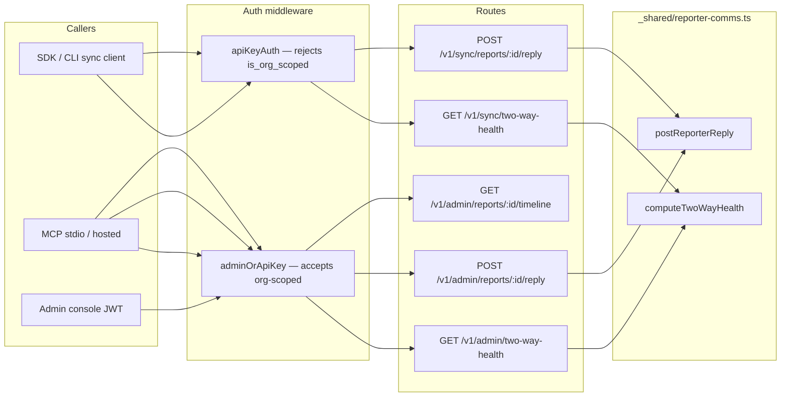

# Reporter two-way comms + MCP org-scoped keys (Jun 24 2026)

**Audience:** Operators triaging from Cursor/Claude MCP, CLI, or the admin console.  
**Trigger:** Glot-It ↔ Mushi pipeline red-team — reporter-comms MCP tools failed for org-scoped keys; duplicate `mushi` entries in multi-workspace Cursor setups masked the fix.

**Related audits:**

- [`docs/audit-2026-06-23/mushi-pipeline-operator-surfaces.md`](../audit-2026-06-23/mushi-pipeline-operator-surfaces.md) — per-surface verification + H4/H5 defect write-up
- [`docs/operators/mcp-multi-project.md`](./mcp-multi-project.md) — how to wire one global MCP entry for many host repos

---

## What shipped

| Layer | Change | Why |
|-------|--------|-----|
| **Shared logic** | `_shared/reporter-comms.ts` — `postReporterReply()`, `computeTwoWayHealth()` | One implementation for SDK sync routes and admin/MCP routes |
| **Admin API** | `POST /v1/admin/reports/:id/reply`, `GET /v1/admin/two-way-health` | Org-scoped MCP keys are accepted (`adminOrApiKey`) |
| **Sync API** | `POST /v1/sync/reports/:id/reply`, `GET /v1/sync/two-way-health` | Unchanged behavior; still `apiKeyAuth` (project-scoped keys only) |
| **MCP stdio** | `packages/mcp/src/server.ts` — three tools repointed to `/v1/admin/...` | Local IDE MCP uses admin routes |
| **MCP hosted** | `hosted-tool-manifest.json` — same path updates | HTTP MCP at `/functions/v1/mcp` |
| **CLI guard** | `project-bootstrap.ts` — skip workspace `mcp.json` when global `mushi` exists | Prevents duplicate Cursor MCP servers |

---

## Architecture — sync vs admin routes

Reporter two-way communication is an **operator action**, not SDK ingest. The API enforces that at the middleware layer:



### Why org-scoped keys hit `ORG_KEY_NOT_ALLOWED` before the fix

`apiKeyAuth` explicitly rejects org-scoped keys on every `/v1/sync/*` path:

```typescript
// packages/server/supabase/functions/_shared/auth.ts
if (keyRow.is_org_scoped) {
  return c.json(
    { error: { code: 'ORG_KEY_NOT_ALLOWED', message: 'Org-scoped keys cannot be used for SDK ingest. Use a project-scoped key.' } },
    403,
  )
}
```

The three MCP tools (`get_report_timeline`, `reply_to_reporter`, `get_two_way_comms_health`) previously called `/v1/sync/*`. Org-scoped keys — the **intended** key type for multi-project MCP — were rejected even though the operations are admin/triage, not ingest.

**Fix:** MCP tools now call `/v1/admin/*` twins behind `adminOrApiKey()`. Sync routes still use `apiKeyAuth` for project-scoped SDK/CLI clients.

---

## API reference (admin routes)

All routes require `X-Mushi-Api-Key` or `Authorization: Bearer mushi_…` with `mcp:read` (read) or `mcp:write` (reply).

| Route | Auth | Scope | Body / query |
|-------|------|-------|----------------|
| `GET /v1/admin/reports/:id/timeline` | `adminOrApiKey()` | `mcp:read` | Report must be in caller's project scope |
| `POST /v1/admin/reports/:id/reply` | `adminOrApiKey({ scope: 'mcp:write' })` | `mcp:write` | `{ "message": string, "author_name"?: string }` |
| `GET /v1/admin/two-way-health` | `adminOrApiKey()` | `mcp:read` | `?project_id=<uuid>` required when caller has **multiple** projects |

### `POST /v1/admin/reports/:id/reply`

Posts an admin comment visible in the reporter widget and fires a `comment_reply` notification.

| Field | Type | Required | Notes |
|-------|------|----------|-------|
| `message` | string | Yes | 1–10,000 chars |
| `author_name` | string | No | Default `"Mushi Admin"`; max 100 chars |

**Success (201):**

```json
{
  "ok": true,
  "data": {
    "comment": {
      "id": "…",
      "author_kind": "admin",
      "author_name": "Mushi Admin",
      "body": "We shipped a fix — please retest.",
      "visible_to_reporter": true,
      "created_at": "2026-06-24T00:00:00.000Z"
    }
  }
}
```

**Errors:** `404 NOT_FOUND` (report outside scope), `422 VALIDATION_ERROR` (empty message), `500 MISCONFIGURED` (project has no `owner_id`).

### `GET /v1/admin/two-way-health`

Single-project snapshot. Org-scoped keys with access to multiple projects **must** pass `project_id` (or pin `MUSHI_PROJECT_ID` in MCP env).

| Field | Type | Meaning |
|-------|------|---------|
| `last_sdk_heartbeat_at` | string \| null | Latest `project_api_keys.last_seen_at` |
| `last_sdk_user_agent` | string \| null | UA from that heartbeat |
| `unread_admin_replies` | number | Unread `reporter_notifications` (no per-comment read flag exists) |
| `admin_replies_7d` | number | Admin comments in the last 7 days |
| `healthy` | boolean | `true` when a heartbeat exists |

**Note:** `unread_admin_replies` counts all unread reporter notifications, not strictly admin replies. Field name is legacy; behavior matches the original sync route.

---

## MCP tools (stdio + hosted)

| Tool | Route | `project_id` arg | Scope |
|------|-------|------------------|-------|
| `get_report_timeline` | `GET /v1/admin/reports/{reportId}/timeline` | Optional* | `mcp:read` |
| `reply_to_reporter` | `POST /v1/admin/reports/{reportId}/reply` | Optional* | `mcp:write` |
| `get_two_way_comms_health` | `GET /v1/admin/two-way-health` | Optional* | `mcp:read` |

\* **Org-scoped key without `MUSHI_PROJECT_ID`:** pass `project_id` on each call when you have multiple projects. Single-project org keys auto-resolve; multi-project keys throw `PROJECT_ID_REQUIRED` with a named list.

### Example (account-mode org key)

```json
{
  "name": "get_report_timeline",
  "arguments": {
    "reportId": "301f46e7-6748-4848-8463-4c1f044714e4",
    "project_id": "542b34e0-019e-41fe-b900-7b637717bb86"
  }
}
```

The MCP server sets `X-Mushi-Project-Id` from `projectScopeHeaders(args.project_id)`.

---

## Cursor MCP config — one global entry (H5)

### Problem

When multiple host repos (glot.it, yen-yen, the-wanting-mind, help-her-take-photo) each had:

```json
{
  "mcpServers": {
    "mushi": {
      "command": "npx",
      "args": ["-y", "@mushi-mushi/mcp@latest"],
      "env": { "MUSHI_PROJECT_ID": "<that-repo's uuid>", … }
    }
  }
}
```

Cursor loaded **multiple** `mushi` servers. Workspace entries shadowed the global dev dist and pinned an npm version that still called `/v1/sync/*` → `ORG_KEY_NOT_ALLOWED` for org-scoped keys.

### Recommended layout

| File | Contents |
|------|----------|
| `~/.cursor/mcp.json` | **One** `mushi` entry — org-scoped `mcp:write` key, optional local `dist/index.js` for dev |
| `<repo>/.cursor/mcp.json` | `{ "mcpServers": {} }` + comment with that repo's `project_id` hint |

**Do not** duplicate the bare key `mushi` in workspace files when a global entry exists.

### Global example (org-scoped, multi-project)

```json
{
  "mcpServers": {
    "mushi": {
      "command": "node",
      "args": ["C:/Users/you/Documents/GitHub/mushi-mushi/packages/mcp/dist/index.js"],
      "env": {
        "MUSHI_API_ENDPOINT": "https://<ref>.supabase.co/functions/v1/api",
        "MUSHI_API_KEY": "mushi_<org-scoped-mcp-write-key>",
        "MUSHI_FEATURES": "triage,fixes,inventory,setup,docs"
      }
    }
  }
}
```

Omit `MUSHI_PROJECT_ID` — pass `project_id` per tool call.

### Workspace example (empty, with hint)

```json
{
  "_comment": "Mushi MCP is in ~/.cursor/mcp.json. Pass project_id=542b34e0-019e-41fe-b900-7b637717bb86 for glot.it.",
  "mcpServers": {}
}
```

### CLI guard (`mushi project create`)

Since Jun 24 2026, `writeProjectBootstrapFiles()` checks `~/.cursor/mcp.json` before writing. If a global `mushi` entry exists, workspace `.cursor/mcp.json` is **skipped** and the CLI prints:

```
--  Skipped .cursor/mcp.json — global ~/.cursor/mcp.json already has a "mushi" entry.
    Your org-scoped key covers this project. Pass project_id=<uuid> on tool calls.
```

`mushi connect` uses `mushi-<id-prefix>` server names (non-legacy) — no conflict with global `mushi`.

### After changing MCP config

1. **Fully restart Cursor** (not just toggle MCP) when removing duplicate workspace entries.
2. Rebuild local dist after MCP source changes: `pnpm --filter @mushi-mushi/mcp build`.
3. Redeploy edge functions after API changes: `api` + `mcp` functions.

---

## Verification checklist

### Backend (curl, org-scoped key)

```bash
EP="https://<ref>.supabase.co/functions/v1/api"
KEY="mushi_<org-scoped-key>"
PID="542b34e0-019e-41fe-b900-7b637717bb86"
RID="301f46e7-6748-4848-8463-4c1f044714e4"

# Timeline — expect 200
curl -s -o /dev/null -w "%{http_code}\n" \
  -H "X-Mushi-Api-Key: $KEY" \
  -H "X-Mushi-Project-Id: $PID" \
  "$EP/v1/admin/reports/$RID/timeline"

# Two-way health — expect 200
curl -s -o /dev/null -w "%{http_code}\n" \
  -H "X-Mushi-Api-Key: $KEY" \
  "$EP/v1/admin/two-way-health?project_id=$PID"

# Health without project_id on multi-project org key — expect 400
curl -s -o /dev/null -w "%{http_code}\n" \
  -H "X-Mushi-Api-Key: $KEY" \
  "$EP/v1/admin/two-way-health"
```

### MCP (Cursor, after restart)

| Tool | Expected |
|------|----------|
| `get_report_timeline` + `project_id` | Timeline JSON, no `ORG_KEY_NOT_ALLOWED` |
| `get_two_way_comms_health` + `project_id` | Health snapshot |
| `reply_to_reporter` + `project_id` + `message` | 201 + comment (use a test report; clean up if needed) |

### Operator surfaces (pipeline)

| Surface | Smoke test |
|---------|------------|
| Console | Report visible; timeline tab loads |
| Slack | `report.created` / triage posts; `slack_message_ts` set |
| MCP | Above three tools with org key |
| CLI | `mushi reports list`, `mushi reports triage <id>` |

---

## Deployment

| Artifact | Deploy command | When |
|----------|----------------|------|
| `api` edge function | `npx supabase functions deploy api --no-verify-jwt` | After `reports.ts` / `reporter-comms.ts` changes |
| `mcp` edge function | `npx supabase functions deploy mcp --no-verify-jwt` | After `hosted-tool-manifest.json` changes |
| `@mushi-mushi/mcp` npm | Changesets + `release.yml` | When publishing MCP package with admin-route repoint |

Local stdio MCP picks up fixes from `packages/mcp/dist/index.js` after `pnpm --filter @mushi-mushi/mcp build` + Cursor restart.

---

## Files map

| File | Role |
|------|------|
| `packages/server/supabase/functions/_shared/reporter-comms.ts` | Shared reply + health logic |
| `packages/server/supabase/functions/api/routes/sync.ts` | SDK/CLI sync routes (`apiKeyAuth`) |
| `packages/server/supabase/functions/api/routes/reports.ts` | Admin routes (`adminOrApiKey`) |
| `packages/server/supabase/functions/_shared/auth.ts` | `apiKeyAuth` vs `adminOrApiKey` |
| `packages/mcp/src/server.ts` | Stdio tool → route mapping |
| `packages/server/supabase/functions/_shared/mcp-hosted-tool-manifest.json` | Hosted HTTP tool → route mapping |
| `packages/cli/src/project-bootstrap.ts` | Global MCP conflict guard |
| `packages/cli/src/mcp-config.ts` | `buildMcpServerName`, `@latest` pin |

---

## Gotchas

| Symptom | Cause | Fix |
|---------|-------|-----|
| `ORG_KEY_NOT_ALLOWED` on MCP tools | Old npm `@mushi-mushi/mcp` or workspace entry calling `/v1/sync/*` | Clear workspace `mcp.json`; use global entry or publish new MCP version |
| `ORG_KEY_NOT_ALLOWED` after toggle | Stale workspace MCP process still running | Full Cursor restart |
| `PROJECT_REQUIRED` on two-way-health | Org key, multiple projects, no `project_id` | Pass `project_id` query param or tool arg |
| Multiple `mushi` in Cursor MCP panel | Per-repo `.cursor/mcp.json` duplicates | Empty workspace files; one global entry |
| `mushi project create` didn't write mcp.json | Global `mushi` already exists | Intentional — use global key + `project_id` |
