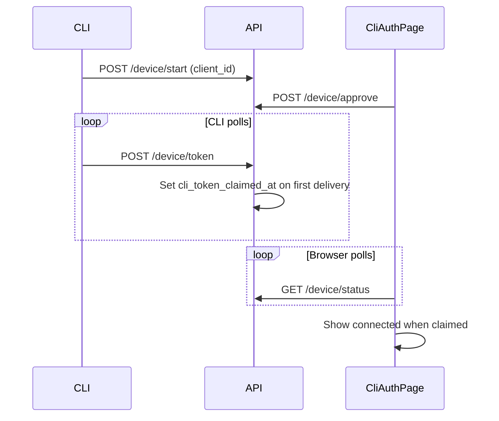

# SDK reliability overhaul (Jul 2026)

**Audience:** Operators deploying edge functions, migrations, and npm SDK patches
for the CLI auth + runtime config + backend hardening rollout.

**Trigger:** Browser shows CLI approved but terminal never continues; host banner
vanishes after console save; report-ingest rate limits silently broken; MCP write
scope bypass via spoofed scanner UA.

**Related:**

- [SDK runtime config merge](../SDK_RUNTIME_CONFIG.md) — precedence rules
- [CLI ↔ console loop (public)](https://kensaur.us/mushi-mushi/docs/quickstart/cli-console-loop)
- [Reporter comms + MCP setup](./reporter-comms-and-mcp-setup.md)

---

## What shipped

| Layer | Change | Why | Verify |
| --- | --- | --- | --- |
| **CLI auth** | Two-phase token claim (`cli_token_claimed_at`), per-machine `client_id`, IP rate limits on `/device/start` and `/device/token` | Fixes RFC 8628 “browser success, terminal stuck” | Approve in browser; terminal resumes; `GET /device/status` shows claimed |
| **CLI auth UI** | `CliAuthPage` polls until CLI claims token; stale-tab help after 45s | Page no longer declares success before terminal has token | Approve → brief waiting → connected |
| **CLI client** | `client_id` in config; 429/408 retried during token poll; whoami before re-init | Same-machine supersede; transient rate limits | Two terminals: newest wins |
| **SDK config** | `_shared/sdk-config.ts` single normalizer | Split-brain between admin + runtime endpoints | Toggle reporter notifications in console → live SDK matches |
| **Runtime merge** | `runtime-merge.ts` + explicit-only server emission | Host banner/capture no longer clobbered | Host `trigger: 'banner'` survives untouched console row |
| **Widget UX** | Draft persistence; capture availability + inline errors | Reporters don't lose typed text; dead buttons hidden | Type description → trigger re-render → text remains |
| **Idempotency RLS** | Drop `"members read own project"` on `request_idempotency` | Viewers could read cached API key rotate responses | Rotate as admin; viewer cannot SELECT cached body |
| **Rate limits** | Drop FK on `scoped_rate_limits.user_id` | FK blocked IP-derived actor IDs; ingest limits silently no-op | Submit reports under rate limit; CLI auth IP limit fires |
| **MCP security** | JWT validated via GoTrue before `mcp:write`; Smithery scanner requires bearer (read-only cap) | Spoofed UA could not grant write | Hosted MCP write tools reject unsigned JWT |
| **MCP manifest** | Canonical `_shared/mcp-hosted-tool-manifest.json`; `refresh_ci` → `mcp:write` | Stale duplicate manifest drift | `check-catalog-sync.mjs` passes |
| **Health** | `GET /health/ready` probes DB | Smoke tests catch degraded deploy | `scripts/smoke-prod-flow.mjs` |
| **LLM failover** | Transient retry with backoff before key rotation | Fewer false key-rotation storms on 429/5xx | Deno tests in `_shared/llm-failover.test.ts` |
| **GitHub API** | `fetchGhWithRetry` for 429/5xx | PR workers survive transient GitHub limits | fix-worker / sdk-upgrade-worker logs |
| **Webhooks** | Audit + IP rate limit + 24h replay cache on Slack/GitHub inbound | Replay and flood protection | Duplicate `trigger_id` / delivery ID ignored |
| **Admin UI** | Shared `runStatusChipTone()` across pages | One status → tone mapping | Visual pass only — no runtime effect |

---

## Architecture — CLI two-phase claim



Token re-delivery grace: 60s (`TOKEN_REDELIVERY_GRACE_MS` in
`_shared/cli-auth-helpers.ts`) allows the same device poll to recover after a
transient blip without minting a new code.

---

## Deploy checklist

Apply in order. **Migrations before edge functions** that depend on new columns
or policies.

### 1. Database migrations

```bash
cd packages/server
supabase db push
```

| Migration | Purpose |
| --- | --- |
| `20260702015655_cli_auth_two_phase_claim.sql` | `cli_token_claimed_at`, `client_id` on `cli_auth_requests`; hardened expiry cron |
| `20260702034746_request_idempotency_restrict_member_read.sql` | Drop member read RLS on `request_idempotency` |
| `20260702035407_scoped_rate_limits_generalize_actor.sql` | Drop `scoped_rate_limits.user_id` FK for IP-derived actors |

Verify:

```sql
-- cli auth columns
SELECT column_name FROM information_schema.columns
WHERE table_name = 'cli_auth_requests'
  AND column_name IN ('cli_token_claimed_at', 'client_id');

-- idempotency policy gone
SELECT policyname FROM pg_policies
WHERE tablename = 'request_idempotency' AND policyname = 'members read own project';
-- expect 0 rows

-- rate limit FK gone
SELECT conname FROM pg_constraint
WHERE conrelid = 'scoped_rate_limits'::regclass AND conname LIKE '%user_id%';
-- expect 0 rows
```

Check `get_advisors` for new ERROR-level findings after push.

### 2. Edge functions

Deploy at minimum:

```bash
supabase functions deploy api --no-verify-jwt
supabase functions deploy mcp --no-verify-jwt
```

If webhook middleware changed in this branch, also deploy:

```bash
supabase functions deploy slack-interactions --no-verify-jwt
supabase functions deploy webhooks-github-indexer --no-verify-jwt
```

### 3. Admin console + docs (optional same release)

- Admin SPA: push `apps/admin/**` → `deploy-admin.yml`
- Docs site: push `apps/docs/**` → `deploy-docs.yml`

### 4. npm SDK (Changesets)

Changeset: `.changeset/mushi-sdk-reliability-overhaul.md` bumps
`@mushi-mushi/cli` and `@mushi-mushi/web` patch. Follow
[DEPLOYMENT.md §1](../DEPLOYMENT.md) for version PR + `release.yml` dispatch.

Host apps should upgrade `@mushi-mushi/web` to pick up runtime merge and widget
draft fixes. CLI upgrade: `npm i -g @mushi-mushi/cli@latest`.

### 5. Smoke tests

```bash
# From repo root (requires env)
node scripts/smoke-prod-flow.mjs
```

Manual:

1. `npx mushi-mushi` → approve in browser → terminal reaches project picker
2. Host with `widget: { trigger: 'banner' }` → banner visible after console save
3. `GET /health/ready` → 200 when DB reachable

---

## Rollback notes

- **CLI auth migration:** Rolling back drops `client_id` / `cli_token_claimed_at`;
  old CLI versions still work but lose two-phase claim protection.
- **Idempotency RLS:** Re-adding member read policy re-exposes cached rotate
  responses to project viewers — do not rollback without accepting that risk.
- **Rate limit FK:** Re-adding FK breaks IP-based CLI auth limits again.

---

## Related docs

- [DEPLOYMENT.md](../DEPLOYMENT.md) — full maintainer runbook
- [SDK_RUNTIME_CONFIG.md](../SDK_RUNTIME_CONFIG.md) — merge precedence
- [AGENTS.md](../../AGENTS.md) — agent inventory appendix
