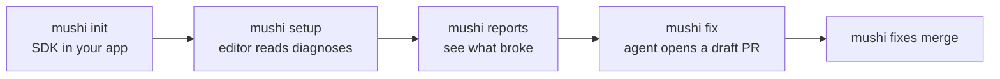

# @mushi-mushi/cli

> **Your AI wrote it. Mushi tells you why it broke.**

The `mushi` command for [Mushi Mushi](https://github.com/kensaurus/mushi-mushi). Install the SDK in your app, connect your editor, then read bugs, dispatch fixes and merge them without leaving the terminal.



## Quick start

```bash
npx mushi-mushi                      # the SDK wizard (same as: npx @mushi-mushi/cli init)
npx mushi-mushi setup --ide cursor   # connect your editor: cursor, claude, continue or zed
npm install -g @mushi-mushi/cli      # optional: a global `mushi` command
```

The wizard detects your framework and package manager, checks your credentials, installs the right SDK, writes framework-prefixed env vars (`NEXT_PUBLIC_`, `VITE_`, `EXPO_PUBLIC_`…) to `.env.local`, prints the snippet to paste, and offers to send a test report. It never overwrites an existing env var or edits your code.

**Credentials** come from the [console](https://kensaur.us/mushi-mushi/admin): the **project ID** is on the Projects page; the **API key** is under **Setup → Verify → Generate API key** (`report:write`), not the AI keys in Settings. No project yet? The wizard can open the console for you.

For your editor, `mushi setup` writes the hosted MCP entry by default: the editor opens a browser sign-in on first use and no key is stored on disk. Add `--stdio` for a local server instead.

## Commands

| Group | Commands |
| --- | --- |
| Set up | `init`, `login`, `setup`, `connect`, `doctor`, `upgrade`, `nudge`, `completion` |
| Bugs | `reports list/show/search/triage`, `lessons list/show` |
| Fixes | `fix <reportId>`, `fixes tail/merge/refresh-ci` |
| Ship | `sourcemaps upload`, `deploy check`, `migrate`, `audit` |
| Test and UX | `qa stories/runs/run`, `tdd gen/pending/approve/improve`, `stories map`, `ux` |
| Account | `whoami`, `status`, `usage`, `billing`, `keys`, `integrations`, `slack` |

`mushi --help` and `mushi <command> --help` list every command and flag.

## Common tasks

```bash
mushi doctor --fix                                  # check SDK, ingest and dispatch; fix what's safe locally
mushi reports list --status new --severity critical # what broke
mushi fix <reportId> --wait                         # an agent opens a draft PR for it
mushi fixes merge <fixId>                           # merge it and mark the report Fixed
mushi upgrade                                       # bump @mushi-mushi/* to the latest stable
mushi upgrade --check                               # CI: exit 0 current, 1 outdated, 2 registry down
mushi sourcemaps upload --release "$GITHUB_SHA" --dir ./dist
mushi ux ui                                         # the local UX studio (see @mushi-mushi/ux)
```

**In CI or scripts**, skip the prompts:

```bash
mushi init --yes --project-id <uuid> --api-key mushi_xxx --skip-test-report
MUSHI_API_KEY=mushi_xxx mushi connect --project-id <uuid> --endpoint <url> --wait   # wire a repo, wait for the first SDK heartbeat
```

Other `init` flags: `--framework next`, `--cwd apps/web` (monorepos), `--endpoint <url>` (self-hosted), `--skip-install`.

## Environment variables

| Variable | Purpose |
| --- | --- |
| `MUSHI_API_KEY` | API key. Prefer it over `--api-key`, which shows up in `ps` |
| `MUSHI_PROJECT_ID` | Project UUID |
| `MUSHI_API_ENDPOINT` | API base URL (defaults to Mushi Cloud) |
| `MUSHI_CONSOLE_URL` | Console base for links and browser opens |
| `MUSHI_BYOK_KEY` | Key for `mushi keys add`, kept out of shell history |
| `MUSHI_NO_UPDATE_CHECK=1` | Skip the "newer version" hint |
| `MUSHI_DEBUG=1` | Full stack traces on error |

Config lives in `~/.config/mushi/config.json`, written with mode `0o600` (a legacy `~/.mushirc` is auto-migrated). `--endpoint` must be `https://` except on localhost.

## Programmatic use

| Import | Exports |
| --- | --- |
| `@mushi-mushi/cli/init` | `runInit`, `InitOptions` |
| `@mushi-mushi/cli/detect` | Framework and package-manager detection |
| `@mushi-mushi/cli/version` | `MUSHI_CLI_VERSION` |

## Learn more

[CLI reference](https://kensaur.us/mushi-mushi/docs/sdks/cli) · [CLI and console loop](https://kensaur.us/mushi-mushi/docs/quickstart/cli-console-loop) · [MCP setup](https://kensaur.us/mushi-mushi/docs/quickstart/mcp)

## License

MIT
