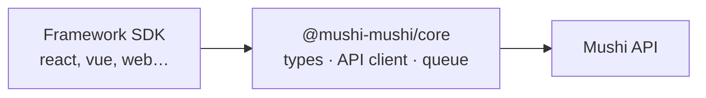

# @mushi-mushi/core

> **Your AI wrote it. Mushi tells you why it broke.**

The shared types, API client and utilities under every [Mushi Mushi](https://github.com/kensaurus/mushi-mushi) SDK.

**You probably don't need to install this directly.** Run `npx mushi-mushi` and the wizard installs the SDK for your framework ([`react`](https://npmjs.com/package/@mushi-mushi/react), [`vue`](https://npmjs.com/package/@mushi-mushi/vue), [`svelte`](https://npmjs.com/package/@mushi-mushi/svelte), [`angular`](https://npmjs.com/package/@mushi-mushi/angular), [`react-native`](https://npmjs.com/package/@mushi-mushi/react-native), [`capacitor`](https://npmjs.com/package/@mushi-mushi/capacitor) or [`web`](https://npmjs.com/package/@mushi-mushi/web)), which depends on this one. Reach for `core` when you build your own adapter or need the types.



## What's inside

| Piece | What it does |
| --- | --- |
| Types | `MushiConfig`, `MushiReport`, `MushiEnvironment` and every shared interface |
| API client (`createApiClient`) | Fetch with retry and backoff. Tags its own requests with `X-Mushi-Internal` so SDKs never report on Mushi |
| Pre-filter (`createPreFilter`) | On-device spam and gibberish filter, before anything is sent |
| Offline queue (`createOfflineQueue`) | IndexedDB queue that syncs on reconnect |
| Environment (`captureEnvironment`) | Viewport, user agent and client hints, connection, accessibility preferences, page-load timing |
| Identity | Anonymous reporter token (`getReporterToken`) and tab-scoped session id (`getSessionId`) |
| Rate limiter (`createRateLimiter`) | Token bucket that stops an SDK flooding the API |
| Breadcrumbs (`createBreadcrumbBuffer`) | 50-entry ring of recent events, in Sentry's breadcrumb shape |
| Errors (`normaliseThrown`) | Turns any thrown value into `{ name, message, stack?, cause? }` |

## Presets

Pass `preset` instead of setting every `widget`, `capture` and `proactive` flag. Your explicit config always wins, key by key.

| | `minimal` | `standard` | `full` |
| --- | --- | --- | --- |
| Console capture | on | SDK default | on |
| Network and performance | off | SDK default | on |
| Screenshot | on report | SDK default | automatic |
| Session replay | off | SDK default | `lite` |
| Proactive prompts | none | SDK default | all on |

The postures `production-calm`, `beta-loud`, `internal-debug` and `manual-only` also work. Precedence, highest first: **explicit config → `preset` → env vars (`NEXT_PUBLIC_MUSHI_*`, `VITE_MUSHI_*`) → SDK defaults.**

```typescript
import { expandPreset, validateConfig } from '@mushi-mushi/core';

validateConfig(config);                // warns on typos or a bad preset, never throws (MUSHI_SILENT=1 hides it)
const resolved = expandPreset(config); // preset → nested options, explicit values win
```

## Sampling and filters

Sampling and URL filters apply to **automatic** error reports only, so a report a user sends from the widget is never sampled or filtered out. Only your own `beforeSend` can change or drop it.

| Field | Default | What it does |
| --- | --- | --- |
| `sampleRate` | `1` | Share of automatic error reports to send (`0`–`1`) |
| `replaySampleRate` | `1` | Share of sessions that record replay |
| `ignoreErrors` / `denyUrls` / `allowUrls` | — | Drop matching automatic captures |
| `beforeSend` | — | `(report) => report \| null` for every report, after the PII scrubber. Return `null` to drop |
| `tunnel` | — | Same-origin ingest path (e.g. `/api/mushi-tunnel`) so ad blockers don't drop reports |

Full option reference: [Core SDK docs](https://kensaur.us/mushi-mushi/docs/sdks/core) · [Presets](https://kensaur.us/mushi-mushi/docs/sdks/presets) · [Runtime config](https://kensaur.us/mushi-mushi/docs/concepts/runtime-config).

## License

MIT
