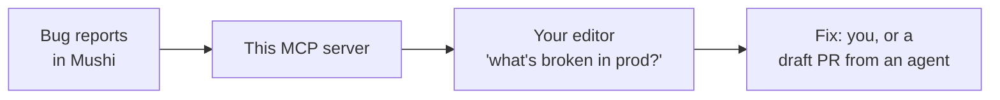

# @mushi-mushi/mcp

> **Your AI wrote it. Mushi tells you why it broke.**

[](https://kensaur.us/mushi-mushi/docs/connect)
[](https://kensaur.us/mushi-mushi/docs/connect)
[](https://kensaur.us/mushi-mushi/docs/connect)
[](https://www.npmjs.com/package/@mushi-mushi/mcp)

The [Model Context Protocol](https://modelcontextprotocol.io/) server for [Mushi Mushi](https://github.com/kensaurus/mushi-mushi). It lets Cursor, Claude Code, VS Code or any MCP client read your app's bug reports, get a plain-English diagnosis with a fix to start from, and dispatch or merge fixes. Your editor's own model does the work, so you need no second LLM key.



## Quick start

```bash
npx mushi-mushi setup --ide cursor   # or: claude, continue, zed
```

Restart the editor and ask *"what's broken in prod?"*. For Cursor and Claude, `setup` writes the hosted server entry: the editor opens a browser sign-in on first use, and no API key is stored on disk. Pass `--stdio` for a local server, or `--with-rules` to also write the lesson-library rules file. You can also use the one-click **Add to Cursor** button on the [connect page](https://kensaur.us/mushi-mushi/docs/connect).

### Manual setup (any MCP client)

```json
{
  "mcpServers": {
    "mushi-mushi": {
      "command": "npx",
      "args": ["-y", "@mushi-mushi/mcp@0.24.6"],
      "env": {
        "MUSHI_API_KEY": "mushi_xxxxxxxxxxxxxxxxxxxx",
        "MUSHI_PROJECT_ID": "xxxxxxxx-xxxx-xxxx-xxxx-xxxxxxxxxxxx"
      }
    }
  }
}
```

| Variable | Where to find it |
| --- | --- |
| `MUSHI_API_KEY` | Console → **Connect** or **MCP**: mint an `mcp:read` or `mcp:write` key. Not the SDK key from Setup → Verify, and not an AI key from Settings |
| `MUSHI_PROJECT_ID` | Console → Projects → the UUID under your project's name |
| `MUSHI_API_ENDPOINT` | Optional. Only for self-hosting, e.g. `http://localhost:54321/functions/v1/api` |
| `MUSHI_FEATURES` | Optional. Tool groups to expose (see below) |

Claude Desktop does not expand `${VAR}` references in this file; Cursor and VS Code expand `${env:MUSHI_API_KEY}` and Claude Code expands `${MUSHI_API_KEY}`. Keep the key out of any `mcp.json` you commit.

## What your editor gets

| Start here | What it does |
| --- | --- |
| `triage_next_steps` | What needs attention right now, from the live queue |
| `get_fix_context` | One brief for a report: root cause, repro, the smallest set of files |
| `triage_issue` | Everything about one report: evidence, similar bugs, blast radius, logs, next actions |
| `dispatch_fix` / `merge_fix` | Have an agent open a draft PR, then merge it and close the report |
| `diagnose_setup` | Explains a broken install and the one next step |
| `search_mushi_docs` | Answers setup and API questions from the docs |

The full catalog has 117 tools, plus 8 resources (`project://dashboard`, `project://stats`, …) and 4 prompts (`summarize_report_for_fix`, `triage_next_steps`, …). Every tool carries read-only and destructive hints, so your editor can ask before it changes anything. Full list: [MCP tool reference](https://kensaur.us/mushi-mushi/docs/sdks/mcp-tools).

**Tool groups.** New installs get a lean default: `triage`, `fixes`, `inventory`, `setup`, `docs`. Turn on more with `MUSHI_FEATURES=triage,qa,codebase` (stdio) or `?features=…` on the hosted URL, or everything with `all`. Groups: `qa`, `skills`, `codebase`, `rewards`, `admin`, `audit`, `usage`. Add `?read_only=1` to the hosted URL to hide every write tool.

## Keys and safety

| Scope | Can do | Give it to |
| --- | --- | --- |
| `report:write` | Send reports only. No admin access | Your app's SDK. Never an MCP client |
| `mcp:read` | Every read tool and resource | Most agent loops |
| `mcp:write` | Reads plus `dispatch_fix`, `merge_fix`, `transition_status` and other changes | Agents that should act on bugs |

A key without the needed scope gets a clear `INSUFFICIENT_SCOPE` error, never a silent failure. Your SDK key ships in your app's bundle, so it must never carry `mcp:write`; the console mints MCP keys separately. Never use a Supabase service-role key. If a laptop is lost, rotate the key in the console.

## Troubleshooting

- **No tools showing?** Check the MCP panel for a green dot, then fully restart the editor after any config change.
- **Keep one config.** Put the Mushi entry in your global `~/.cursor/mcp.json` only; a second copy in a project file can cause connection storms.
- **Windows paths** in JSON need forward slashes (`C:/Users/...`) or escaped backslashes.
- **Still stuck?** Ask your editor to run `diagnose_setup`, or run `mushi doctor --mcp`.

## Programmatic use

| Import | Exports |
| --- | --- |
| `@mushi-mushi/mcp/server` | `createMushiServer()` for a custom host |
| `@mushi-mushi/mcp/catalog` | `TOOL_CATALOG`, scopes and tool specs |
| `@mushi-mushi/mcp/feature-groups` | Feature-group filtering |
| `@mushi-mushi/mcp/clients` | The supported editors and how each one installs |
| `@mushi-mushi/mcp/branding` | Icons and server metadata |

## Learn more

[MCP guide](https://kensaur.us/mushi-mushi/docs/sdks/mcp) · [MCP quickstart](https://kensaur.us/mushi-mushi/docs/quickstart/mcp) · [The incident loop](https://kensaur.us/mushi-mushi/docs/quickstart/incident-loop) · [Fix orchestrator](https://kensaur.us/mushi-mushi/docs/concepts/fix-orchestrator)

## License

MIT
