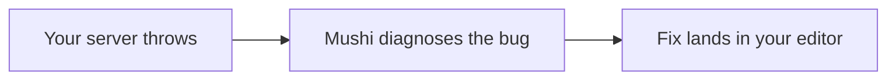

# `@mushi-mushi/node`

> **Your AI wrote it. Mushi tells you why it broke.**

The server-side SDK for [Mushi Mushi](https://github.com/kensaurus/mushi-mushi). Browser SDKs report the bugs users see; this one reports the bugs your backend sees: uncaught exceptions, failed webhooks, broken integrations. They land in the same queue and get the same plain-English diagnosis and fix.



## Quick start

```bash
npm i @mushi-mushi/node
```

Create one client, then hand it to the error handler for your framework:

```ts
import { MushiNodeClient, attachUnhandledHook } from '@mushi-mushi/node'

const client = new MushiNodeClient({
  apiKey: process.env.MUSHI_API_KEY!,
  projectId: process.env.MUSHI_PROJECT_ID!,
  environment: process.env.NODE_ENV, // optional
  release: process.env.GIT_SHA,      // optional
})

// Express: register after your routes
import { mushiExpressErrorHandler } from '@mushi-mushi/node/express'
app.use(mushiExpressErrorHandler({ client }))

// Fastify
import { mushiFastifyPlugin } from '@mushi-mushi/node/fastify'
mushiFastifyPlugin(app, { client })

// Hono (Node or edge): onError must return a Response, so pass your own handler second
import { mushiHonoErrorHandler } from '@mushi-mushi/node/hono'
app.onError(mushiHonoErrorHandler({ client }, (err, c) => c.text('Server error', 500)))

// Any server: also report uncaughtException and unhandledRejection
attachUnhandledHook({ client })
```

By default the handlers report thrown errors and 5xx responses, not 4xx. **Outside a request** (cron jobs, queue workers), call the client directly:

```ts
await client.captureReport({
  description: 'Stripe webhook signature verification failed',
  severity: 'high',
  component: 'billing',
  metadata: { event: 'invoice.payment_failed' },
})
```

## What's inside

| Export | What it does |
| --- | --- |
| `@mushi-mushi/node/express`, `/fastify`, `/hono` | Error handlers that report failed requests |
| `MushiNodeClient` | `captureReport()` and `track()` from anywhere in your server |
| `attachUnhandledHook()` | Reports process-level crashes |
| `mushiTraceMiddleware`, `createOtelSpanProcessor` | Request spans and an OpenTelemetry span processor. The error handlers also read `traceparent` and `sentry-trace`, so a server error links to the browser report from the same request |
| `createMushiRewardsHandler()` | Receives signed reward webhooks (see below) |
| `connectLinearApiKey()` | Connects Linear from a script or CI |

**Safe by design.** `captureReport` never throws: a failure is logged once and swallowed, so reporting can't take your server down. Requests time out after 10 seconds. The server SDK does not scrub PII, so remove user data before you send it.

## Reward webhooks

When a reporter earns points or reaches a new tier, Mushi sends your app a signed webhook. This is where you grant a role, unlock Pro, or apply a coupon. The handler checks the `X-Mushi-Signature` HMAC before any callback runs and answers `401` on a bad signature.

```ts
import { createMushiRewardsHandler } from '@mushi-mushi/node'

const handler = createMushiRewardsHandler({
  secret: process.env.MUSHI_REWARD_WEBHOOK_SECRET!, // the mushi_whk_… secret shown once in the console
  onTierChanged: async (event) => {
    if (event.host_credit_payload?.kind === 'pro_coupon') await grantProAccess(event.external_user_id)
  },
  onPointsAwarded: async (event) => { /* event.action, event.points, event.total_points */ },
})

// Next.js App Router or any Web-standard runtime
export const POST = (req: Request) => handler.fetch(req)

// Express: the raw body is required to verify the signature
app.post('/api/mushi/reward-webhook', express.raw({ type: '*/*' }), handler.express)
```

`verifyRewardSignature()` and `parseRewardEvent()` are exported if you want to route events yourself. Event shapes and the rewards economy: [`docs/REWARDS.md`](https://github.com/kensaurus/mushi-mushi/blob/master/docs/REWARDS.md).

## Learn more

[Node SDK reference](https://kensaur.us/mushi-mushi/docs/sdks/node) · [Rewards](https://kensaur.us/mushi-mushi/docs/concepts/rewards) · [Mushi Mushi on GitHub](https://github.com/kensaurus/mushi-mushi)

## License

MIT
