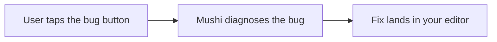

# @mushi-mushi/react

> **Your AI wrote it. Mushi tells you why it broke.**

The React and Next.js SDK for [Mushi Mushi](https://github.com/kensaurus/mushi-mushi). It adds a bug button to your app. When a user taps it, Mushi captures a screenshot, the route, their note and the recent console and network events, explains the cause in plain English, and hands your editor a fix to start from.



## Quick start

```bash
npx mushi-mushi    # detects React or Next.js, installs this package, writes NEXT_PUBLIC_ / VITE_ env vars
# or: npm install @mushi-mushi/react
```

```tsx
import { MushiProvider } from '@mushi-mushi/react';

function App() {
  return (
    <MushiProvider config={{
      projectId: import.meta.env.VITE_MUSHI_PROJECT_ID, // from the console's Projects page
      apiKey: import.meta.env.VITE_MUSHI_API_KEY,       // report:write key from Setup → Verify
    }}>
      <YourApp />
    </MushiProvider>
  );
}
```

### Next.js App Router

The provider uses React context, so it lives in a client component:

```tsx
// app/providers.tsx
'use client';
import { MushiProvider } from '@mushi-mushi/react';

export function Providers({ children }: { children: React.ReactNode }) {
  return (
    <MushiProvider config={{
      projectId: process.env.NEXT_PUBLIC_MUSHI_PROJECT_ID!,
      apiKey: process.env.NEXT_PUBLIC_MUSHI_API_KEY!,
    }}>
      {children}
    </MushiProvider>
  );
}
```

Wrap the tree in `app/layout.tsx`, which stays a Server Component. Keep callbacks such as `beforeSend` in `providers.tsx`, because functions cannot cross from a Server Component to a client one.

```tsx
// app/layout.tsx
import { Providers } from './providers';

export default function RootLayout({ children }: { children: React.ReactNode }) {
  return (
    <html>
      <body>
        <Providers>{children}</Providers>
      </body>
    </html>
  );
}
```

## Use your own button

```tsx
import { MushiTrigger, MushiAttach } from '@mushi-mushi/react'

// Any element or component
<MushiTrigger as="button" category="bug" className="my-feedback-btn">
  Report a bug
</MushiTrigger>

// Your design system's button (Radix, shadcn, …)
<MushiTrigger as={Button} variant="ghost" size="sm">Feedback</MushiTrigger>

// An element you can't wrap
<MushiAttach selector="#help-button" category="bug" />
```

## What's inside

| Export | What it does |
| --- | --- |
| `<MushiProvider config>` | Starts the SDK once at your app root |
| `<MushiTrigger>` / `<MushiAttach>` | Open the reporter from your own element or a CSS selector |
| `<MushiErrorBoundary>` | Catches render errors and pre-fills a report with the stack |
| `useMushiReport()` | Returns a function that opens the reporter, optionally with a category |
| `useMushiTrack()` | Returns `track(event, properties)` for funnels and paths |
| `useMushi()` | `report()`, `isReady`, and the reporter's replies and rewards |
| `useMushiReady()` / `useMushiSdk()` | Ready flag / the underlying [`@mushi-mushi/web`](https://npmjs.com/package/@mushi-mushi/web) instance |
| `MushiRewardsBadge`, `useReputation`, `useTier` | Reporter points and tiers |

Every option of `@mushi-mushi/web` (privacy masks, replay, triggers, analytics) works in `config`. Peer dependencies: `react` and `react-dom` 18 or 19. CI keeps this wrapper under 5 KB; `@mushi-mushi/web` and `@mushi-mushi/core` install with it.

## Learn more

[React quickstart](https://kensaur.us/mushi-mushi/docs/quickstart/react) · [React SDK reference](https://kensaur.us/mushi-mushi/docs/sdks/react) · [Next.js and CSP](https://kensaur.us/mushi-mushi/docs/sdks/nextjs-app-router-csp) · Other frameworks: [`vue`](https://npmjs.com/package/@mushi-mushi/vue) · [`svelte`](https://npmjs.com/package/@mushi-mushi/svelte) · [`angular`](https://npmjs.com/package/@mushi-mushi/angular) · [`react-native`](https://npmjs.com/package/@mushi-mushi/react-native)

## License

MIT
