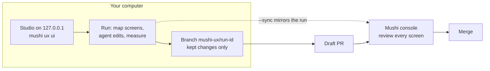

# @mushi-mushi/ux

> **Your AI wrote it. Mushi tells you why it broke.**

Find the UX problems on every screen of your app before your users do, and let the coding agent you already pay for fix them one screen at a time. Every change is measured. Only the ones that help are kept, on a branch you review. Part of [Mushi Mushi](https://github.com/kensaurus/mushi-mushi).



1. **Studio (your computer).** `mushi ux ui` opens a page on 127.0.0.1. Pick the agent, model, skill and pages, then watch each attempt live.
2. **Console (mirror and review).** With sync on, the run is mirrored to the [console](https://kensaur.us/mushi-mushi/admin) as it goes. The studio offers sync when you are signed in with the Mushi CLI; from the terminal, add `--sync`. **Review in console** on a run opens it there, screen by screen.
3. **Merge.** Open the kept changes as a draft PR from the studio, then merge it from the console (after a confirmation) or on GitHub. Nothing is merged for you.

## Quick start

```bash
mushi ux ui                    # through the Mushi CLI: passes your login, so runs show in the console
npx @mushi-mushi/ux ui         # or standalone
mushi ux run --dev "pnpm dev --port {port}" --agent cursor --model <id> --skill enhance-mobile-native-feel
```

Your app must run locally. `{port}` is replaced with a spare port. Signed-in app? Run `mushi-ux login --url http://localhost:5173` once and sign in by hand; later runs reuse that session with `--login-url`.

## What a run does

1. Checks the agent can start and read a file (about a minute), so a signed-out agent fails before anything slow.
2. Creates a git worktree on a new branch `mushi-ux/<run>` and starts your dev server there. Your own checkout is never touched.
3. Maps the app: every page, plus the tabs, dialogs and menus each one opens.
4. For each screen: screenshots it at phone and desktop width and measures accessibility (axe), sideways scrolling, tap targets under 24×24 px, console errors and layout shift. The agent gets the screenshots, the problems and your design tokens.
5. After each attempt it re-measures. The edit is **kept** as a commit if nothing got worse and something changed, otherwise **rolled back** with the reason for one more try. Screens already done are re-checked, and any that moved are marked **regressed**.
6. Optionally, a second model compares each changed screen before and after. Its review is advisory and never keeps or reverts anything.

With `--steps` (on by default in the studio) the agent first plans 2–5 small changes per screen, then makes one per attempt. A stopped run (closed laptop, Stop, crash) shows **Resume** and continues from the first unfinished screen: `mushi-ux run --resume <runId>`.

## Safety

- **Exploring never writes.** Every non-GET request is blocked, forms are never submitted, and buttons like Delete, Pay, Send and Log out are never clicked. If your app reads with POST (Supabase `rpc`, GraphQL), allow it: `--allow "POST /rest/v1/rpc/*"`.
- **The agent never sees your session or keys.** Credentials are stripped from its environment except its own model key. Claude Code runs with no shell and only the worktree's files.
- **Your dev server** runs without this tool's keys (`CURSOR_API_KEY`, `ANTHROPIC_API_KEY`, `OPENAI_API_KEY`, `GITHUB_TOKEN`, `MUSHI_*`). Put app secrets in the app's ignored `.env` files; those are copied into the worktree.
- **What reaches the console:** phase, screens, scores, problem counts, screenshots, and the names of files read or edited. The agent's words, its commands and their output stay in `.mushi/ux/<run>/agent/`.
- Use a test account if your dev server talks to production data.

## Agents

| `--agent` | Needs | Status |
| --- | --- | --- |
| `claude-code` (default) | `claude` on PATH | Verified on Windows |
| `cursor` | Cursor CLI (`agent`), signed in with `agent login` | Verified on Windows |
| `codex` | `codex` on PATH | Unverified |
| `cursor-cloud` | `CURSOR_API_KEY` and an `origin` on GitHub | Unverified |

`mushi-ux models --agent <name>` lists the models your account can use. `--skill` takes a name from [kensaurus/skills](https://github.com/kensaurus/skills) (`mushi-ux skills` lists them) or a path to a skill folder. Without one, the agent gets built-in UX guidance. On Windows, start runs from PowerShell or cmd: a Claude Code hook that fails under Git Bash makes the Cursor CLI refuse every file read, and the start-up check says so.

## Commands and options

| Command | What it does |
| --- | --- |
| `mushi-ux ui` | The studio: start runs and watch them |
| `mushi-ux run --dev "<cmd with {port}>"` | Run the loop from the terminal |
| `mushi-ux discover --url <url>` | List the screens, change nothing |
| `mushi-ux login --url <url>` | Sign in once, in a visible browser |
| `mushi-ux models` / `mushi-ux skills` | What `--model` and `--skill` accept |
| `mushi-ux open <runId>` | The local dashboard for a past run |

| `run` option | Default | What it does |
| --- | --- | --- |
| `--max-surfaces` / `--iterations` / `--timeout` | 10 / 2 / 10 min | Screens, attempts per screen, minutes per attempt |
| `--base <ref>` | `HEAD` | Branch from this ref, e.g. `origin/main` |
| `--path <path>` | — | Work only on these pages (repeatable) |
| `--ignore <selector>` | — | Not your UI (a dev badge): hidden and skipped. Or mark it `data-mushi-ux-ignore` |
| `--install <cmd>` | from lockfile | Monorepos: also build workspace packages, e.g. `"pnpm install --frozen-lockfile && pnpm turbo run build --filter=<app>^..."` |
| `--sync` | off | Mirror the run to the console (`mushi ux` passes your login) |
| `--no-judge` / `--no-preflight` / `--no-dashboard` | — | Skip the review, the agent check, or the local dashboard |

Run state and screenshots live in `.mushi/ux/<runId>/`. The run adds its folders to `.git/info/exclude`, so `git status` stays clean. `--sync` refuses a run whose app reports to a different Mushi project than your login.

## On GitHub Actions

Copy [`docs/templates/mushi-ux.yml`](https://github.com/kensaurus/mushi-mushi/blob/master/docs/templates/mushi-ux.yml) to `.github/workflows/mushi-ux.yml` and set its `dev-command`. Start it from the Actions tab, or with **Run in the cloud** on the console's [UX runs](https://kensaur.us/mushi-mushi/docs/admin/ux-runs) page. It uses `cursor-cloud`, sees the app signed out, and opens one draft PR. Its pushes go to `mushi-ux/**`, so add `branches-ignore: ['mushi-ux/**']` to any CI that runs on every push.

## License

MIT
