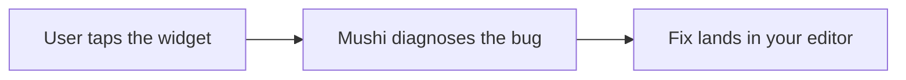

# @mushi-mushi/web

> **Your AI wrote it. Mushi tells you why it broke.**

A bug widget for any website. When a user reports a problem, it sends a screenshot, the route, their note and the last console and network events to [Mushi Mushi](https://github.com/kensaurus/mushi-mushi). Mushi explains the cause in plain English and hands your editor a fix. It renders in a Shadow DOM, so your CSS and the widget's never mix.



## Quick start

```bash
npx mushi-mushi              # wizard: picks the right SDK, installs it, writes env vars
# or: npm install @mushi-mushi/web
```

```ts
import { Mushi } from '@mushi-mushi/web';

Mushi.init({
  projectId: '00000000-0000-0000-0000-000000000000', // from the console's Projects page
  apiKey: 'mushi_xxx',                               // report:write key from Setup → Verify
});
```

A launcher appears in the corner. That is the whole integration. On React, Vue, Svelte, Angular, React Native or Capacitor, use the framework package instead: [`react`](https://npmjs.com/package/@mushi-mushi/react) · [`vue`](https://npmjs.com/package/@mushi-mushi/vue) · [`svelte`](https://npmjs.com/package/@mushi-mushi/svelte) · [`angular`](https://npmjs.com/package/@mushi-mushi/angular) · [`react-native`](https://npmjs.com/package/@mushi-mushi/react-native) · [`capacitor`](https://npmjs.com/package/@mushi-mushi/capacitor).

## What's inside

| | |
| --- | --- |
| **Report screen** | A free-text note, an optional type, a screenshot the reporter can mark up or remove. Reporters see your replies and fix status under **Your reports**. |
| **Capture** | Screenshot, console, network, Web Vitals, and a timeline of routes and clicks before the report. |
| **Offline** | Reports queue in IndexedDB and send when the connection is back. An on-device spam filter and rate limit run first. |
| **Privacy** | A built-in PII scrubber, selector masking for screenshots, and opt-in session replay. |
| **Stays out of the way** | Zero-size host with `pointer-events: none`, keyboard-first, respects reduced motion. |
| **Runtime config** | Change the widget from the console without a deploy. Values you set in code win. |
| **Size** | CI caps the core bundle at 89.5 KB gzipped (105 KB uncompressed). Screenshot markup and the Your reports views load only when used. |

## Recipes

**Use your own button** instead of the launcher. Other modes: `auto`, `edge-tab`, `banner`, `manual`, `hidden` ([trigger modes](https://kensaur.us/mushi-mushi/docs/concepts/trigger-modes)).

```ts
const mushi = Mushi.init({
  projectId: 'proj_xxx',
  apiKey: 'mushi_xxx',
  widget: { trigger: 'attach', attachToSelector: '[data-mushi-feedback]' },
});
mushi.attachTo('#support-menu-feedback');
```

**Ask for a report when users get stuck** (rage clicks, long tasks, failing API calls). Session limits and cooldowns are always on.

```ts
Mushi.init({ projectId: 'proj_xxx', apiKey: 'mushi_xxx', proactive: { rageClick: true, longTask: true, apiCascade: true } });
```

**Keep private data out of screenshots.** Masked elements are painted over; blocked ones are removed.

```ts
Mushi.init({
  projectId: 'proj_xxx',
  apiKey: 'mushi_xxx',
  privacy: { maskSelectors: ['input'], blockSelectors: ['[data-payment]'], allowUserRemoveScreenshot: true },
});
```

**Record a session replay** of the moments before a report. Install `rrweb` in your app and pass your own import, so your bundler can split it into a lazy chunk ([coexisting with Sentry Replay](https://kensaur.us/mushi-mushi/docs/sdks/sentry-replay-coexistence)).

```ts
Mushi.init({ projectId: 'proj_xxx', apiKey: 'mushi_xxx', capture: { replay: 'rrweb', rrweb: () => import('rrweb') } });
```

**Send through your own domain** so ad blockers don't drop reports. Your proxy must allow only your host, project and `/v1/` paths.

```ts
Mushi.init({ projectId: 'proj_xxx', apiKey: 'mushi_xxx', tunnel: '/api/mushi-tunnel', ignoreErrors: ['ResizeObserver loop'] });
```

**Tag users and report caught errors.** Breadcrumbs, tags and any active Sentry scope are attached for you.

```ts
const mushi = Mushi.init({ projectId: 'proj_xxx', apiKey: 'mushi_xxx' });
mushi.identify('usr_42', { email: 'aya@example.com', segment: 'beta' });

try {
  await runCheckout();
} catch (err) {
  mushi.captureException(err, { severity: 'high', tags: { surface: 'checkout' } });
}
```

**Track product events** for funnels and paths in the same console. Do Not Track and Global Privacy Control are respected.

```ts
const mushi = Mushi.init({ projectId: 'proj_xxx', apiKey: 'mushi_xxx', analytics: { consent: 'required' } });
mushi.setConsent('granted');
mushi.track('checkout_started', { plan: 'pro' });
```

**Check the install.** Safe to call before `Mushi.init()`; reports endpoint, CSP and widget health.

```ts
const health = await Mushi.diagnose(); // { apiEndpointReachable, cspAllowsEndpoint, widgetMounted, widgetHostPointerSafe, ... }
```

**Name the current screen** for the "what happened before" timeline.

```ts
const mushi = Mushi.init({ /* ... */ });
mushi.setScreen({ name: 'Chat', route: '/chat', feature: 'roleplay' });
```

**Match your brand.** The widget uses your page's font and light/dark colors. Override any token in CSS ([all tokens](https://github.com/kensaurus/mushi-mushi/blob/master/packages/web/src/styles.ts)):

```css
#mushi-mushi-widget { --mushi-accent: #b8860b; --mushi-accent-fg: #000; --mushi-font: Georgia, serif; }
```

Screenshots cannot capture cross-origin iframes or tainted `<canvas>` elements, and strict CSP can block them. Playwright and jsdom helpers live in `@mushi-mushi/web/test-utils`, which production bundles never load.

## Learn more

[Web SDK reference](https://kensaur.us/mushi-mushi/docs/sdks/web) · [Runtime config](https://kensaur.us/mushi-mushi/docs/concepts/runtime-config) · [Presets](https://kensaur.us/mushi-mushi/docs/sdks/presets) · [Analytics](https://kensaur.us/mushi-mushi/docs/sdks/analytics) · [Rewards and replies](https://kensaur.us/mushi-mushi/docs/concepts/rewards)

## License

MIT
